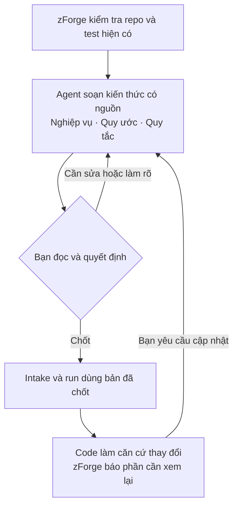
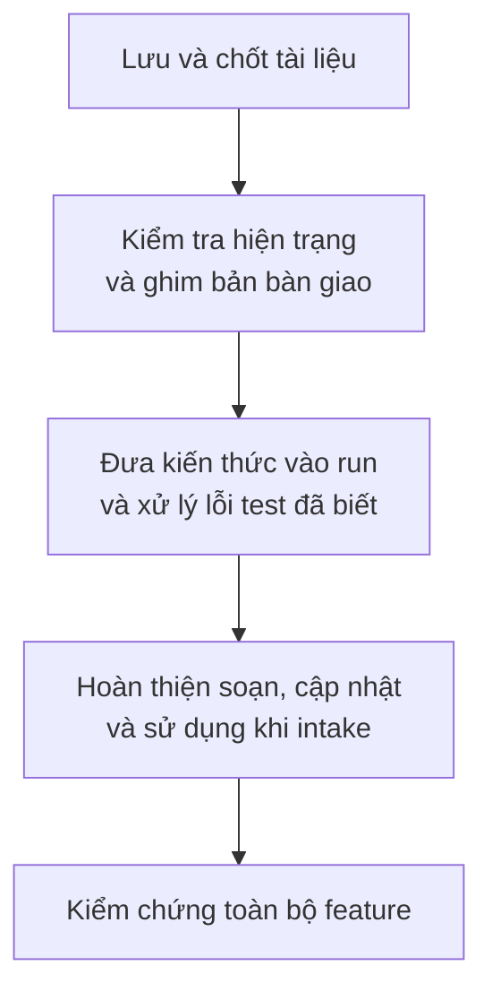

# ONBOARD giúp agent hiểu dự án

**Mục tiêu:** agent có bộ kiến thức bạn đã chốt để dùng lại, tránh mỗi lần làm việc phải tự tìm hiểu và đoán quy tắc dự án.

Ví dụ: dự án chỉ cho dùng refresh token một lần. Agent ghi lại quy tắc kèm nguồn trong code; bạn chốt; tính năng đăng nhập sau phải tính đến quy tắc đó.

**Hành vi — bạn và hệ thống phối hợp như sau:**

**Giải pháp:** lưu kiến thức cùng repo để cả nhóm dùng chung. Mỗi lần bàn giao ghi cố định phiên bản kiến thức cho run. Chỉ phần liên quan được đưa vào đầu vào của agent; mục không vừa giới hạn dung lượng phải được báo và có đường dẫn đọc thêm.

**Các lựa chọn bạn cần hiểu để chốt:**

| Lựa chọn | Hệ quả |
|---|---|
| Bạn chốt kiến thức | Agent có thể soạn và đề xuất sửa, không tự quyết định điều code chưa chứng minh. |
| Onboarding mặc định không bắt buộc | Thiếu hoặc cũ thì cảnh báo; bật chế độ bắt buộc thì chặn bàn giao. |
| Bạn ghi nhận tên test đã lỗi từ trước | Run sau có thể đạt dù còn những lỗi đó. Có lỗi mới hoặc không đọc được tên test lỗi thì thất bại. |
| Soạn tự động dùng Claude, tính ngân sách mỗi lần gọi | Repo nhiều module có thể cần nhiều lần gọi. Onboarding không tự sửa test lỗi. |

**Chia việc — 11 task trong lần bàn giao cuối đi qua bốn chặng:**

**Đạt khi:** chứng minh được tài liệu đã chốt đi vào run, lỗi mới không bị bỏ qua và code nguồn đổi thì báo mục cần xem lại. Bàn giao gồm code cục bộ và báo cáo; chưa tự push/merge.

**Còn cần làm rõ:** nguồn mô tả khác nhau về việc tự bỏ lỗi test đã sửa khỏi danh sách hay để bạn quyết định. Ngoại lệ lỗi đã biết phải được nêu rõ khi giải thích kết quả “đạt”.

*Bản đọc thử, chưa thay hợp đồng đã chốt. Nguồn: [ONBOARD/HANDOVER-006](.records/handovers/HANDOVER-006.json).*
