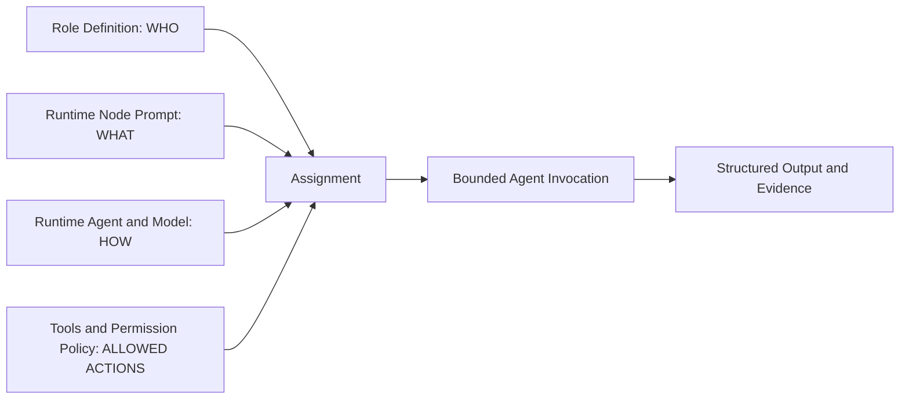
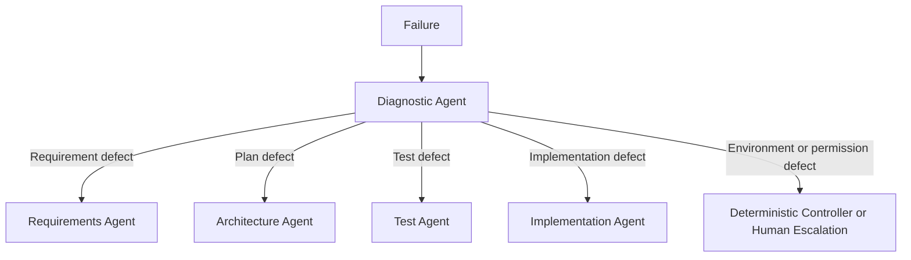
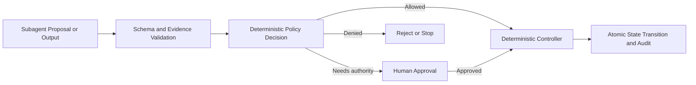
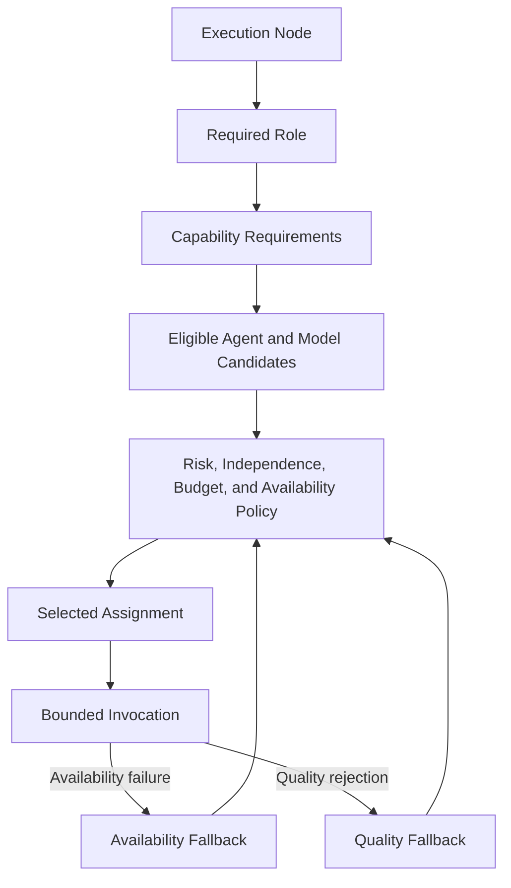
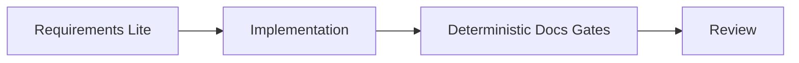
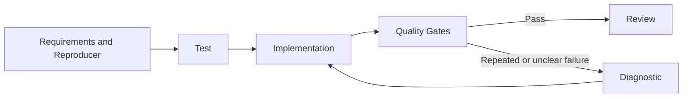
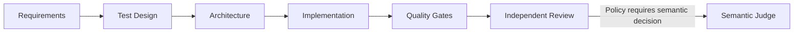
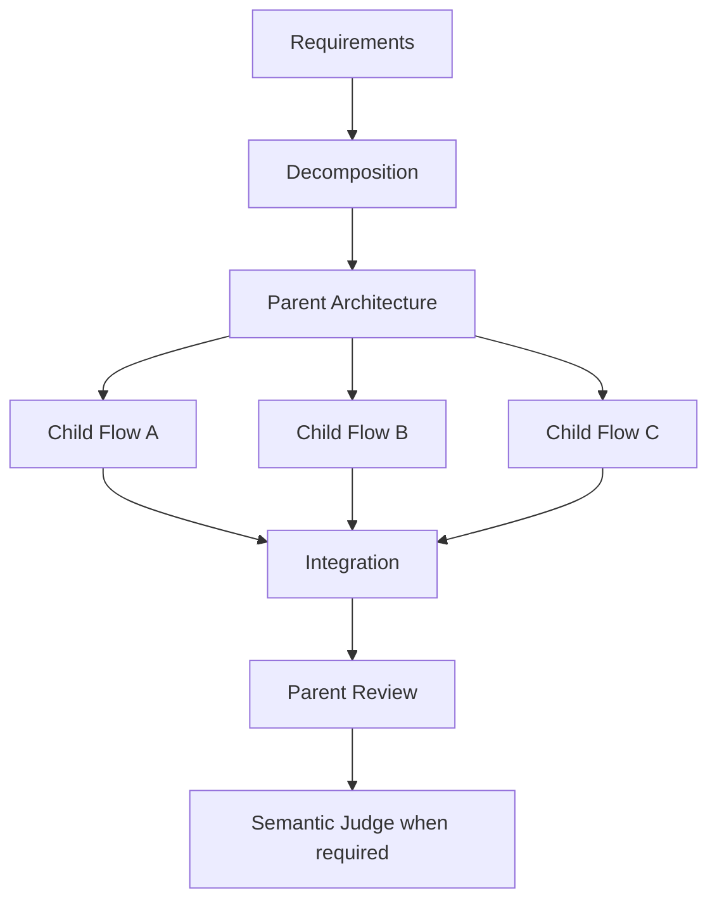
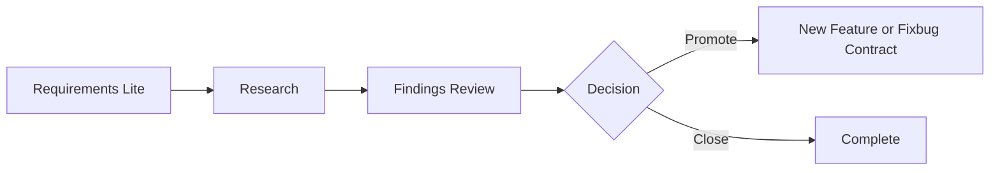
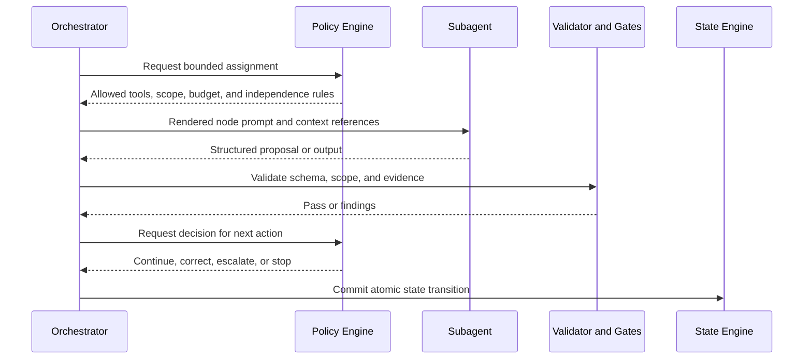

# zForge v2 Agents and Subagents

## Status

This document defines the proposed v2 agent-role architecture. It is a design target, not a description of the current v1 implementation.

Related documents:

- [Product Direction](./product-direction.md)
- [Fleet and Human Attention](./fleet-and-human-attention.md)
- [zForge v2 Autonomous Flow](./flow.md)
- [Deterministic Runtime](./deterministic-runtime.md)
- [Automatic Model Routing](./model-routing.md)
- [Agent Token and Cost Accounting](./cost.md)
- [Skills](./skills.md)
- [Data Model](./data-model.md)
- [State and Events](./state-and-events.md)
- [Artifacts and Traceability](./artifacts-and-traceability.md)
- [Execution DAG](./execution-dag.md)
- [Policy and Risk](./policy-and-risk.md)
- [Configuration](./configuration.md)
- [Security Threat Model](./security-threat-model.md)
- [Evaluation](./evaluation.md)
- [Autonomous Software Engineering System — Implementation Plan](../../requirements/autonomous-software-engineering-implementation-plan.md)
- [Agent / Template Responsibility Split](../../requirements/agent-template-split.md)

## Objective

Define a small set of independent, capability-oriented AI roles that can analyze, design, implement, diagnose, and review engineering work without allowing any agent to control global state, grant itself permissions, approve its own output, or bypass deterministic evidence.

Roles are composed to maximize expected accepted engineering quality while
minimizing human active attention. Agent count, raw throughput, and parallelism
are not quality goals. A role is activated only when its independence,
specialization, or expected contribution justifies its context and cost.

## Terminology

### Runtime Agent

A runtime agent is the executable AI provider integration that runs a role:

- Claude Code;
- Codex;
- OpenCode;
- another registered agent command.

The runtime agent defines how zForge invokes a model. It does not define the engineering responsibility of that invocation.

### Subagent Role

A subagent role defines one bounded engineering responsibility:

- requirements analysis;
- decomposition;
- architecture;
- test design;
- implementation;
- diagnosis;
- review;
- integration;
- research;
- semantic judgment.

### Assignment

An assignment binds a role to one execution node, runtime agent, model, tool policy, and output contract.

```yaml
role: implementation
node_id: implement-callback
agent: claude
model_requested: auto
model_resolved: versioned-model-id
routing_decision_ref: routing_decision_01J...
prompt_template: implement-node
tools:
  - codegraph.read
  - filesystem.read
  - filesystem.write_scoped
write_scope:
  - src/auth/**
  - tests/auth/**
output_schema: change-manifest-v2
```

The values above are illustrative.

## Design Principle

v1 binds agent identity to a fixed pipeline phase. v2 separates engineering role, runtime instructions, model assignment, and permissions.



## v1 Agent Model

v1 defines five phase-oriented agents:

| v1 agent | Primary responsibility |
|---|---|
| `spec-agent` | Produce a specification |
| `testspec-agent` | Produce test cases |
| `plan-agent` | Produce an implementation plan |
| `code-agent` | Write tests and implementation |
| `review-agent` | Review the completed change |

Characteristics:

- one agent maps to one linear phase;
- agent responsibility is coupled to one Markdown artifact;
- task decomposition is not represented;
- root-cause diagnosis is folded into the code-agent loop;
- parent/child integration has no dedicated role;
- test implementation and production implementation are not independent;
- specialist review is not selected from risk;
- reviewer independence is not enforced;
- agent prompts may behave differently across direct CLI and parent/subagent execution paths.

## v1 to v2 Mapping

This is a conceptual comparison, not an alias registry or migration contract.
The v1 relationship notes below are historical context only.

| v1 | v2 |
|---|---|
| `spec-agent` | `requirements-agent`, with `decomposition-agent` when oversized |
| `testspec-agent` | `test-agent` in design or implementation mode |
| `plan-agent` | `architecture-agent` |
| `code-agent` | `implementation-agent`, with `diagnostic-agent` for repeated failures |
| `review-agent` | Independent `review-agent`, optional specialist skills, and conditional semantic judge |
| No equivalent | `integration-agent` |
| Generic spike spec/code | `research-agent` |

## Role Categories

### Core Roles

Core roles are available to normal executable tasks:

- `requirements-agent`;
- `architecture-agent`;
- `test-agent`;
- `implementation-agent`;
- `diagnostic-agent`;
- `review-agent`.

### Conditional Roles

Conditional roles run only when the task graph or policy requires them:

- `decomposition-agent`;
- `integration-agent`;
- `research-agent`;
- `semantic-judge-agent`.

### Specialist Review Skills

Specialist review behavior should be attached to the common review role through skills or profiles instead of duplicating the complete review agent:

- security review;
- API compatibility review;
- database migration review;
- performance review;
- UI and accessibility review;
- local environment readiness review;
- privacy and compliance review.

## Role Catalog

## Requirements Agent

### Purpose

Convert an intake into a contract that is clear, bounded, and verifiable.

### Inputs

- original intake and provenance;
- repository and domain context;
- organizational terminology;
- existing parent/shared contracts;
- clarification answers;
- applicable task-size and risk policy.

### Outputs

- clarification questions;
- requirements;
- measurable acceptance criteria;
- assumptions;
- exclusions;
- initial component and file scope;
- external dependencies;
- confidence and unresolved issues.

### Restrictions

- Must not modify production code.
- Must not create an implementation plan.
- Must not silently convert blocking ambiguity into an assumption.
- Must not approve its own contract.
- Must not expand the requested outcome.

### v1 Relationship

Replaces the requirement-analysis responsibility of `spec-agent` without owning decomposition or implementation planning.

## Decomposition Agent

### Purpose

Turn an oversized outcome into a parent contract and a dependency graph of bounded child tasks.

### Activation

Runs when task-size analysis exceeds policy thresholds or when an intake contains independently deliverable outcomes.

### Inputs

- intake;
- draft parent contract;
- task-size analysis;
- architecture and repository boundaries;
- organizational delivery constraints.

### Outputs

- parent contract amendments;
- child task definitions;
- child-to-parent acceptance-criterion mapping;
- dependency graph;
- shared interfaces and schemas;
- integration task;
- parallelization opportunities;
- decomposition risks and confidence.

### Restrictions

- Must not implement the parent task.
- Must not create a child without a bounded outcome and evidence strategy.
- Must not introduce circular dependencies.
- Must not split only by technical layer unless a shared interface contract exists.
- Must not change the original parent outcome without an explicit contract amendment.

### v1 Relationship

New in v2.

## Architecture Agent

### Purpose

Turn an approved contract into an executable architecture and execution plan or DAG.

### Inputs

- approved contract;
- traceability graph;
- repository structure and code context;
- child/shared contracts;
- risk and policy requirements;
- available language and delivery profiles.

### Outputs

- architecture decisions;
- component boundaries;
- execution nodes and dependencies;
- expected file scope per node;
- required tools and resources;
- required quality gates;
- migration, compatibility, and rollback strategy;
- implementation risks and unresolved decisions.

### Restrictions

- Must not modify production code.
- Must not weaken acceptance criteria.
- Must not omit mandatory gates selected by policy.
- Must not silently broaden file or component scope.

### v1 Relationship

Expands `plan-agent` from a linear Markdown plan into a machine-verifiable execution graph.

## Test Agent

### Purpose

Own the test and evidence contract independently from production implementation.

### Modes

#### Design Mode

Produces:

- test cases;
- acceptance-criterion mapping;
- happy-path, boundary, failure, and regression scenarios;
- required test levels;
- alternative evidence for non-testable criteria;
- coverage and mutation expectations when applicable.

#### Implementation Mode

Produces:

- failing tests before production implementation when policy requires TDD;
- test fixtures and test-support code;
- test change manifest;
- evidence that failure represents the intended missing behavior.

### Restrictions

- Must not modify production implementation in test mode.
- Must not change acceptance criteria to match current behavior.
- Must not weaken a failing test after implementation begins without an approved contract amendment.
- Must not claim coverage from test names alone.

### Independence

For medium- and high-risk tasks, test design must use a context or assignment independent from the implementation agent. Policy may require a different model or provider.

### v1 Relationship

Replaces `testspec-agent` and separates test ownership from `code-agent`.

## Implementation Agent

### Purpose

Implement one bounded execution node within an isolated workspace and approved change scope.

### Inputs

- approved contract and relevant acceptance criteria;
- one execution node;
- test/evidence contract;
- relevant code context;
- allowed file scope;
- deterministic gate or reviewer feedback from previous attempts;
- current budget and attempt limit.

### Outputs

- source and permitted test-support changes;
- change manifest;
- implementation evidence;
- newly discovered blockers;
- proposed scope amendment when necessary.

### Restrictions

- Must not change the parent or task contract.
- Must not weaken tests to obtain a passing result.
- Must not edit files outside the allowed scope.
- Must not approve, merge, push, or deploy its output.
- Must not advance global task state.
- Must not expand its own permissions or budget.

### v1 Relationship

Replaces the implementation responsibility of `code-agent` while removing test-contract ownership and self-diagnosis responsibilities.

## Diagnostic Agent

### Purpose

Classify the root cause of repeated or unclear failures and route correction to the role that owns the defect.

### Activation

Runs when:

- the same failure class repeats;
- correction confidence is low;
- evidence conflicts;
- the implementation agent cannot identify a bounded fix;
- a gate failure may originate from requirement, plan, test, environment, or implementation.

### Outputs

- root-cause classification;
- supporting evidence;
- affected contract, plan, test, environment, or implementation nodes;
- recommended correction route;
- confidence;
- terminal blocker when no autonomous correction is safe.



### Restrictions

- Must not modify artifacts or code while acting in diagnostic mode.
- Must not route every failure to implementation by default.
- Must not request another retry without new evidence after repeated identical failure.

### v1 Relationship

New in v2. It replaces unstructured retry reasoning previously folded into the code phase.

## Review Agent

### Purpose

Independently evaluate whether the final change satisfies the contract, respects scope, and is supported by sufficient evidence.

### Inputs

- original intake;
- approved contract;
- execution plan;
- traceability graph;
- final diff and change manifest;
- deterministic quality-gate evidence;
- relevant child or integration evidence.

### Outputs

- correctness findings;
- scope violations;
- requirement drift;
- uncovered acceptance criteria;
- missing or contradictory evidence;
- maintainability and risk findings;
- severity and confidence;
- recommended pass, correction, replan, or escalation decision.

### Independence

- Must not receive private implementation-agent reasoning.
- Medium- and high-risk tasks must not use the same execution context as implementation.
- High-risk policy may require a different model or provider.
- A reviewer may not approve its own earlier implementation output.

### Restrictions

- Must not override mandatory deterministic gate failure.
- Must not directly modify the reviewed change.
- Must not merge, deploy, or advance global state.
- Must not change the contract to make the implementation acceptable.

### v1 Relationship

Expands `review-agent` and makes independence enforceable.

## Integration Agent

### Purpose

Evaluate and reconcile multiple child-task outcomes against the parent contract and shared interfaces.

### Activation

Runs for decomposed parent tasks or multi-project execution graphs.

### Inputs

- parent contract;
- child contracts and accepted changes;
- shared API, schema, and architecture contracts;
- child evidence;
- integration-gate results;
- integration change manifest.

### Outputs

- compatibility findings;
- cross-child conflict analysis;
- missing parent evidence;
- integration correction plan;
- parent acceptance-criterion coverage;
- integration report and confidence.

### Restrictions

- Must not silently change child or shared contracts.
- Must not merge child branches directly.
- Must not mark the parent complete when only child-local gates have passed.
- Must not resolve a conflict outside the approved integration scope.

### v1 Relationship

New in v2.

## Research Agent

### Purpose

Answer a bounded research question through repository analysis, experiments, and evidence without producing an unreviewed production implementation.

### Inputs

- research question;
- scope and time budget;
- allowed sandbox;
- comparison criteria;
- relevant repository or external context.

### Outputs

- alternatives;
- experiments;
- evidence;
- trade-offs;
- limitations;
- recommendation;
- proposed feature, fixbug, or follow-up research task.

### Restrictions

- Must not deliver prototype code as production code.
- Must not silently promote a spike into an implementation task.
- Must not exceed the experiment sandbox or research budget.

### v1 Relationship

Replaces the generic `spec → code` interpretation of spike work.

## Semantic Judge Agent

### Purpose

Resolve semantic acceptance decisions that remain after deterministic validation and independent review.

### Activation

Runs only when policy requires semantic judgment and deterministic evidence is insufficient to make the final decision.

### Inputs

- contract and risk classification;
- traceability graph;
- deterministic gate results;
- review findings;
- correction history;
- remaining budget.

### Output

```yaml
decision: pass | correct | replan | escalate | fail
confidence: 0.91
reasons: []
missing_evidence: []
recommended_route: null
```

### Restrictions

- Must not override a failed mandatory gate.
- Must not modify code or contracts.
- Must not grant permissions, budget, or approval authority.
- Must not be the implementation agent for the judged change.
- Must not return `pass` when required evidence is missing.

### v1 Relationship

New in v2. Low-risk tasks may use a deterministic decision engine instead to avoid unnecessary agent cost.

## Specialist Review Skills

Specialist behavior extends `review-agent` through focused runtime skills and risk-specific schemas.

| Skill | Trigger examples | Required evidence |
|---|---|---|
| Security | Authentication, authorization, cryptography, secrets, untrusted input | Threat boundaries, security gates, abuse cases |
| API compatibility | Public API, schema, protocol, SDK | Compatibility diff, versioning, consumer impact |
| Database migration | Schema or data migration | Forward/rollback validation, lock and data-loss risk |
| Performance | Hot paths, large data, latency-sensitive change | Baseline and regression measurements |
| UI/accessibility | User-facing visual or interaction change | Visual, interaction, keyboard, accessibility evidence |
| Local environment readiness | Test config, fixtures, containers/devices | Readiness, isolation, reset, teardown and reproducible evidence |
| Privacy/compliance | Personal or regulated data | Data flow, retention, access, audit evidence |

Specialist skills must not duplicate the common review contract. They add domain-specific checks and evidence requirements.

## Deterministic Components, Not Agents

The detailed execution model is defined in [Deterministic Runtime](./deterministic-runtime.md).

The following responsibilities must remain in deterministic zForge components:

| Component | Responsibility |
|---|---|
| Orchestrator | Execute the graph and maintain global state |
| Policy engine | Decide permissions, required roles, and approvals |
| Risk rules | Enforce mandatory risk classifications and minimum rigor |
| Workspace manager | Create, lease, reconcile, and clean isolated workspaces |
| Quality-gate runner | Run tests, lint, security, compatibility, and other gates |
| Budget manager | Forecast, reserve, reconcile, and stop spending |
| Git controller | Stage manifest-approved files and create scoped commits |
| Delivery controller | Push, create pull requests and merge under development-only policy |
| Evidence aggregator | Validate and aggregate evidence without double counting |
| State engine | Validate durable, idempotent state transitions |

Agents propose and evaluate. Deterministic components authorize and execute side effects.



## Role Definition Structure

v2 keeps identity, runtime task instructions, machine policy, and provider assignment separate.

```text
templates/v2/
├── agents/
│   ├── requirements-agent.md
│   ├── decomposition-agent.md
│   ├── architecture-agent.md
│   ├── test-agent.md
│   ├── implementation-agent.md
│   ├── diagnostic-agent.md
│   ├── review-agent.md
│   ├── integration-agent.md
│   ├── research-agent.md
│   └── semantic-judge-agent.md
├── prompts/
│   ├── clarify.tmpl
│   ├── contract.tmpl
│   ├── decompose.tmpl
│   ├── plan-dag.tmpl
│   ├── design-tests.tmpl
│   ├── implement-tests.tmpl
│   ├── implement-node.tmpl
│   ├── diagnose-failure.tmpl
│   ├── review-change.tmpl
│   ├── review-integration.tmpl
│   └── semantic-judge.tmpl
├── roles/
│   ├── requirements.yaml
│   ├── decomposition.yaml
│   ├── architecture.yaml
│   ├── test.yaml
│   ├── implementation.yaml
│   ├── diagnostic.yaml
│   ├── review.yaml
│   ├── integration.yaml
│   ├── research.yaml
│   └── semantic-judge.yaml
└── skills/
    ├── security-review.md
    ├── api-compatibility-review.md
    ├── database-migration-review.md
    ├── performance-review.md
    ├── ui-accessibility-review.md
    └── local-environment-readiness-review.md
```

Responsibilities:

| File | Owns |
|---|---|
| `agents/*.md` | Stable role identity and purpose: WHO |
| `prompts/*.tmpl` | Rendered task/node instructions: WHAT |
| `roles/*.yaml` | Tool, permission, input, output, and independence policy |
| `skills/*.md` | Optional domain-specific review or execution guidance |
| agent registry and model config | Runtime command and model assignment: HOW |

## Role Manifest

Example machine-readable role policy:

```yaml
schema_version: 2
role: review
identity: review-agent
allowed_prompt_templates:
  - review-change
  - review-integration
inputs:
  required:
    - contract
    - traceability
    - final_diff
    - gate_evidence
outputs:
  schema: review-findings-v2
permissions:
  filesystem: read_only
  network: denied
  secrets: denied
  state_transition: denied
  delivery: denied
independence:
  different_context_from:
    - implementation
  different_agent_or_model_when_risk_at_least: high
```

Role manifests are enforced by the orchestrator and policy engine, not trusted as prompt instructions.

## Assignment and Routing

Role definitions do not hard-code Claude, Codex, OpenCode, or a specific model.
The normative candidate catalog, capability profile, selection algorithm,
explanation record, and rollout semantics are defined in
[Automatic Model Routing](./model-routing.md).



Routing inputs:

- role capability requirements;
- language and framework;
- task risk;
- context-window requirement;
- historical acceptance and retry rate;
- independence constraints;
- model availability;
- forecast cost and remaining budget;
- provider fallback policy.

Routing uses this precedence:

1. eligibility, safety, and required independence;
2. expected correctness and accepted quality;
3. probability of resolving the node without human intervention;
4. expected correction and fallback burden;
5. cost and elapsed time.

The cheapest or fastest invocation is not necessarily the best accepted outcome.
Routing optimizes expected quality to acceptance within policy and hard budgets.

The deterministic assignment router selects the concrete runtime agent, model,
and supported reasoning profile before spawn. A spawned role cannot select or
replace its own model. `agent=<name>, model=auto` constrains selection to that
runtime-agent adapter; `agent=auto, model=auto` permits selection of the pair.
Every automatic result pins its capability profile, model-catalog snapshot,
routing policy, and immutable routing decision.

## Context Isolation

Every role receives the minimum context required for its node.

Rules:

- Requirements receives intake and domain context, not implementation-agent reasoning.
- Test receives contract and relevant interfaces, not a proposed implementation when tests must be implementation-independent.
- Implementation receives the approved contract, plan node, tests, scope, and structured correction feedback.
- Review receives the original intake, contract, final diff, and evidence, but not private implementation reasoning.
- Judge receives decisions and evidence, not unrestricted repository access by default.
- Specialist review receives only relevant risk context and evidence.
- Parent integration receives accepted child outputs, not unrelated child workspace history.

Context references must have provenance and trust classification.

Context assembly first resolves approved product, repository, and task knowledge.
A role MUST NOT ask a human to repeat information that is available in eligible
context. Conflicting, stale, or insufficient material knowledge is returned as a
structured clarification or knowledge-conflict proposal, not silently resolved
by rewriting canonical knowledge.

## Output Contracts

Every role returns structured output validated before the orchestrator advances.

| Role | Required output contract |
|---|---|
| Requirements | `task-contract-v2` or `clarification-request-v2` |
| Decomposition | `decomposition-plan-v2` |
| Architecture | `execution-plan-v2` |
| Test | `test-contract-v2` and optional `test-change-manifest-v2` |
| Implementation | `change-manifest-v2` and `implementation-evidence-v2` |
| Diagnostic | `root-cause-analysis-v2` |
| Review | `review-findings-v2` |
| Integration | `integration-report-v2` |
| Research | `research-findings-v2` |
| Semantic judge | `semantic-decision-v2` |

Free-form prose may accompany structured output but cannot replace it.

## Independence Policy

Minimum invariants:

- No role approves its own output.
- No subagent advances global state.
- No subagent grants permissions or budget.
- No subagent directly pushes, merges, deploys, or rolls back.
- Implementation cannot change requirements or acceptance criteria.
- Test contracts cannot be weakened by implementation without amendment.
- Review does not share private implementation context.
- High-risk review uses a different agent or model according to policy.
- Semantic judge cannot be the implementation agent for the judged change.
- Mandatory deterministic failures cannot be overridden by any agent.
- Scope amendment returns to the parent orchestrator.
- Every invocation has a bounded scope, context, permission set, attempt limit, and budget.

## Composition by Task Profile

Not every task runs every role. The flow compiler selects the minimum role graph allowed by risk policy.

### Low-Risk Docs



Expected AI roles: requirements-lite, implementation, review.

### Fixbug



Diagnostic is conditional.

### Feature



Judge is conditional. Low-risk features may use a deterministic final decision.

### Epic or Oversized Intake



Each child flow independently selects its required roles.

### Spike



A research agent never transitions directly to production delivery.

## Quality-Preserving Role Fusion

Low-risk tasks may combine compatible roles into one invocation when policy allows it.

Permitted examples:

- requirements-lite and simple planning for a docs task;
- research and findings summary for a bounded spike;
- review and semantic decision when deterministic gates pass and risk is low.

Prohibited examples:

- implementation and independent review;
- implementation and semantic judgment;
- high-risk test ownership and implementation;
- permission decision and the role requesting permission;
- budget decision and the role consuming the budget.

Role fusion must remain visible in telemetry as multiple logical role contributions within one invocation or as an explicit fused role. It must not hide independence loss.

Role fusion is allowed only after protected quality and independence requirements
are satisfied. Its primary purpose is to remove redundant context and human
coordination, not simply to minimize invocation count.

## Fallback Semantics

### Availability Fallback

Triggered by:

- timeout;
- rate limit;
- provider outage;
- quota exhaustion;
- authentication or transport failure classified as retryable.

The same role is reassigned to another eligible runtime agent or model. The new
candidate normally remains in the measured quality-equivalent set and must keep
the same output contract while creating a new attempt, routing decision,
assignment and invocation.

### Quality Fallback

Triggered by:

- invalid structured output;
- repeated gate failure attributable to agent output;
- low confidence;
- unresolved reviewer findings;
- policy-defined quality threshold failure.

Quality fallback may change agent, model, reasoning profile, strategy, or role
decomposition. It never bypasses failed evidence and cannot silently downgrade
measured capability merely to reduce cost.

Every fallback creates a new attempt, routing decision, assignment and invocation
and is accounted for separately. No assignment authorizes an alternate model.

## State and Side-Effect Ownership



The subagent never writes global state directly.

## Proposed Directory Layout

```text
templates/v2/
├── agents/
├── prompts/
├── roles/
└── skills/

schemas/v2/
├── task-contract.schema.json
├── decomposition-plan.schema.json
├── execution-plan.schema.json
├── test-contract.schema.json
├── change-manifest.schema.json
├── root-cause-analysis.schema.json
├── review-findings.schema.json
├── integration-report.schema.json
├── research-findings.schema.json
└── semantic-decision.schema.json
```

The final repository location may differ, but identity, runtime prompt, role policy, skill, and schema must remain separate concepts.

## Native-v2 Role Implementation

Per [ADR-005](./decisions/005-native-v2-no-migration.md), implement native role manifests and structured output
contracts directly. No v1 phase-agent aliases or dual role-resolution paths are
required. Reuse tested helpers only where they satisfy native contracts.

Suggested order:

1. Core requirements, architecture, test, implementation, diagnosis and review roles.
2. Structured outputs, bounded permissions and independent-review enforcement.
3. Conditional decomposition and integration for parent/child task execution.
4. Conditional research and semantic judgment under activation policy.

## Testing Strategy

Required tests:

- role-manifest parsing and validation;
- prompt template allowlisting;
- tool and write-scope enforcement;
- output-schema validation for every role;
- context minimization and provenance;
- self-approval prevention;
- reviewer and implementation independence;
- high-risk different-agent/model enforcement;
- deterministic-gate override prevention;
- state-transition denial from subagents;
- budget and permission escalation;
- availability and quality fallback separation;
- role-fusion allow and deny policy;
- parent/child integration role behavior;
- unsupported legacy role names fail resolution without implicit aliases;
- real-agent contract tests behind explicit quota-consuming flags.

## Acceptance Criteria

- [ ] Runtime agent identity is separate from logical engineering role.
- [ ] Role, prompt, policy, skill, model assignment, and output schema are independently configurable.
- [ ] The core role set covers requirements, architecture, tests, implementation, diagnosis, and review.
- [ ] Decomposition, integration, research, and semantic judgment are conditional roles.
- [ ] Specialist reviews reuse the review role through risk-selected skills.
- [ ] Global state, permissions, budgets, Git, and delivery remain deterministic responsibilities.
- [ ] Every role has defined inputs, outputs, restrictions, and a structured output schema.
- [ ] No subagent can approve itself or directly advance global state.
- [ ] High-risk reviewer independence is enforceable by policy.
- [ ] Test ownership can be independent from implementation.
- [ ] Role composition is selected by task profile and risk rather than a fixed phase list.
- [ ] Low-risk role fusion cannot remove mandatory independence boundaries.
- [ ] Availability fallback and quality fallback remain distinct and auditable.
- [ ] Automatic model selection occurs before spawn and is explainable from pinned inputs.
- [ ] Role resolution uses native manifests without requiring a v1 compatibility path.

## Analysis Ownership and Reviewer Handoff

Pre-run semantic roles use bounded `AnalysisSession` ownership, not a fabricated
DAG/run. Their context, risk floor, permissions, model selection and budget are
pinned before spawn as defined in [Data Model](./data-model.md).

Test design produces readable expected behavior independently from observed
results. Reviewers receive criteria-linked scenarios, negative/boundary cases,
current gate evidence and focused high-risk code pointers. The implementation
role records documentation impact and updates affected docs. The runtime seals
the concise package; no role can claim unrun tests passed.
See [Development Handoff and Review](./delivery-and-review.md).
