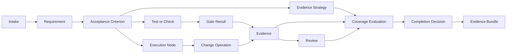
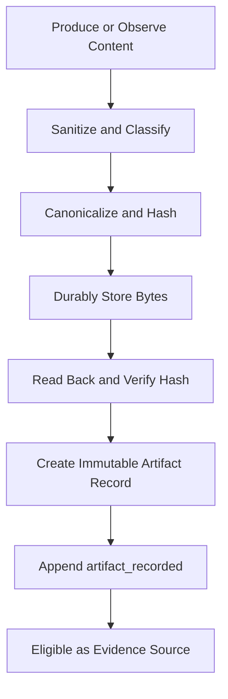
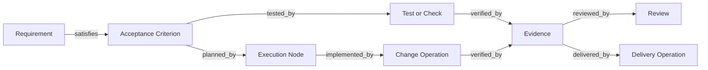
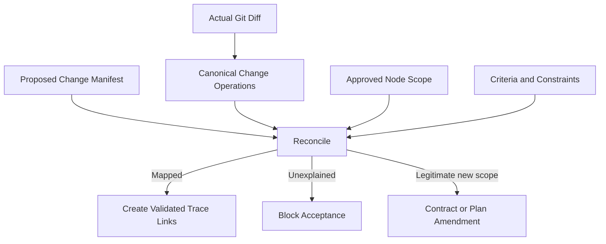
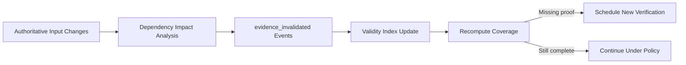
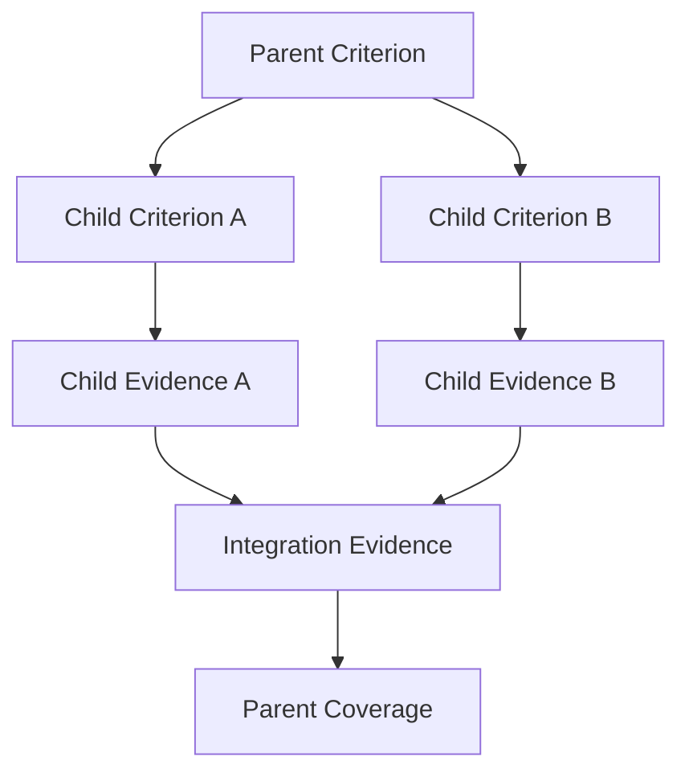
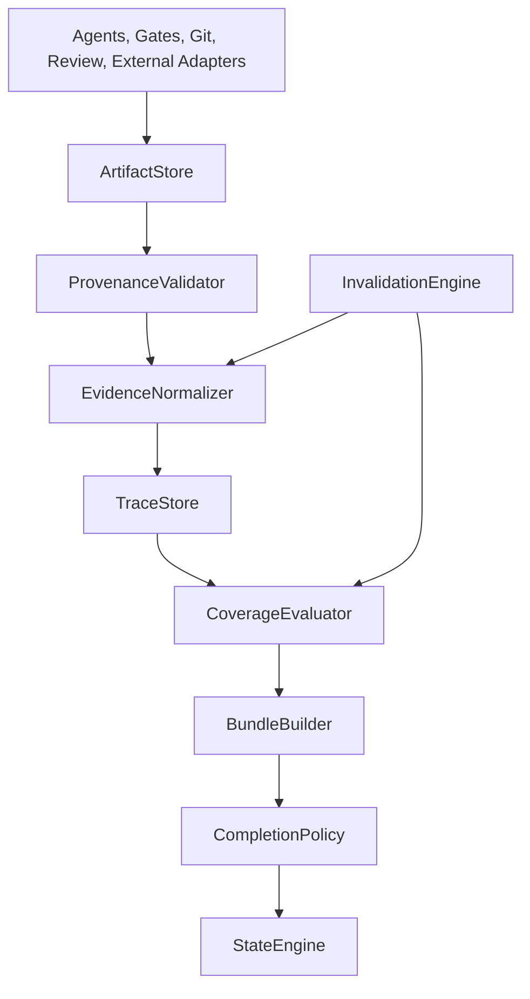

# zForge v2 Artifacts and Traceability

## Status

This document is the normative design draft for zForge v2 artifact management,
evidence validity, traceability graphs, coverage, invalidation, and completion
evidence packages.

Normative terms such as **MUST**, **MUST NOT**, **SHOULD**, and **MAY** describe
implementation requirements. The document remains a draft until explicitly
accepted.

Related documents:

- [Product Direction](./product-direction.md)
- [Fleet and Human Attention](./fleet-and-human-attention.md)
- [Data Model](./data-model.md)
- [State and Events](./state-and-events.md)
- [zForge v2 Autonomous Flow](./flow.md)
- [Deterministic Runtime](./deterministic-runtime.md)
- [Agents and Subagents](./agents.md)
- [Automatic Model Routing](./model-routing.md)
- [Skills](./skills.md)
- [Agent Token and Cost Accounting](./cost.md)
- [Workspace and Git](./workspace-and-git.md)
- [Quality Gates](./quality-gates.md)
- [Evaluation](./evaluation.md)

## Objective

Ensure that every engineering conclusion can be traced from an approved
requirement to immutable, current, policy-acceptable evidence.

zForge MUST NOT treat agent confidence, prose claims, process exit code, a
commit, or the existence of a pull request as sufficient proof of completion.

## Scope

This document defines:

- artifact identity, storage, integrity, provenance, confidentiality, and retention;
- evidence requirements, production, normalization, validity, and strength;
- typed trace graph nodes, relations, and validation;
- acceptance-criterion coverage and completion decisions;
- evidence invalidation, reuse, contradictions, retries, and amendments;
- parent and child evidence aggregation;
- evidence bundles for review, delivery, audit, and reproduction;
- deterministic runtime responsibilities, APIs, events, and tests.

The concrete record envelopes are defined in the data model. State transitions
and event append semantics are defined in the state-and-events document.

## Core Concepts

### Artifact

An artifact is immutable content or an immutable reference to content produced,
observed, or imported during engineering work.

Examples:

- approved contract or human-readable contract projection;
- execution plan;
- source diff or patch;
- test source and test report;
- compiler, linter, scanner, or benchmark output;
- screenshot, video, or accessibility report;
- review report;
- external CI or pull-request status;
- local environment, reproduction or continuation report.

An artifact records what exists. It does not by itself prove that an acceptance
criterion is satisfied.

### Evidence

Evidence is a typed assertion that one or more immutable sources support a
specific subject under exact input conditions.

For example, a test report is an artifact. An `EvidenceRecord` states that the
report demonstrates a specific acceptance criterion for a specific repository
tree, contract revision, test definition, and gate configuration.

### Trace Link

A trace link is a typed, validated relationship between two stable engineering
entities. It explains how intent is transformed into design, implementation,
verification, review, and delivery.

### Evidence Strategy

An evidence strategy defines what proof an acceptance criterion requires before
implementation begins. It prevents an agent from choosing weaker proof after
seeing the result.

### Evidence Bundle

An evidence bundle is a reproducible manifest of records and artifacts used for
one decision, such as node acceptance, run completion, review, or delivery.

## Conceptual Flow



## Source-of-Truth Boundaries

| Concern | Authoritative source | Not authoritative |
|---|---|---|
| Artifact bytes | Content-addressed blob or verified external object | Path or filename alone |
| Artifact identity | Artifact ID plus artifact hash | Human-readable label |
| Artifact origin | Provenance and producer references | Agent prose |
| Selected context | Immutable `ContextSnapshot` plus source provenance | Prompt text alone |
| Gate outcome | Structured `GateResult` and raw-output hash | Exit code copied into Markdown |
| Evidence validity | `EvidenceRecord`, current input hashes, and invalidation events | Confidence alone |
| Trace relationship | Valid typed `TraceLink` | Similar wording or inferred association |
| Criterion coverage | Deterministic coverage evaluator | Reviewer or agent claim by itself |
| Completion | Policy decision over a pinned evidence bundle | “Done” status in generated output |

## Artifact Model

The canonical artifact envelope is defined in the data model. This document
adds behavioral requirements.

```yaml
schema_version: 2
record_type: artifact
record_id: artifact_01J...
revision: 1
status: immutable
artifact_id: artifact_01J...
artifact_type: gate_output
media_type: application/json
storage:
  kind: local_content_addressed
  locator: sha256/ab/cd/abcdef...
artifact_hash: sha256:abcdef...
size_bytes: 12345
producer:
  actor_type: system
  actor_id: gate-runner
produced_for:
  task_id: SSO-102
  run_id: run_01J...
  node_id: node_03J...
  attempt_id: attempt_01J...
source_record_refs:
  - gate_result_01J...@1
provenance_refs:
  - provenance_01J...
retention_class: execution_evidence
confidentiality: project
created_at: 2026-08-25T01:11:10Z
created_by:
  actor_type: system
  actor_id: artifact-store
updated_at: 2026-08-25T01:11:10Z
content_hash: sha256:artifact-record...
```

### Artifact Categories

| Category | Examples | Typical retention |
|---|---|---|
| `source_input` | Intake attachment, design, external specification | Task history |
| `structured_record` | Contract, plan, manifest, review decision | Task history |
| `human_projection` | Markdown, HTML, generated summary | Rebuildable or task history |
| `source_change` | Patch, diff, tree manifest | Execution evidence |
| `test_definition` | Test case, fixture manifest, evidence strategy | Task history |
| `gate_output` | Test, lint, build, scan, benchmark output | Execution evidence |
| `runtime_observation` | Screenshot, trace, log excerpt, metric export | Execution evidence |
| `agent_output` | Structured proposal, analysis, diagnostic result | Policy-dependent |
| `review_output` | Findings and review report | Execution evidence |
| `delivery_output` | PR response, development CI result, local handoff | Task history |

Artifact type is more specific than category and is registry-defined. Unknown
types are stored but cannot satisfy evidence policy until registered.

### Artifact Identity and Immutability

- Artifact ID identifies one immutable logical object.
- Artifact hash identifies exact bytes after declared canonicalization.
- Changed bytes MUST create a new artifact ID.
- Multiple artifact IDs MAY reference the same content-addressed blob when
  provenance or retention differs.
- Artifact path and external URL are locators, not identities.
- A referenced artifact cannot be edited in place.
- Supersession preserves both artifact records and an explicit trace relation.
- Retention deletion preserves a tombstone containing ID, hash, size, media
  type, provenance summary, deletion authority, and deletion time.

### Canonicalization and Hashing

Artifact hashing is performed over the exact stored byte representation unless
the artifact type defines a versioned canonicalizer.

Examples:

- JSON: parsed and canonicalized according to the schema's canonical JSON rules;
- structured YAML: parsed, validated, then serialized as canonical JSON;
- text: UTF-8 with declared newline normalization when the type permits it;
- binary, image, archive, or raw logs: exact bytes without transformation;
- Git tree or diff: canonical Git object identity plus normalized manifest.

The artifact record MUST store canonicalizer identity and version whenever the
stored bytes differ from the hashed logical representation.

### Storage Backends

Supported storage kinds:

```text
local_content_addressed | task_local | git_object | protected_local |
external_immutable | external_mutable_snapshot
```

Rules:

- `local_content_addressed` is the default for immutable evidence artifacts.
- `task_local` MAY be used for readable projections but the hash remains authoritative.
- `git_object` references a repository and immutable object ID.
- `protected_local` requires a separate access decision and audit trail.
- `external_immutable` requires a verified immutable external identity.
- `external_mutable_snapshot` stores retrieval time, response hash, and protected
  snapshot or response artifact; the live URL alone is insufficient.
- Storage write and artifact-record publication MUST be atomic or use a pending
  state that cannot be referenced as accepted evidence.

### Artifact Production



An artifact is not eligible as evidence until bytes are durable, hash verified,
media type known, confidentiality classified, and producer/provenance recorded.

## Provenance

Every material artifact MUST answer:

- What produced or supplied it?
- For which project, task, run, node, and attempt?
- Which agent invocation, deterministic component, human, or external system?
- From which source records and artifacts?
- At what time and under which configuration?
- Which capability profile, model-catalog snapshot, and routing decision selected
  the producing invocation?
- What transformations, sanitization, or canonicalization occurred?
- What exact content hash was accepted?

Agent-produced artifacts MUST reference their `AgentInvocation`. Deterministic
gate artifacts MUST reference the gate definition, command, parser, workspace
tree, and configuration hashes. Human-provided artifacts MUST retain trusted
identity or input provenance without falsely claiming deterministic production.

## Confidentiality, Redaction, and Context Eligibility

Confidentiality values follow the data model:

```text
public | project | restricted | secret
```

| Classification | Normal storage | Agent context eligibility |
|---|---|---|
| `public` | Standard artifact store | Allowed when relevant |
| `project` | Project-controlled store | Allowed to authorized project assignments |
| `restricted` | Protected store and audited reads | Requires explicit scoped grant |
| `secret` | Secret-capable protected store or external vault | Denied by default; never copied merely for convenience |

Redaction produces a new artifact with `derived_from` trace to the original.
The redacted artifact has its own hash, confidentiality, and provenance. Redaction
MUST NOT overwrite or silently change the original.

Secrets detected in an artifact intended for normal storage cause rejection or
protected routing. A hash does not make secret content safe to disclose.

## Evidence Strategy

Every acceptance criterion MUST have at least one approved evidence strategy
before its implementation node starts.

```yaml
schema_version: 2
record_type: evidence_strategy
record_id: evidence_strategy_01J...
revision: 1
status: approved
criterion_ref: ac_01J...
required_claim: Callback requests with mismatched state are rejected before token exchange
methods:
  all_of:
    - method: automated_test
      test_ref: test_01J...
      required_result: pass
    - method: diff
      required_scope_refs:
        - node_02J...
minimum_strength: deterministic
freshness:
  bind_to:
    - repository_tree
    - contract
    - test_definition
    - gate_configuration
alternatives:
  require_policy_approval: true
created_at: 2026-08-25T01:00:00Z
created_by:
  actor_type: system
  actor_id: contract-validator
updated_at: 2026-08-25T01:00:00Z
content_hash: sha256:evidence-strategy...
provenance_refs: []
```

Strategy expressions support `all_of`, `any_of`, and bounded `at_least`.
Nested expressions MUST be acyclic and deterministic.

Rules:

- The criterion identifies the claim; the strategy identifies acceptable proof.
- Required evidence type, producer independence, strength, and freshness are explicit.
- An alternative evidence method requires a policy decision or contract amendment.
- An agent cannot weaken its own evidence strategy.
- Risk policy MAY add stronger methods or independence requirements.
- A strategy cannot rely only on agent analysis for a deterministically testable
  critical behavior unless policy explicitly accepts the exception.

## Evidence Model

Evidence records normalize proof without duplicating source artifact content.

`subjects: [{type, id}]` is the canonical subject field selected by
[ADR-001](./decisions/001-canonical-schema.md); `subject_refs` is not a native-v2
alias. Typed identity is validated alongside pinned input hashes and owning
records, not treated as sufficient evidence-version binding on its own.

```yaml
schema_version: 2
record_type: evidence
record_id: evidence_01J...
revision: 1
status: valid
evidence_id: evidence_01J...
evidence_type: automated_test
subjects:
  - type: acceptance_criterion
    id: ac_01J...
claim: Mismatched state is rejected before token exchange
producer:
  actor_type: system
  actor_id: evidence-aggregator
source_refs:
  - gate_result_01J...
  - artifact_01J...
input_hashes:
  repository_tree: sha256:tree...
  contract: sha256:contract...
  test_definition: sha256:test...
  gate_configuration: sha256:gate-config...
result: pass
strength: deterministic
confidence: 1.0
valid_from: 2026-08-25T01:11:10Z
expires_at: null
invalidated_at: null
invalidation_reason: null
created_at: 2026-08-25T01:11:10Z
created_by:
  actor_type: system
  actor_id: evidence-aggregator
updated_at: 2026-08-25T01:11:10Z
content_hash: sha256:evidence...
provenance_refs: []
```

### Evidence Types

Core evidence types remain aligned with the data model:

| Type | Meaning |
|---|---|
| `automated_test` | Structured result from a registered test gate |
| `deterministic_check` | Build, lint, type, schema, security, or policy check |
| `diff` | Verified statement about actual repository change |
| `review` | Independent structured evaluation and finding resolution |
| `external_status` | Verified development CI, PR, or local test status |
| `manual_observation` | Human-observed behavior with required capture and identity |
| `analysis` | Agent or human reasoning supported by cited sources |
| `approval` | Scoped human authority; not proof that technical behavior works |

Approval evidence can satisfy an authority requirement but MUST NOT substitute
for a technical test, security check, or runtime observation.

### Evidence Strength

```text
deterministic | observed | corroborated | advisory
```

| Strength | Required characteristics |
|---|---|
| `deterministic` | Registered deterministic producer, exact inputs, reproducible semantics |
| `observed` | Direct runtime or human observation with identity and captured context |
| `corroborated` | Multiple compatible sources or independent review support the claim |
| `advisory` | Analysis, heuristic, or prediction requiring stronger proof when policy demands it |

Strength is not a universal ranking detached from the claim. A UI appearance
criterion may require observed visual evidence; a compilation criterion should
normally require deterministic evidence.

Confidence is producer-reported certainty between `0.0` and `1.0`. Confidence
does not upgrade strength and cannot override a required method.

### Evidence Validity

Evidence is valid only when all conditions hold:

- evidence schema and referenced records validate;
- producer was authorized for the action;
- source artifacts exist or have valid retention tombstones permitted by policy;
- content and input hashes match;
- subject belongs to the current contract revision or approved parent mapping;
- required producer independence is satisfied;
- result and strength satisfy the approved evidence strategy;
- evidence is not expired, invalidated, or superseded;
- no unresolved contradiction defeats the claim;
- policy accepts any baseline exception or alternative method.

Validity is evaluated at decision time, not assumed forever from a historical
`pass` result.

## Traceability Graph

The trace graph connects intent to delivery through stable typed nodes and edges.



### Trace Node Types

```text
requirement | acceptance_criterion | assumption | constraint | exclusion |
test | evidence_strategy | execution_node | change_operation | file |
artifact | gate_result | evidence | review | finding | approval |
delivery_operation | child_task
```

### Core Relations

| Relation | Valid direction | Meaning |
|---|---|---|
| `derived_from` | Any derived record/artifact -> source | Provenance derivation |
| `satisfies` | Acceptance criterion -> requirement | Criterion operationalizes requirement |
| `constrained_by` | Node/change/test -> constraint | Work is governed by constraint |
| `tested_by` | Criterion -> test/check | Test is intended to evaluate criterion |
| `planned_by` | Criterion -> execution node | Node contributes to criterion |
| `implemented_by` | Node/criterion -> change operation | Actual change implements planned outcome |
| `touches` | Change operation -> file | Change affects exact path/content |
| `verified_by` | Criterion/test/change -> evidence | Evidence supports a claim about subject |
| `reviewed_by` | Evidence/change/criterion -> review | Independent review evaluated subject |
| `delivered_by` | Evidence/change -> delivery operation | Subject entered configured delivery boundary |
| `invalidates` | Revision/change/event -> downstream item | Source makes target stale |
| `supersedes` | New revision/artifact/evidence -> old | New item replaces current use of old item |
| `aggregates` | Parent criterion -> child criterion/evidence | Parent coverage delegates to child |

Relations are directional. Reverse traversal is a query operation, not an
additional stored edge.

### Trace Link Validation

- Both endpoints MUST exist and match the relation compatibility matrix.
- Endpoint task, run, plan, node, and attempt ownership MUST be compatible.
- Revision-sensitive endpoints MUST be pinned by revision and content hash.
- `derived_from`, `supersedes`, and contract derivation subgraphs MUST be acyclic.
- A link created by an agent remains proposed until deterministic validation.
- Text similarity MAY suggest a link but cannot create an authoritative link.
- Links to invalidated or superseded nodes remain historical and do not count
  toward current coverage.
- Required links cannot be removed without a contract or policy-authorized change.

## Change-to-Intent Reconciliation

Every accepted repository operation MUST map to approved intent.



Rules:

- Actual Git diff is authoritative over an agent manifest.
- Every added, modified, deleted, or renamed path maps to a change operation.
- Every change operation maps to an execution node and criterion, constraint,
  or approved technical-enabler record.
- Generated files map to their generator/configuration and are not treated as
  unexplained merely because they are indirect.
- Formatting-only or dependency-lock changes still require an explanation and scope.
- Unexplained changes block node acceptance and delivery.

## Coverage Model

Coverage is calculated over the current approved contract revision.

For a criterion `c`:

```text
strategy_satisfied(c) = evaluate(
  approved_strategy(c),
  valid_evidence_for(c),
  current_input_hashes,
  current_policy
)
```

Task coverage:

```text
required_criteria = current criteria where required = true
covered_criteria  = required criteria where strategy_satisfied = true
coverage_ratio    = covered_criteria / required_criteria
```

If there are no required criteria, coverage is `not_applicable`, not an
implicitly successful `100%`.

Delivery requires:

- every required criterion covered;
- every mandatory constraint validated;
- every actual change explained;
- every mandatory gate current and passing;
- every required review accepted;
- no unresolved blocking or critical findings;
- required parent/integration coverage complete;
- evidence bundle pinned to the delivery tree and contract hashes.

### Coverage Status

```text
covered | partial | missing | invalidated | contradictory |
not_applicable | policy_exception
```

Policy exceptions require explicit authority, reason, scope, expiry, and residual
risk. An exception is visible in review and delivery bundles and is never
reported as ordinary deterministic coverage.

### Coverage Report

```yaml
schema_version: 2
record_type: coverage_report
record_id: coverage_01J...
revision: 1
status: incomplete
task_id: SSO-102
run_id: run_01J...
contract_ref: contract_01J...@3
repository_tree_hash: sha256:tree...
criteria:
  - criterion_ref: ac_01J...
    status: covered
    strategy_ref: evidence_strategy_01J...@1
    evidence_refs:
      - evidence_01J...
  - criterion_ref: ac_02J...
    status: missing
    missing:
      - required_method: manual_observation
        reason_code: REQUIRED_OBSERVATION_NOT_RECORDED
required_count: 2
covered_count: 1
coverage_ratio: 0.5
blocking_reason_codes:
  - REQUIRED_CRITERION_MISSING_EVIDENCE
created_at: 2026-08-25T01:20:00Z
created_by:
  actor_type: system
  actor_id: evidence-aggregator
updated_at: 2026-08-25T01:20:00Z
content_hash: sha256:coverage...
provenance_refs: []
```

Coverage reports are derived records. Completion decisions pin the exact report
hash and evidence bundle but can always recompute them from authoritative records.

## Evidence Invalidation

Evidence binds to exact inputs. A change to a bound input triggers dependency
impact analysis.



Common invalidation triggers:

| Changed input | Normally affected evidence |
|---|---|
| Contract or criterion semantics | Tests, plan, change, gate, review, and completion evidence |
| Evidence strategy | Evidence that does not satisfy the new strategy |
| Test definition | Test results produced by prior definition |
| Repository tree | Gates and observations bound to prior tree |
| Relevant file subset | Evidence whose declared dependency set intersects changed files |
| Gate command/parser/configuration | Normalized gate evidence from prior setup |
| Runtime environment | Platform-dependent build, integration, performance, or visual evidence |
| External state | Development CI, compatibility, or local environment evidence |
| Review finding correction | Review decision until resolution is independently verified |
| Time/expiry | Time-sensitive security, dependency, or external-status evidence |

Invalidation rules:

- Invalidation appends an event; it never edits historical evidence bytes.
- Reason records identify changed input, affected evidence, and dependency path.
- Conservative invalidation is required when dependency precision is unknown.
- Evidence reuse requires proving all strategy-bound hashes and independence
  constraints still match.
- A policy decision may authorize reuse but cannot falsify mismatched hashes.
- Completion and delivery projections are recomputed after invalidation.

## Baselines and Regressions

Gate evidence distinguishes existing baseline failures from task-introduced
regressions.

Baseline comparison requires:

- same gate definition and compatible environment;
- verified base commit and candidate tree;
- normalized finding identities;
- separate lists for pre-existing, fixed, new, and changed findings;
- policy decision for any accepted baseline failure.

A passing “no new failures” comparison is not equivalent to an absolute passing
gate unless the evidence strategy explicitly permits baseline-relative proof.

## Contradictory Evidence

Evidence is contradictory when current valid records make incompatible claims
about the same subject and comparable inputs.

Examples:

- unit test passes but required integration test fails;
- agent review says secure while deterministic security gate reports a critical issue;
- local test passes but authoritative CI fails on the delivery commit;
- screenshot shows expected UI while accessibility tree evidence fails policy.

Resolution rules:

- Contradiction changes criterion coverage to `contradictory`.
- Deterministic or authoritative evidence is not discarded because lower-strength
  evidence disagrees.
- Incomparable environments are reported separately, not averaged.
- Policy selects required diagnosis, rerun, environment matrix, or escalation.
- Human approval may accept residual risk when policy permits, but history keeps
  both records and the exception.

## Attempts, Retries, and Corrections

- Every attempt retains its own artifact, diff, gate, evidence, and review refs.
- A later successful attempt does not erase failed-attempt evidence.
- Current coverage uses only evidence bound to the accepted attempt and current tree.
- Availability fallback creates a new attempt, routing decision, assignment and invocation; prior evidence is reusable only through explicit validity checks.
- Quality correction creates a new attempt and new output artifacts.
- Unchanged evidence may be reused only through exact dependency-hash validation.
- Findings link to the attempt that introduced them and the attempt/evidence that
  resolved them.

## Parent and Child Traceability

Parent criteria may delegate bounded proof to child criteria through `aggregates`
links.



Rules:

- Every required child mapping is explicit and revision-pinned.
- Child completion alone does not prove a cross-child parent criterion.
- Shared interface and end-to-end behavior require integration evidence.
- Parent aggregation references child evidence IDs; it does not copy records.
- Evidence and costs are counted once in flat project totals.
- Child invalidation propagates to dependent parent coverage.
- Optional child tasks cannot satisfy required parent coverage unless the parent
  contract explicitly identifies the alternative path.

Work-batch aggregation follows the same reference rule: batch outcomes point to
task and integration evidence bundles without copying or reinterpreting them. A
completed batch item is not evidence for another item unless an explicit,
revision-pinned dependency or aggregate relation validates the reuse.

Human answers and approvals are authority/provenance evidence for the exact
decision they resolve. They do not prove runtime behavior. Consolidated answers
retain links to every affected contract and cannot be reused when task semantics
or input hashes differ.

## Review Evidence View

Reviewers receive a minimized, reproducible view containing:

- original intake and approved contract revision;
- risk and policy decisions;
- evidence strategies;
- final actual diff and change-to-intent map;
- coverage report and trace graph slice;
- current gate results with raw-artifact access where authorized;
- failed/corrected attempt history relevant to residual risk;
- unresolved findings, exceptions, and known limitations;
- parent/child and integration evidence when applicable.

Reviewers do not receive private model reasoning or unrelated restricted
artifacts. Context references and hashes allow requesting authorized detail.

## Evidence Bundle

```yaml
schema_version: 2
record_type: evidence_bundle
record_id: bundle_01J...
revision: 1
status: sealed
purpose: delivery
project_id: project_01J...
task_id: SSO-102
run_id: run_01J...
contract_ref: contract_01J...@3
plan_ref: plan_01J...@1
repository:
  base_commit: abcdef123456
  tree_hash: sha256:tree...
coverage_report_ref: coverage_01J...@1
change_manifest_ref: change_01J...@1
evidence_refs:
  - evidence_01J...
review_refs:
  - review_01J...@1
policy_decision_refs:
  - policy_01J...@1
approval_refs: []
artifact_manifest:
  - artifact_id: artifact_01J...
    artifact_hash: sha256:artifact...
exceptions: []
sealed_at: 2026-08-25T01:30:00Z
sealed_by:
  actor_type: system
  actor_id: evidence-aggregator
bundle_hash: sha256:bundle...
created_at: 2026-08-25T01:30:00Z
created_by:
  actor_type: system
  actor_id: evidence-aggregator
updated_at: 2026-08-25T01:30:00Z
content_hash: sha256:bundle-record...
provenance_refs: []
```

Bundle purposes:

```text
node_acceptance | analysis_completion | run_completion | independent_review |
delivery | audit_export | reproduction
```

Bundle rules:

- Sealing resolves every logical reference to record revision and content hash.
- Bundle manifest ordering is canonical.
- Bundle hash covers the manifest, not necessarily all artifact bytes inline.
- Opening a bundle verifies record and artifact hashes before use.
- New evidence creates a new bundle; sealed bundles are immutable.
- A delivery bundle identifies the exact commit/tree submitted externally.
- Missing retained bytes are represented by authorized tombstones and may make
  reproduction incomplete even when historical audit remains possible.

## Pull Request and Delivery Projection

Every accepted result MUST have the concise ReviewPackage defined in
[Development Handoff and Review](./delivery-and-review.md). The human-readable
summary is generated from its sealed bundle and includes:

- requested outcome and contract revision;
- implementation and scope summary;
- acceptance-criterion coverage table;
- tests and deterministic gates;
- review result and resolved findings;
- policy exceptions and residual risk;
- parent/child delivery status;
- local reproduction and recovery guidance;
- approach rationale and material trade-offs;
- readable test cases linked to expected behavior and observed evidence;
- documentation changes or a justified not-applicable decision;
- remaining phases/tasks and a continuation manifest when applicable;
- stable references to protected evidence rather than secret content.

The PR body is a projection. Editing it does not mutate evidence or traceability.

## Runtime Components



### Artifact Store

Responsibilities:

- sanitize, classify, canonicalize, hash, store, and read back artifacts;
- enforce content immutability and confidentiality;
- maintain content-addressed indexes and retention tombstones;
- provide hash-verified streaming reads.

### Provenance Validator

Responsibilities:

- validate producer authority and ownership;
- validate source references and transformation chain;
- reject missing or circular derivation;
- verify external snapshot identity and retrieval metadata.

### Evidence Normalizer

Responsibilities:

- parse registered producer output;
- construct typed claims and bind exact inputs;
- assign method, strength, result, and confidence under producer policy;
- never convert unknown, partial, or parse failure into pass.

### Trace Store

Responsibilities:

- validate endpoint types, ownership, revisions, and relation compatibility;
- support forward and reverse graph traversal;
- retain historical/superseded links separately from current links;
- expose missing and unexplained-link queries.

### Coverage Evaluator

Responsibilities:

- load the current approved contract and evidence strategies;
- select only valid, current evidence;
- evaluate strategy expressions and independence requirements;
- emit stable missing, contradictory, and exception reason codes.

### Invalidation Engine

Responsibilities:

- maintain content-hash dependency indexes;
- compute affected downstream evidence and bundles;
- append invalidation events idempotently;
- trigger coverage and completion reprojection.

### Bundle Builder

Responsibilities:

- resolve and pin exact record/artifact versions;
- minimize the bundle while preserving decision reproducibility;
- canonicalize and seal the manifest;
- generate review and delivery projections.

## State and Event Integration

Minimum event integration:

| Event | Cause |
|---|---|
| `artifact_recorded` | Durable bytes and verified artifact record exist |
| `trace_link_accepted` | Proposed link passes deterministic validation |
| `evidence_linked` | Valid evidence is connected to its subjects |
| `evidence_invalidated` | A bound input or validity rule changed |
| `coverage_evaluated` | Current contract coverage was recomputed |
| `evidence_bundle_sealed` | Immutable decision bundle was created |

State guards query a sequence-consistent coverage projection. The event that
advances a node, run, or task pins the coverage report and bundle hashes it used.

## Failure Semantics

Stable failure categories include:

```text
ARTIFACT_BYTES_MISSING
ARTIFACT_HASH_MISMATCH
ARTIFACT_PROVENANCE_INVALID
ARTIFACT_ACCESS_DENIED
EVIDENCE_SOURCE_INVALID
EVIDENCE_INPUT_STALE
EVIDENCE_METHOD_INSUFFICIENT
EVIDENCE_CONTRADICTORY
TRACE_ENDPOINT_MISSING
TRACE_RELATION_INVALID
TRACE_GRAPH_CYCLE
CHANGE_UNEXPLAINED
CRITERION_EVIDENCE_MISSING
REQUIRED_REVIEW_MISSING
BUNDLE_HASH_MISMATCH
```

Unknown, missing, unauthorized, stale, or unparsable evidence is never coerced
to `pass`, empty success, or zero risk.

## Storage Layout

```text
.zforge/
├── artifacts/
│   ├── sha256/
│   ├── protected/
│   └── tombstones/
├── tasks/
│   └── SSO-102/
│       ├── trace/
│       │   ├── links.jsonl
│       │   └── current-index.yaml
│       ├── evidence-strategies/
│       ├── evidence/
│       ├── coverage/
│       └── bundles/
└── schemas/
    └── lock.yaml
```

Paths are implementation indexes. IDs and hashes remain authoritative.

## Schema Registry

Schemas below are the canonical data contracts. Rust serializers, consumers,
fixtures and complete documentation examples MUST be checked against them under
[ADR-001](./decisions/001-canonical-schema.md). Domain checks still enforce
reference ownership, evidence validity and acceptance authority.

```text
schemas/v2/
├── artifact.schema.json
├── artifact-tombstone.schema.json
├── evidence-strategy.schema.json
├── evidence.schema.json
├── trace-link.schema.json
├── coverage-report.schema.json
├── evidence-bundle.schema.json
└── events/
    ├── artifact-recorded.v1.schema.json
    ├── trace-link-accepted.v1.schema.json
    ├── evidence-linked.v1.schema.json
    ├── evidence-invalidated.v1.schema.json
    ├── coverage-evaluated.v1.schema.json
    └── evidence-bundle-sealed.v1.schema.json
```

## Rust Module Boundaries

```text
src/artifact/
├── model.rs
├── store.rs
├── canonicalize.rs
├── confidentiality.rs
├── provenance.rs
└── retention.rs

src/evidence/
├── model.rs
├── strategy.rs
├── normalize.rs
├── validity.rs
├── invalidate.rs
├── coverage.rs
└── bundle.rs

src/traceability/
├── model.rs
├── relation.rs
├── graph.rs
├── validate.rs
└── query.rs
```

Recommended implementation properties:

- newtypes for artifact, evidence, strategy, bundle, and trace IDs;
- enums for types, relations, strength, status, and reason codes;
- validated content hashes and repository-relative paths;
- pure coverage and validity evaluators;
- deterministic graph traversal and canonical bundle ordering;
- store traits separated from the file-backed adapter selected in [ADR-002](./decisions/002-file-backed-persistence.md).

## Retention and Reproducibility

Retention policy balances audit, reproduction, privacy, and storage cost.

Rules:

- Contracts, trace links, coverage decisions, bundle manifests, hashes, and
  authority records SHOULD outlive large raw artifacts.
- Required evidence bytes are retained at least through configured review,
  delivery, and rollback windows.
- Security/privacy policy MAY require earlier deletion of sensitive raw content.
- Deletion creates a tombstone and retention event.
- A report distinguishes `decision_reproducible`, `metadata_only`, and
  `not_reproducible` instead of implying full reproduction after bytes expire.
- External evidence needed for audit SHOULD be snapshotted when license and
  policy permit it.

## Native-v2 Artifact Boundary

Per [ADR-005](./decisions/005-native-v2-no-migration.md), no legacy task/artifact migration adapter is required.
Users may supply existing Markdown as ordinary source context for a new task;
it does not import lifecycle state, approvals or trusted evidence. Native task
contracts, trace links and verification are established through normal v2
validation. Historical checkboxes and completion claims cannot satisfy gates.
Original v1 artifacts are not rewritten or deleted.

## Testing Strategy

Required tests:

- artifact hash, canonicalization, deduplication, and immutable identity;
- atomic artifact publication and read-back verification;
- confidentiality, access grant, redaction, and secret rejection;
- provenance completeness and cycle detection;
- every evidence type, result, strength, and status;
- evidence-strategy `all_of`, `any_of`, and `at_least` evaluation;
- confidence cannot override method or strength;
- trace relation compatibility and graph-cycle rejection;
- actual diff to change-operation and intent reconciliation;
- missing and unexplained link reporting;
- coverage for complete, partial, missing, invalidated, contradictory, and
  not-applicable contracts;
- no vacuous `100%` when required criterion set is empty;
- invalidation by contract, test, tree, gate, environment, external state, and time;
- safe evidence reuse by exact input hashes;
- baseline failure versus introduced regression classification;
- retry and correction history preservation;
- parent/child aggregation and integration evidence;
- context snapshot selection, staleness, conflict, and provenance;
- batch aggregation without rewriting task truth;
- consolidated human-answer scope and reuse validation;
- bundle canonicalization, sealing, opening, and tamper detection;
- retention tombstones and reproduction-status reporting;
- malicious agent cannot forge authority, deterministic strength, or coverage;
- source documents cannot fabricate evidence, approvals or trace links.

Property-based tests SHOULD cover trace graphs, strategy expressions, dependency
invalidation, canonical manifests, and coverage aggregation.

## Acceptance Criteria

- [ ] Every artifact has immutable identity, verified content hash, producer,
      provenance, confidentiality, and retention classification.
- [ ] Artifact location is never treated as artifact identity.
- [ ] Every required acceptance criterion has an approved evidence strategy
      before implementation starts.
- [ ] Evidence is bound to exact subjects, sources, producers, and input hashes.
- [ ] Confidence cannot replace a required evidence method or strength.
- [ ] Trace links are typed, revision-aware, ownership-safe, and cycle-validated.
- [ ] Every actual repository change maps to approved intent.
- [ ] Current coverage uses only valid, non-contradictory evidence.
- [ ] Delivery requires complete coverage of all required criteria and constraints.
- [ ] Empty required-criterion sets are reported as `not_applicable`.
- [ ] Input changes invalidate affected downstream evidence and bundles.
- [ ] Retry and correction preserve failed evidence without counting it as current.
- [ ] Parent completion requires child evidence plus required integration evidence.
- [ ] Context snapshots identify every selected source and relevance decision.
- [ ] Batch evidence aggregation preserves independent task and integration truth.
- [ ] Human answers and approvals cannot substitute for behavioral evidence.
- [ ] Review and delivery use sealed, hash-verifiable evidence bundles.
- [ ] Protected artifacts cannot enter agent context without an explicit grant.
- [ ] Retention deletion preserves truthful tombstones and reproduction status.
- [ ] Agent claims, exit code zero, commits, and pull-request existence cannot
      independently advance completion state.

## Planning and Environment Provenance

Planning bundles pin the analysis session, contract and decomposition revisions,
validation/review evidence and review-package source artifacts without inventing
run/node IDs or implementation results. Phase bundles additionally pin the
accepted phase key, prerequisite commits and integration evidence. Full-task
completion still requires all contracted outcomes.

Environment-dependent evidence pins lease/profile, fixture, toolchain/image or
device/OS identity and tested tree. A change invalidates only affected evidence
through the normal dependency graph. Test-case projections distinguish historical
base/candidate results, fresh replay results and current invalidations.

The canonical `ReviewPackage` record and immutable `test_definition` /
`continuation_manifest` artifacts are defined in [Data Model](./data-model.md).
The package never copies secrets or treats a passed test as proof of untested
production behavior. No production connector is part of evidence collection.
