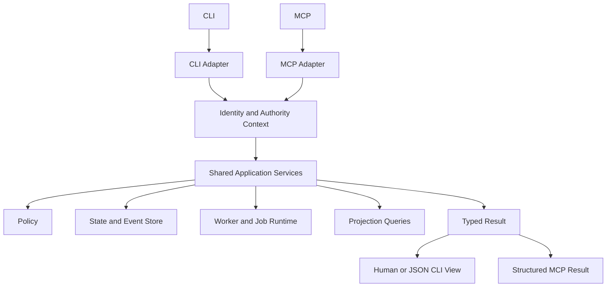

# zForge v2 CLI and MCP

## Status

Normative design draft for zForge v2 command-line and Model Context Protocol
(MCP) control surfaces, shared application services, authority, asynchronous
operations, output contracts, errors, and native format boundaries.

Related documents:

- [Product Direction](./product-direction.md)
- [Fleet and Human Attention](./fleet-and-human-attention.md)
- [State and Events](./state-and-events.md)
- [Data Model](./data-model.md)
- [Policy and Risk](./policy-and-risk.md)
- [Configuration](./configuration.md)
- [Automatic Model Routing](./model-routing.md)
- [Artifacts and Traceability](./artifacts-and-traceability.md)
- [Errors and Recovery](./errors-and-recovery.md)
- [Security Threat Model](./security-threat-model.md)

## Objective

Provide equivalent, safe, scriptable control through CLI and MCP without
duplicating business logic or granting an MCP caller/agent more authority than
an authenticated CLI caller.

## Architecture



Adapters parse and render. They do not implement separate transition, policy,
approval, Git, evidence, or recovery semantics.

## Principles

- CLI and MCP invoke the same typed application commands and queries.
- Mutating operations require identity, policy, expected state, and idempotency.
- Read commands have no hidden mutation except explicitly documented cache repair.
- Human output and machine output are separate renderings of one typed result.
- Long operations return durable job/run identity and are observable/cancellable.
- Agents cannot use MCP tool availability as proof of permission.
- Errors use stable codes and structured safe details.
- Secret values are never accepted in ordinary arguments or returned in output.

## Command and Query Separation

Commands request state changes:

```text
task create | task import | task answer | task amend |
run start | run cancel | run retry | approval decide |
delivery submit | workspace retain | workspace release
```

Queries return projections:

```text
task list | task show | run status | run events | plan show |
evidence status | trace show | approval list | cost report |
config validate | config explain | doctor
```

Queries MUST NOT advance lifecycle state merely because a caller viewed status.

## Proposed CLI Surface

```text
zforge init
zforge doctor
zforge project onboard|readiness
zforge analysis start|status|cancel
zforge environment validate|prepare|status|reset|release
zforge review package|cases|feedback|replay

zforge task create|import|list|show|answer|amend|archive
zforge task decompose|approve-decomposition

zforge batch create|add|remove|show|preflight
zforge batch start|status|watch|pause|resume|cancel
zforge batch result|evidence|cost
zforge inbox list|show|answer|decide

zforge run start|status|watch|events|cancel|retry
zforge plan show|validate
zforge evidence status|bundle|verify
zforge trace show|validate
zforge approval list|show|decide
zforge cost report|forecast
zforge config validate|explain|snapshot
zforge models list|show|probe
zforge routing explain|shadow
zforge workspace list|show|retain|release
zforge delivery status|submit|reconcile
zforge eval run|status|report

zforge mcp serve|register|unregister|doctor
```

This is the target native-v2 surface; no v1 compatibility routing is required.

## Global CLI Options

```text
--project <path-or-id>
--output human|json|jsonl|yaml
--quiet
--no-color
--request-id <idempotency-key>
--expected-sequence <n>
--dry-run
--timeout <duration>
```

Security or rigor controls are not generic bypass flags. Overrides follow the
configuration allowlist and policy rules.

## Mutation Request Envelope

```yaml
schema_version: 2
request_id: request_01J...
command: run.start
actor:
  actor_type: human
  actor_id: user-local
project_id: project_01J...
task_id: SSO-102
expected_sequence: 18
idempotency_key: cli:request_01J...
input_hash: sha256:request...
payload:
  requested_result:
    mode: full_implementation
    target_phase_key: null
    implementation_boundary: pull_request
  dry_run: false
requested_at: 2026-08-25T01:00:00Z
```

The adapter derives actor context from authenticated transport/session, not a
caller-controlled payload field.

## Response Envelope

```yaml
schema_version: 2
request_id: request_01J...
status: accepted
result:
  task_id: SSO-102
  run_id: run_01J...
  job_id: job_01J...
  state: queued
links:
  status_command: zforge run status run_01J...
warnings: []
error: null
```

Statuses:

```text
ok | accepted | needs_input | needs_approval | conflict | rejected | failed
```

Process exit codes are stable by category and documented separately from domain status.

## Exit Codes

```text
0 success/query completed
2 usage or input schema error
3 not found
4 state or optimistic concurrency conflict
5 policy denied
6 needs input or approval
7 execution/gate failure
8 external ambiguity
9 internal/integrity failure
```

Machine callers SHOULD use structured error codes rather than parsing messages.

## Task Intake

`task create/import` records provenance, does not assume the intake is executable,
and returns the next required action. Large tasks transition through decomposition
using the same task lifecycle specification.

Input may come from stdin or approved files/connectors. External content is
classified as untrusted context and never interpreted as CLI flags or policy.

Approved product and repository context is assembled before asking a human for
information. Human questions are targeted and provenance-backed; repeated or
equivalent questions are consolidated through the Decision Inbox.

## Batch and Decision Inbox

`batch preflight` is read-only with respect to task execution. It analyzes task
readiness, context gaps, dependencies, conflicts, risk, environment, expected
human decisions, budget, and integration order.

`batch start` pins an accepted batch revision and starts eligible task runs. It
does not imply parallel or overnight execution. Blocked items remain visible
while unrelated ready items continue when policy permits.

`inbox list` is a query projection. `inbox answer` and `inbox decide` dispatch
typed task, approval, amendment, or review commands to the owning application
service. Inbox tools never become an independent authority or state store.

## Run Start

`run start` validates approved contract/risk/plan/configuration, policy, budget,
and active-run conflicts. It returns a durable run/job identity before long work.

`--dry-run` compiles and validates decisions without spawning agents, mutating a
workspace, or performing external delivery. Dry-run output is not execution evidence.

Run selection accepts:

```text
--agent <runtime-agent|auto>
--model <resolved-model-id|auto>
--reasoning <profile>
```

`--agent codex --model auto` selects only candidates supported by the Codex
adapter. `--agent claude --model auto` does the same for Claude Code.
`--agent auto --model auto` permits selection of the runtime-agent/model pair.
An explicit resolved model remains pinned but cannot bypass capability, policy,
independence, availability, or budget validation.

Dry-run and `routing explain` return the capability-profile, catalog-snapshot,
policy, candidate outcome, stable reason codes, and selected resolved identity
that would be used. They exclude protected evaluation cases, credentials, raw
provider payloads, and chain-of-thought.

## Status and Watch

`run status` returns a sequence-pinned projection with:

- run/task state and last event sequence;
- ready/running/waiting/terminal nodes;
- current attempt and worker identity;
- pending input/approval/blocker;
- budget and cost summary;
- evidence coverage and latest gates/review;
- workspace and delivery summary;
- stale/corrupt projection warning when relevant.

`watch` follows events using cursors and reconnect-safe sequence numbers. It does
not hold a worker lease or mutate the run.

## Cancellation and Retry

Cancellation is a request followed by reconciliation; successful command receipt
does not imply terminal cancellation. The response exposes progress.

Retry requires a target node/error/attempt or a deterministic default route,
expected sequence, and policy decision. It creates a new attempt and never rewinds
or deletes event history.

## Approval Interface

Approval display includes exact action, request hash, scope, reason, risk/cost
impact, evidence, alternatives, expiry, and resulting consequences.

```text
zforge approval decide approval_01J --decision approve --request-id request_01J
```

Interactive confirmation is a UX guard, not authentication. MCP approval tools
require a trusted human authority context and MUST reject agent invocation identity.

## Evidence and Trace Queries

Commands expose current versus historical views explicitly. Default evidence
status uses the current contract/tree and reports missing, invalidated,
contradictory, exception, and not-applicable criteria.

Evidence bundle verification reads hashes and returns reproduction status without
implicitly trusting bundle location.

## MCP Server Boundary

The MCP server communicates over configured local stdio or authenticated remote
transport. Tool calls are untrusted requests until schema, identity, policy, and
state validation pass.

MCP tools MUST NOT:

- expose raw secret values;
- let callers set trusted actor identity;
- bypass expected sequence/idempotency for mutations;
- return unrestricted protected artifacts;
- treat model consent as human approval;
- expose internal chain-of-thought;
- execute arbitrary shell through a generic tool.

## Proposed MCP Tools

| Tool | Kind | Result |
|---|---|---|
| `task_create` | command | Task identity and next action |
| `task_get` | query | Structured task projection |
| `task_answer` | command | Accepted provenance and new state |
| `decomposition_get` | query | Proposed parent/child graph |
| `batch_create` | command | Work-batch identity and selected tasks |
| `batch_preflight` | command | Durable preflight job and readiness identity |
| `batch_get` | query | Batch, item, decision, and outcome projection |
| `batch_start` | command | Batch-run identity and eligible task-run summaries |
| `batch_cancel` | command | Scoped cancellation request identity |
| `inbox_list` | query | Consolidated decision projections |
| `inbox_answer` | command | Provenance-backed product answer routed to owners |
| `run_start` | command | Run and job identity |
| `run_get` | query | Sequence-pinned run projection |
| `run_cancel` | command | Cancellation request identity |
| `run_retry` | command | Recovery decision/new attempt |
| `run_events` | query | Cursor-paginated event envelopes |
| `plan_get` | query | Accepted DAG projection |
| `evidence_status` | query | Coverage and missing evidence |
| `evidence_bundle_get` | query | Authorized bundle manifest |
| `approval_get` | query | Exact pending decision |
| `approval_decide` | command | Only with trusted human authority |
| `cost_get` | query | Forecast/actual/reserved accounting |
| `models_list` | query | Authorized model-catalog projection and availability age |
| `routing_explain` | query | Pinned or prospective routing decision explanation |
| `delivery_get` | query | External operation/reconciliation state |

Tool count should remain bounded. Generic resource/query endpoints MAY reduce
surface area but cannot become arbitrary filesystem access.

## MCP Tool Result

```yaml
content:
  - type: text
    text: Run accepted and queued
structuredContent:
  schema_version: 2
  request_id: request_01J...
  status: accepted
  run:
    run_id: run_01J...
    state: queued
    event_sequence: 1
  required_action: null
isError: false
```

Structured content is authoritative for automation. Text is a concise projection.

## Pagination and Cursors

List/event tools use opaque signed or integrity-protected cursors containing
query identity and last sequence, without secret data. Invalid, expired, or
query-mismatched cursors are rejected. Page ordering is stable.

## Async Jobs

Long commands return `job_id` and domain identity. Job state is transport/runtime
status and does not replace task/run state.

```text
queued | starting | running | reconciling | completed | failed | cancelled
```

Worker disappearance triggers reconciliation. A job marked failed cannot alone
mark the engineering run failed.

## Idempotency and Concurrency

- Mutation tools require a client request/idempotency key.
- Same key and same canonical input returns the original result.
- Same key with different input returns conflict.
- Expected sequence protects state decisions.
- Adapters may retry transport failures only with the same key.
- Query retries are safe and do not create events.

## Authentication and Authorization

Local CLI derives OS/process identity under configured trust. Remote MCP requires
authenticated transport and explicit identity mapping. Authentication does not
imply authorization; every protected command still uses policy.

## Output Safety

- Human output escapes terminal control sequences from untrusted content.
- JSON/YAML follows versioned schemas and stable field names.
- Paths and external strings are rendered as data, never executable suggestions.
- Logs, errors, artifacts, and MCP content apply confidentiality/redaction policy.
- `--debug` does not reveal secrets or protected model content.

## Errors

```yaml
status: conflict
error:
  code: STATE_SEQUENCE_CONFLICT
  message: Run changed after the request was prepared
  safe_details:
    expected_sequence: 18
    actual_sequence: 20
  retry:
    allowed: true
    action: reload_and_reassess
```

Errors follow the errors-and-recovery taxonomy and include safe remediation.

## Native-v2 Command Boundary

Per [ADR-005](./decisions/005-native-v2-no-migration.md), CLI/MCP expose native-v2 contracts. Keeping old command
signatures, MCP aliases, defaults or dual-engine routing is not required.
Unsupported commands/formats return actionable diagnostics without mutating old
data. `task import` is ordinary new-task intake, not a legacy-state converter;
source content must pass native validation and cannot import completion authority.
Machine outputs still advertise native schema and capability versions.

## Capability Discovery

CLI `doctor` and MCP initialization expose supported schema versions, tools,
transports, adapters, optional features, and disabled reasons. Discovery does not
expose installed secrets or grant access.

Model capability discovery distinguishes configured candidate metadata,
authenticated adapter probes, measured evaluation evidence, and unknown facts.
It never converts an installed runtime command into automatic eligibility without
a trusted catalog entry and policy validation.

## Rust Modules

```text
src/application/
├── command.rs
├── query.rs
├── service.rs
├── authority.rs
└── response.rs

src/cli/v2/
├── args.rs
├── commands.rs
├── output.rs
└── exit.rs

src/mcp/v2/
├── server.rs
├── tools.rs
├── schema.rs
├── cursor.rs
└── transport.rs
```

## Testing Strategy

Tests prove CLI/MCP semantic parity, argument/schema validation, stable JSON,
exit codes, idempotency, concurrency conflicts, async jobs, cancellation,
pagination, cursor misuse, approval identity rejection, protected artifact access,
terminal escape sanitization, secret redaction, transport retries, unsupported legacy input rejection,
and no mutation from queries.

Contract tests invoke the same application command through CLI and MCP and
compare canonical domain results/events.

## Acceptance Criteria

- [ ] CLI and MCP share one application-service implementation.
- [ ] Mutations require identity, policy, idempotency, and expected state.
- [ ] Queries do not perform hidden lifecycle transitions.
- [ ] Long operations return durable run/job identities.
- [ ] Structured output and errors are stable and schema-versioned.
- [ ] MCP tool availability never implies authorization.
- [ ] Agent identities cannot submit human approvals.
- [ ] Secret/protected data follows identical policy across transports.
- [ ] CLI supports explicit, agent-scoped automatic, and fully automatic model selection.
- [ ] Routing explanations expose stable reasons without leaking protected evaluator or provider data.
- [ ] CLI and MCP parity is verified by contract tests.
- [ ] Unsupported legacy inputs do not trigger implicit migration or mutate old data.
- [ ] Batch commands do not imply concurrency or overnight scheduling.
- [ ] Decision Inbox mutations route to authoritative task or policy services.

## Requested Results, Review and Environment Commands

Proposed task intake options are `--result plan_only|through_phase|full_implementation`,
`--through-phase <key>` and `--delivery local_changes|local_commits|pull_request`.
The last is invalid for plan-only mode. Persist the canonical `requested_result`
value; changing it after acceptance is a contract amendment. A phase target must
resolve before execution. The old top-level task boundary field is rejected;
only the canonical nested value is stored.

CLI and MCP expose the same typed operations:

| CLI | Typed operation / MCP name | Effect |
|---|---|---|
| `project onboard` | `project.onboard` / `project_onboard` | Start bounded onboarding session and granted baseline checks |
| `project readiness` | `project.readiness` / `project_readiness` | Read supported task classes and blockers |
| `analysis start/status/cancel` | `analysis.start/status/cancel` / `analysis_start/status/cancel` | Start/query/cancel a bounded pre-run session |
| `environment validate/status` | `environment.validate/status` / `environment_validate/status` | Read-only definition or lease validation/query |
| `environment prepare/reset/release` | `environment.prepare/reset/release` / `environment_prepare/reset/release` | Policy-controlled lease lifecycle |
| `review package/cases` | `review.package/cases` / `review_package/cases` | Read package or criteria-linked cases/results |
| `review feedback` | `review.feedback` / `review_feedback` | Record typed feedback against package revision and criterion/test IDs |
| `review replay` | `review.replay` / `review_replay` | Run selected cases in a fresh workspace/environment under grants |

Slash-separated names abbreviate separate commands/tools, not literal MCP names.
All state-changing operations require the normal actor, expected sequence,
idempotency and policy envelope and return a durable job/session/run/lease identity.
Pure status/validation queries never spawn agents, provision environments or run
repository scripts. Batch preflight that invokes agents is a command even though
it is repository-read-only.

Feedback categories and resulting correction/amendment behavior follow
[Development Handoff and Review](./delivery-and-review.md). Replay reports fresh
evidence separately and cannot rewrite sealed historical results. Implementation
commands, publication and continuation cannot exceed authorized requested scope.
