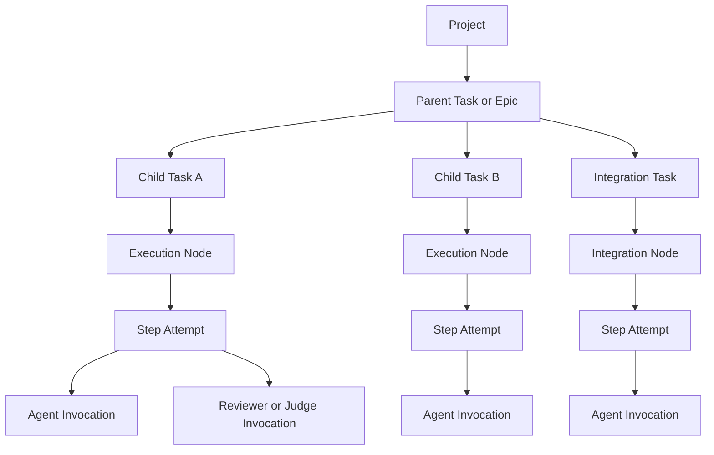
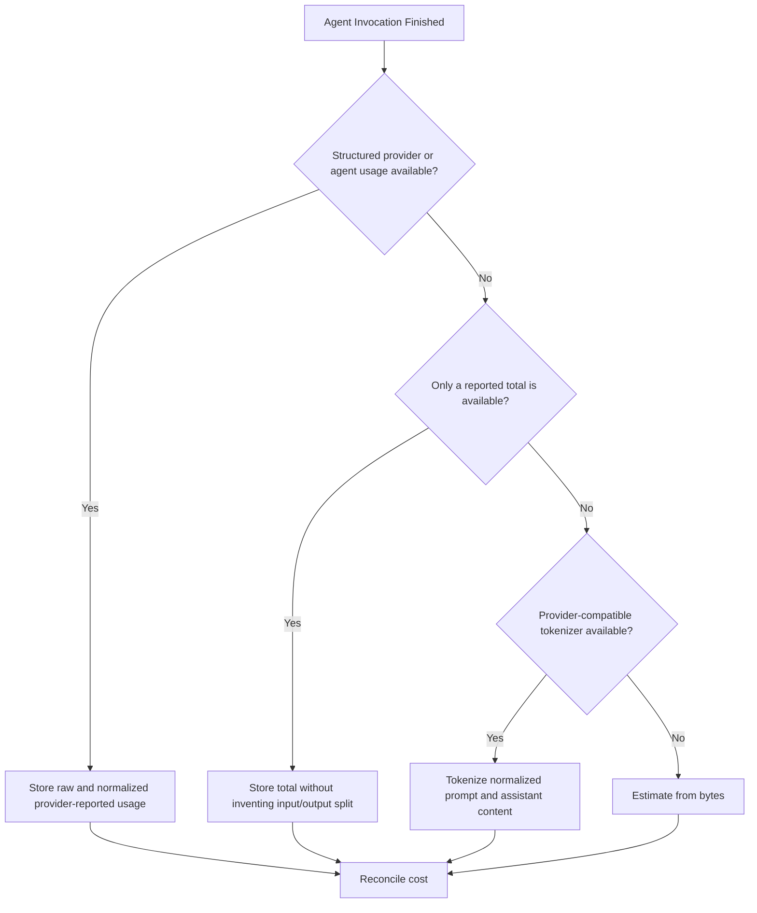
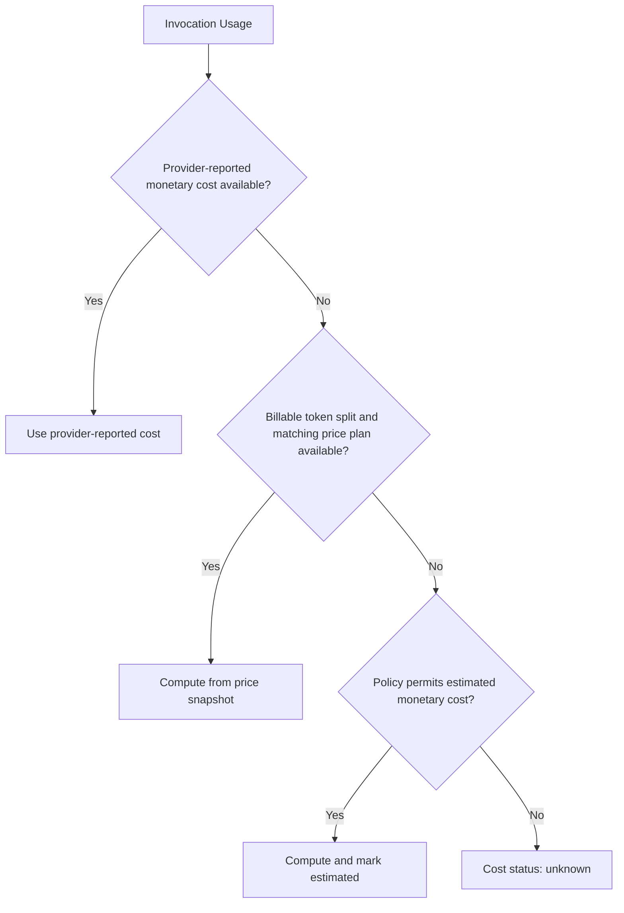
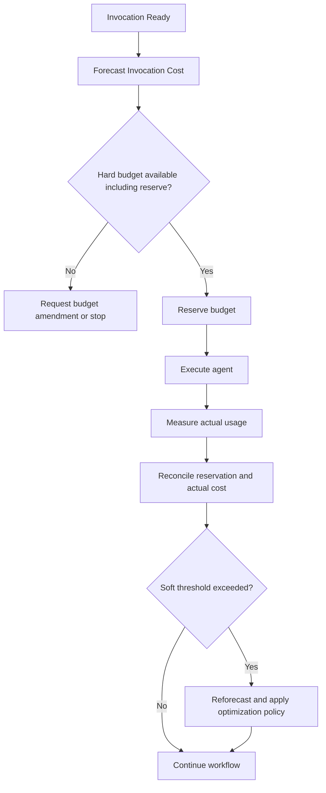

# zForge v2 Agent Token and Cost Accounting

## Status

This document defines the proposed v2 accounting model for AI-agent token usage, monetary cost, quota consumption, forecasting, and budget enforcement.

It is a design target. The current implementation remains the v1 cost telemetry under `src/cost/`.

Related documents:

- [Product Direction](./product-direction.md)
- [Fleet and Human Attention](./fleet-and-human-attention.md)
- [zForge v2 Autonomous Flow](./flow.md)
- [Agents and Subagents](./agents.md)
- [Automatic Model Routing](./model-routing.md)
- [Deterministic Runtime](./deterministic-runtime.md)
- [Skills](./skills.md)
- [Data Model](./data-model.md)
- [State and Events](./state-and-events.md)
- [Artifacts and Traceability](./artifacts-and-traceability.md)
- [Configuration](./configuration.md)
- [Evaluation](./evaluation.md)
- [Autonomous Software Engineering System — Implementation Plan](../../requirements/autonomous-software-engineering-implementation-plan.md)

## Scope

This document covers costs produced by AI-agent invocations:

- prompt and context tokens;
- cache-read and cache-creation tokens;
- visible output and reasoning tokens when reported separately;
- request-level fees;
- provider-reported monetary cost;
- computed monetary cost from a versioned price plan;
- flat-subscription allocation and quota usage;
- retries, fallbacks, review, judge, parent, child, and integration calls;
- pre-run forecasting and runtime budget enforcement.

Development CI compute and storage are not token costs. They may be reported
separately when available. Human active-time measurement is not required, and
application deployment or production-incident accounting is outside v2.

## Goals

- Measure every agent invocation, including failed, timed-out, cancelled, and fallback attempts.
- Prefer provider-reported usage over estimates.
- Preserve raw provider usage before normalization.
- Never represent unknown price as zero cost.
- Distinguish invoice cost, allocated subscription cost, and quota consumption.
- Aggregate without double counting from invocation to parent task.
- Forecast before execution and continuously update the forecast.
- Enforce hard and soft budgets at task, child, node, agent, and project levels.
- Make every number explainable through its source, price snapshot, and calculation.
- Prevent cost optimization from weakening protected quality or increasing human
  attention merely to reduce agent spend.

## Non-Goals

- Predict the business value of a task.
- Guarantee that provider-reported usage matches a future invoice.
- Convert developer time or incident risk into token cost.
- Infer an exact input/output split from a total-only usage report.
- Treat subscription-backed execution as economically free.

## v1 Baseline

v1 records one `CostEntry` per agent spawn in:

```text
<project>/.zforge/cost-log.jsonl
```

Current behavior:

- Claude JSON output can provide input, output, cache-read, cache-creation tokens, and provider-computed USD cost.
- Codex CLI can provide a `tokens used N` total without an input/output split.
- Missing usage falls back to `ceil(bytes / 4)` for prompt and stdout.
- Claude cache reads and writes use static multipliers over the input rate.
- Codex through a flat ChatGPT subscription is represented as zero per-token billing.
- Unknown agent/model prices also currently calculate to zero.
- Legacy interactive dispatch captures input only and marks the call as unmeasured.
- Rollups group by task, phase, agent, model, or step.

## v1 Limitations Addressed by v2

- `estimated` and `reported` values share fields, obscuring which values are authoritative.
- Total-only token reports cannot support reliable input/output price calculation.
- Unknown pricing and genuinely free marginal usage both appear as zero.
- Static compiled prices can drift from provider billing.
- Subscription execution does not expose quota or allocated subscription cost.
- Parent/child task hierarchy is not represented.
- Retries and quality fallbacks are not separated from productive attempts in reports.
- No pre-run forecast or hard budget reservation exists.
- Byte-based output estimation may include JSON envelopes or diagnostic output that was not billed as model output.
- No price-snapshot identifier explains which rate produced a historical number.

## Accounting Hierarchy



The agent invocation is the atomic accounting unit. Higher-level totals are sums of invocation records selected by stable IDs.

## Atomic Agent Invocation Record

Every spawned agent process produces one immutable record.

```yaml
schema_version: 2
invocation_id: inv_01J...
project_id: zforge
task_id: SSO-102
parent_task_id: SSO-100
run_id: run_01J...
node_id: implement-callback
attempt_id: attempt-2
assignment_id: assignment_01J...
routing_decision_ref: routing_decision_01J...
role: coder
phase: execute

agent: claude
provider: anthropic
model_requested: auto
model_resolved: claude-sonnet-versioned
reasoning_profile_requested: deep
reasoning_profile_resolved: provider-specific-high
billing_mode: api

started_at: 2026-08-24T10:00:00Z
duration_ms: 18342
exit_code: 0
outcome: success
fallback_from_invocation_id: null

usage:
  raw: {}
  input_fresh_tokens: 1200
  input_cache_read_tokens: 8000
  input_cache_write_tokens: 0
  output_visible_tokens: 900
  output_reasoning_tokens: null
  provider_total_tokens: 10100
  normalized_billable_tokens: 10100
  source: provider_reported
  confidence: exact

pricing:
  currency: USD
  price_plan_id: anthropic-api-example@2026-08-24
  price_effective_at: 2026-08-24T00:00:00Z
  source: configured_snapshot

cost:
  provider_reported_usd: null
  computed_invoice_usd: 0.0123
  allocated_subscription_usd: null
  effective_usd: 0.0123
  status: computed

forecast:
  estimated_tokens_before_start: 12000
  reserved_usd: 0.02
```

The example values and price-plan name are illustrative, not authoritative vendor pricing.

## Stable Identity

Required identifiers:

- `invocation_id`: unique for one spawned agent process;
- `attempt_id`: one bounded attempt, with at most one spawned agent invocation;
- `node_id` and `run_id`: required for execution-node work, absent for analysis;
- `analysis_session_ref` and `analysis_action`: required for pre-run agent work;
- `task_id`: task/child task when the owner has one; batch/project analysis may omit it;
- `parent_task_id`: parent task when decomposed;
- `project_id`: registered zForge project.

Retries and fallbacks always create new attempt, decision, assignment and
invocation IDs. They never overwrite prior records. Session-level budget accounts
cover pre-run planning/onboarding/preflight; those costs roll up once by reference
to the owner project/task/batch and are not rebilled into a later run.

## Usage Sources and Precedence

zForge selects the best available usage source in this order:



Source values:

| Source | Meaning | Confidence |
|---|---|---|
| `provider_reported` | Structured usage returned by provider or agent | Exact for the reported billing event |
| `reported_total` | Provider or agent reports only total tokens | Exact total, unknown split |
| `tokenizer_estimated` | Compatible tokenizer applied to captured content | Medium to high |
| `byte_estimated` | Byte-length heuristic | Low |
| `input_only` | Output was not captured | Incomplete |
| `unmeasured` | No defensible usage measurement | Unknown |

Reported fields and estimated fields remain separate. An estimate must not overwrite a reported value.

## Raw and Normalized Usage

Providers expose different token concepts. v2 stores both:

- `usage.raw`: provider payload preserved for audit;
- normalized fields used for cross-agent reports;
- billing quantities derived by the selected price plan.

Normalized fields:

- `input_fresh_tokens`;
- `input_cache_read_tokens`;
- `input_cache_write_tokens`;
- `output_visible_tokens`;
- `output_reasoning_tokens`;
- `provider_total_tokens`;
- `normalized_billable_tokens`.

If provider output tokens already include reasoning tokens, the normalization metadata must record that relationship. zForge must not add both values and double count them.

## Token Calculation

### Provider-Reported Split

When all billable classes are reported:

```text
normalized_billable_tokens
  = input_fresh_tokens
  + input_cache_read_tokens
  + input_cache_write_tokens
  + provider-defined billable output tokens
```

`provider_total_tokens` is stored independently because a provider's total may use different inclusion rules.

### Total-Only Report

When only `provider_total_tokens` is reported:

- store the total as exact;
- leave the authoritative input/output split null;
- optionally store a separate estimated split for forecasting analysis;
- do not calculate API invoice cost from the estimated split unless policy explicitly permits an estimated-cost status;
- prefer provider-reported monetary cost when available.

### Tokenizer Estimate

When a compatible tokenizer exists:

```text
estimated_input_tokens
  = tokenize(system + developer + user + tool schemas + selected context)

estimated_output_tokens
  = tokenize(normalized assistant content + billed tool messages)
```

The estimation input must include hidden system or tool context when zForge controls or can observe it.

### Byte Estimate

The final fallback remains:

```text
estimated_tokens = ceil(utf8_bytes / bytes_per_token)
```

The initial configurable estimate is:

```text
bytes_per_token = 4
```

The ratio must be configurable by provider/model and calibrated from historical reported usage. Byte estimates are planning signals, not invoice truth.

Only normalized assistant content should be used for output estimation. CLI banners, JSON envelopes, progress text, stack traces, and stderr must not automatically count as output tokens.

## Price Plans

Prices move out of a compile-time-only table into versioned snapshots.

```yaml
price_plan_id: provider-model-api@2026-08-24
provider: example-provider
agent: example-agent
model_pattern: example-model-*
billing_mode: api
currency: USD
effective_from: 2026-08-24T00:00:00Z
effective_to: null
rates_per_1m:
  input_fresh: 1.00
  input_cache_read: 0.10
  input_cache_write: 1.25
  output_visible: 5.00
  output_reasoning: null
request_fee: 0.00
source:
  type: user_configured
  reference: null
```

The values above are illustrative.

Price-plan rules:

- Every computed historical cost references an immutable `price_plan_id`.
- A price update creates a new snapshot instead of modifying history.
- Project-local configuration may override global configuration.
- Missing price produces `cost.status: unknown`, never numeric zero.
- Currency conversion is separate and references its own exchange-rate snapshot.
- Provider-reported cost is preserved even when a computed price is also available.

## API-Billed Cost Formula

For a price plan with separate token classes:

```text
fresh_input_cost
  = input_fresh_tokens × input_fresh_rate / 1,000,000

cache_read_cost
  = input_cache_read_tokens × input_cache_read_rate / 1,000,000

cache_write_cost
  = input_cache_write_tokens × input_cache_write_rate / 1,000,000

visible_output_cost
  = output_visible_tokens × output_visible_rate / 1,000,000

reasoning_output_cost
  = separately_billable_reasoning_tokens × reasoning_rate / 1,000,000

computed_invoice_cost
  = fresh_input_cost
  + cache_read_cost
  + cache_write_cost
  + visible_output_cost
  + reasoning_output_cost
  + request_fee
```

Only provider-defined separately billable reasoning tokens enter `reasoning_output_cost`.

## Cost Precedence

The effective invoice-cost value uses this precedence:



Stored values:

- `provider_reported_usd`;
- `computed_invoice_usd`;
- `estimated_invoice_usd`;
- `effective_usd`;
- `cost.status`: `reported`, `computed`, `estimated`, `subscription`, or `unknown`.

If provider-reported and computed cost differ, both values remain visible and the reconciliation delta is reported.

## Subscription and Quota Accounting

A flat subscription has no reliable per-call invoice amount, but execution is not economically free.

Track three separate values:

- `invoice_marginal_usd`: normally zero for a covered call;
- `allocated_subscription_usd`: optional management allocation;
- `quota_usage`: tokens, requests, credits, or provider-specific capacity units.

Possible allocation policy:

```text
allocated_subscription_cost_for_invocation
  = monthly_subscription_cost
  × invocation_weight
  / total_period_weight
```

Allocation is retrospective and must be labeled `allocated`, not `provider_reported`.

Reports must distinguish:

```text
$0 marginal invoice cost
```

from:

```text
unknown monetary cost
```

and:

```text
unmeasured usage
```

## Retries, Fallbacks, and Failed Calls

Every invocation consumes its own budget regardless of outcome.

Cost categories:

- `productive`: accepted output contributed to the final result;
- `correction`: output used in a successful correction loop;
- `availability_fallback`: provider failure caused another agent to run;
- `quality_fallback`: inadequate output caused another agent to run;
- `discarded`: output was rejected and did not contribute;
- `overhead`: classifier, judge, reviewer, or summarizer call.

Reports must expose:

```text
total cost
productive cost
correction cost
fallback cost
discarded cost
overhead cost
```

A timeout, non-zero exit, cancellation, or provider error may still have billable tokens and must not be omitted.

## Parent and Child Task Aggregation

The parent total is:

```text
parent_total
  = parent_analysis_and_decomposition
  + sum(child_task_totals)
  + integration_task_total
  + parent_review_and_delivery
```

Aggregation rules:

- Every invocation belongs to exactly one executable task.
- A child invocation appears once in the child total and once through hierarchical parent rollup, not twice in a flat project total.
- Cache creation is charged to the invocation that created it.
- Cache reads are charged to the invocation that consumed them.
- Shared parent context is accounted according to actual provider usage for each invocation.
- Parallel execution reduces wall-clock time but does not reduce summed token usage.
- Cancelled descendants remain in actual cost even when the parent fails.

## Forecasting

Before execution, zForge produces a range rather than a single number.

```yaml
forecast:
  confidence: medium
  expected:
    input_tokens: 80000
    output_tokens: 18000
    agent_cost_usd: 1.80
  p90:
    input_tokens: 140000
    output_tokens: 32000
    agent_cost_usd: 3.40
  assumptions:
    attempts_per_node: 1.3
    cache_hit_rate: 0.70
    child_tasks: 3
```

Forecast inputs:

- selected task profile and risk;
- execution-DAG nodes;
- selected agent and model per node;
- expected context size;
- output limit;
- historical usage for similar task classes;
- expected retry and fallback rates;
- expected cache hit rate;
- parent, child, integration, reviewer, and judge calls.

Initial forecasting may use configured heuristics. It should evolve toward historical P50 and P90 distributions grouped by project, task type, role, agent, and model.

## Expected Retry Cost

For a bounded node with attempt costs `C1..Cn` and probability of reaching each attempt `P1..Pn`:

```text
expected_node_cost = Σ Pi × Ci
```

When detailed probabilities are unavailable:

```text
expected_node_cost
  = first_attempt_cost × expected_attempt_count
```

The forecast must include reviewer and correction calls triggered by failure, not only coder calls.

## Budget Model

Budgets may be defined at project, parent task, child task, execution node, role, agent, or model level.

```yaml
budget:
  agent_tokens:
    soft: 150000
    hard: 250000
  agent_cost_usd:
    soft: 5.00
    hard: 8.00
  agent_invocations:
    hard: 20
  correction_attempts_per_node:
    hard: 3
  fallback_attempts_per_node:
    hard: 2
  reserve_ratio: 0.15
```

Budget behavior:

- `soft`: warn, reforecast, and apply cost optimization policy;
- `hard`: prevent the next invocation unless an authorized budget amendment exists;
- `reserve_ratio`: preserve capacity for required review and delivery calls;
- budget amendments are versioned policy decisions with provenance.

The scheduler reserves forecast cost before starting an invocation and reconciles reservation against actual usage after completion.

## Budget Enforcement Flow



## Cost Optimization Policy

When approaching a soft limit, zForge may:

- stop before launching optional reviewers or gates;
- use deterministic validation before an LLM judge;
- reduce irrelevant context through traceability-based selection;
- reuse cacheable stable context;
- select a cheaper permitted model;
- run affected tests before full-suite gates;
- avoid repeating successful unaffected nodes;
- require human approval before another correction loop;
- split or defer optional scope.

Cost optimization cannot bypass mandatory safety, security, evidence, or review policy.
It also cannot trade an expected increase in human active attention for lower
agent cost unless the human explicitly selects that operating policy. When
quality and attention are equivalent, the lower expected accepted-outcome cost
is preferred.

## Agent and Model Routing

The normative automatic-selection algorithm is defined in
[Automatic Model Routing](./model-routing.md). Cost accounting supplies forecast
and observed cost/quota signals; it does not own candidate eligibility or the
quality decision.

Routing first satisfies eligibility, safety, evidence, independence, and expected
accepted-quality requirements. It then minimizes expected human intervention,
correction burden, and monetary cost in that order.

Example policy:

| Role | Default routing principle |
|---|---|
| Requirement extraction | Quality-equivalent model with lowest expected accepted-outcome cost |
| Risk classification | Deterministic rules first, model only for unresolved cases |
| Planning | Model selected by task complexity and architecture risk |
| Coding | Model selected by language, scope, and historical pass rate |
| Review | Independent model satisfying risk policy |
| Judge | Quality-equivalent model with lowest expected accepted-outcome cost |

The cheapest model is not automatically the lowest-cost choice. Expected cost includes retry probability:

```text
expected_effective_cost
  = cost_per_attempt × expected_attempts_to_acceptance
```

The router compares cost only after protected quality and expected human
intervention. Unknown model cost remains unknown and is reserved conservatively;
it is not interpreted as free. Routing decisions retain forecast inputs and the
actual invocation ledger retains resolved-model usage, allowing prediction error
to be measured without rewriting the original decision.

## Reporting

Required report dimensions:

- project;
- parent and child task;
- run, node, attempt, and invocation;
- role and phase;
- agent, provider, and resolved model;
- usage source and confidence;
- fresh input, cached input, cache creation, visible output, and reasoning;
- billing mode and price plan;
- reported, computed, estimated, allocated, and unknown cost;
- productive, correction, fallback, discarded, and overhead cost;
- duration, outcome, and timeout status.

Required views:

```text
zforge cost estimate <TASK-ID>
zforge cost report --tree <TASK-ID>
zforge cost report --by role
zforge cost report --by agent
zforge cost report --by model
zforge cost report --waste
zforge cost explain <INVOCATION-ID>
zforge cost budget <TASK-ID>
```

`cost explain` must show the exact usage source, normalization, price snapshot, formula, and reconciliation delta.

## Storage

Immutable invocation records and budget-ledger revisions are YAML files committed
with the owning events under [ADR-002](./decisions/002-file-backed-persistence.md).
Task/run directories retain those records; the reporting path below is derived:

```text
<project>/.zforge/telemetry/agent-invocations/<invocation-id>.yaml
```

Requirements:

- append-only immutable invocation records;
- `schema_version` on every record;
- atomic visibility through the YAML commit-manifest protocol for authoritative records;
- corrupt authoritative budget/usage records block affected admission/reconciliation; incomplete reports expose gaps rather than treating missing cost as zero;
- reporting indexes are rebuildable and cannot authorize spending;
- secrets and prompt content excluded from telemetry by default;
- raw usage payloads redacted according to policy;
- optional centralized export through a separate adapter;
- local reports remain available without a remote service.

## Privacy and Security

- Do not store prompts or model output in cost telemetry by default.
- Store byte counts, hashes, token counts, and artifact IDs instead.
- Redact provider payload fields that may contain text, identifiers, or secrets.
- Do not expose subscription account identifiers in project artifacts.
- Treat price configuration and subscription allocation as potentially sensitive organizational data.
- Apply retention policies independently to telemetry and task artifacts.

## Native-v2 Telemetry Boundary

Per [ADR-005](./decisions/005-native-v2-no-migration.md), v2 accounting starts from native invocation records.
Reading or converting the old cost log is out of scope; no synthetic invocation
or node identities are created from v1 entries. Old logs remain untouched and
outside native-v2 totals. The user handles historical data separately.
Native usage provenance and immutable price snapshots remain required.

## Testing Strategy

Required tests:

- provider usage parser fixtures;
- total-only usage without invented split;
- tokenizer and byte-estimate fallbacks;
- non-ASCII prompt estimation;
- JSON-envelope and stderr exclusion from output estimates;
- reasoning-token double-count prevention;
- price-snapshot selection by effective timestamp;
- unknown-price behavior;
- provider-reported versus computed-cost reconciliation;
- subscription allocation and quota reporting;
- retries, fallbacks, timeouts, cancellations, and failed-call accounting;
- parent/child aggregation without double counting;
- budget reservation, release, amendment, and hard-stop behavior;
- legacy logs remain untouched and excluded from native totals;
- corrupted telemetry-record handling;
- redaction and secret-leak tests.

Real-agent contract tests remain behind explicit environment flags because they may consume quota or incur monetary cost.

## Acceptance Criteria

- [ ] Every orchestrated agent spawn produces one immutable invocation record.
- [ ] Provider-reported usage takes precedence over estimates.
- [ ] Raw usage and normalized usage are both preserved safely.
- [ ] Total-only reports never fabricate an authoritative token split.
- [ ] Unknown price is represented as unknown, not `$0`.
- [ ] Subscription, API billing, and quota usage are distinct.
- [ ] Historical costs reference immutable price snapshots.
- [ ] Failed, cancelled, timed-out, retry, and fallback invocations are counted.
- [ ] Parent and child totals aggregate without double counting.
- [ ] Forecasts include correction, reviewer, judge, and integration calls.
- [ ] Hard budgets prevent unauthorized new invocations.
- [ ] Soft budgets trigger reforecasting and optimization without bypassing mandatory gates.
- [ ] Every displayed cost can be explained from source usage through formula and price plan.
- [ ] Cost reports do not require human active-time tracking.
- [ ] Cost optimization cannot weaken protected quality or silently increase expected human intervention.
- [ ] Routing forecast and resolved-model actual cost can be reconciled per decision and invocation.
- [ ] Native accounting does not silently consume or rewrite legacy telemetry.
