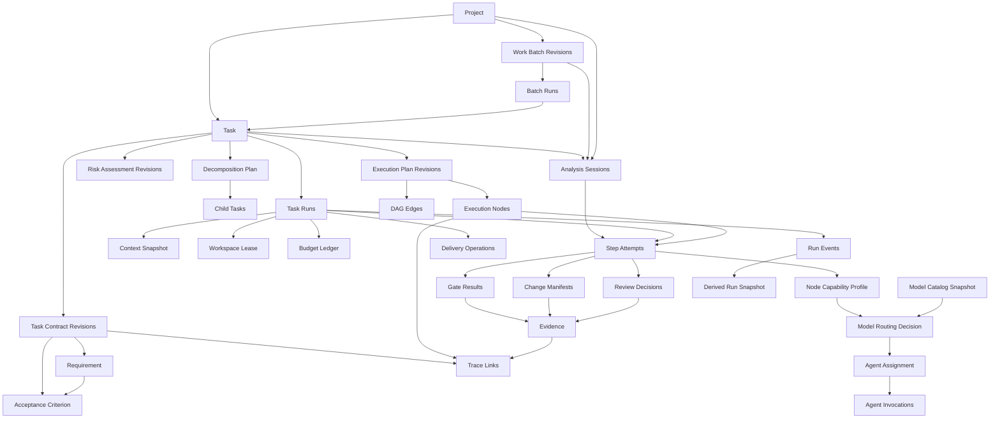
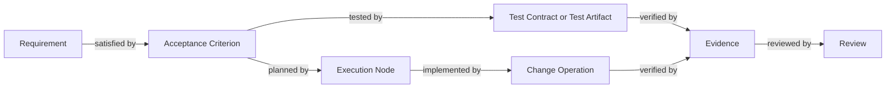
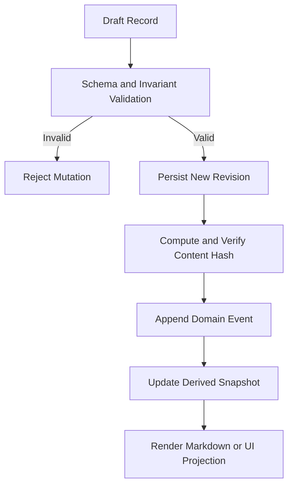
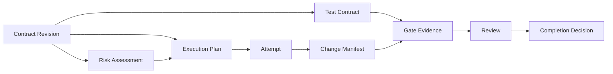
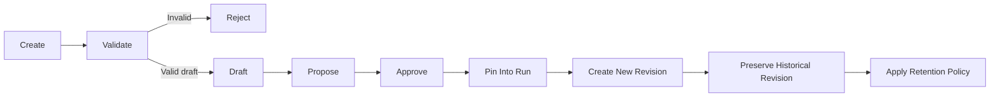

# zForge v2 Data Model

## Status

This document is the normative design draft for zForge v2 structured records, identifiers, relationships, persistence boundaries, versioning, and validation invariants.

Normative terms such as **MUST**, **MUST NOT**, **SHOULD**, and **MAY** describe implementation requirements. The document remains a draft until explicitly accepted.

Schema ownership is accepted in
[ADR-001 — Canonical Schema Ownership](./decisions/001-canonical-schema.md).
This does not imply that every record field or runtime implementation is final.

Related documents:

- [Product Direction](./product-direction.md)
- [Fleet and Human Attention](./fleet-and-human-attention.md)
- [zForge v2 Autonomous Flow](./flow.md)
- [State and Events](./state-and-events.md)
- [Artifacts and Traceability](./artifacts-and-traceability.md)
- [Agents and Subagents](./agents.md)
- [Automatic Model Routing](./model-routing.md)
- [Skills](./skills.md)
- [Deterministic Runtime](./deterministic-runtime.md)
- [Agent Token and Cost Accounting](./cost.md)
- [Execution DAG](./execution-dag.md)
- [Policy and Risk](./policy-and-risk.md)
- [Configuration](./configuration.md)
- [Workspace and Git](./workspace-and-git.md)
- [Quality Gates](./quality-gates.md)
- [Errors and Recovery](./errors-and-recovery.md)
- [CLI and MCP](./cli-and-mcp.md)
- [Security Threat Model](./security-threat-model.md)
- [Evaluation](./evaluation.md)

## Scope

This document defines the canonical model for:

- projects and tasks;
- product/repository/task context snapshots;
- work batches, batch runs, and batch items;
- parent and child task decomposition;
- requirements and acceptance criteria;
- risk assessment;
- policy bundles and configuration snapshots;
- execution plans and DAG nodes;
- task runs and step attempts;
- node capability profiles, model-catalog snapshots, and routing decisions;
- agent assignments and invocations;
- workspace leases;
- change manifests;
- quality-gate results;
- gate definitions and gate groups;
- review findings and decisions;
- policy decisions and human approvals;
- artifacts, provenance, evidence, and traceability;
- budget reservations and ledger entries;
- errors and external delivery operations;
- recovery decisions and asynchronous interface jobs;
- evaluation cases, case runs, and evaluation runs;
- human-decision inbox projections and attention metrics;
- project, task, batch and run event envelopes and derived snapshots.
- bounded analysis sessions, project readiness and local environment leases;
- requested result modes, phase boundaries, review packages and continuation artifacts.

Detailed transition behavior and the event catalog are defined in [State and Events](./state-and-events.md). Detailed policy evaluation is defined in [Policy and Risk](./policy-and-risk.md). This document defines the records those systems exchange and persist.

## Design Principles

- Structured records are authoritative; Markdown is a human-readable projection.
- Durable events are the source of lifecycle truth; snapshots are derived caches.
- Artifacts and evidence are immutable once referenced by an accepted event.
- Every mutable concept uses explicit revisioning or append-only events.
- Every cross-record reference is stable, typed, and validated.
- Every agent invocation is attributable to one execution or analysis owner, attempt, assignment, model, skill set, policy decision and budget reservation.
- No agent-authored field grants permission, approval, budget, or state advancement.
- Parent totals and child totals aggregate without double counting.
- Batch aggregation references task truth and never replaces it.
- Decision provenance does not require human active-duration telemetry.
- Schema evolution is explicit and backward-compatible within a major schema version.
- Secrets and unnecessary prompt or model-output content are excluded from operational records.

## Sources of Truth

| Concern | Authoritative source | Derived representation |
|---|---|---|
| Requirements and scope | Approved `TaskContract` revision | `task.md`, specification views, PR summary |
| Selected execution context | Immutable `ContextSnapshot` | Prompt context and context explanation |
| Batch selection and dependencies | Accepted `WorkBatch` revision | Fleet plan and preflight view |
| Batch execution | Batch event stream plus referenced task/run summaries | Fleet status and outcome digest |
| Parent/child structure | Approved `DecompositionPlan` revision | Task tree and dependency views |
| Risk and required rigor | Accepted `RiskAssessment` plus policy decisions | Status and approval hints |
| Execution structure | Accepted `ExecutionPlan` revision | Scheduler indexes and status views |
| Task lifecycle | Append-only task event stream | Task status and parent/child progress |
| Run lifecycle | Append-only run event stream | Run, node, and attempt status |
| Model eligibility facts | Immutable `ModelCatalogSnapshot` | Available-model and capability views |
| Model selection | Immutable `ModelRoutingDecision` | Routing explanation and candidate summary |
| Agent work | `AgentInvocation` and immutable output artifacts | Cost and activity reports |
| Code changes | Actual Git diff plus accepted `ChangeManifest` | Commit and PR summaries |
| Verification | Immutable `GateResult` and `EvidenceRecord` | Verification summaries |
| Human authority | `ApprovalDecision` | Current policy grant view |
| Cost | Invocation usage plus budget ledger | Cost reports and forecasts |
| Delivery | `DeliveryOperation` records plus verified external state | PR and development CI status |

Markdown MUST NOT be parsed as the only source for decisions when an authoritative structured record exists.

## Canonical Serialization and Hashing

Records MAY be stored as YAML or JSON for readability, but hashing follows one canonical process:

1. Parse the document into its typed schema.
2. Remove transport-only fields excluded by that schema, such as a self-referential `content_hash`.
3. Normalize timestamps to RFC 3339 UTC.
4. Normalize object keys and set-like arrays according to schema rules.
5. Serialize to canonical JSON without insignificant whitespace.
6. Compute SHA-256 over the UTF-8 bytes.

Hash representation:

```text
sha256:<lowercase-hex>
```

Ordered arrays, including plan steps, DAG edges, attempts, and event streams, MUST preserve order. Set-like arrays, including tags and capability names, MUST be sorted before canonical hashing.

## Common Record Envelope

Persisted records that are not event envelopes SHOULD use:

```yaml
schema_version: 2
record_type: task_contract
record_id: contract_01J...
revision: 3
status: accepted
created_at: 2026-08-25T00:00:00Z
created_by:
  actor_type: human
  actor_id: user-local
updated_at: 2026-08-25T01:00:00Z
content_hash: sha256:abc...
provenance_refs:
  - provenance_01J...
```

Required common fields:

| Field | Requirement |
|---|---|
| `schema_version` | MUST identify the major data-model version |
| `record_type` | MUST identify the concrete schema |
| `record_id` | MUST be globally unique within a project store |
| `revision` | MUST begin at `1` and increase monotonically for revisions of the same logical record |
| `status` | MUST use the enum defined by the concrete schema |
| `created_at` | MUST be RFC 3339 UTC |
| `created_by` | MUST identify a human, system component, or agent invocation |
| `updated_at` | MUST be greater than or equal to `created_at` |
| `content_hash` | MUST match canonical typed content |
| `provenance_refs` | MUST identify material source inputs |

Append-only records such as events and ledger entries use their own immutable envelope and do not increment revisions.

Embedded value objects such as requirements, acceptance criteria, risk factors,
review findings, and change operations do not repeat the common envelope. They
MUST have a stable opaque ID and are versioned with their owning record. If one
of these objects needs an independent lifecycle, it MUST be promoted to a
top-level record with the common envelope.

## Actor Reference

```yaml
actor_type: human | system | agent_invocation | external_system
actor_id: user-local | orchestrator | inv_01J... | github
display_name: optional-readable-name
```

Rules:

- `agent_invocation` actors MUST reference an existing invocation.
- `system` actors MUST identify the deterministic component.
- Human approvals MUST identify a human or trusted external identity, not an agent invocation.

## Identifier Conventions

### Human Task IDs

Human-facing task IDs retain the project-key format:

```text
PROJECT-NUMBER
```

Examples:

```text
TASK-001
AUTH-42
SSO-199
```

Canonical validation:

```text
^[A-Z][A-Z0-9]*-[0-9]+$
```

Task IDs are case-sensitive and MUST NOT be reused within the same project history.

### Opaque Record IDs

Runtime and immutable record IDs use a lowercase type prefix plus a lexicographically sortable opaque suffix:

| Entity | Prefix | Example |
|---|---|---|
| Project | `project_` | `project_01J...` |
| Task record | `task_` | `task_01J...` |
| Contract | `contract_` | `contract_01J...` |
| Requirement | `req_` | `req_01J...` |
| Acceptance criterion | `ac_` | `ac_01J...` |
| Test definition | `test_` | `test_01J...` |
| Evidence strategy | `evidence_strategy_` | `evidence_strategy_01J...` |
| Assumption | `assumption_` | `assumption_01J...` |
| Constraint | `constraint_` | `constraint_01J...` |
| Exclusion | `exclusion_` | `exclusion_01J...` |
| Clarification question | `question_` | `question_01J...` |
| Decomposition plan | `decomp_` | `decomp_01J...` |
| Risk assessment | `risk_` | `risk_01J...` |
| Risk factor | `risk_factor_` | `risk_factor_01J...` |
| Policy bundle | `policy_bundle_` | `policy_bundle_01J...` |
| Configuration snapshot | `config_snapshot_` | `config_snapshot_01J...` |
| Execution plan | `plan_` | `plan_01J...` |
| Node | `node_` | `node_01J...` |
| Edge | `edge_` | `edge_01J...` |
| Analysis session | `analysis_` | `analysis_01J...` |
| Project readiness | `readiness_` | `readiness_01J...` |
| Environment profile | `env_profile_` | `env_profile_01J...` |
| Environment lease | `env_lease_` | `env_lease_01J...` |
| Review package | `review_package_` | `review_package_01J...` |
| Run | `run_` | `run_01J...` |
| Attempt | `attempt_` | `attempt_01J...` |
| Node capability profile | `capability_profile_` | `capability_profile_01J...` |
| Model catalog snapshot | `model_catalog_` | `model_catalog_01J...` |
| Model routing decision | `routing_decision_` | `routing_decision_01J...` |
| Assignment | `assignment_` | `assignment_01J...` |
| Invocation | `inv_` | `inv_01J...` |
| Workspace lease | `lease_` | `lease_01J...` |
| Change manifest | `change_` | `change_01J...` |
| Change operation | `change_op_` | `change_op_01J...` |
| Gate result | `gate_result_` | `gate_result_01J...` |
| Gate definition | `gate_` | `gate_01J...` |
| Gate group | `gate_group_` | `gate_group_01J...` |
| Review | `review_` | `review_01J...` |
| Finding | `finding_` | `finding_01J...` |
| Policy decision | `policy_` | `policy_01J...` |
| Approval | `approval_` | `approval_01J...` |
| Artifact | `artifact_` | `artifact_01J...` |
| Evidence | `evidence_` | `evidence_01J...` |
| Trace link | `trace_` | `trace_01J...` |
| Coverage report | `coverage_` | `coverage_01J...` |
| Evidence bundle | `bundle_` | `bundle_01J...` |
| Budget account | `budget_account_` | `budget_account_01J...` |
| Budget reservation | `reservation_` | `reservation_01J...` |
| Ledger entry | `ledger_` | `ledger_01J...` |
| Error | `error_` | `error_01J...` |
| Recovery decision | `recovery_` | `recovery_01J...` |
| Event | `event_` | `event_01J...` |
| Command | `command_` | `command_01J...` |
| Interface request | `request_` | `request_01J...` |
| Async job | `job_` | `job_01J...` |
| Delivery operation | `delivery_` | `delivery_01J...` |
| Provenance | `provenance_` | `provenance_01J...` |
| Evaluation case | `eval_case_` | `eval_case_01J...` |
| Evaluation case run | `eval_case_run_` | `eval_case_run_01J...` |
| Evaluation run | `eval_run_` | `eval_run_01J...` |
| Context snapshot | `context_` | `context_01J...` |
| Work batch | `batch_` | `batch_01J...` |
| Batch run | `batch_run_` | `batch_run_01J...` |

The suffix implementation MAY use ULID or another sortable 128-bit identifier. Its generation algorithm MUST be collision-resistant and testable with a deterministic clock/random source.

## Stable Keys and Opaque IDs

Execution nodes and contract elements MAY also expose readable keys:

```yaml
node_id: node_01J...
key: implement-auth-callback
```

Rules:

- Opaque IDs are authoritative references.
- Readable keys are unique only within their owning revision.
- A new contract or plan revision MAY retain a readable key while creating a new opaque ID when semantics materially change.

## Entity Relationship Overview



## Project Record

```yaml
schema_version: 2
record_type: project
record_id: project_01J...
revision: 1
status: active
name: zforge
root_path: /absolute/path/to/project
repository:
  kind: git
  canonical_remote: optional-remote-identity
default_branch: main
configuration_refs:
  - config:project-defaults@4
created_at: 2026-08-25T00:00:00Z
created_by:
  actor_type: system
  actor_id: zforge-init
updated_at: 2026-08-25T00:00:00Z
content_hash: sha256:abc...
provenance_refs: []
```

Project status:

```text
active | disabled | archived
```

The project record MUST NOT contain credentials.

## Task Record

The task record identifies a durable engineering outcome. It does not duplicate the full contract.

```yaml
schema_version: 2
record_type: task
record_id: task_01J...
revision: 1
status: active
task_id: SSO-102
project_id: project_01J...
kind: executable
profile: feature
title: Implement the SSO callback behavior
parent_task_id: SSO-100
root_task_id: SSO-100
current_contract_ref:
  record_id: contract_01J...
  revision: 3
current_risk_ref:
  record_id: risk_01J...
  revision: 2
current_plan_ref:
  record_id: plan_01J...
  revision: 1
created_at: 2026-08-25T00:00:00Z
created_by:
  actor_type: system
  actor_id: task-intake
updated_at: 2026-08-25T01:00:00Z
content_hash: sha256:abc...
provenance_refs:
  - provenance_01J...
```

Task kinds:

```text
epic | executable | integration | research
```

Task profiles:

```text
feature | fixbug | docs | spike
```

Task record status:

```text
active | archived | superseded
```

Operational task status such as `running`, `needs_input`, or `completed` is derived from the task event stream, linked runs, approvals, and child state. It is not written into the task record as lifecycle truth. Canonical task states and transitions are defined in [State and Events](./state-and-events.md).

Invariants:

- `epic` tasks MUST NOT directly own production-code execution nodes.
- `integration` tasks MUST reference a parent epic or executable task graph.
- `research` tasks MUST use the `spike` profile.
- `parent_task_id` MUST reference an existing task in the same project.
- `root_task_id` MUST resolve to the topmost ancestor.
- Parent relationships MUST be acyclic.

## Context Snapshot

`ContextSnapshot` pins the exact product, repository, task, and permitted
external context selected for a task run or batch preflight. It records
selection and provenance, not raw secret values.

```yaml
schema_version: 2
record_type: context_snapshot
record_id: context_01J...
revision: 1
status: immutable
project_id: project_01J...
task_id: SSO-102
purpose: task_execution
sources:
  - provenance_ref: provenance_01J...
    artifact_ref: artifact_01J...
    context_class: product_knowledge
    relevance_reason_codes:
      - AUTH_SESSION_POLICY
    trust_classification: project_trusted
    source_revision: 4
    content_hash: sha256:source...
staleness_findings: []
conflict_findings: []
selection_policy_ref: context-policy@2
created_at: 2026-08-28T01:00:00Z
created_by:
  actor_type: system
  actor_id: context-assembler
updated_at: 2026-08-28T01:00:00Z
content_hash: sha256:context...
provenance_refs:
  - provenance_01J...
```

Context classes:

```text
product_knowledge | repository_knowledge | task_context | external_reference
```

Invariants:

- Every selected source has identity, version or retrieval time, hash, trust,
  and a relevance explanation.
- Material stale or contradictory context cannot be silently selected as truth.
- Context snapshots are immutable and pinned before an invocation consumes them.
- Agent output may propose a knowledge update but cannot create a trusted
  canonical source without the required authority.
- Secret values are excluded; authorized secret identities are modeled through
  policy grants.

## Work Batch

`WorkBatch` is a revisioned selection of task outcomes, priorities, dependencies,
and shared execution policy. It is not an execution state record and is not an
alias for a sprint or schedule.

```yaml
schema_version: 2
record_type: work_batch
record_id: batch_01J...
revision: 2
status: accepted
project_id: project_01J...
name: sprint-42-core
objective: Deliver selected authentication outcomes
items:
  - task_id: AUTH-101
    priority: high
    required: true
    dependency_task_ids: []
  - task_id: AUTH-102
    priority: normal
    required: true
    dependency_task_ids:
      - AUTH-101
quality_profile_ref: quality:strict@1
attention_policy_ref: attention:default@1
budget_policy_ref: budget:sprint-42@1
delivery_boundary: pull_request
created_at: 2026-08-28T01:00:00Z
created_by:
  actor_type: human
  actor_id: user-local
updated_at: 2026-08-28T01:00:00Z
content_hash: sha256:batch...
provenance_refs: []
```

Batch status:

```text
draft | proposed | accepted | superseded | rejected | archived
```

Invariants:

- Membership, priority, dependency, quality, attention, budget, and delivery
  changes create a new revision.
- Batch task dependencies are acyclic.
- A batch priority cannot bypass task risk, policy, or evidence requirements.
- A task retains independent lifecycle and completion truth.
- Batch delivery settings are defaults/constraints only; they cannot turn a plan-only item into implementation or widen an accepted task boundary.

## Batch Run

`BatchRun` pins one accepted work-batch revision, preflight inputs, and aggregate
execution policy. Operational state is derived from its batch event stream.

```yaml
schema_version: 2
record_type: batch_run
record_id: batch_run_01J...
revision: 1
status: active
batch_ref:
  record_id: batch_01J...
  revision: 2
context_snapshot_refs:
  - context_01J...
configuration_snapshot_ref: config_snapshot_01J...@1
preflight_artifact_ref: artifact_01J...
task_run_refs:
  - run_01J...
integration_run_ref: null
created_at: 2026-08-28T01:10:00Z
created_by:
  actor_type: system
  actor_id: batch-controller
updated_at: 2026-08-28T01:10:00Z
content_hash: sha256:batch-run...
provenance_refs: []
```

Batch-run record status:

```text
active | superseded | archived
```

Canonical operational states are defined in
[Fleet and Human Attention](./fleet-and-human-attention.md). The Decision Inbox
is a projection over clarification, approval, blocker, amendment, integration,
and human-review records; it is not a competing mutable record.

## Provenance Record

```yaml
schema_version: 2
record_type: provenance
record_id: provenance_01J...
revision: 1
status: active
source_type: human_input | jira | figma | repository | artifact | external_document | memory
source_identity: optional-stable-source-id
source_uri: optional-redacted-uri
retrieved_at: 2026-08-25T00:00:00Z
trust_classification: trusted | project_trusted | untrusted | unknown
content_hash: sha256:abc...
content_artifact_ref: artifact_01J...
created_at: 2026-08-25T00:00:00Z
created_by:
  actor_type: system
  actor_id: intake
updated_at: 2026-08-25T00:00:00Z
provenance_refs: []
```

Raw source content MAY live in a separate protected artifact. Operational records SHOULD store references and hashes rather than duplicating external content.

## Task Contract

`TaskContract` is the authoritative definition of the requested outcome and delivery boundary.

`requested_result` and `documentation_impact` are required typed values defined in
[Development Handoff and Review](./delivery-and-review.md). Changing the mode,
target phase, boundary or documentation obligation creates a contract revision.
A plan-only contract requires no implementation delivery operation.

```yaml
schema_version: 2
record_type: task_contract
record_id: contract_01J...
revision: 3
status: approved
task_id: SSO-102
supersedes:
  record_id: contract_01J...
  revision: 2
requested_result:
  mode: full_implementation
  target_phase_key: null
  implementation_boundary: pull_request
documentation_impact:
  status: required
  audience: API consumers
  target_paths: [docs/authentication.md]
  reason: New callback behavior and error contract
outcome: A user can complete the SSO callback securely
problem: The callback flow is not implemented
requirements:
  - requirement_id: req_01J...
    key: REQ-001
    statement: The callback validates state before exchanging a code
    source_refs:
      - provenance_01J...
    priority: required
acceptance_criteria:
  - criterion_id: ac_01J...
    key: AC-001
    requirement_refs:
      - req_01J...
    statement: A callback with mismatched state is rejected before token exchange
    verification:
      kind: automated_test
      required_evidence_types:
        - gate_result
        - trace_link
    priority: required
assumptions:
  - assumption_id: assumption_01J...
    statement: The identity provider supports authorization code flow
    status: confirmed
    source_refs:
      - provenance_01J...
constraints:
  - constraint_id: constraint_01J...
    kind: security
    statement: Identity-provider secrets never reach the frontend
exclusions:
  - exclusion_id: exclusion_01J...
    statement: Identity-provider administration UI is out of scope
scope:
  components:
    - auth-service
  allowed_path_patterns:
    - src/auth/**
    - tests/auth/**
    - docs/authentication.md
  prohibited_path_patterns:
    - deployment/production/**
dependencies: []
clarification_state:
  blocking_questions: []
  resolved_questions:
    - question_01J...
approved_by:
  actor_type: human
  actor_id: user-local
approved_at: 2026-08-25T01:00:00Z
created_at: 2026-08-25T00:00:00Z
created_by:
  actor_type: agent_invocation
  actor_id: inv_01J...
updated_at: 2026-08-25T01:00:00Z
content_hash: sha256:abc...
provenance_refs:
  - provenance_01J...
```

Contract status:

```text
draft | needs_input | proposed | approved | superseded | rejected
```

Requirement priority:

```text
required | optional | deferred
```

Verification kinds:

```text
automated_test | deterministic_check | manual_evidence | external_evidence | analysis
```

Invariants:

- Every required acceptance criterion MUST reference at least one requirement.
- Every required acceptance criterion MUST define a verification strategy.
- Blocking clarification questions MUST be empty before approval.
- Approved contracts MUST identify an authorized approver or a policy decision that permits automatic approval.
- An agent invocation MAY propose a contract but MUST NOT populate an authoritative human approval actor.
- A new approved revision MUST supersede the previous approved revision.
- Contract changes MUST trigger downstream invalidation based on trace and input hashes.

## Clarification Question

```yaml
question_id: question_01J...
key: Q-001
question: Which redirect origins are allowed?
blocking: true
reason: Callback-origin behavior is not verifiable without this boundary
requested_from: human
status: answered
answer: Only origins configured in the server allowlist
answered_by:
  actor_type: human
  actor_id: user-local
answered_at: 2026-08-25T00:30:00Z
provenance_refs:
  - provenance_01J...
```

Question status:

```text
open | answered | withdrawn | superseded
```

## Decomposition Plan

```yaml
schema_version: 2
record_type: decomposition_plan
record_id: decomp_01J...
revision: 1
status: approved
parent_task_id: SSO-100
parent_contract_ref:
  record_id: contract_09J...
  revision: 2
children:
  - task_id: SSO-101
    kind: executable
    profile: feature
    title: Configure and validate an identity provider
    parent_criterion_refs:
      - ac_09J...
    initial_scope:
      components:
        - auth-service
  - task_id: SSO-102
    kind: executable
    profile: feature
    title: Implement callback behavior
    parent_criterion_refs:
      - ac_08J...
dependencies:
  - from_task_id: SSO-101
    to_task_id: SSO-102
    condition: accepted_contract
integration_task_id: SSO-199
phases:
  - key: callback-and-session
    outcome: Provider configuration and callback work together
    task_ids: [SSO-101, SSO-102]
    depends_on: []
    acceptance_criterion_refs: [ac_09J..., ac_08J...]
    integration_task_id: SSO-199
shared_contract_refs:
  - artifact_01J...
approved_by:
  actor_type: human
  actor_id: user-local
approved_at: 2026-08-25T01:00:00Z
created_at: 2026-08-25T00:00:00Z
created_by:
  actor_type: agent_invocation
  actor_id: inv_01J...
updated_at: 2026-08-25T01:00:00Z
content_hash: sha256:abc...
provenance_refs: []
```

Dependency conditions:

```text
accepted_contract | completed | delivered | evidence_available
```

Invariants:

- Every child MUST map to one or more parent acceptance criteria.
- The child and phase dependency graphs MUST be acyclic.
- Phase keys are unique within a decomposition; all task and criterion refs resolve.
- A through-phase target resolves in the accepted decomposition and includes required prerequisite phases.
- Phase acceptance requires current integration evidence, not only child success.
- Plan-only decomposition may reserve/create task definitions but cannot schedule implementation.
- The integration task MUST map to all parent criteria requiring cross-child evidence.
- Child IDs MUST be reserved atomically when the decomposition is accepted.
- Decomposition approval creates tasks through the deterministic task controller, not directly from agent output.

## Risk Assessment

```yaml
schema_version: 2
record_type: risk_assessment
record_id: risk_01J...
revision: 2
status: accepted
task_id: SSO-102
contract_ref:
  record_id: contract_01J...
  revision: 3
overall_level: high
confidence: 0.93
factors:
  - factor_id: risk_factor_01J...
    domain: authentication
    likelihood: possible
    impact: high
    detectability: medium
    reversibility: reversible_with_downtime
    calculated_level: high
    mandatory_minimum: high
    reason_codes:
      - AUTH_CALLBACK_SECURITY_BOUNDARY
    evidence_refs:
      - provenance_01J...
required_controls:
  - independent_security_review
  - integration_test
  - human_merge_approval
required_roles:
  - requirements
  - architecture
  - test
  - implementation
  - review
required_specialist_skills:
  - security-auth-review@1.2.0
required_gates:
  - unit-tests
  - integration-tests
  - security-scan
required_approvals:
  - contract
  - final_diff
maximum_autonomy_level: L2
policy_refs:
  - org-security-policy@4
accepted_by:
  actor_type: system
  actor_id: policy-engine
created_at: 2026-08-25T00:00:00Z
created_by:
  actor_type: system
  actor_id: risk-engine
updated_at: 2026-08-25T00:10:00Z
content_hash: sha256:abc...
provenance_refs: []
```

Risk levels:

```text
low | medium | high | critical
```

Risk assessment status:

```text
proposed | accepted | superseded | rejected
```

Invariants:

- `overall_level` MUST be at least the maximum mandatory factor level imposed by policy.
- Agent recommendations MAY add risk but MUST NOT lower policy-derived minimum risk.
- `confidence` MUST be between `0.0` and `1.0`.
- Required roles, gates, skills, and approvals MUST resolve before plan execution.
- A contract revision invalidates a risk assessment unless its input hash remains equivalent under policy.

## Execution Plan

```yaml
schema_version: 2
record_type: execution_plan
record_id: plan_01J...
revision: 1
status: accepted
task_id: SSO-102
contract_ref:
  record_id: contract_01J...
  revision: 3
  content_hash: sha256:contract...
risk_ref:
  record_id: risk_01J...
  revision: 2
  content_hash: sha256:risk...
nodes:
  - node_id: node_01J...
    key: design-tests
    kind: agent
    role: test
    required: true
    input_refs:
      - ac_01J...
    output_contract: test-contract-v2
    allowed_path_patterns:
      - tests/auth/**
    required_skill_refs:
      - rust-testing@2.0.0
    required_gate_refs: []
    retry_policy_ref: retry:test-default@1
    budget_policy_ref: budget:test-default@1
  - node_id: node_02J...
    key: implement-callback
    kind: agent
    role: implementation
    required: true
    input_refs:
      - ac_01J...
      - node_01J...
    output_contract: change-manifest-v2
    allowed_path_patterns:
      - src/auth/**
    required_skill_refs:
      - rust-patterns@2.0.0
    required_gate_refs:
      - unit-tests
    retry_policy_ref: retry:implementation-default@1
    budget_policy_ref: budget:implementation-default@1
edges:
  - edge_id: edge_01J...
    from_node_id: node_01J...
    to_node_id: node_02J...
    condition: passed
    edge_type: dependency
entry_node_ids:
  - node_01J...
required_terminal_node_ids:
  - node_02J...
accepted_by:
  actor_type: human
  actor_id: user-local
accepted_at: 2026-08-25T01:00:00Z
created_at: 2026-08-25T00:00:00Z
created_by:
  actor_type: agent_invocation
  actor_id: inv_01J...
updated_at: 2026-08-25T01:00:00Z
content_hash: sha256:plan...
provenance_refs: []
```

Plan status:

```text
draft | proposed | accepted | superseded | rejected
```

Node types:

```text
agent | gate | gate_group | approval | integration | delivery | research | checkpoint
```

Edge types:

```text
dependency | data | invalidation | compensation
```

Edge conditions:

```text
passed | completed | failed | approved | evidence_available | always
```

Invariants:

- The execution graph MUST be acyclic for dependency and data edges.
- Compensation edges MAY refer backward but MUST NOT enter the normal ready-node graph.
- Every required node MUST be reachable from an entry node.
- Every terminal success path MUST cover required contract evidence.
- Agent nodes MUST identify one role and output contract.
- Gate nodes MUST identify registered gate definitions.
- Approval nodes MUST identify a policy-controlled approval type.
- Plan input hashes MUST match the approved contract and accepted risk assessment before a run begins.
- Plan revisions MUST create new node and edge IDs for materially changed semantics.

## Analysis Session and Execution Ownership

An `AnalysisSession` supplies bounded execution ownership before an accepted
execution plan exists. It supports onboarding, intake, planning, decomposition
and batch preflight without fabricating a `TaskRun` or DAG node.

It uses the common record envelope with `record_type: analysis_session` and
`record_id` prefixed `analysis_`. Required domain fields:

```yaml
analysis_session_id: analysis_01J...
project_id: project_01J...
owner:
  type: task
  id: SSO-102
purpose: planning
configuration_snapshot_ref: config_snapshot_01J...@1
context_snapshot_ref: context_01J...
policy_bundle_ref: policy_bundle_01J...@1
risk_floor: medium
budget_account_ref: budget_account_01J...
input_refs: [artifact_01J...]
output_artifact_refs: []
attempt_refs: []
workspace_lease_refs: []
environment_lease_refs: []
```

Owner type is `project | task | batch`; its ID resolves in that project.
Purpose is `onboarding | requirements | planning | decomposition | preflight`.
States are `created | running | waiting_input | waiting_approval | blocked |
completed | failed | cancelled`. Lifecycle and attempt events live in the owner
project/task/batch stream, selected by session ID. The session is not a separate
event stream. One active session per owner/purpose is the default; competing
sessions require explicit isolation.

Execution-scoped records use these exclusive ownership alternatives:

| Scope | Required fields | Null or absent fields |
|---|---|---|
| Execution node attempt | `run_id`, `node_id`, `attempt_id` | `analysis_session_ref`, `analysis_action` |
| Analysis attempt | `analysis_session_ref`, `analysis_action`, `attempt_id` | `run_id`, `node_id` |

`analysis_action` is a stable bounded work key within the session, such as
`draft-contract` or `review-plan`; it is not a fake node. This union applies
to `StepAttempt`, `NodeCapabilityProfile`, `ModelRoutingDecision`,
`AgentAssignment`, `AgentInvocation`, and attempt-scoped gate/review/error/
budget records. Repeated owner fields MUST agree with the referenced attempt.
Execution examples below omit the null analysis fields for readability.

Session-level policy, approval, workspace, environment and budget records may
omit attempt identity; they still identify exactly one owning session or run.
Task identity is inherited from a task owner; batch/project analysis may have no
task ID. Existing parent-task cost projections must not invent a task or run.

Bootstrap invariants:

- Pin approved context/configuration, a conservative risk floor, permissions and
  a finite budget before routing analysis agents; later risk findings may
  increase rigor, never retroactively grant authority.
- No approved execution plan is needed for analysis assignments. Analysis output
  is validated and accepted by controllers before it can create an execution plan.
- Semantic roles use the same model eligibility, assignment, invocation,
  independence, timeout and evidence rules as execution roles.
- Analysis is repository-read-only by default. Experiments or onboarding commands
  require explicit disposable workspace/environment grants, not task write scope.
- Intake/preflight queries cannot spawn analysis or run repository commands;
  starting a session is an explicit cost-bearing command.
- A completed planning session does not complete an implementation task.
  `planning_result_accepted` completes only an authorized plan-only contract.
- Analysis costs are booked once to the session, then rolled up by references to
  project/task/batch totals. A later run does not rebill that work.
- Terminal sessions/attempts are immutable; retry creates new bounded work.

## Task Run

```yaml
schema_version: 2
record_type: task_run
record_id: run_01J...
revision: 1
status: active
run_id: run_01J...
task_id: SSO-102
plan_ref:
  record_id: plan_01J...
  revision: 1
  content_hash: sha256:plan...
contract_ref:
  record_id: contract_01J...
  revision: 3
  content_hash: sha256:contract...
risk_ref:
  record_id: risk_01J...
  revision: 2
  content_hash: sha256:risk...
context_snapshot_ref:
  record_id: context_01J...
  content_hash: sha256:context...
base_revision:
  repository: project_01J...
  commit: abcdef123456
worker_lease_ref: lease_01J...
workspace_lease_refs:
  - lease_02J...
budget_account_ref: budget_account_01J...
event_stream_ref: runs/run_01J/events/
started_at: 2026-08-25T01:00:00Z
ended_at: null
created_at: 2026-08-25T01:00:00Z
created_by:
  actor_type: system
  actor_id: orchestrator
updated_at: 2026-08-25T01:00:00Z
content_hash: sha256:run...
provenance_refs: []
```

Run record status:

```text
active | terminal | archived
```

Operational run state is derived from its run event stream:

```text
created | queued | provisioning | running | waiting_input |
waiting_approval | reviewing | integrating | delivering | blocked |
completed | failed | cancelled
```

Invariants:

- A run pins exact plan, contract, risk, context snapshot, base commit, policy,
  skill, and configuration versions.
- A run never silently upgrades pinned inputs.
- Only one active run for the same task and target branch MAY mutate delivery state unless policy explicitly supports alternatives.
- `ended_at` is set only through a terminal event.

## Step Attempt

One execution node may have multiple attempts. An attempt is immutable after reaching a terminal state.

```yaml
schema_version: 2
record_type: step_attempt
record_id: attempt_01J...
revision: 1
status: running
attempt_id: attempt_01J...
run_id: run_01J...
node_id: node_02J...
ordinal: 2
reason: correction
supersedes_attempt_id: attempt_00J...
assignment_ref: assignment_01J...
workspace_lease_ref: lease_02J...
input_artifact_refs:
  - artifact_01J...
invocation_refs:
  - inv_01J...
gate_result_refs: []
change_manifest_refs: []
review_refs: []
evidence_refs: []
error_refs: []
started_at: 2026-08-25T01:10:00Z
ended_at: null
created_at: 2026-08-25T01:10:00Z
created_by:
  actor_type: system
  actor_id: scheduler
updated_at: 2026-08-25T01:10:00Z
content_hash: sha256:attempt...
provenance_refs: []
```

Attempt reasons:

```text
initial | correction | availability_fallback | quality_fallback | manual_retry | resume
```

Attempt states:

```text
created | assigned | running | validating | succeeded | failed | timed_out | cancelled
```

Invariants:

- `ordinal` is unique and monotonically increasing per run/node or analysis session/action.
- An execution attempt references exactly one node revision through its pinned plan; an analysis attempt pins its session/action and input contract.
- A terminal attempt cannot acquire new invocations or evidence.
- Retry creation MUST satisfy retry, policy, and budget decisions.
- Every retry or fallback spawn creates a new attempt, routing decision, assignment and invocation. A terminal attempt is linked by `supersedes_attempt_id`, not a `superseded` state.

## Node Capability Profile

The full compilation and selection semantics are defined in
[Automatic Model Routing](./model-routing.md). The data record binds routing
requirements to one node attempt.

```yaml
schema_version: 2
record_type: node_capability_profile
record_id: capability_profile_01J...
revision: 1
status: compiled
run_id: run_01J...
node_id: node_02J...
attempt_id: attempt_01J...
role: implementation
task_profile: feature
risk: high
languages:
  - rust
complexity:
  class: high
  reasons:
    - cross_component_change
context:
  estimated_input_tokens: 82000
  requires_large_context: true
capabilities_required:
  - repository_read
  - repository_edit
  - structured_output
capabilities_preferred:
  - long_horizon_reasoning
independence:
  different_from_assignment_refs:
    - assignment_00J...
  different_provider_required: false
quality_floor_ref: quality-floor:rust-feature-high@3
created_at: 2026-08-28T00:00:00Z
created_by:
  actor_type: system
  actor_id: capability-compiler
updated_at: 2026-08-28T00:00:00Z
content_hash: sha256:capability-profile...
provenance_refs:
  - plan_01J...
  - risk_01J...
```

Status:

```text
compiled | superseded | invalid
```

Invariants:

- The profile references exactly one attempt and its pinned node revision.
- Risk, authority, and independence requirements come from trusted policy and
  accepted records, not free-form agent claims.
- A material correction-input or risk change creates a new profile revision.
- The profile contains requirements, not a selected model.

## Model Catalog Snapshot

```yaml
schema_version: 2
record_type: model_catalog_snapshot
record_id: model_catalog_01J...
revision: 1
status: immutable
catalog_version: 2026-08-28.1
candidates:
  - candidate_id: candidate_codex_standard
    runtime_agent: codex
    adapter_version: 2.0.0
    provider: example-provider
    model_resolved: example-model-version
    model_family: example-model-family
    reasoning_profiles:
      - standard
      - deep
    capabilities:
      - repository_read
      - repository_edit
      - structured_output
      - tool_use
    context_limit_tokens: 200000
    policy_labels:
      - local-cli
      - supported
    availability:
      state: available
      observed_at: 2026-08-28T00:00:00Z
      source: authenticated_probe
    evaluation_refs:
      - eval_run_01J...
source_refs:
  - model-registry:installation@4
  - model-registry:project@2
created_at: 2026-08-28T00:00:00Z
created_by:
  actor_type: system
  actor_id: model-catalog-resolver
updated_at: 2026-08-28T00:00:00Z
content_hash: sha256:model-catalog...
provenance_refs: []
```

Invariants:

- A snapshot is immutable and contains only validated candidate identities.
- Availability observations include time and source; unknown is not available.
- Evaluation references identify task strata, sample policy, and measured
  uncertainty outside this record.
- Aliases retain a resolved model and family identity for independence checks.
- Catalog data grants no permission by itself.

## Model Routing Decision

```yaml
schema_version: 2
record_type: model_routing_decision
record_id: routing_decision_01J...
revision: 1
status: selected
run_id: run_01J...
node_id: node_02J...
attempt_id: attempt_01J...
request:
  runtime_agent: codex
  model: auto
capability_profile_ref: capability_profile_01J...
catalog_snapshot_ref: model_catalog_01J...
routing_policy_ref: routing-quality-first@1
candidates:
  - candidate_id: candidate_codex_standard
    outcome: selected
    reason_codes:
      - highest_quality_lower_bound
  - candidate_id: candidate_codex_fast
    outcome: rejected
    reason_codes:
      - below_quality_floor
selected:
  runtime_agent: codex
  adapter_version: 2.0.0
  provider: example-provider
  model_resolved: example-model-version
  model_family: example-model-family
  reasoning_profile_requested: deep
  reasoning_profile_resolved: provider-high
selection_basis: evaluated
created_at: 2026-08-28T00:00:00Z
created_by:
  actor_type: system
  actor_id: assignment-router
updated_at: 2026-08-28T00:00:00Z
content_hash: sha256:routing-decision...
provenance_refs:
  - eval_run_01J...
```

Status:

```text
selected | no_eligible_candidate | policy_blocked | budget_blocked
```

Candidate outcome:

```text
selected | eligible_not_selected | rejected
```

Selection basis:

```text
evaluated | cold_start | explicit | shadow
```

Invariants:

- The decision pins the exact capability profile, catalog snapshot, and policy.
- Automatic and explicit selections both create a decision record.
- Candidate outcomes use stable reason codes; ordering is deterministic for the
  same inputs.
- `selected` status contains exactly one concrete candidate.
- A non-selected status cannot authorize an assignment.
- A `shadow` selection basis cannot authorize an assignment.
- A model change creates a new decision; prior decisions remain immutable.

## Agent Assignment

```yaml
schema_version: 2
record_type: agent_assignment
record_id: assignment_01J...
revision: 1
status: authorized
assignment_id: assignment_01J...
run_id: run_01J...
node_id: node_02J...
attempt_id: attempt_01J...
role: implementation
agent: claude
provider: anthropic
model_requested: auto
model_resolved: versioned-model-id
reasoning_profile_requested: deep
reasoning_profile_resolved: provider-specific-high
capability_profile_ref: capability_profile_01J...
model_catalog_snapshot_ref: model_catalog_01J...
routing_decision_ref: routing_decision_01J...
prompt_template:
  id: implement-node
  version: 2
  content_hash: sha256:prompt...
skill_refs:
  - id: rust-patterns
    version: 2.0.0
    content_hash: sha256:skill...
context_refs:
  - artifact_01J...
tool_grants:
  - codegraph.read
permission_grant_ref: policy_01J...
output_schema: change-manifest-v2
independence_constraints:
  different_context_from_roles:
    - review
budget_reservation_ref: reservation_01J...
timeout_seconds: 600
created_at: 2026-08-25T01:10:00Z
created_by:
  actor_type: system
  actor_id: assignment-router
updated_at: 2026-08-25T01:10:00Z
content_hash: sha256:assignment...
provenance_refs: []
```

Assignment status:

```text
proposed | authorized | consumed | expired | revoked
```

Invariants:

- Only an authorized assignment may create an invocation.
- An assignment pins prompt, skill, context, model, output schema, and permission grant.
- An automatic assignment pins its capability profile, model-catalog snapshot,
  and successful routing decision.
- Agent output cannot change the assignment.
- An assignment authorizes at most one invocation with one concrete runtime/model/reasoning tuple. Transport retries that provably do not spawn a new process are not new invocations.
- Consumed assignments cannot be reused. A model, reasoning, agent or input change requires new routing and assignment authorization in a new attempt.

## Agent Invocation

The full token and monetary model is defined in [Agent Token and Cost Accounting](./cost.md).

Identity and outcome fields required by the core data model:

```yaml
schema_version: 2
record_type: agent_invocation
record_id: inv_01J...
revision: 1
status: completed
invocation_id: inv_01J...
project_id: project_01J...
task_id: SSO-102
parent_task_id: SSO-100
run_id: run_01J...
node_id: node_02J...
attempt_id: attempt_01J...
assignment_id: assignment_01J...
role: implementation
agent: claude
provider: anthropic
model_resolved: versioned-model-id
process:
  pid: 12345
  exit_code: 0
  timed_out: false
  cancelled: false
started_at: 2026-08-25T01:10:00Z
ended_at: 2026-08-25T01:10:18Z
duration_ms: 18342
output_artifact_refs:
  - artifact_01J...
usage_ref: telemetry:inv_01J...
error_refs: []
created_at: 2026-08-25T01:10:00Z
created_by:
  actor_type: system
  actor_id: agent-runner
updated_at: 2026-08-25T01:10:18Z
content_hash: sha256:invocation...
provenance_refs: []
```

Invocation status:

```text
starting | running | completed | failed | timed_out | cancelled
```

Invariants:

- Every invocation references one authorized assignment.
- Exit code zero does not alone imply accepted engineering output.
- Failed and cancelled invocations retain usage, cost, output, and error evidence.
- Raw prompts and model output are stored only through protected artifact policy, not embedded in the invocation record.

## Workspace Lease

```yaml
schema_version: 2
record_type: workspace_lease
record_id: lease_02J...
revision: 1
status: active
lease_id: lease_02J...
lease_kind: workspace
project_id: project_01J...
task_id: SSO-102
run_id: run_01J...
owner_worker_id: worker_12345
workspace_path: /absolute/path/to/worktree
branch: zforge/SSO-102
base_commit: abcdef123456
acquired_at: 2026-08-25T01:00:00Z
heartbeat_at: 2026-08-25T01:10:00Z
expires_at: 2026-08-25T01:12:00Z
released_at: null
retention_policy: preserve_on_failure
created_at: 2026-08-25T01:00:00Z
created_by:
  actor_type: system
  actor_id: workspace-manager
updated_at: 2026-08-25T01:10:00Z
content_hash: sha256:lease...
provenance_refs: []
```

Lease status:

```text
pending | active | expired | released | orphaned
```

Invariants:

- At most one active mutable workspace lease exists per workspace path.
- Lease acquisition and renewal are atomic.
- Worker identity, process liveness, heartbeat, and expiry participate in reconciliation.
- An expired lease is not silently stolen while the owner may still be executing; reconciliation decides ownership.
- Workspace paths MUST be absolute and within configured workspace roots.
- Symlink and path traversal checks occur before use.

## Project Readiness and Local Environment Records

[Project Onboarding and Local Testing](./project-onboarding-and-local-testing.md)
defines lifecycle and safety semantics. These records use the common envelope:

| Record type / ID prefix | Required domain fields | Status |
|---|---|---|
| `project_readiness_report` / `readiness_` | project ID, analysis session ref, configuration/context refs, base commit, task classes, environment-profile refs, capability results, baseline gate/evidence refs, blockers | `ready \| partially_ready \| blocked \| unsupported` |
| `environment_profile` / `env_profile_` | environment ID/version, adapter/version, definition refs, toolchain ref, fixture refs, resource requirements, network-profile ref, test-only credential refs, setup/readiness/reset/teardown command refs | `draft \| accepted \| superseded \| revoked` |
| `environment_lease` / `env_lease_` | project ID, owner run or analysis-session ref, profile ref/hash, workspace lease ref, resource identities, fencing token, observed environment/toolchain/fixture hashes, readiness evidence refs, expiry, cleanup result refs | lifecycle below |

Environment-lease states are `requested | provisioning | checking | ready |
in_use | resetting | retained | releasing | released | failed`.
Readiness reports and accepted profile revisions are immutable inputs; lease
state changes are event-derived revisions. Resource identities include allocated
ports, networks, containers, volumes, data namespaces and exclusive device IDs.

Gate results expose `environment_lease_ref` and environment/toolchain/fixture
hashes whenever their result depends on that environment. A new profile, fixture,
tree or device/OS identity invalidates dependent evidence. An expired/failed
lease does not authorize reuse until the previous owner is fenced and resource
quiescence is verified. Production credentials, endpoints and release actions
are forbidden regardless of profile status.

## Review Package and Continuation Artifacts

`ReviewPackage` is a common-envelope record (`record_type: review_package`,
ID prefix `review_package_`) with `status: sealed | superseded`.
It pins project/task, contract revision, requested result, candidate tree/commit
when implemented, source analysis-session/run refs, evidence bundle ref, concise
summary artifact ref, test-definition refs, criterion-to-result projections,
risk/review findings, reproduction instructions, documentation-impact/result
refs, limitations and an optional continuation-manifest artifact ref.

The summary and case projections are generated from validated sources. Changed
sources produce a new package revision; acceptance always checks current hashes.
A sealed historic package remains auditable but cannot assert current validity
after invalidation. Plan-only packages use planning evidence and explicitly mark
implementation test results as not run.

Registered immutable artifact types `test_definition` and
`continuation_manifest` carry the field contracts in
[Development Handoff and Review](./delivery-and-review.md). Test definitions
contain expected behavior and implementation references, not author-approved
observed results. Continuations pin the accepted decomposition/phase keys,
completed and remaining task refs, prerequisite commits, unresolved decisions
and local environment definitions. A continuation never grants authority.

## Change Manifest

```yaml
schema_version: 2
record_type: change_manifest
record_id: change_01J...
revision: 1
status: proposed
manifest_id: change_01J...
run_id: run_01J...
node_id: node_02J...
attempt_id: attempt_01J...
workspace_lease_ref: lease_02J...
base_commit: abcdef123456
operations:
  - operation_id: change_op_01J...
    kind: modify
    path: src/auth/callback.rs
    old_path: null
    before_hash: sha256:before...
    after_hash: sha256:after...
    plan_node_ref: node_02J...
    criterion_refs:
      - ac_01J...
    reason: Validate callback state before token exchange
actual_diff_hash: sha256:diff...
scope_validation:
  status: passed
  policy_decision_ref: policy_01J...
created_at: 2026-08-25T01:10:18Z
created_by:
  actor_type: agent_invocation
  actor_id: inv_01J...
updated_at: 2026-08-25T01:10:18Z
content_hash: sha256:change...
provenance_refs: []
```

Operation kinds:

```text
create | modify | delete | rename | chmod
```

Manifest status:

```text
proposed | validated | accepted | rejected | superseded
```

Invariants:

- Actual Git diff is authoritative over an agent-proposed operation list.
- Every accepted operation references a plan node and at least one criterion, constraint, or approved technical-enabler record.
- Paths are repository-relative normalized paths without `..` components.
- Rename operations identify both `old_path` and `path`.
- Before and after hashes MUST match the validated workspace state.
- Any post-gate content change invalidates gate evidence bound to prior hashes.

## Gate Result

```yaml
schema_version: 2
record_type: gate_result
record_id: gate_result_01J...
revision: 1
status: passed
gate_result_id: gate_result_01J...
gate_definition_ref: gate:unit-tests@2
run_id: run_01J...
node_id: node_03J...
attempt_id: attempt_01J...
workspace_lease_ref: lease_02J...
input_hashes:
  repository_tree: sha256:tree...
  configuration: sha256:config...
command:
  executable: cargo
  args:
    - test
timeout_seconds: 600
exit_code: 0
started_at: 2026-08-25T01:11:00Z
ended_at: 2026-08-25T01:11:10Z
summary:
  total: 120
  passed: 120
  failed: 0
finding_refs: []
raw_output_artifact_ref: artifact_03J...
evidence_refs:
  - evidence_01J...
created_at: 2026-08-25T01:11:10Z
created_by:
  actor_type: system
  actor_id: gate-runner
updated_at: 2026-08-25T01:11:10Z
content_hash: sha256:gate...
provenance_refs: []
```

Gate status:

```text
passed | failed | error | timed_out | cancelled | skipped
```

Invariants:

- Only the deterministic gate runner creates authoritative gate results.
- `passed` requires a successful parser result, not only exit code zero when the gate definition requires structured output.
- Gate evidence is valid only for its recorded input hashes.
- `skipped` requires an explicit policy reason.
- A mandatory failed gate cannot be overridden by review or judge output.

## Review Finding

```yaml
finding_id: finding_01J...
key: REV-001
category: correctness
severity: high
title: State validation occurs after token exchange
description: The implementation performs an external exchange before rejecting mismatched state
location_refs:
  - artifact_id: artifact_02J...
    path: src/auth/callback.rs
    line: 42
criterion_refs:
  - ac_01J...
evidence_refs:
  - evidence_01J...
status: open
recommended_route: implementation
```

Finding severity:

```text
critical | high | medium | low | info
```

Finding status:

```text
open | accepted | resolved | rejected | superseded
```

## Review Decision

```yaml
schema_version: 2
record_type: review_decision
record_id: review_01J...
revision: 1
status: changes_requested
review_id: review_01J...
run_id: run_01J...
node_id: node_04J...
attempt_id: attempt_02J...
reviewer_assignment_ref: assignment_02J...
reviewer_invocation_ref: inv_02J...
input_refs:
  contract: contract_01J...@3
  plan: plan_01J...@1
  change_manifest: change_01J...@1
  gate_results:
    - gate_result_01J...
finding_refs:
  - finding_01J...
decision: correct
confidence: 0.95
recommended_route: implementation
independence_validation:
  status: passed
  policy_decision_ref: policy_02J...
created_at: 2026-08-25T01:12:00Z
created_by:
  actor_type: agent_invocation
  actor_id: inv_02J...
updated_at: 2026-08-25T01:12:00Z
content_hash: sha256:review...
provenance_refs: []
```

Review decisions:

```text
pass | correct | replan | amend_contract | escalate | fail
```

Invariants:

- Review is advisory until deterministic validation and policy accept it.
- Review confidence MUST be between `0.0` and `1.0`.
- High-risk review MUST contain independence validation.
- A review cannot mark missing mandatory evidence as present.
- Finding resolution references the correcting attempt and evidence.

## Policy Decision

Decision semantics follow [ADR-004](./decisions/004-bounded-yaml-policy.md).
Each record must resolve its exact bundle/language/compiler/evaluator and trusted
fact-registry versions, matched rule identities, fact provenance, obligations and
approval refs, directly or through pinned references. No matching authorization,
unknown/invalid applicable facts or unsatisfied mandatory obligations yields a
grant. The outcome enum remains `allow | deny | require_approval`.

```yaml
schema_version: 2
record_type: policy_decision
record_id: policy_01J...
revision: 1
status: final
policy_decision_id: policy_01J...
run_id: run_01J...
node_id: node_02J...
attempt_id: attempt_01J...
decision: allow
requested_action: invoke_agent
policy_refs:
  - org-security-policy@4
  - project-policy@2
input_hash: sha256:policy-input...
grant:
  write_path_patterns:
    - src/auth/**
    - tests/auth/**
  network: false
  secrets: []
  commands: []
  max_duration_seconds: 600
  max_processes: 8
reason_codes:
  - ROLE_ALLOWED
  - SCOPE_WITHIN_CONTRACT
evaluated_at: 2026-08-25T01:10:00Z
created_at: 2026-08-25T01:10:00Z
created_by:
  actor_type: system
  actor_id: policy-engine
updated_at: 2026-08-25T01:10:00Z
content_hash: sha256:policy...
provenance_refs: []
```

Policy decisions:

```text
allow | deny | require_approval
```

Policy status:

```text
final | superseded | revoked
```

Invariants:

- Only the deterministic policy engine creates authoritative policy decisions.
- Grants are bounded to an exact requested action and input hash.
- A changed request requires a new decision.
- Deny and approval reasons use stable reason codes plus human-readable context.
- Revocation prevents new side effects but does not erase historical authority.

## Approval Request and Decision

```yaml
schema_version: 2
record_type: approval
record_id: approval_01J...
revision: 2
status: approved
approval_id: approval_01J...
run_id: run_01J...
node_id: node_05J...
requested_action: expand_scope
request:
  reason: Callback configuration is outside the current approved scope
  requested_grant:
    write_path_patterns:
      - config/auth-callback.yaml
  alternatives:
    - stop_task
    - create_follow_up_task
  impact:
    risk_change: medium_to_high
    forecast_cost_delta_usd: 0.80
request_policy_ref: policy_03J...
requested_at: 2026-08-25T01:20:00Z
expires_at: 2026-08-26T01:20:00Z
decision: approved
decided_by:
  actor_type: human
  actor_id: user-local
decided_at: 2026-08-25T01:25:00Z
resulting_policy_decision_ref: policy_04J...
created_at: 2026-08-25T01:20:00Z
created_by:
  actor_type: system
  actor_id: policy-engine
updated_at: 2026-08-25T01:25:00Z
content_hash: sha256:approval...
provenance_refs: []
```

Approval status:

```text
pending | approved | denied | expired | withdrawn | superseded
```

Invariants:

- Approval is scoped to one action, run, input hash, and expiry.
- Agents cannot be approval actors.
- Approval does not directly mutate policy; it authorizes the policy engine to create a resulting decision.
- A changed requested grant invalidates prior approval.

## Artifact Reference

```yaml
schema_version: 2
record_type: artifact
record_id: artifact_01J...
revision: 1
status: immutable
artifact_id: artifact_01J...
artifact_type: contract_projection
media_type: text/markdown
path: .zforge/tasks/SSO-102/task.md
artifact_hash: sha256:artifact...
size_bytes: 12345
created_at: 2026-08-25T01:00:00Z
created_by:
  actor_type: system
  actor_id: artifact-renderer
source_record_refs:
  - contract_01J...@3
provenance_refs:
  - provenance_01J...
retention_class: task_history
confidentiality: project
updated_at: 2026-08-25T01:00:00Z
content_hash: sha256:artifact-record...
```

Artifact status:

```text
immutable | superseded | deleted_by_retention
```

Confidentiality:

```text
public | project | restricted | secret
```

Invariants:

- Referenced artifact content is immutable for its artifact ID and is verified
  by `artifact_hash`; `content_hash` verifies the artifact record envelope.
- Changed content creates a new artifact ID.
- `secret` artifacts are never injected into agent context without an explicit grant.
- Artifact path is a storage hint; artifact ID and `artifact_hash` are authoritative.
- Retention deletion preserves a tombstone record and hash metadata.

## Evidence Record

```yaml
schema_version: 2
record_type: evidence
record_id: evidence_01J...
revision: 1
status: valid
evidence_id: evidence_01J...
evidence_type: automated_test
subjects:
  - type: acceptance_criterion
    id: ac_01J...
producer:
  actor_type: system
  actor_id: gate-runner
source_refs:
  - gate_result_01J...
input_hashes:
  repository_tree: sha256:tree...
  contract: sha256:contract...
result: pass
confidence: 1.0
valid_from: 2026-08-25T01:11:10Z
invalidated_at: null
invalidation_reason: null
created_at: 2026-08-25T01:11:10Z
created_by:
  actor_type: system
  actor_id: evidence-aggregator
updated_at: 2026-08-25T01:11:10Z
content_hash: sha256:evidence...
provenance_refs: []
```

Evidence types:

```text
automated_test | deterministic_check | diff | review | external_status |
manual_observation | analysis | approval
```

Evidence status:

```text
valid | invalidated | superseded | expired
```

Invariants:

- Evidence is valid only for its subject and input hashes.
- `subjects` contains typed identities validated against the subject registry and pinned owning inputs. `subject_refs` is not a supported native-v2 alias.
- Deterministic evidence confidence is `1.0` only when the underlying gate guarantees exact result semantics.
- Agent analysis evidence MUST identify its producing invocation and confidence.
- Invalidated evidence remains in history.
- A completion decision uses only valid evidence.

## Trace Link

```yaml
schema_version: 2
record_type: trace_link
record_id: trace_01J...
revision: 1
status: active
trace_id: trace_01J...
task_id: SSO-102
from_ref:
  type: acceptance_criterion
  id: ac_01J...
to_ref:
  type: evidence
  id: evidence_01J...
relation: verified_by
required: true
created_at: 2026-08-25T01:11:10Z
created_by:
  actor_type: system
  actor_id: evidence-aggregator
updated_at: 2026-08-25T01:11:10Z
content_hash: sha256:trace...
provenance_refs: []
```

Trace relations:

```text
derived_from | satisfies | tested_by | planned_by | implemented_by |
verified_by | reviewed_by | invalidates | supersedes
```

Allowed trace progression:



Invariants:

- Trace endpoints MUST exist and be compatible with the relation.
- Trace links MUST NOT create invalid circular derivation or supersession chains.
- Required criterion coverage is calculated from valid trace links and evidence, not from matching text.
- Superseded contract elements retain historical trace links but do not satisfy the current revision.

## Budget Account

```yaml
schema_version: 2
record_type: budget_account
record_id: budget_account_01J...
revision: 1
status: active
budget_account_id: budget_account_01J...
run_id: run_01J...
limits:
  agent_tokens:
    soft: 150000
    hard: 250000
  agent_cost_usd:
    soft: 5.00
    hard: 8.00
  invocations:
    hard: 20
  wall_time_seconds:
    hard: 7200
reserve_ratio: 0.15
policy_ref: budget:feature-high@2
created_at: 2026-08-25T01:00:00Z
created_by:
  actor_type: system
  actor_id: budget-manager
updated_at: 2026-08-25T01:00:00Z
content_hash: sha256:budget...
provenance_refs: []
```

## Budget Reservation

```yaml
schema_version: 2
record_type: budget_reservation
record_id: reservation_01J...
revision: 1
status: active
reservation_id: reservation_01J...
budget_account_id: budget_account_01J...
run_id: run_01J...
node_id: node_02J...
attempt_id: attempt_01J...
assignment_id: assignment_01J...
reserved:
  input_tokens: 12000
  output_tokens: 3000
  cost_usd: 0.08
  wall_time_seconds: 600
reserved_at: 2026-08-25T01:10:00Z
expires_at: 2026-08-25T01:20:00Z
reconciled_at: null
ledger_refs: []
created_at: 2026-08-25T01:10:00Z
created_by:
  actor_type: system
  actor_id: budget-manager
updated_at: 2026-08-25T01:10:00Z
content_hash: sha256:reservation...
provenance_refs: []
```

Reservation status:

```text
active | reconciled | released | expired | cancelled
```

## Budget Ledger Entry

Ledger entries are immutable and append-only.

```yaml
schema_version: 2
record_type: budget_ledger_entry
ledger_entry_id: ledger_01J...
budget_account_id: budget_account_01J...
reservation_id: reservation_01J...
entry_type: actual
amounts:
  input_tokens: 10100
  output_tokens: 900
  cost_usd: 0.06
  wall_time_seconds: 18.342
source_ref: inv_01J...
recorded_at: 2026-08-25T01:10:18Z
recorded_by:
  actor_type: system
  actor_id: budget-manager
idempotency_key: reservation_01J:actual:inv_01J
content_hash: sha256:ledger...
```

Ledger entry types:

```text
reserve | actual | release | adjustment | refund | allocation
```

Invariants:

- Ledger entries are never mutated or deleted.
- Idempotency keys prevent duplicate reconciliation.
- Adjustments require provenance and policy authority.
- Aggregate availability is derived from limits and ledger entries.
- Unknown monetary cost remains unknown and is not coerced to zero.

## Error Record

```yaml
schema_version: 2
record_type: error
record_id: error_01J...
revision: 1
status: active
error_id: error_01J...
run_id: run_01J...
node_id: node_02J...
attempt_id: attempt_01J...
invocation_id: inv_01J...
category: agent_availability
code: PROVIDER_RATE_LIMIT
message: Provider rate limit prevented completion
retry_class: retryable_with_fallback
severity: error
source_component: agent-runner
details_artifact_ref: artifact_04J...
caused_by_error_ref: null
occurred_at: 2026-08-25T01:10:18Z
created_at: 2026-08-25T01:10:18Z
created_by:
  actor_type: system
  actor_id: agent-runner
updated_at: 2026-08-25T01:10:18Z
content_hash: sha256:error...
provenance_refs: []
```

Error categories:

```text
requirement | policy | budget | agent_availability | agent_quality |
contract | approval | schema | artifact | evidence | traceability | scope |
gate | workspace | git | concurrency | state | configuration | security |
delivery | external_ambiguity | cancellation | internal
```

Retry classes:

```text
not_retryable | retryable_same_assignment | retryable_with_fallback |
retryable_after_input | retryable_after_policy | retryable_after_environment |
retryable_after_backoff
```

Invariants:

- Stable error codes drive routing; human-readable messages do not.
- Sensitive raw output lives in a protected artifact.
- Retry class is assigned by deterministic error policy.
- Error chains MUST be acyclic.

## Delivery Operation

```yaml
schema_version: 2
record_type: delivery_operation
record_id: delivery_01J...
revision: 1
status: verified
delivery_operation_id: delivery_01J...
run_id: run_01J...
operation_type: create_pull_request
adapter: github
target:
  repository: owner/repository
  base_branch: main
  head_branch: zforge/SSO-102
request_hash: sha256:request...
idempotency_key: run_01J:create-pr
policy_decision_ref: policy_05J...
approval_ref: approval_02J...
external_identity: pull-request-123
submitted_at: 2026-08-25T02:00:00Z
verified_at: 2026-08-25T02:00:05Z
result_artifact_ref: artifact_05J...
error_refs: []
created_at: 2026-08-25T02:00:00Z
created_by:
  actor_type: system
  actor_id: delivery-controller
updated_at: 2026-08-25T02:00:05Z
content_hash: sha256:delivery...
provenance_refs: []
```

Operation types:

```text
push_branch | create_pull_request | update_pull_request | read_ci |
merge_pull_request
```

Delivery status:

```text
planned | authorized | submitted | verified | failed | ambiguous | cancelled
```

Invariants:

- External writes require a policy decision and any required approval.
- Request hashes and idempotency keys prevent accidental duplicate writes.
- `verified` requires reading authoritative external state.
- Ambiguous operations are not retried automatically when duplication may be unsafe.
- Credentials are never persisted in the operation record.
- Deployment operations and production access are not valid v2 operation types.
- Git/CI writes must be checked for deployment/production-triggering workflows; if isolation cannot be proven, produce a local handoff.

## Domain Event Envelope

Task and run events are immutable and append-only. The complete event catalog,
transition guards, and recovery rules are defined in
[State and Events](./state-and-events.md).

```yaml
schema_version: 2
record_type: domain_event
event_id: event_01J...
stream:
  type: run
  id: run_01J...
sequence: 42
aggregate_version: 42
project_id: project_01J...
run_id: run_01J...
task_id: SSO-102
node_id: node_02J...
attempt_id: attempt_01J...
event_type: node_passed
event_version: 1
occurred_at: 2026-08-25T01:11:10Z
recorded_at: 2026-08-25T01:11:10Z
actor:
  actor_type: system
  actor_id: orchestrator
payload:
  from_state: running
  to_state: passed
  evidence_refs:
    - evidence_01J...
causation:
  event_id: event_00J...
  command_id: command_01J...
correlation_id: run_01J...
idempotency_key: run_01J:node_02J:attempt_01J:passed
policy_decision_refs:
  - policy_01J...
content_hash: sha256:event...
```

Event requirements:

- `sequence` is contiguous and monotonically increasing within one event stream.
- `event_id` is globally unique.
- `stream.type` and `stream.id` identify one aggregate consistency boundary.
- `idempotency_key` is unique within the event stream.
- `occurred_at` describes the domain action; `recorded_at` describes durable persistence.
- Event payload schema is selected by `event_type` and `event_version`.
- Events are never updated or deleted.
- Corrections are represented by new events.
- Causation chains MUST be acyclic.

## Derived Snapshot

Snapshots accelerate reads and are always rebuildable from events. The example
below is a run-stream snapshot; task and project streams use the same envelope
with their own typed state payload.

```yaml
schema_version: 2
record_type: aggregate_snapshot
stream:
  type: run
  id: run_01J...
through_sequence: 42
state_hash: sha256:folded-state...
event_prefix_hash: sha256:events-through-42...
projector_version: 3
state:
  run_state: running
  node_states:
    node_01J...: passed
    node_02J...: running
  active_attempts:
    node_02J...: attempt_01J...
  pending_approval_refs: []
  active_workspace_lease_refs:
    - lease_02J...
  budget_summary:
    reserved_cost_usd: 0.08
    actual_cost_usd: 0.06
  blocked_reason: null
created_at: 2026-08-25T01:11:10Z
```

Snapshot requirements:

- A snapshot MUST identify its stream and last applied sequence.
- A snapshot MUST NOT contain lifecycle truth absent from events.
- A corrupt or stale snapshot is discarded and rebuilt.
- Snapshot writes are atomic.

## Reference Types

### Revision-Pinned Record Reference

```yaml
record_id: contract_01J...
revision: 3
content_hash: sha256:contract...
```

Used when behavior must remain reproducible.

### Immutable Record Reference

```yaml
record_id: evidence_01J...
content_hash: sha256:evidence...
```

Used for append-only or immutable records.

### Logical Latest Reference

```yaml
logical_id: task-contract:SSO-102
selection: latest_approved
```

Logical references MAY be used for UI navigation but MUST be resolved and pinned before execution.

## Record Mutation Rules



Rules:

- Approved structured records are never edited in place.
- Changes create a new revision with `supersedes` linkage.
- Append-only records never use revision mutation.
- A revision write and its authoritative event MUST be committed atomically or through a recoverable write-ahead protocol.
- Optimistic concurrency uses expected revision or event sequence.
- Failed compare-and-swap returns a concurrency error rather than overwriting newer state.

## Invalidation Model

When an authoritative input changes, downstream records are invalidated by content-hash dependency.



Examples:

- Contract revision invalidates risk, plan, tests, evidence, and review unless equivalence is proven by policy.
- Plan revision invalidates attempts for changed nodes.
- File-content changes invalidate gate results bound to the previous tree hash.
- Skill or prompt changes do not invalidate past evidence, but new attempts pin the new versions.
- Price-plan changes do not rewrite historical recorded cost.

Invalidation MUST create durable events and preserve the invalidated records for audit.

## Parent and Child Aggregation

Parent state and evidence are derived from child references and integration evidence.

Rules:

- Every execution-run record belongs to one task; analysis-session records inherit their project/task/batch owner.
- Child invocation, gate, and cost records are counted once in flat project totals.
- Hierarchical parent reports include child totals through references without duplicating flat totals.
- Implementation parent completion requires every child required by the requested phase/full scope plus current integration evidence. Plan-only parent completion instead uses accepted planning evidence; it cannot claim child implementation.
- Child contract amendment that affects a shared contract triggers parent-level impact analysis.
- Parent cancellation policy determines whether active child runs are cancelled, allowed to complete, or detached.

## Storage Layout

Markdown/YAML file-backed persistence is selected in
[ADR-002](./decisions/002-file-backed-persistence.md); no database backend is used.
The layout below stores task-local records and projections while shared project
commit manifests establish authoritative visibility across related files.

```text
.zforge/
├── config.yaml
├── store/
│   ├── write.lock
│   ├── commits/               # immutable YAML commit manifests
│   ├── staging/
│   └── index.yaml             # derived only
├── models/
│   ├── catalog-snapshots/
│   └── routing-policies/
├── batches/
│   └── batch_01J.../
│       ├── batch.yaml
│       ├── events/            # immutable YAML batch-stream events
│       ├── preflight/
│       └── runs/
│           └── batch_run_01J.../
│               ├── batch-run.yaml
│               └── snapshot.yaml
├── tasks/
│   └── SSO-102/
│       ├── task.yaml
│       ├── task.md
│       ├── events/            # immutable YAML task-stream events
│       ├── snapshot.yaml
│       ├── contracts/
│       │   ├── contract-0001.yaml
│       │   └── contract-0003.yaml
│       ├── risks/
│       │   └── risk-0002.yaml
│       ├── plans/
│       │   └── plan-0001.yaml
│       ├── decomposition/
│       ├── artifacts/
│       └── runs/
│           └── run_01J.../
│               ├── run.yaml
│               ├── context/
│               ├── events/    # immutable YAML run-stream events
│               ├── snapshot.yaml
│               ├── routing/
│               ├── attempts/
│               ├── evidence/
│               ├── gates/
│               ├── reviews/
│               ├── changes/
│               ├── policy/
│               ├── approvals/
│               ├── budget/
│               └── delivery/
├── telemetry/
│   └── agent-invocations/     # YAML reporting views, not budget authority
└── schemas/
    └── lock.yaml
```

Storage rules:

- Paths are implementation indexes, not record identities.
- Related immutable records, YAML event batches and outbox intents commit through one manifest under a short-lived project writer lock, following ADR-002.
- Flush files and directories before acknowledging commit; an unsupported durability guarantee fails eligibility rather than silently using best-effort writes.
- Task/run YAML, snapshots, generated Markdown and indexes carry committed cursors and are projections, not independently writable lifecycle truth.
- A file in an event/record directory is authoritative only when admitted by a committed manifest. Idempotency is checked against committed history.
- The project store is shared across task worktrees; no writer lock spans agent or test execution.
- Task records and event streams MUST remain readable without a remote service.
- Large or restricted artifacts MAY be stored outside the task directory through content-addressed storage, while retaining an `ArtifactRef`.
- Telemetry retention is independent from contract and evidence retention.

The `file_commit` storage envelope uses the common version/identity/hash
conventions. Its required domain fields are transaction identity, project-local
ordinal, previous commit identity/hash, command identity and result, idempotency
scope/key, input hash, expected/result sequences for affected streams, and the
typed file references/hashes for new record revisions, event batches and outbox
intents. A commit without all required referenced metadata fails integrity
validation. The initial commit has no predecessor; later commits must form one
contiguous verified chain per store. It is distinct from domain-event sequencing.

## Schema Registry

Proposed schema layout:

```text
schemas/v2/
├── common/
│   ├── actor.schema.json
│   ├── record-ref.schema.json
│   └── hash.schema.json
├── file-commit.schema.json
├── analysis-session.schema.json
├── project-readiness-report.schema.json
├── environment-profile.schema.json
├── environment-lease.schema.json
├── review-package.schema.json
├── test-definition.schema.json
├── continuation-manifest.schema.json
├── project.schema.json
├── task.schema.json
├── context-snapshot.schema.json
├── work-batch.schema.json
├── batch-run.schema.json
├── provenance.schema.json
├── task-contract.schema.json
├── decomposition-plan.schema.json
├── risk-assessment.schema.json
├── policy-bundle.schema.json
├── policy-rule.schema.json
├── policy-expression.schema.json
├── policy-fact-registry.schema.json
├── configuration-snapshot.schema.json
├── execution-plan.schema.json
├── task-run.schema.json
├── step-attempt.schema.json
├── node-capability-profile.schema.json
├── model-catalog-snapshot.schema.json
├── model-routing-decision.schema.json
├── agent-assignment.schema.json
├── agent-invocation.schema.json
├── workspace-lease.schema.json
├── change-manifest.schema.json
├── gate-result.schema.json
├── gate-definition.schema.json
├── gate-group.schema.json
├── review-decision.schema.json
├── policy-decision.schema.json
├── approval.schema.json
├── artifact.schema.json
├── artifact-tombstone.schema.json
├── evidence-strategy.schema.json
├── evidence.schema.json
├── trace-link.schema.json
├── coverage-report.schema.json
├── evidence-bundle.schema.json
├── budget-account.schema.json
├── budget-reservation.schema.json
├── budget-ledger-entry.schema.json
├── error.schema.json
├── recovery-decision.schema.json
├── delivery-operation.schema.json
├── interface-request.schema.json
├── async-job.schema.json
├── evaluation-case.schema.json
├── evaluation-case-run.schema.json
├── evaluation-run.schema.json
├── domain-event.schema.json
├── event-payloads/
└── aggregate-snapshot.schema.json
```

Schema rules:

- JSON Schema under `schemas/v2/` is the canonical persisted/exchanged-data contract, as accepted in [ADR-001](./decisions/001-canonical-schema.md).
- Rust types implement domain behavior and MUST serialize/deserialize compatibly with the canonical schemas; Markdown is explanatory, not an alternate wire contract.
- Schema fixtures include minimum valid, full valid, and invalid examples.
- CI validates fixtures, Rust round trips and complete documentation examples against the same schemas, with separate cross-record/domain-invariant tests.
- Illustrative fragments and placeholder sketches are not complete valid fixtures; reconcile them with validated examples as each record is implemented.
- Shared typed reference definitions are reused; execution/evidence inputs resolve logical references to revision/hash-pinned identities before use.
- Unknown fields are rejected for security-sensitive and state-changing records unless the schema explicitly permits extensions.
- Extensible metadata uses namespaced extension objects rather than arbitrary top-level fields.
- Schema/type/fixture/documentation changes land together; code generation is not required initially.

## Extension Model

```yaml
extensions:
  com.example.security:
    threat_model_ref: artifact_01J...
```

Rules:

- Namespace ownership is explicit.
- Extensions cannot override core fields or invariants.
- Policy decides which namespaces are trusted.
- Unknown untrusted extensions are preserved only as opaque data and cannot influence decisions.

## Rust Domain Modules

Suggested ownership:

```text
src/domain/
├── ids.rs
├── common.rs
├── project.rs
├── task.rs
├── context.rs
├── batch.rs
├── contract.rs
├── decomposition.rs
├── risk.rs
├── plan.rs
├── run.rs
├── attempt.rs
├── model_routing.rs
├── assignment.rs
├── invocation.rs
├── workspace.rs
├── change.rs
├── gate.rs
├── review.rs
├── policy.rs
├── approval.rs
├── artifact.rs
├── evidence.rs
├── trace.rs
├── budget.rs
├── error.rs
├── delivery.rs
├── event.rs
└── state.rs
```

Recommended Rust patterns:

- newtypes for every identifier;
- enums for every closed state and category;
- `NonZeroU32` or validated wrappers for revisions and ordinals;
- UTC timestamps;
- validated repository-relative paths;
- validated content hashes;
- immutable constructors for append-only records;
- explicit transition and revision services rather than public field mutation.

## Cross-Record Validation

Schema validation alone is insufficient. Domain validators MUST enforce:

- referenced records exist;
- record types match reference expectations;
- referenced revisions and hashes match;
- task, project and exclusive analysis-session/run ownership is consistent;
- each attempt has at most one authorized assignment and one spawned invocation;
- phase boundaries, requested result and continuation references agree;
- review packages expose current evidence and documentation disposition;
- environment leases are isolated, fenced and bound to gate input hashes;
- parent and dependency graphs are acyclic;
- plan inputs match current approved contract and accepted risk;
- role assignments satisfy node and risk requirements;
- permission grants match the exact assignment request;
- manifests match actual diffs and approved scope;
- gate inputs match current workspace hashes;
- evidence subjects and trace relations are compatible;
- review independence satisfies policy;
- budget reservations cover new invocations;
- approval is unexpired and scoped to the exact request;
- event sequence and idempotency are valid;
- terminal transitions contain required evidence.
- context sources are eligible, current enough, provenance-backed, and relevant;
- batch membership and dependencies are valid and acyclic;
- batch aggregation references rather than rewrites task and run truth;

## Privacy and Secret Handling

- Operational records MUST NOT contain raw secrets.
- Environment-variable values, tokens, cookies, private keys, and credentials MUST be redacted before artifact persistence.
- Prompt and output content are stored only when policy explicitly enables protected retention.
- Records SHOULD store content hashes, byte counts, token counts, and protected artifact references instead of raw content.
- External URIs MAY be redacted while preserving stable source identity.
- Restricted and secret artifacts require access checks separate from task-directory access.
- Error messages included in normal records MUST be sanitized.

## Native-v2 Format Boundary

Per [ADR-005](./decisions/005-native-v2-no-migration.md), v2 reads and writes native-v2 structured records only.
There is no v1 state adapter, compatibility-event mapping or verified-upgrade
workflow to implement. Legacy task directories and `.state.yaml` cannot resume
as native runs. Unsupported store formats fail closed without converting,
overwriting or deleting source data; users handle old data manually.

Source Markdown may enter ordinary new-task intake, but never carries inherited
completion, approval or evidence authority. Schema evolution within native v2
remains versioned; it is separate from product-v1 migration.

## Data Lifecycle



Retention classes:

```text
configuration | task_history | execution_evidence | telemetry |
restricted_artifact | temporary_workspace
```

Retention MUST preserve enough metadata to explain historical decisions even when large raw artifacts expire.

## Testing Strategy

Required tests:

- ID format, uniqueness, ordering, and deterministic generation fixtures;
- canonical serialization and hashing;
- every schema's minimum, full, and invalid fixtures;
- unknown-field behavior;
- revision monotonicity and supersession;
- actor and approval restrictions;
- task-parent and dependency cycle detection;
- contract and acceptance-criterion invariants;
- risk minimum enforcement;
- execution-DAG reachability and cycle detection;
- attempt ordinal uniqueness;
- assignment and permission-reference integrity;
- invocation accounting on success, failure, timeout, and cancellation;
- workspace path and lease validation;
- manifest path normalization and hash validation;
- gate input-hash invalidation;
- review independence;
- evidence and trace relation compatibility;
- budget ledger idempotency;
- model-routing eligibility, catalog pinning, and deterministic candidate ordering;
- error-chain cycle detection;
- event ordering, causation, and idempotency;
- snapshot rebuild from events;
- atomic write and crash recovery;
- parent/child aggregation without double counting;
- secret redaction and restricted artifact access;
- legacy state rejection without conversion or source mutation.

Property-based tests SHOULD cover identifiers, graphs, event sequences, revisions, path normalization, hashes, and aggregation.

## Acceptance Criteria

- [ ] Every persisted v2 record has an explicit schema and version.
- [ ] Structured records, events, snapshots, Markdown projections, and artifacts have unambiguous source-of-truth boundaries.
- [ ] Every identifier type is stable, validated, and non-reusable.
- [ ] Approved records are revised rather than edited in place.
- [ ] Events and ledger entries are append-only and idempotent.
- [ ] Every run pins exact contract, risk, plan, context, policy, prompt, skill,
      model, configuration, and base-commit versions.
- [ ] Every agent invocation maps to one authorized assignment and budget reservation.
- [ ] Every automatic assignment pins a capability profile, catalog snapshot, and selected routing decision.
- [ ] Parent and child task relationships are acyclic and evidence-aware.
- [ ] Context snapshots pin relevant product, repository, and task knowledge with provenance.
- [ ] Work batches preserve independent task truth and acyclic dependencies.
- [ ] Decision Inbox views are rebuildable projections, not competing authority records.
- [ ] Change manifests reconcile against actual Git diff and approved scope.
- [ ] Gate and evidence validity is bound to immutable input hashes.
- [ ] Traceability covers requirement, criterion, test, plan, change, evidence, and review relationships.
- [ ] Policy and approval records cannot be authored or granted by agents.
- [ ] Unknown price, missing evidence, and ambiguous external side effects are never coerced into successful zero/default values.
- [ ] Derived snapshots are fully rebuildable from durable events.
- [ ] Cross-record validation detects stale references, ownership mismatch, graph cycles, invalid grants, and missing evidence.
- [ ] Operational records exclude secrets and unnecessary prompt/output content.
- [ ] Legacy state cannot be resumed, implicitly converted or treated as native evidence.
- [ ] The schema registry and Rust domain types have round-trip and fixture-based compatibility tests.
