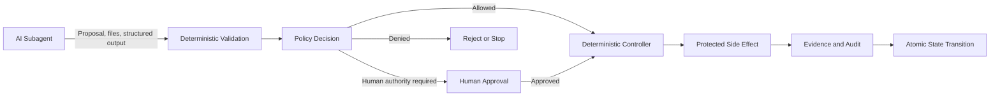
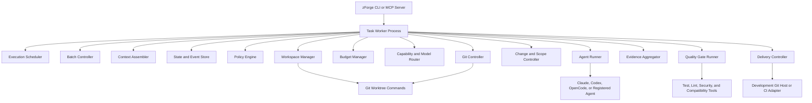
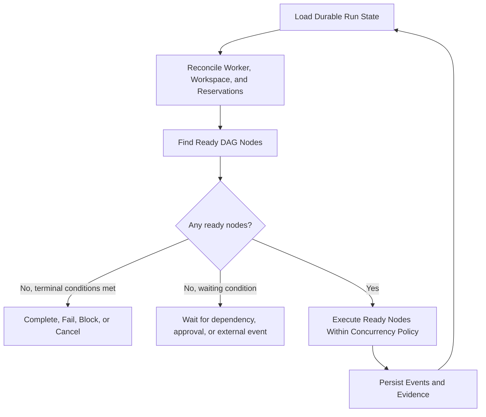
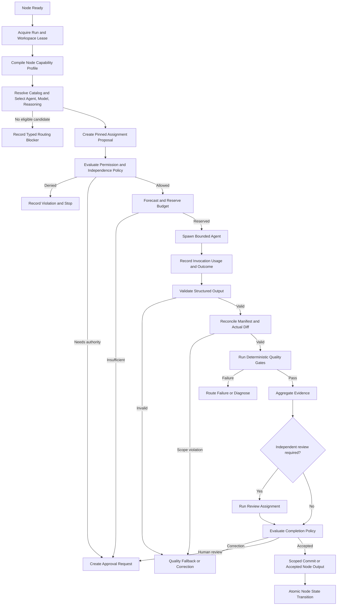
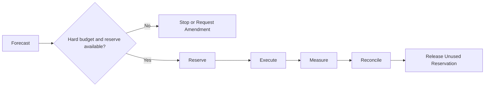
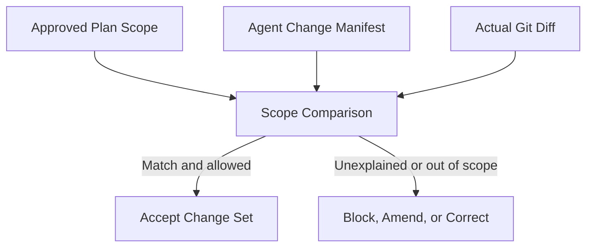
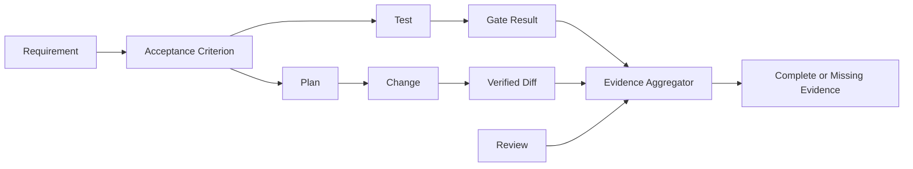
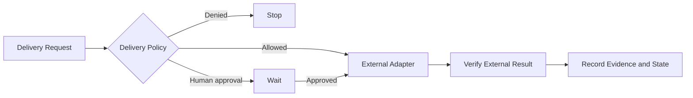
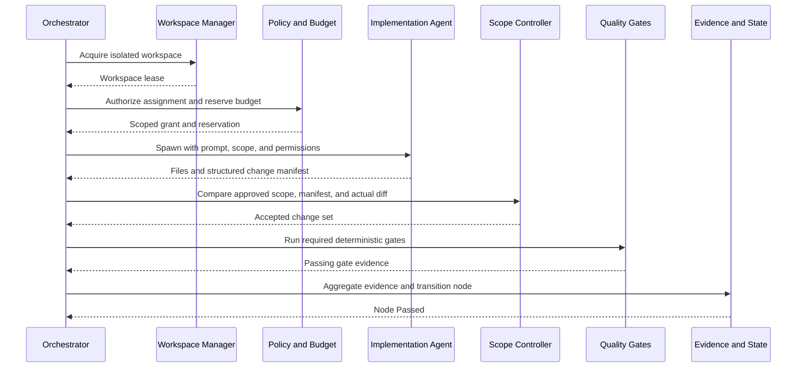
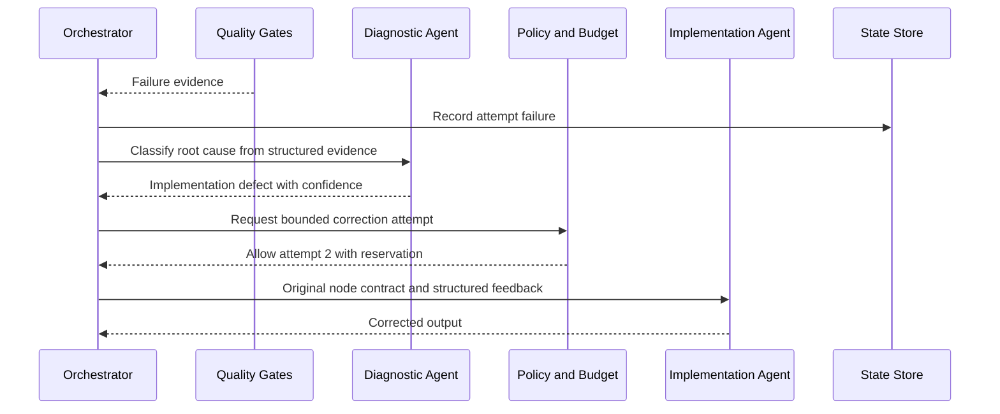

# zForge v2 Deterministic Runtime

## Status

This document defines how v2 responsibilities that must not be delegated to AI agents execute at runtime.

It is a design target, not a description of the current v1 implementation.

Related documents:

- [Product Direction](./product-direction.md)
- [Fleet and Human Attention](./fleet-and-human-attention.md)
- [zForge v2 Autonomous Flow](./flow.md)
- [Agents and Subagents](./agents.md)
- [Automatic Model Routing](./model-routing.md)
- [Skills](./skills.md)
- [Agent Token and Cost Accounting](./cost.md)
- [Data Model](./data-model.md)
- [State and Events](./state-and-events.md)
- [Artifacts and Traceability](./artifacts-and-traceability.md)
- [Execution DAG](./execution-dag.md)
- [Policy and Risk](./policy-and-risk.md)
- [Configuration](./configuration.md)
- [Workspace and Git](./workspace-and-git.md)
- [Quality Gates](./quality-gates.md)
- [Errors and Recovery](./errors-and-recovery.md)
- [Security Threat Model](./security-threat-model.md)
- [Autonomous Software Engineering System — Implementation Plan](../../requirements/autonomous-software-engineering-implementation-plan.md)

## Objective

Ensure that global state, permissions, budgets, workspaces, quality gates, Git, delivery, and evidence are controlled by deterministic code even when AI agents perform analysis, planning, implementation, diagnosis, and review.

The runtime preserves the product optimization order: correctness and safety,
completeness and maintainability, human active attention, cost, then elapsed
time. Concurrency and unattended duration are execution choices, not goals.

An agent may propose an action or produce a change. Only deterministic runtime components may authorize side effects, execute protected operations, and advance durable state.

## Core Boundary



The agent answers:

> This is the change or action I propose, with a structured manifest and supporting evidence.

The runtime decides:

> Whether the action is allowed, what actually changed, whether gates passed, whether budget remains, and whether state may advance.

## Runtime Topology

The initial v2 implementation should remain a modular monolith. It does not require a separate service for every component.



The worker owns one task-run lease. External agent and tool commands run as bounded child processes.

Batch coordination owns separate leases and consumes task/run summaries; it does
not replace task workers or mutate their internal state. The context assembler
pins eligible product, repository, and task sources before assignment rendering.

## Deterministic Does Not Mean Hard-Coded

A deterministic component may be configurable and extensible while still producing repeatable decisions from explicit inputs.

Examples:

- policy is loaded from versioned YAML rules;
- quality gates are configured commands with explicit parsers;
- delivery is implemented through adapters;
- risk rules may combine thresholds and structured agent recommendations;
- price and budget rules use versioned configuration.

An LLM recommendation may be one input to policy, but the LLM cannot grant its own request or override mandatory rules.

## Main Execution Loop



Conceptual API:

```rust
fn run_task(run_id: RunId) -> Result<RunOutcome> {
    loop {
        let state = state_store.load(run_id)?;
        reconciler.reconcile(&state)?;

        let ready = scheduler.find_ready_nodes(&state)?;
        if ready.is_empty() {
            return scheduler.resolve_or_wait(&state);
        }

        for node in concurrency_policy.select(ready) {
            execute_node(run_id, node)?;
        }
    }
}
```

Each node execution is idempotent from a stable node ID, attempt ID, and idempotency key.

## Node Execution Flow



## Component Responsibilities

## Context Assembler

The context assembler resolves eligible product, repository, task, and permitted
external sources; detects material staleness or conflicts; records relevance and
provenance; and emits an immutable context snapshot. It cannot promote
agent-authored content into canonical product knowledge without authority.

Before the runtime requests human input, it records which eligible sources were
checked and why the remaining decision is material.

## Batch Controller

The batch controller performs read-only preflight, maintains batch-run and item
projections, invokes the quality-first task scheduler, continues unrelated work
when an item blocks, and builds aggregate outcomes from referenced task truth.

It does not interpret a task as passed, bypass task completion policy, or require
parallel execution. Detailed semantics are defined in
[Fleet and Human Attention](./fleet-and-human-attention.md).

## Execution Scheduler

### Purpose

Select which execution-DAG nodes may run and manage dependency, retry, concurrency, and terminal-state behavior.

### Inputs

- durable run and node state;
- dependency graph;
- workspace and resource leases;
- policy decisions;
- attempt history;
- approval and external-event status;
- cancellation state.

### Outputs

- ready nodes;
- permitted concurrent node set;
- wait reason;
- terminal run outcome;
- correction or compensation route.

### Invariants

- A node cannot run before required dependencies pass.
- A node cannot exceed attempt policy.
- Cancelled or terminal nodes cannot start a new invocation.
- Parallel nodes cannot share a mutable workspace unless policy explicitly defines safe coordination.
- Scheduler decisions are reproducible from persisted state and policy versions.
- The scheduler MAY execute fully serially and does not treat parallelism as progress.
- Quality, risk reduction, and human-decision reuse precede cost or elapsed-time optimization.

## Policy Engine

### Purpose

Evaluate whether a requested action is allowed, denied, or requires explicit authority.

Conceptual decision type:

```rust
enum PolicyDecision {
    Allow(Grant),
    Deny(Vec<Violation>),
    RequireApproval(ApprovalRequest),
}
```

Example policy:

```yaml
policies:
  implementation:
    filesystem:
      write: scoped
    network: denied
    secrets: denied
    max_attempts: 3

  high_risk_review:
    different_agent_or_model: true
    human_merge_approval: required
```

### Inputs

- role and requested action;
- task and node risk;
- requested tools and paths;
- network and secret requirements;
- remaining budget;
- independence requirements;
- deterministic gate results;
- previous attempts and violations;
- organizational and project policy versions.

### Outputs

```yaml
decision: allow
grant:
  write_paths:
    - src/auth/**
    - tests/auth/**
  network: false
  secrets: []
  max_duration_seconds: 600
  max_processes: 8
```

### Invariants

- Default deny for undeclared network, secret, and external side effects.
- An agent cannot approve its own request.
- An LLM recommendation cannot override a mandatory deterministic rule.
- Policy changes are versioned and auditable.
- Approval grants only the requested scoped action, not future unrelated actions.

## Risk Rules

### Purpose

Convert structured task signals into minimum required rigor.

Signals may include:

- authentication, authorization, cryptography, or secrets;
- personal or regulated data;
- public API or schema compatibility;
- database migration;
- local environment and integration blast radius;
- reversibility;
- affected component count;
- requirement confidence;
- test and evidence availability.

Risk rules select:

- required roles;
- reviewer independence;
- mandatory quality gates;
- human approval points;
- maximum autonomy level;
- delivery boundary.

Agent-assisted classification may propose semantic risk labels, but deterministic rules enforce minimum risk based on observable signals.

## Workspace Manager

### Purpose

Create, lease, reconcile, and clean one isolated worktree or equivalent sandbox per executable task.

Conceptual operations:

```rust
let lease = workspace_manager.acquire(task_id, run_id)?;
let workspace = workspace_manager.prepare(&lease, base_commit)?;
workspace_manager.verify_owner(&workspace, worker_id)?;
```

External operations may include:

```text
git worktree add <path> <branch>
git status --porcelain
git diff --name-status
git worktree remove <path>
```

### Invariants

- Every executable child task has its own mutable workspace.
- A workspace has one active owner lease.
- A failed worker cannot leave a workspace permanently marked active.
- The developer's original working tree is not modified by autonomous execution.
- Cleanup is explicit, idempotent, retained in audit, and policy-controlled.
- Failed workspaces may be retained for inspection according to retention policy.

## Budget Manager

### Purpose

Forecast, reserve, reconcile, and enforce token, monetary, invocation, attempt, and time budgets.



Conceptual API:

```rust
let estimate = forecaster.estimate(&assignment)?;
let reservation = budget.reserve(run_id, node_id, estimate)?;
let outcome = agent_runner.spawn(&assignment)?;
budget.reconcile(reservation, outcome.actual_usage)?;
```

### Invariants

- A new invocation cannot begin without reservation.
- Hard-budget exhaustion stops new spending unless an authorized amendment exists.
- Required review and delivery reserve cannot be consumed silently by correction retries.
- Failed and cancelled invocations still reconcile actual usage.
- Agents cannot modify budgets.

Detailed token and cost behavior is defined in [Agent Token and Cost Accounting](./cost.md).

## Agent Runner

The assignment router is a separate deterministic component. It compiles node
requirements, resolves a trusted model-catalog snapshot, filters hard
eligibility, applies the quality-first routing policy, and records an immutable
routing decision. It does not spawn processes or grant permissions. Complete
selection semantics are defined in [Automatic Model Routing](./model-routing.md).

### Purpose

Spawn the runtime agent selected by an already-authorized assignment.

Inputs include:

- role and node ID;
- registered agent command;
- resolved model;
- rendered prompt;
- context references;
- isolated workspace;
- sandbox and permission arguments;
- timeout, cancellation, and process limits;
- telemetry identity.

Responsibilities:

- start the process;
- deliver the prompt;
- capture stdout and stderr;
- enforce timeout and cancellation;
- terminate the process group;
- parse usage reports;
- record exit, duration, and resource evidence;
- return output without judging engineering quality.

### Invariants

- The runner does not select its own permissions or model.
- The runner rejects an adapter/model identity that differs from the authorized assignment.
- Every spawn has an immutable invocation ID.
- A timeout or provider error is still recorded and accounted for.
- Headless flags are derived from policy grants, not applied unconditionally.
- The runner cannot advance task state.

## Structured Output Validator

### Purpose

Validate agent output against the role's required schema and provenance contract.

Validation includes:

- schema version;
- required fields;
- stable IDs;
- allowed output type for the assigned role;
- artifact hashes;
- referenced task, node, and attempt IDs;
- absence of prohibited state, permission, or approval claims.

Free-form prose may accompany output but cannot replace a required structured contract.

Invalid output produces a quality failure, not a successful node transition.

## Change and Scope Controller

### Purpose

Compare the agent-declared change manifest with the actual Git diff and approved scope.



Conceptual validation:

```rust
let actual = git.diff_files(&workspace)?;
let result = change_policy.compare(
    &node.allowed_paths,
    &agent_output.change_manifest,
    &actual,
)?;
```

### Invariants

- Actual diff is authoritative over an agent-declared manifest.
- Every accepted file maps to a plan step or approved scope amendment.
- Out-of-scope changes block commit and delivery.
- Unrelated developer or process changes cannot enter an autonomous commit.
- Deletes and renames are explicit manifest operations.

## Quality Gate Runner

### Purpose

Run deterministic verification tools in the isolated workspace and produce structured evidence.

Example configuration:

```yaml
gates:
  - id: format
    command: cargo fmt --check
    timeout_seconds: 60
    required: true

  - id: lint
    command: cargo clippy -- -D warnings
    timeout_seconds: 300
    required: true

  - id: tests
    command: cargo test
    timeout_seconds: 600
    required: true
```

Gate execution:

```rust
for gate in selected_gates {
    let grant = policy.authorize_gate(&gate, &workspace)?;
    let result = process_runner.execute(&gate.command, &workspace, &grant)?;
    evidence_store.record_gate(result)?;
}
```

### Invariants

- Mandatory gate failure cannot be converted into pass by an agent.
- Every command is policy-authorized and bounded by timeout.
- Output parsers preserve raw evidence and normalized result.
- Baseline failures are distinguishable from task-introduced regressions.
- An unchanged successful gate may be reused only when input hashes prove it remains valid.

## Evidence Aggregator

### Purpose

Validate and combine artifacts, changes, gates, reviews, and trace links into a completion view.



Example incomplete result:

```yaml
complete: false
missing:
  - acceptance_criterion: AC-003
    reason: No passing test or approved alternative evidence
```

### Invariants

- Missing evidence remains missing; it is not filled by semantic inference.
- Evidence references immutable artifacts, hashes, and invocation IDs.
- Parent and child evidence aggregate without double counting.
- An acceptance criterion cannot be complete without its required evidence strategy.
- Review findings remain visible even after correction, with resolution links.

## State and Event Store

### Purpose

Persist durable, atomic, idempotent transitions and support recovery after crash or cancellation.

Persistence uses Markdown/YAML files, not a database, as selected in
[ADR-002](./decisions/002-file-backed-persistence.md). Controllers stage immutable
YAML record/event batches and publish one durable YAML manifest for related
state, budget/lease and outbox changes under a short-lived project writer lock.
Current task/run YAML and generated Markdown are cursor-bound projections.
Agent/test execution and external actions happen outside the writer lock; restart
reconciles committed history and side-effect identity before rescheduling work.

Example transition event:

```yaml
schema_version: 2
record_type: domain_event
event_id: event_01J...
stream:
  type: run
  id: run_01J...
sequence: 42
aggregate_version: 42
project_id: project_01J...
task_id: SSO-102
run_id: run_01J...
node_id: node_02J...
attempt_id: attempt_01J...
event_type: node_passed
event_version: 1
payload:
  from_state: running
  to_state: passed
  evidence_refs:
    - evidence_01J...
idempotency_key: run_01J:node_02J:attempt_01J:pass
recorded_at: 2026-08-25T00:00:00Z
```

Conceptual API:

```rust
state_engine.handle(PassNodeCommand {
    run_id,
    node_id,
    attempt_id,
    expected_sequence,
    evidence_refs,
    idempotency_key,
})?;
```

### Invariants

- Agents cannot write global state directly.
- Invalid transitions are rejected.
- Required evidence is checked before transition.
- Lease owner and optimistic state version are validated.
- Repeating an idempotency key does not duplicate side effects.
- Crash recovery resumes from the last durable event.

## Git Controller

### Purpose

Create scoped commits from an accepted change manifest.

The controller must not use repository-wide autonomous staging such as `git add -A`.

Conceptual behavior:

```rust
for path in accepted_manifest.paths() {
    git.add_path(&workspace, path)?;
}

git.verify_staged_matches_manifest(&workspace, &accepted_manifest)?;
git.commit(&workspace, commit_metadata)?;
```

Checks before commit:

- accepted manifest matches actual staged diff;
- all files are within approved scope;
- required quality-gate input hashes still match;
- no unexplained files remain;
- commit metadata references task, node, run, and evidence;
- branch and worktree lease remain valid.

Only the Git controller may perform autonomous commit, push, merge, or branch cleanup operations.

## Delivery Controller

### Purpose

Execute authorized external delivery actions through explicit adapters.

Possible adapters:

- GitHub or GitLab pull requests;
- CI status and logs;
- artifact registry;
- local review-package export;
- development-only test-result retrieval.



### Invariants

- External credentials are held by the adapter runtime, not exposed to the agent.
- Push, PR creation/update, and merge are separate scoped permissions.
- External action uses an idempotency key when supported.
- Success is verified from the external system rather than assumed from request submission.
- Application deployment and production access/debugging are prohibited across v2;
  no environment policy or ordinary approval can enable them.
- No autonomous force push or destructive branch operation is permitted by default.

## Reconciler

### Purpose

Recover consistent state after worker crash, process termination, network failure, or partial external action.

The reconciler checks:

- worker PID and heartbeat;
- task and workspace leases;
- running child processes;
- budget reservations;
- workspace and branch existence;
- pending external delivery operations;
- node states without terminal evidence;
- partially written artifacts or events.

Possible outcomes:

- resume the existing attempt;
- release an abandoned reservation;
- mark an orphaned process attempt failed;
- retry an idempotent external query;
- require human intervention for an ambiguous side effect;
- preserve the workspace for inspection.

The reconciler does not repeat a non-idempotent operation when completion is uncertain.

## Human Approval Interface

Approval requests are structured runtime objects, not conversational text only.

```yaml
approval_id: approval_01J...
run_id: run_01J...
requested_action: expand_scope
reason: Required callback configuration file is outside approved scope
requested_grant:
  write_paths:
    - config/auth-callback.yaml
impact:
  risk_change: medium_to_high
  forecast_cost_delta_usd: 0.80
alternatives:
  - stop task
  - create follow-up child task
expires_at: 2026-08-26T00:00:00Z
```

Approval is bound to:

- exact action;
- exact task and run;
- requested scope;
- policy version;
- expiry;
- approver identity;
- resulting state transition.

## End-to-End Implementation Node Example



## Failure and Correction Example



If the diagnostic result identifies a contract or plan defect, the orchestrator routes correction to the requirements or architecture role instead of repeatedly invoking implementation.

## Proposed Rust Module Boundaries

```text
src/
├── execution/
│   ├── scheduler.rs
│   ├── node.rs
│   ├── run.rs
│   └── reconcile.rs
├── policy/
│   ├── engine.rs
│   ├── grants.rs
│   ├── risk.rs
│   └── approval.rs
├── workspace/
│   ├── manager.rs
│   ├── lease.rs
│   └── worktree.rs
├── budget/
│   ├── forecast.rs
│   ├── reserve.rs
│   └── ledger.rs
├── model_routing/
│   ├── capability.rs
│   ├── catalog.rs
│   ├── eligibility.rs
│   ├── select.rs
│   └── explain.rs
├── agent_runtime/
│   ├── assignment.rs
│   ├── spawn.rs
│   └── output.rs
├── change/
│   ├── manifest.rs
│   ├── scope.rs
│   └── diff.rs
├── gate/
│   ├── engine.rs
│   ├── parser.rs
│   └── evidence.rs
├── evidence/
│   ├── aggregate.rs
│   ├── traceability.rs
│   └── provenance.rs
├── state/
│   ├── events.rs
│   ├── store.rs
│   └── transition.rs
├── git/
│   ├── controller.rs
│   └── commit.rs
└── delivery/
    ├── controller.rs
    ├── pull_request.rs
    └── local_handoff.rs
```

This is a conceptual boundary. Tested existing helpers may be reused where they satisfy native-v2 contracts; preserving v1 runtime behavior is not required.

## Side-Effect Classification

Every operation is classified before execution:

| Class | Examples | Default behavior |
|---|---|---|
| Read-only local | Read files, inspect Git state | Allowed within task scope |
| Mutable workspace | Edit scoped files, create test fixtures | Allowed only through role grant |
| Local process | Test, lint, build | Allowed through gate/command policy |
| Network read | Fetch dependency metadata, read ticket | Denied unless declared |
| External write | Push branch, create PR, comment | Requires delivery policy |
| Secret access | Development registry or test-only credentials | Denied unless explicit scoped grant |
| Destructive local | Delete branch/worktree, migration rollback | Controller-only with policy |
| Application release or production access | Deploy, production reads/writes/debugging | Prohibited in all v2 phases |

## Security Boundaries

The supported v2 execution host is macOS only, per
[ADR-003](./decisions/003-macos-host-scope.md). Linux/Windows host adapters are
not required. Docker is the selected boundary for supported autonomous agents
and repository commands, with controllers and the YAML store on macOS. No
separately managed VM is introduced. The foundation spike validates mounts,
credentials, enforced egress, child-process ownership and runtime compatibility;
Docker availability or worktree isolation alone is not proof. Native macOS-only
gates require separately validated host adapters and cannot trigger a silent
unsandboxed fallback. Agents never receive the Docker control socket.

- Agent prompts and repository content are untrusted inputs.
- Tool and permission enforcement occurs outside the prompt.
- Secret values are not inserted into agent context unless explicitly required and policy-approved.
- Child processes inherit only the minimum required environment.
- Network access is denied by default for autonomous agent and gate execution.
- External output is validated before becoming trusted evidence.
- Artifact and evidence hashes prevent post-verification mutation from being committed silently.
- Audit records avoid storing prompt or output content unless retention policy allows it.

## Observability

Every component emits structured events with:

- project, task, parent, run, node, attempt, and invocation IDs;
- component and operation;
- start and completion timestamps;
- policy and configuration versions;
- outcome and reason;
- evidence references;
- budget reservation and reconciliation;
- duration and resource usage;
- error classification;
- idempotency key.

Logs explain execution. State and evidence remain the source of truth.

## Native-v2 Implementation Sequence

Per [ADR-005](./decisions/005-native-v2-no-migration.md), build one native-v2 runtime, without dual-engine
routing or a migration phase. Reuse tested helpers where native contracts permit.

1. Add isolated workspace management and enforceable bounded runner permissions.
2. Implement native run, node, attempt and file-backed transactional event records.
3. Bind agent spawn to assignment, invocation and context snapshots.
4. Enforce manifest-based Git control.
5. Add budget reservation, heartbeat and invocation reconciliation.
6. Implement the pluggable gate engine and evidence-based transition guards.
7. Add correction, independent review and quality fallback.
8. Add work batches, preflight, Decision Inbox and serial scheduling.
9. Add delivery adapters after policy and evidence are stable.
10. Enable evaluated concurrency after serialized execution meets quality thresholds.

Agent-managed authoritative state and side effects are prohibited from the first
native-v2 slice, not deferred until a legacy path is retired.

## Testing Strategy

Required tests:

- scheduler dependency and concurrency behavior;
- node retry and terminal-state resolution;
- task, workspace, and resource lease ownership;
- crash, restart, heartbeat, and stale-worker reconciliation;
- policy allow, deny, and approval decisions;
- least-privilege environment and command execution;
- hard and soft budget behavior;
- process timeout and cancellation propagation;
- structured-output validation;
- actual diff versus manifest mismatch;
- out-of-scope create, edit, rename, and delete attempts;
- mandatory gate override prevention;
- evidence completeness and traceability;
- invalid and duplicate state transitions;
- idempotent Git, external query, and delivery behavior;
- unknown external side-effect recovery;
- secret and prompt-injection boundary tests;
- concurrent child-task isolation;
- legacy state/job inputs cannot start a native run or mutate old data.

Integration tests should use fake agents, temporary Git repositories, temporary worktrees, and fake external adapters. Real-agent or real-delivery tests remain explicitly gated because they consume quota or mutate external systems.

## Acceptance Criteria

- [ ] Global state transitions are performed only by the deterministic state engine.
- [ ] Every execution node is selected by the scheduler from durable graph state.
- [ ] Every agent spawn has an authorized assignment, isolated workspace, budget reservation, and invocation ID.
- [ ] Every automatic assignment has a pinned capability profile, catalog snapshot, and routing decision.
- [ ] Permissions are enforced outside prompts.
- [ ] Network, secret, Git, and delivery side effects are denied by default.
- [ ] Actual Git diff is reconciled against both plan scope and agent manifest.
- [ ] Mandatory quality-gate failures cannot be overridden by an agent.
- [ ] Evidence completeness is machine-validated before state advancement.
- [ ] Autonomous commits stage only accepted manifest paths.
- [ ] External delivery actions are policy-controlled, verified, and idempotent where possible.
- [ ] Crash, timeout, cancellation, and partial-action recovery are tested.
- [ ] Human approval grants are structured, scoped, versioned, and auditable.
- [ ] Agents cannot grant permissions, increase budgets, approve themselves, or advance global state.
- [ ] The runtime can explain every decision and side effect from persisted policy, evidence, and events.
- [ ] Native execution requires no v1 engine, state adapter or compatibility aliases.

## Pre-Run Analysis, Local Environments and Handoff

The analysis controller creates a bounded `AnalysisSession` with pinned
context/configuration, risk floor, policy and budget before semantic planning.
It uses normal routing/attempt/assignment services but no fake execution plan
or run. The execution compiler consumes validated analysis outputs.
[Data Model](./data-model.md) defines the exclusive analysis/run ownership union.

The environment controller owns profiles, readiness reports, leases, resource
allocation, fixtures, readiness/reset/teardown and crash/fencing reconciliation.
The scheduler allocates test resources alongside workspace leases. Adapters must
declare actual enforcement guarantees; a missing prevention guarantee fails
eligibility rather than relying on a post-run scope scan.

The handoff controller validates `requested_result`, phase acceptance and
documentation impact, then seals a concise ReviewPackage and continuation
manifest where needed. Test-case feedback routes to correction/amendment without
granting test success or broader scope. See
[Development Handoff and Review](./delivery-and-review.md) and
[Project Onboarding and Local Testing](./project-onboarding-and-local-testing.md).
