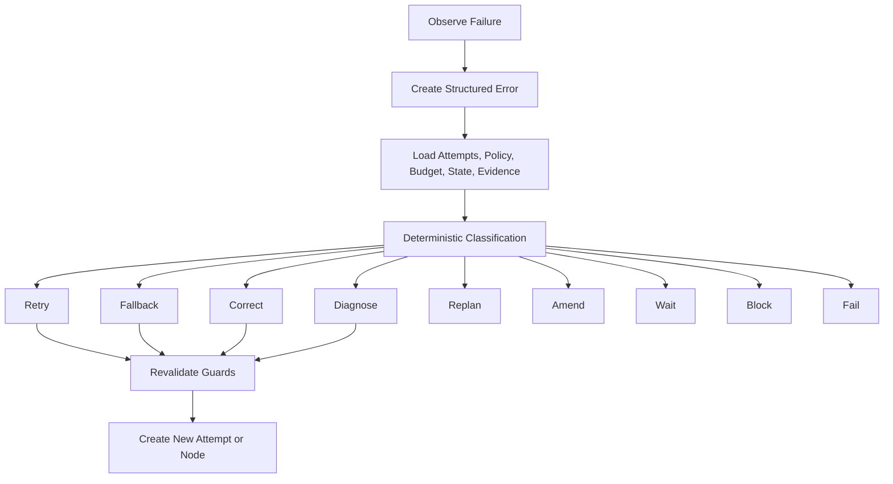
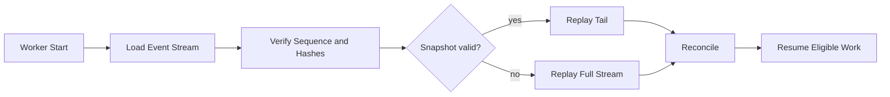
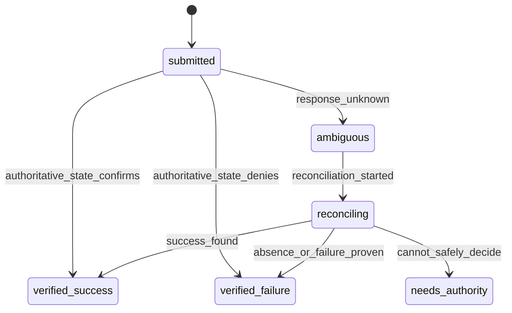

# zForge v2 Errors and Recovery

## Status

Normative design draft for error classification, retry and correction routing,
crash consistency, reconciliation, ambiguity, escalation, and terminal failure.

Related documents:

- [Product Direction](./product-direction.md)
- [Fleet and Human Attention](./fleet-and-human-attention.md)
- [State and Events](./state-and-events.md)
- [Execution DAG](./execution-dag.md)
- [Policy and Risk](./policy-and-risk.md)
- [Automatic Model Routing](./model-routing.md)
- [Workspace and Git](./workspace-and-git.md)
- [Quality Gates](./quality-gates.md)
- [Artifacts and Traceability](./artifacts-and-traceability.md)

## Objective

Recover autonomously when safe and useful, stop deterministically when not, and
never hide uncertainty, duplicate unsafe side effects, corrupt history, or retry
without bounded policy and new information.

## Principles

- Errors are structured records with stable codes.
- Failure is a fact; routing is a separate deterministic decision.
- Retry, fallback, correction, replan, amendment, block, and fail are distinct.
- Every attempt and partial result remains auditable.
- Unknown external outcomes are explicit ambiguity, not assumed failure.
- Recovery revalidates current state, policy, budget, leases, and evidence.
- Terminal state requires reconciliation of owned resources and side effects.

## Error Record

```yaml
schema_version: 2
record_type: error
record_id: error_01J...
revision: 1
status: active
error_id: error_01J...
code: AGENT_PROVIDER_RATE_LIMIT
category: agent_availability
severity: warning
retry_class: retryable_with_fallback
scope:
  task_id: SSO-102
  run_id: run_01J...
  node_id: node_02J...
  attempt_id: attempt_01J...
  invocation_id: inv_01J...
message: Provider rate limit prevented completion
safe_details:
  provider: anthropic
  retry_after_seconds: 30
details_artifact_ref: artifact_04J...
cause_refs: []
observed_at: 2026-08-25T01:10:18Z
created_at: 2026-08-25T01:10:18Z
created_by:
  actor_type: system
  actor_id: agent-runner
updated_at: 2026-08-25T01:10:18Z
content_hash: sha256:error...
provenance_refs: []
```

Raw output is sanitized and stored as protected artifact when policy permits.

## Error Categories

```text
requirement | contract | policy | approval | budget | agent_availability |
agent_quality | model_routing | schema | artifact | evidence | traceability | scope | gate |
workspace | git | concurrency | state | configuration | security |
delivery | external_ambiguity | cancellation | internal
```

## Severity

```text
info | warning | error | critical
```

Severity describes impact, not retry eligibility. A critical issue may be safely
recoverable after human authority; a warning may be non-retryable.

## Retry Classes

```text
not_retryable | retryable_same_assignment | retryable_with_fallback |
retryable_after_input | retryable_after_policy |
retryable_after_environment | retryable_after_backoff
```

Retry class is assigned by deterministic error policy. Agents may recommend but
cannot authorize retry or reset counters.

## Recovery Actions

| Action | Meaning |
|---|---|
| `retry` | New attempt, same node contract and compatible assignment |
| `fallback` | New attempt/decision/assignment/invocation for a compatible alternative under the existing output contract |
| `correct` | New attempt with failure/finding context and changed work output |
| `diagnose` | Bounded diagnostic node produces cause and routing evidence |
| `replan` | New plan revision and run because graph/approach is invalid |
| `amend` | New contract/risk/plan because scope or outcome changed |
| `wait` | Persist typed external condition or backoff time |
| `block` | No safe autonomous progress until external condition changes |
| `compensate` | Authorized action counteracts a prior side effect |
| `fail` | Terminal outcome after reconciliation |
| `cancel` | Authorized stop with cleanup and reconciliation |

## Routing Flow



## Routing Inputs

- stable error code and category;
- current task/run/node/attempt state;
- previous attempts and repeated failure fingerprint;
- assignment, agent, model, tool, and environment;
- risk and policy decisions;
- remaining budget and time;
- workspace and external side-effect state;
- evidence/finding impact;
- retry limits, backoff, and available compatible alternatives.

Free-form message text is diagnostic context, not the routing key.

## Retry Budget

Retries consume attempt count, token/cost budget, elapsed-time budget, and
provider/tool quotas. Limits apply per node, failure fingerprint, run, task, and
external operation where relevant.

```yaml
retry_policy:
  max_attempts_per_node: 3
  max_same_fingerprint: 2
  backoff:
    strategy: exponential_jitter
    initial_seconds: 5
    maximum_seconds: 120
  require_new_evidence_after_repeat: true
```

Backoff is persisted as `not_before`; workers release scarce leases rather than sleep.

## Repeated Failure

Failures have normalized fingerprints based on stable code, failing gate/finding,
relevant location, tool/parser version, and sanitized signature.

Repeated identical failure without new evidence routes to diagnosis, fallback,
replan, block, or fail. Reissuing the same prompt indefinitely is prohibited.

## Agent Failures

| Failure | Normal route |
|---|---|
| Provider unavailable/rate limited | Backoff or compatible fallback |
| Process crash | Record usage/output, then retry if policy permits |
| Timeout | Cancel process group; diagnose size/tooling before retry |
| Invalid structured output | Bounded correction or quality fallback |
| Permission request outside scope | Deny; amend or human decision if legitimate |
| Hallucinated file/result | Scope/evidence failure; correction or fail |
| Repeated low quality | Different assignment/model/role strategy or escalation |
| No eligible model candidate | Typed routing blocker; refresh facts, narrow scope, or escalate |
| Selected model cannot be represented by adapter | Reject before spawn; refresh catalog or adapter |
| Runtime resolves a different model | Stop invocation acceptance and record identity mismatch |

Exit code zero does not mean accepted output; nonzero does not erase produced evidence.

Availability failure and quality failure use different reselection policy.
Availability fallback normally remains within the quality-equivalent candidate
set. Quality escalation may increase reasoning, change model or agent, or route
to diagnosis, but cannot downgrade protected capability merely to reduce cost.
An unchanged routing decision is not new evidence for another identical retry.

## Gate Failures

Gate status and normalized findings distinguish:

- product defect -> implementation correction;
- test/fixture defect -> test-design correction under independence policy;
- environment/tool failure -> environment recovery;
- flaky evidence -> bounded flaky policy;
- baseline incompatibility -> baseline diagnosis;
- parser/schema error -> gate infrastructure recovery;
- contract/plan conflict -> amendment or replan.

Mandatory failure remains visible through all correction attempts.

## Workspace and Git Recovery

Lease loss or worker crash freezes the workspace. A reconciler verifies process,
repository, HEAD, index, diff, artifacts, and last durable events before deciding
whether to preserve, resume, or clean. Ambiguous changes are never auto-committed
or deleted.

Git conflicts create integration evidence and bounded resolution work. Force
reset, broad clean, or deleting locks without ownership checks is prohibited.

## State and Event Store Recovery



File-backed recovery follows [ADR-002](./decisions/002-file-backed-persistence.md).
Only complete verified YAML commit manifests admit record/event/outbox batches.
Uncommitted files are ignored and may be cleaned up only after reference checks
under the writer lock. Committed history is never truncated to hide corruption.
Sequence gaps or corrupt committed metadata block affected work and produce an
integrity incident. Stale task/run YAML projections are rebuilt from the committed
cursor; an uncertain acknowledgement is resolved by idempotency lookup.

## External Side-Effect Ambiguity

When a request may have succeeded but the response is unknown:



The controller queries authoritative external state using idempotency key,
correlation identity, target, and request hash. Unsafe duplication is never retried blindly.

## Budget Exhaustion

Soft threshold triggers reforecast and permitted optimization. Hard threshold
prevents new invocations while allowing accounting, cancellation, cleanup, and
safe reconciliation. Budget increase requires scoped approval.

Unknown usage is reserved conservatively and does not become zero.

## Configuration and Policy Changes

Active runs retain pinned snapshots. A normal change affects new runs. Emergency
revocation may stop new actions and trigger reconciliation. Unsupported or corrupt
configuration blocks rather than falling back to defaults.

## Evidence and Artifact Recovery

- Hash mismatch quarantines the artifact and invalidates dependent evidence.
- Missing retained bytes update reproduction status and may block decisions.
- Parser failures preserve raw artifacts for repair.
- Rebuilt projections cannot invent evidence absent from records/events.
- Trace or coverage corruption triggers deterministic recomputation from sources.

## Cancellation Recovery

Cancellation is not terminal until child processes stop, leases/resources are
released or preserved, budget is settled, workspace is frozen/reconciled, and
external operations are verified or explicitly accepted as ambiguous by authority.

## Blocked State

A blocker record includes code, owner, resumption predicate, evidence, deadline,
escalation rule, and safe alternatives. Unblocking recomputes all guards rather
than restoring stale state.

In a work batch, a blocked task is preserved and projected into the Decision
Inbox. The batch controller continues unrelated ready tasks unless a shared
dependency, resource, policy, or all-ready batch rule prevents it. A task blocker
cannot be generalized into a batch-wide failure without deterministic impact
analysis.

## Human Escalation

Escalation packages contain:

- exact decision required;
- stable error and current state;
- attempts and new evidence;
- impact, risk, cost, and scope;
- safe alternatives and recommendation;
- what happens on approval, denial, or timeout;
- protected artifact references.

Humans are not asked to interpret raw logs when a structured explanation can be produced.

## Terminal Failure

A run may become `failed` only when:

- no permitted retry/correction/replan path remains or policy chooses failure;
- required active processes are stopped;
- leases and budget are reconciled;
- workspaces and partial artifacts are preserved/cleaned per policy;
- external effects are verified, compensated, or explicitly ambiguous;
- terminal error, evidence, and recovery summary are durable.

Task failure additionally evaluates child and replacement-task policy.

## Recovery Record

```yaml
schema_version: 2
record_type: recovery_decision
record_id: recovery_01J...
revision: 1
status: final
run_id: run_01J...
error_ref: error_01J...
failure_fingerprint: sha256:fingerprint...
decision: fallback
reason_codes:
  - PROVIDER_TEMPORARILY_UNAVAILABLE
inputs:
  attempt_count: 1
  same_fingerprint_count: 1
  remaining_budget_usd: 1.20
action:
  compatible_agent: codex
  not_before: 2026-08-25T01:11:00Z
policy_decision_ref: policy_01J...
created_at: 2026-08-25T01:10:20Z
created_by:
  actor_type: system
  actor_id: recovery-engine
updated_at: 2026-08-25T01:10:20Z
content_hash: sha256:recovery...
provenance_refs: []
```

## Events

```text
error_recorded | recovery_decided | retry_scheduled | fallback_selected |
model_reselection_requested | model_routing_blocked |
diagnosis_requested | replan_required | contract_amendment_required |
run_blocked | run_unblocked | reconciliation_started |
reconciliation_completed | external_operation_ambiguous |
run_cancel_requested | run_cancelled | run_failed
```

## Rust Modules

```text
src/recovery/
├── model.rs
├── normalize.rs
├── fingerprint.rs
├── classify.rs
├── route.rs
├── retry.rs
├── backoff.rs
├── reconcile.rs
├── external.rs
├── escalate.rs
└── terminal.rs
```

## Observability

Metrics include failure count by stable code, recovery route, same-fingerprint
repeats, retry cost, time blocked, reconciliation age, ambiguous external actions,
workspace preservation, terminal cleanup duration, and recovery success rate.

## Testing Strategy

Tests cover every error category/retry class, repeated fingerprints, retry and
budget limits, fallback compatibility, timeouts and process groups, gate routing,
model-catalog staleness, no-candidate routing, adapter identity mismatch,
workspace lease loss, event corruption, snapshot rebuild, external ambiguity,
budget exhaustion, config revocation, artifact hash mismatch, cancellation at
every crash point, terminal reconciliation, and escalation contents.

Fault-injection tests MUST crash before/after every durable boundary and prove no
duplicate unsafe side effect or lost accepted event.

## Acceptance Criteria

- [ ] Errors use stable structured codes and sanitized details.
- [ ] Routing is deterministic from current facts and policy.
- [ ] Retry, fallback, correction, diagnosis, replan, and amendment remain distinct.
- [ ] Every retry is bounded by attempts, fingerprint, time, and budget.
- [ ] Repeated failure requires new evidence or a different route.
- [ ] Crash recovery revalidates ownership and state before resuming.
- [ ] External ambiguity is explicit and never blindly retried.
- [ ] Partial artifacts and failed attempts remain auditable.
- [ ] Cancellation and failure reconcile resources and side effects first.
- [ ] Recovery cannot weaken policy, gates, evidence, or authority requirements.
- [ ] Availability fallback and quality escalation use distinct model-routing rules.
- [ ] No eligible or correctly resolved model fails explicitly before accepted work.
- [ ] A blocked batch item does not stop unrelated ready items by default.
- [ ] Decision Inbox projections preserve the authoritative error and resumption predicate.

## Analysis and Local Environment Recovery

Pre-run failures retain their `AnalysisSession` and owner-stream identity; they
do not invent a failed execution run. `retryable_same_assignment` means the
same assignment specification is eligible, not reuse of a consumed assignment
ID. Every new agent process uses a fresh attempt, decision and assignment.

Local environment provisioning, readiness, reset, device disconnect, fencing
and teardown failures are typed environment/resource failures. Capture bounded
logs, preserve exact resource ownership, and reconcile before retry/release.
A failed or expired lease cannot be reused until quiescence is verified.
Missing required E2E capability is blocked/unsupported, not a skipped pass.
See [Project Onboarding and Local Testing](./project-onboarding-and-local-testing.md).
