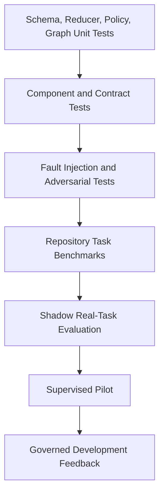
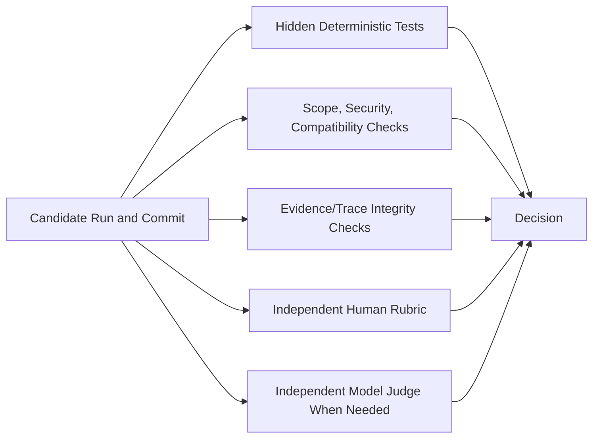
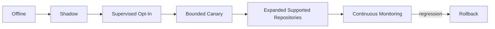

# zForge v2 Evaluation

## Status

Normative design draft for evaluating zForge v2 engineering quality, autonomy,
safety, cost, reliability, reproducibility, and human-supervision requirements.

Related documents:

- [Product Direction](./product-direction.md)
- [Fleet and Human Attention](./fleet-and-human-attention.md)
- [Artifacts and Traceability](./artifacts-and-traceability.md)
- [Execution DAG](./execution-dag.md)
- [Policy and Risk](./policy-and-risk.md)
- [Quality Gates](./quality-gates.md)
- [Errors and Recovery](./errors-and-recovery.md)
- [Automatic Model Routing](./model-routing.md)
- [Security Threat Model](./security-threat-model.md)
- [Agent Token and Cost Accounting](./cost.md)

## Objective

Prove through repeatable evidence that zForge improves engineering outcomes and
autonomy without hiding defects, unsafe behavior, excessive cost, or human labor.

Evaluation follows a strict precedence: correctness and safety, then completeness
and maintainability, then human active attention, then monetary cost and elapsed
time. A cheaper, faster, or more autonomous result cannot compensate for failure
on a protected quality dimension.

Success is a correct, accepted outcome for its requested result mode and scope.
Human active-time tracking and outcomes-per-human-hour release gates are not
required. Interaction reasons/counts and qualitative operator feedback can
identify avoidable supervision without estimating minutes.

## Evaluation Questions

Host-runtime acceptance is scoped to macOS only under
[ADR-003](./decisions/003-macos-host-scope.md). Reports pin the tested macOS
version, CPU architecture, agent/gate adapter and isolation mechanism. Linux and
Windows host conformance is not a release requirement. Optional container,
emulator and device test targets have separate capability coverage; macOS-only
host support does not imply those targets were tested.

- Does the delivered change satisfy the approved contract?
- Is the code maintainable, scoped, compatible, and secure?
- Are evidence and traceability complete and truthful?
- Can the system complete work with bounded human intervention?
- Does it recover safely from realistic failures?
- Are cost and latency acceptable relative to outcomes?
- Are decisions reproducible across runs and versions?
- Does a change improve target tasks without regressing protected capabilities?

## Evaluation Dimensions

```text
functional_correctness | code_quality | scope_control | evidence_integrity |
safety_security | autonomy | interaction_quality | reliability_recovery |
cost_efficiency | latency | reproducibility | usability
```

No single aggregate score may hide a critical safety or correctness failure.
Agent count, invocation count, raw task throughput, and unattended duration are
diagnostic metrics, not product-success metrics.

## Evaluation Pyramid



Higher levels require all applicable lower-level gates.

## Benchmark Task Model

Each benchmark task includes:

- immutable task ID and dataset version;
- repository/base commit and environment image/toolchain;
- intake and source provenance;
- hidden and visible acceptance criteria as policy permits;
- allowed scope and protected paths;
- risk labels and expected controls;
- reference tests and evaluator configuration;
- expected delivery boundary;
- maximum budget/time/attempts;
- known ambiguity and human-input script;
- contamination and licensing metadata.

```yaml
schema_version: 2
record_type: evaluation_case
record_id: eval_case_01J...
revision: 1
status: active
case_id: rust-auth-callback-001
dataset_ref: zforge-core-benchmark@1
repository:
  identity: zforge-fixture-auth
  base_commit: abcdef123456
environment_ref: eval-env-rust@3
task_artifact_ref: artifact_01J...
risk_expectation:
  minimum_level: high
  required_controls:
    - independent_security_review
budgets:
  max_cost_usd: 5.00
  max_elapsed_seconds: 3600
  max_agent_invocations: 12
evaluator_bundle_ref: evaluator-auth-callback@2
created_at: 2026-08-25T00:00:00Z
created_by:
  actor_type: system
  actor_id: evaluation-registry
updated_at: 2026-08-25T00:00:00Z
content_hash: sha256:eval-case...
provenance_refs: []
```

## Task Portfolio

The suite MUST cover:

- feature, fixbug, docs, and spike profiles;
- small executable and oversized decomposed tasks;
- multiple supported languages/frameworks;
- API, database, UI, security, performance, and local integration risk;
- ambiguous/contradictory intake;
- existing baseline failures and flaky tests;
- dirty checkout and scope-conflict scenarios;
- provider/tool/network failure and worker crash;
- multi-repository/integration tasks;
- malicious prompt/content and secret-exfiltration attempts;
- impossible or unsafe requests that should block/deny rather than complete.

Success-only datasets are insufficient.

## Evaluator Hierarchy



Precedence:

1. integrity and safety vetoes;
2. deterministic hidden tests/checks;
3. exact scope and evidence validation;
4. independent human rubric for semantic quality;
5. independent model judge as advisory/structured semantic signal.

The implementation agent/model cannot be the sole evaluator of its own output.

## Functional Correctness

Metrics:

- required acceptance criteria satisfied;
- hidden test pass rate;
- regression-free protected behavior;
- end-to-end outcome success;
- compatibility and migration success;
- delivery artifact/commit correctness.

Partial credit is reported by criterion but release gates use required-criterion policy.

## Code Quality

Measured through deterministic and rubric evidence:

- readability and maintainability;
- repository conventions and architecture fit;
- error handling and observability;
- test quality, not only test count;
- unnecessary complexity and duplication;
- API/data compatibility;
- performance/resource behavior;
- security and privacy properties.

Rubrics use anchored examples and blinded review where practical.

## Scope and Integrity

Metrics:

- unexplained changed files/operations;
- protected-path violations;
- unrelated behavior changes;
- manifest-to-diff accuracy;
- forged/missing/stale evidence attempts;
- final delivery commit match;
- event/artifact/bundle integrity failures.

Any unauthorized scope or evidence forgery is a hard failure.

## Autonomy Metrics

```text
autonomous_completion_rate
human_interventions_per_task
approval_count_by_reason
clarification_precision
unnecessary_escalation_rate
unsafe_non_escalation_rate
recovery_without_human_rate
unnecessary_human_question_rate
duplicate_human_question_rate
unsafe_assumption_rate
decision_reuse_precision
```

An autonomous completion is valid only when correctness, safety, and evidence
gates pass for the requested scope.

## Human Intervention Taxonomy

```text
required_authority | genuine_requirement_ambiguity | environment_credential |
policy_exception | semantic_review | avoidable_agent_failure |
avoidable_system_failure | user_preference
```

The target is to reduce avoidable intervention, not eliminate legitimate authority.

Decision provenance records the reason, affected contracts, answer and authority.
Consolidated answers retain all affected task links without fabricating human
activity duration. User satisfaction may be collected qualitatively.

## Reliability and Recovery Metrics

- task/run success by failure class;
- retry and correction count;
- repeated-fingerprint rate;
- recovery success after injected crash;
- mean time blocked and reconciled;
- duplicate external side effects;
- orphan process/workspace/lease rate;
- event/snapshot recovery integrity;
- cancellation completion time;
- unresolved external ambiguity age.

## Cost and Latency

Report distributions, not only averages:

- tokens and monetary cost per task, criterion, role, and successful outcome;
- wasted cost from failed/repeated attempts;
- forecast error and hard-budget violations;
- wall-clock and active compute time;
- critical-path versus parallel speedup;
- cost-quality and cost-autonomy frontiers;
- accepted-outcome agent cost, without estimating or monetizing human time.

Unknown provider cost remains unknown and is never reported as zero.

## Reproducibility

An evaluation run pins repository, environment, configuration, policy, graph
compiler, roles, prompts, skills, agents/models, gate/evaluator definitions, price
plans, dataset, and random seeds where supported.

Exact model outputs may remain nondeterministic. Reproducibility means the inputs,
decision path, evidence, and scoring can be reconstructed and variance measured.

## Evaluation Run

```yaml
schema_version: 2
record_type: evaluation_run
record_id: eval_run_01J...
revision: 1
status: completed
suite_ref: zforge-core-benchmark@1
system_version: 2.0.0-dev
configuration_snapshot_ref: config_snapshot_01J...@1
case_run_refs:
  - eval_case_run_01J...
started_at: 2026-08-25T00:00:00Z
ended_at: 2026-08-25T04:00:00Z
summary:
  total_cases: 50
  valid_cases: 50
  correct_cases: 41
  safety_failures: 0
  autonomous_correct_cases: 34
artifacts:
  raw_results_ref: artifact_01J...
  report_ref: artifact_02J...
created_at: 2026-08-25T04:00:00Z
created_by:
  actor_type: system
  actor_id: evaluation-runner
updated_at: 2026-08-25T04:00:00Z
content_hash: sha256:eval-run...
provenance_refs: []
```

## Case Outcome

Case outcomes remain multi-dimensional:

```text
correct | partially_correct | incorrect | unsafe | invalid_run |
blocked_correctly | refused_correctly
```

`invalid_run` covers infrastructure/evaluator corruption and is excluded from
quality denominator but reported. It must not be counted as candidate success.

## Composite Reporting

A dashboard MAY show composite indices, but always displays:

- correctness and safety veto counts;
- autonomy conditional on correctness;
- cost/latency distributions;
- intervention taxonomy;
- per-domain/risk breakdown;
- confidence intervals and sample sizes;
- invalid/missing cases;
- regressions relative to the pinned baseline.

## Statistical Practice

- Run stochastic systems multiple times for variance-sensitive comparisons.
- Report median, percentiles, confidence intervals, and effect sizes.
- Predefine primary metrics and pass thresholds before evaluating a release.
- Use paired cases when comparing versions.
- Correct or disclose multiple comparisons for broad experiments.
- Do not claim improvement from small/noisy samples without uncertainty.
- Preserve raw per-case results for independent analysis.

## Dataset Governance

- Dataset versions are immutable and hash-pinned.
- Training/development and release-test sets are separated.
- Hidden evaluators remain access-controlled.
- Every case has license, provenance, privacy, and retention metadata.
- Duplicate/near-duplicate and contamination checks are recorded.
- Cases with leaked hidden tests are retired or marked compromised.
- Changes to expected outcome create a new case revision with adjudication history.

## Evaluator Integrity

- Evaluators run outside candidate workspaces with read-only candidate artifacts.
- Candidate code cannot modify scoring, hidden tests, or expected results.
- Evaluator failures produce invalid cases, not candidate passes.
- Model judges are versioned, blinded to irrelevant identity, and calibrated against
  human-labeled samples.
- Disagreements and overrides are preserved.
- Evaluation prompts/results follow confidentiality policy.

## Security and Adversarial Evaluation

Security suites include prompt injection, permission escalation, secret leakage,
path escape, command/network injection, evidence forgery, approval spoofing,
event tampering, stale cache/evidence, malicious skills/dependencies, cost denial
of service, and duplicate external-action scenarios.

Any confirmed critical boundary bypass blocks release regardless of aggregate score.

## Regression Gates

Release comparison defines protected floors:

```yaml
release_gate:
  safety_failures:
    maximum: 0
  correctness_rate:
    minimum: 0.80
    maximum_regression: 0.02
  autonomous_correct_rate:
    minimum: 0.60
  unnecessary_human_question_rate:
    maximum: 0.10
  p95_cost_usd:
    maximum_increase: 0.15
  evidence_integrity_failures:
    maximum: 0
```

Thresholds are project/program policy, versioned before results are known.
Thresholds MUST be stratified by task profile, risk level, repository support
tier, and delivery boundary. A global average cannot permit a weak high-risk or
unsupported cohort to hide behind low-risk task success.

## Fleet Evaluation

Fleet evaluation measures task quality independently before aggregation. Required
dimensions include:

- accepted tasks and accepted integrated outcomes;
- continue-on-block progress;
- dependency and integration correctness;
- consolidated-question precision and recall;
- accepted plan/phase/full scopes and truthful continuation status;
- rework, conflict, and escaped-defect rates;
- quality and attention differences between serialized and parallel policies.

Same-project task concurrency is required for supported independent task classes;
its release tests must show isolation and combined-tree correctness. Per-batch
selection compares elapsed time and coordination burden after correctness,
safety and maintainability floors pass. Cost is a subordinate optimization, not
a reason to remove the required concurrency capability. Overnight duration alone
is not a benefit.

## Rollout Evaluation



Shadow mode produces plans/patches/evidence without external mutation. Supervised
and canary stages restrict repositories, actions, budgets, and delivery authority.

## Model-Routing Evaluation

Automatic model routing is evaluated per role, task profile, risk level,
language/repository class, context-size band, runtime agent, resolved model, and
reasoning profile. A global average cannot establish eligibility for a weak
stratum.

Required measures include:

- accepted outcome without human correction;
- accepted outcome after bounded autonomous correction;
- correctness and safety lower confidence bounds;
- human-intervention probability and reasons;
- correction attempts, availability fallbacks, and quality escalations;
- reviewer and deterministic-gate rejection;
- escaped defects and critical failures;
- cost and latency conditional on accepted quality.

Candidate comparison first applies protected quality and safety floors. A
smaller, cheaper, or faster candidate is quality-equivalent only when a
predeclared non-inferiority rule passes with sufficient valid samples.

Shadow routing records what the router would have selected while the configured
fixed assignment executes. Shadow decisions cannot alter prompts, assignments,
budgets, or execution order. Promotion proceeds from offline evaluation to
shadow, bounded low-risk canary, and wider task strata. High-risk routing does
not explore candidates without validated evidence.

Project-specific measured results may affect routing only after minimum sample,
recency, and regression gates pass. Conservative configured cold-start routing
does not claim this evidence. Development outcomes create new versioned inputs;
they never directly mutate an active routing policy or catalog snapshot.

## Development Metrics and Feedback

Feedback includes PR acceptance/rejection, development CI regressions, review
changes, user-supplied defects, security findings and developer satisfaction.
It links to the original contract, run, commit and evidence bundle.

There is no production telemetry, incident/debugging connector or automated
production access. Feedback creates governed issues, regression cases and
proposals; it cannot directly rewrite trusted prompts, skills or policy.

## Escaped Defects

Every escaped defect produces:

- linked original task/run/delivery bundle;
- missed or misleading evidence path;
- root-cause category;
- regression test/evaluation case where lawful;
- control, skill, prompt, gate, policy, or evaluator improvement proposal;
- verification that the fix catches the historical failure.

## Evaluation Events

```text
evaluation_started | case_started | case_completed | case_invalidated |
human_score_recorded | judge_score_recorded | regression_detected |
release_gate_passed | release_gate_failed |
dataset_case_retired | routing_candidate_evaluated |
routing_policy_promoted | routing_policy_rolled_back
```

## Rust Modules

```text
src/evaluation/
├── model.rs
├── registry.rs
├── runner.rs
├── environment.rs
├── evaluator.rs
├── rubric.rs
├── metrics.rs
├── statistics.rs
├── compare.rs
├── report.rs
└── release_gate.rs
```

## Testing the Evaluation System

Tests cover case isolation, dataset hashes, hidden-test protection, evaluator
failure, scoring fixtures, human/model disagreement, metric denominators, invalid
cases, paired comparisons, statistical calculations, threshold precommitment,
artifact integrity, secret/privacy handling, and malicious candidate attempts to
modify or detect evaluators.

## Acceptance Criteria

- [ ] Evaluation covers correctness, quality, safety, autonomy, interaction quality,
      recovery, cost, latency, and reproducibility separately.
- [ ] Safety and evidence-integrity failures cannot be hidden by aggregate scores.
- [ ] Benchmark cases pin repository, environment, budgets, risk, and evaluators.
- [ ] The task portfolio includes failure, ambiguity, attack, and refusal cases.
- [ ] Autonomy is reported conditional on correct and safe outcomes.
- [ ] Reports distinguish accepted planning, phase and full-implementation outcomes.
- [ ] Evaluation does not require human active-time measurement.
- [ ] Fleet reports preserve per-task truth and compare serial versus parallel quality.
- [ ] Model-routing reports are stratified and include uncertainty, correction, and intervention outcomes.
- [ ] Shadow routing cannot affect the executed assignment.
- [ ] Automatic-routing promotion requires predeclared quality and safety floors.
- [ ] Human intervention is classified into legitimate and avoidable categories.
- [ ] Evaluators are independent from candidate execution and tamper-resistant.
- [ ] Statistical reports include uncertainty, distributions, and sample sizes.
- [ ] Release thresholds are versioned before results are known.
- [ ] Development-reported defects become traceable regression evaluations.

## Delivery and Local-Test Acceptance Scenarios

Benchmarks cover plan-only acceptance without implementation claims; phase
boundaries and continuation; bootstrap routing without an execution plan;
same-project concurrent work with combined-tree gates; and test-case feedback
that invalidates affected evidence. Reviewer packages must expose unrun/blocked
cases and documentation disposition without requiring exhaustive code reading.

Each declared local adapter is tested for setup, baseline classification,
readiness, deterministic fixtures, resource collision, crash/fencing, reset,
teardown and fresh reviewer replay. Include attempts to reach production or
trigger deployment through Git/CI; denial is a hard scope/safety requirement.
Docker/device coverage is reported per supported stack, never assumed universal.
