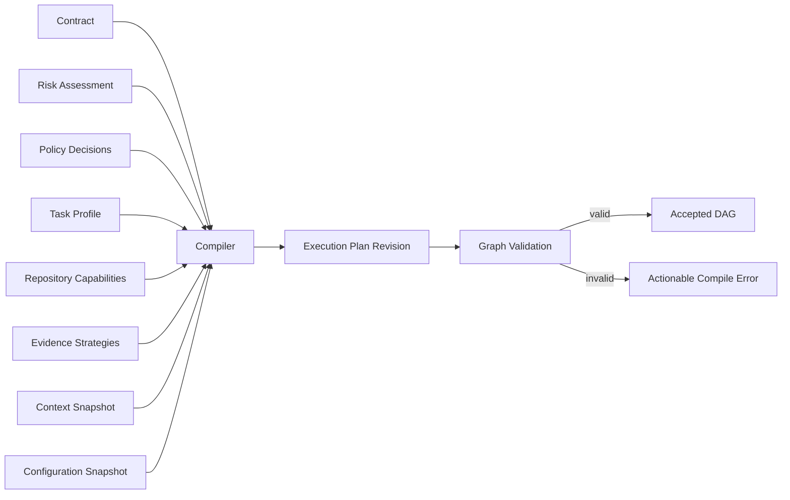
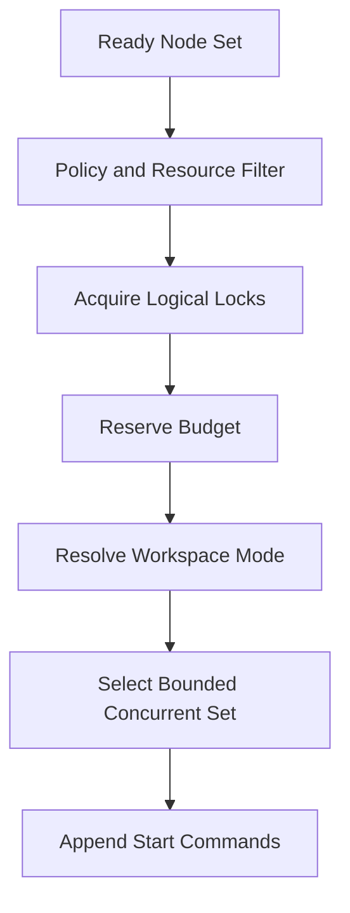
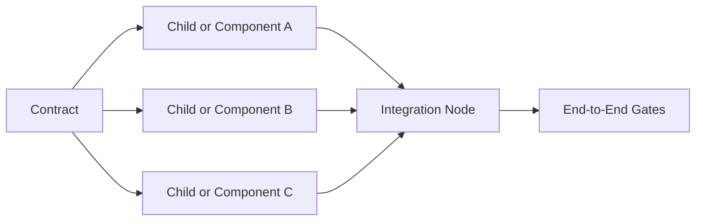
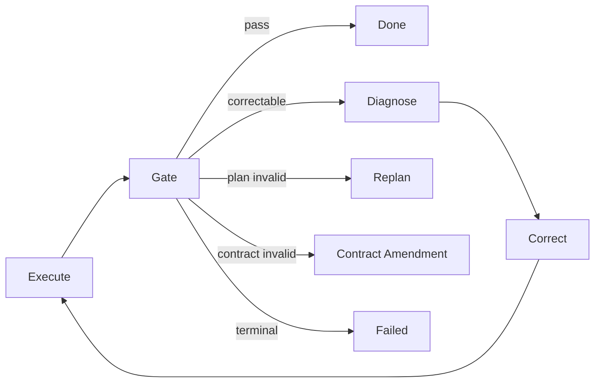

# zForge v2 Execution DAG

## Status

Normative design draft for compiling approved engineering intent into a valid,
bounded, evidence-aware execution directed acyclic graph (DAG).

Related documents:

- [Product Direction](./product-direction.md)
- [Fleet and Human Attention](./fleet-and-human-attention.md)
- [Data Model](./data-model.md)
- [State and Events](./state-and-events.md)
- [Artifacts and Traceability](./artifacts-and-traceability.md)
- [Deterministic Runtime](./deterministic-runtime.md)
- [Agents and Subagents](./agents.md)
- [Automatic Model Routing](./model-routing.md)
- [Policy and Risk](./policy-and-risk.md)
- [Configuration](./configuration.md)

## Objective

Replace a fixed phase pipeline with a deterministic graph that executes the
minimum work permitted by task profile, contract, risk, policy, repository
capabilities, and evidence requirements.

The graph maximizes accepted quality and minimizes unnecessary human attention.
Concurrency is an optional execution strategy, not a goal or completion signal.

## Scope

This document defines graph inputs, node and edge semantics, compilation,
validation, readiness, concurrency, retries, conditional paths, fan-out/fan-in,
replanning, parent/child coordination, and completion evaluation.

It does not define agent prompts, state persistence mechanics, gate execution,
or Git commands.

## Graph Compilation



Every compilation pins exact input revisions and hashes. Identical canonical
inputs and compiler version MUST produce the same logical graph. Runtime IDs MAY
differ only when the deterministic ID fixture is not enabled.

## Graph Model

An execution plan contains nodes, edges, entry nodes, required terminal outputs,
resource declarations, and compiler provenance.

```yaml
schema_version: 2
record_type: execution_plan
record_id: plan_01J...
revision: 1
status: accepted
task_id: SSO-102
inputs:
  contract: contract_01J...@3
  risk: risk_01J...@2
  context_snapshot: context_01J...
  policy_bundle: policy_bundle_01J...@1
  configuration_snapshot: config_snapshot_01J...@1
compiler:
  id: execution-graph-compiler
  version: 2.0.0
nodes:
  - node_id: node_01J...
    key: design-tests
    kind: agent
    role: test
    required: true
    criterion_refs:
      - ac_01J...
    output_contract: test-definition-v2
    resources:
      workspace_mode: read_only
      locks: []
  - node_id: node_02J...
    key: implement-callback
    kind: agent
    role: implementation
    required: true
    criterion_refs:
      - ac_01J...
    output_contract: change-manifest-v2
    resources:
      workspace_mode: exclusive_write
      locks:
        - repo-path:src/auth/**
  - node_id: node_03J...
    key: verify
    kind: gate_group
    required: true
    gate_refs:
      - gate:unit-tests@2
  - node_id: node_04J...
    key: review
    kind: agent
    role: review
    required: true
    output_contract: review-decision-v2
edges:
  - edge_id: edge_01J...
    from_node_id: node_01J...
    to_node_id: node_02J...
    condition: passed
  - edge_id: edge_02J...
    from_node_id: node_02J...
    to_node_id: node_03J...
    condition: passed
  - edge_id: edge_03J...
    from_node_id: node_03J...
    to_node_id: node_04J...
    condition: passed
entry_node_ids:
  - node_01J...
required_terminal_node_ids:
  - node_04J...
created_at: 2026-08-25T01:00:00Z
created_by:
  actor_type: system
  actor_id: graph-compiler
updated_at: 2026-08-25T01:00:00Z
content_hash: sha256:plan...
provenance_refs: []
```

## Node Kinds

| Kind | Owner | Purpose |
|---|---|---|
| `agent` | Agent runner | Execute one bounded engineering role assignment |
| `gate` | Gate runner | Execute one deterministic quality gate |
| `gate_group` | Gate runner | Execute policy-defined gates with aggregation semantics |
| `approval` | Policy/human interface | Wait for scoped authority |
| `integration` | Integration controller or agent | Combine independently produced outputs |
| `delivery` | Delivery controller | Perform a protected external delivery operation |
| `research` | Research role and artifact runtime | Produce bounded findings, not production changes |
| `checkpoint` | State engine | Evaluate evidence, policy, budget, or graph condition |

Agents do not implement gate, approval, global state, Git, budget, or delivery
nodes. An agent node produces a proposal or artifact for deterministic acceptance.

## Node Contract

Every node MUST declare:

- stable opaque ID and readable key;
- node kind and required/optional status;
- input record/artifact references;
- output schema and evidence obligations;
- acceptance-criterion or technical-enabler mapping;
- requested role and capabilities when agent-backed;
- runtime-agent/model selection scope (`fixed`, agent-scoped `auto`, or fully `auto`);
- workspace mode and expected path scope;
- resource locks and concurrency group;
- timeout, retry, budget, and policy references;
- activation condition;
- failure and correction routes.

Node semantics materially changing requires a new node ID in a new plan revision.
The plan requests capabilities and permitted selection scope; it does not embed a
provider model default. The assignment router resolves the concrete candidate
for each attempt and records that decision before spawn.

## Edge Semantics

Normal edges are directed dependencies. Supported conditions:

```text
passed | completed | failed | approved | evidence_available |
condition_true | always
```

Edge rules:

- The normal dependency graph MUST be acyclic.
- Each edge references nodes in the same plan revision.
- `always` means the predecessor is terminal, not that it may be ignored.
- Failure edges route diagnosis or cleanup but cannot convert failure into pass.
- Compensation references are stored separately and excluded from readiness DAG.
- Data dependencies declare the exact output refs consumed by the target.
- An optional predecessor cannot become an accidental mandatory dependency.

## Activation Conditions

Conditions use a deterministic, side-effect-free expression language over typed
facts. Agents cannot supply executable expressions.

```yaml
activation:
  all_of:
    - fact: task.profile
      op: in
      value: [feature, fixbug]
    - fact: risk.domains
      op: contains
      value: authentication
    - fact: repository.capabilities.integration_tests
      op: equals
      value: true
```

Allowed operators are closed and schema-defined. Unknown facts or operators
evaluate to an error, not false. Conditions cannot read wall-clock time except
through an explicit persisted fact such as retry `not_before`.

## Graph Validation

Compilation is rejected unless:

- node and edge IDs are unique;
- the dependency graph is acyclic;
- every required node is reachable from an entry node;
- no edge targets a node outside the plan revision;
- every success path reaches required terminal nodes;
- every required criterion has a plan node and evidence path;
- node kinds have the required role, gate, approval, or delivery definition;
- outputs satisfy downstream input types;
- resource declarations are compatible;
- write scopes are bounded and do not overlap unsafely in parallel branches;
- retry and correction routes are bounded;
- approval and independence requirements from policy are represented;
- budget forecast fits policy or an approval node exists;
- parent and child dependencies are acyclic across task boundaries.

## Readiness

A node is ready when all of the following are true:

```text
state is pending or retry_scheduled
AND activation condition is true
AND all required incoming edge conditions are satisfied
AND required inputs exist and are not invalidated
AND run is active and not cancellation-requested
AND retry not_before has passed
AND policy, budget, workspace, and locks permit starting
```

Readiness is recomputed from a sequence-consistent run projection immediately
before the `node_ready` event. Cached readiness is only a hint.

## Scheduler Selection



Selection is deterministic using configured ordering such as:

1. dependency and policy eligibility;
2. required before optional;
3. risk-reducing or knowledge-producing work;
4. expected accepted quality and correction probability;
5. human-decision and validated-context reuse;
6. critical-path rank;
7. lower expected cost or elapsed time when otherwise equivalent;
8. stable node ID.

Starvation prevention MAY increase persisted scheduling age. Concurrency limits
apply at project, run, role, provider, workspace, and resource-group levels.

## Parallelism and Resource Safety

Parallel nodes MUST use one of:

- independent read-only access;
- isolated worktrees with later deterministic integration;
- non-overlapping validated write scopes;
- an explicitly serialized shared resource.

Path patterns alone do not prove semantic independence. Shared generated files,
schemas, migrations, dependency manifests, and public interfaces use named locks
or isolated branches plus integration.

Lock identities are logical resources, not OS mutex names. Lease loss triggers
reconciliation before another worker mutates the resource.

The scheduler MAY serialize all ready nodes. Parallel selection requires an
evaluation-backed policy showing that the chosen isolation and integration path
does not weaken protected correctness, safety, evidence, or human-attention
thresholds.

Fleet-level scheduling is defined separately from this within-task DAG. The first
fleet implementation SHOULD parallelize isolated task runs before enabling
parallel write nodes inside one task.

## Fan-Out and Fan-In



Fan-in requires:

- all required branch conditions satisfied;
- accepted branch manifests and immutable output refs;
- conflict and shared-contract validation;
- integration workspace based on pinned inputs;
- end-to-end evidence for cross-branch criteria.

Partial branch success remains durable but cannot make the join pass.

## Optional and Skipped Nodes

Optional nodes are skipped only through a policy decision proving their
activation condition false or evidence obligation unnecessary. `node_skipped`
records reason, policy, evaluated facts, and coverage effect.

A skipped node cannot remove a mandatory criterion, gate, review, or approval.

## Retries and Correction Subgraphs

Retries create attempts on the same node when its contract remains valid.
Correction routes MAY activate diagnostic or repair nodes before a new attempt.



Retry cycles are state transitions, not cycles in the dependency DAG. Limits,
backoff, budget, and escalation are policy-controlled and persisted.

## Dynamic Discovery and Replanning

An executing graph is immutable. Newly discovered work cannot inject nodes into
the accepted revision.

Discovery produces one of:

- a new attempt when the node contract is unchanged;
- a new plan revision when execution structure changes;
- a contract amendment when scope or acceptance changes;
- a child/follow-up task when work is independently deliverable;
- a blocker or terminal failure when authority is unavailable.

Affected current work is cancelled, allowed to finish as obsolete, or preserved
for reuse according to policy. A new run pins the new plan revision.

## Parent and Child DAGs

Cross-task dependencies reference task terminal conditions and evidence bundle
hashes, not mutable child internals. Parent readiness consumes idempotent child
summary events. Parent integration remains a native node with its own workspace,
gates, review, and evidence strategy.

Work-batch scheduling consumes only task readiness, dependency, policy, resource,
and outcome summaries. It MUST NOT reach into a child run to reinterpret node
truth. See [Fleet and Human Attention](./fleet-and-human-attention.md).

## Completion

A graph succeeds only when:

- every required node is `passed` or policy-valid `skipped`;
- required terminal nodes passed;
- no active or retry-scheduled required node remains;
- all required criteria have current evidence coverage;
- no blocking finding, invalidation, or contradictory evidence remains;
- completion policy accepts the sealed evidence bundle.

An empty runnable graph is not automatically successful. The compiler must
explain whether the task is analysis-only, already satisfied with proof, or invalid.

## Events

Core graph events:

```text
execution_plan_compiled | execution_plan_accepted | execution_plan_rejected |
node_ready | node_started | node_wait_started | node_retry_scheduled |
node_passed | node_failed | node_skipped | node_cancelled |
plan_invalidated | replan_required
```

Event envelopes and state effects follow the state-and-events specification.

## Configuration Surface

```yaml
execution:
  max_parallel_nodes_per_run: 1
  max_parallel_nodes_per_project: 1
  scheduling_order:
    - critical_path
    - required_first
    - stable_id
  default_timeout_seconds: 900
  max_attempts_per_node: 3
  require_isolated_writes: true
  dynamic_graph_mutation: denied
```

Configuration cannot weaken mandatory policy and is pinned into each run.
Initial native-v2 defaults are serial. Projects increase concurrency only after
their repository profile passes the applicable parallelism evaluation gates.

## Rust Modules

```text
src/execution/
├── model.rs
├── compiler.rs
├── condition.rs
├── validate.rs
├── readiness.rs
├── scheduler.rs
├── resources.rs
├── critical_path.rs
├── integration.rs
└── completion.rs
```

## Testing Strategy

Required tests cover deterministic compilation, graph cycles, unreachable nodes,
type-incompatible edges, all activation operators, unknown fact failure, critical
path ordering, bounded concurrency, lock conflicts, fan-out/fan-in, optional skip,
retry limits, correction routing, cancellation, replan immutability, child-event
deduplication, and completion with missing or invalidated evidence.

Property tests SHOULD generate DAGs and verify acyclicity, reachability,
deterministic readiness, no unsafe parallel selection, and terminal invariants.

## Acceptance Criteria

- [ ] Identical pinned inputs produce the same logical graph.
- [ ] Runtime graph revisions are immutable.
- [ ] Every required criterion has an executable and evidence path.
- [ ] Invalid, cyclic, unreachable, or type-incompatible graphs are rejected.
- [ ] Readiness is deterministic and sequence-consistent.
- [ ] Parallel writes cannot share unsafe mutable resources.
- [ ] A valid graph can execute fully serially without changing completion semantics.
- [ ] Parallel policies demonstrate quality-neutral benefit before rollout.
- [ ] Retries do not introduce dependency-graph cycles.
- [ ] Replanning creates a new plan revision and run.
- [ ] Parent completion requires integration nodes and evidence.
- [ ] Graph success cannot bypass policy, gates, review, or coverage.

## Analysis, Requested Scope and Local Resources

Pre-run analysis is owned by `AnalysisSession`, not an executable DAG node.
Its bounded attempts produce proposed plans under pinned policy and budgets.
The execution graph is accepted only after those outputs pass validation.

The compiler consumes `requested_result` and accepted phase definitions.
Plan-only requests have no implementation run. Through-phase graphs include the
target and prerequisite tasks/gates plus continuation handoff; full-implementation
graphs retain every required outcome. Completion cannot drop later required
phases simply because the current run exhausted its budget.

Task-level concurrency within one project is a required v2 capability.
Within-task parallel nodes remain optional. Readiness checks cover workspace
leases and environment resources: ports, fixture/database namespaces, containers,
volumes, queues, emulators and exclusive devices. Allocation is bounded and
ordered to prevent deadlock; unavailable exclusive devices block only dependent
work. Integration reruns required gates on the combined candidate tree.

See [Development Handoff and Review](./delivery-and-review.md) and
[Project Onboarding and Local Testing](./project-onboarding-and-local-testing.md).
