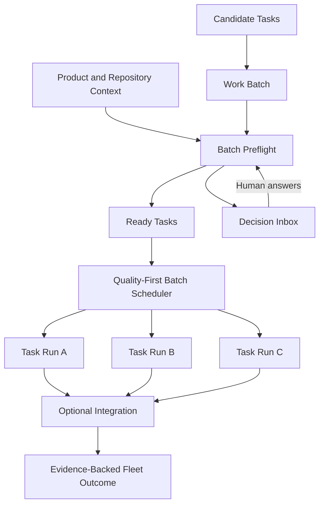

# zForge v2 Fleet and Human Attention

## Status

Normative design draft for multi-task work batches, readiness analysis,
quality-first scheduling, consolidated human decisions, and aggregate outcomes.

Related documents:

- [Product Direction](./product-direction.md)
- [Autonomous Flow](./flow.md)
- [Data Model](./data-model.md)
- [State and Events](./state-and-events.md)
- [Execution DAG](./execution-dag.md)
- [Policy and Risk](./policy-and-risk.md)
- [Evaluation](./evaluation.md)

## Objective

Allow a human to delegate a selected set of engineering outcomes while zForge
maximizes accepted quality, minimizes active human attention, and keeps every
task independently bounded, observable, recoverable, and reviewable.

A fleet is not an overnight mode and does not require parallel execution. It is
a durable control plane for selecting, preparing, scheduling, integrating, and
reporting multiple tasks.

## Terminology

| Term | Meaning |
|---|---|
| Work batch | A durable, ordered selection of tasks and desired outcomes |
| Batch run | One execution of a pinned work-batch revision |
| Batch item | One task's membership, dependency, priority, and outcome in a batch run |
| Preflight | Read-only analysis that determines task readiness and fleet feasibility |
| Decision Inbox | Projection of unresolved questions, approvals, conflicts, and human reviews |
| Fleet outcome | Aggregate result that preserves each task's independent truth |

The term `sprint` is not a runtime primitive. A sprint MAY supply candidate tasks
for one or more work batches, including tasks that remain human-owned or are not
safe for autonomous execution.

## Core Model



Each task retains its own contract, run, workspace, budget, evidence, review,
and delivery status. A batch does not weaken or replace task completion rules.

## Work Batch

A work batch records intent and selection, not mutable execution state.

```yaml
schema_version: 2
record_type: work_batch
record_id: batch_01J...
revision: 2
status: accepted
project_id: project_01J...
name: sprint-42-core
objective: Deliver the selected authentication outcomes
task_refs:
  - task_id: AUTH-101
    priority: high
  - task_id: AUTH-102
    priority: normal
    depends_on:
      - AUTH-101
quality_profile_ref: quality:strict@1
attention_policy_ref: attention:default@1
budget_policy_ref: budget:sprint-42@1
delivery_boundary: pull_request
created_at: 2026-08-28T01:00:00Z
created_by:
  actor_type: human
  actor_id: user-local
updated_at: 2026-08-28T01:00:00Z
content_hash: sha256:batch...
provenance_refs: []
```

Invariants:

- Batch membership and dependency edges are revisioned.
- A task MAY appear in historical batches but MUST NOT have conflicting active
  delivery-mutating runs for the same target.
- Task dependency graphs MUST be acyclic.
- Removing a task or changing a dependency creates a new batch revision.
- A batch priority cannot bypass task policy, risk, or evidence requirements.

## Batch Preflight

Preflight runs before state-changing task execution. It MAY use read-only agents
and deterministic repository inspection.

Preflight evaluates:

- task contract readiness;
- product and repository context availability;
- stale or contradictory knowledge;
- duplicate or overlapping outcomes;
- task size and required decomposition;
- dependency and integration order;
- file, component, schema, migration, and shared-resource conflicts;
- environment, credential, network, and tool availability;
- risk, approval, evidence, and delivery requirements;
- expected human decisions;
- budget and capacity feasibility.

Preflight produces one status per batch item:

```text
ready | needs_input | needs_approval | needs_decomposition |
conflicting | environment_blocked | unsupported | deferred
```

It also produces a readiness explanation and a consolidated Decision Inbox.
Preflight MUST NOT claim that an unexecuted task is verified or complete.

## Decision Inbox

The Decision Inbox is a projection over authoritative clarification questions,
approval requests, blockers, scope amendments, integration conflicts, and human
review requests.

Decision categories:

```text
product_input | approval | scope_change | environment |
integration_conflict | human_review | knowledge_conflict
```

Every item contains:

- exact question or action requiring authority;
- reason the runtime cannot resolve it safely;
- affected task, criteria, batch items, and downstream work;
- evidence and sources already inspected;
- recommendation and confidence;
- safe alternatives and default behavior;
- effect of approval, denial, answer, or timeout;
- deduplication key and provenance.

The runtime SHOULD consolidate equivalent questions when one answer has the same
meaning for every affected task. It MUST preserve task-specific impact and MUST
NOT reuse an answer when context or semantics differ.

Answering a decision creates authoritative task or policy events. The inbox item
itself does not directly mutate contracts or runs.

## Attention Policy

```yaml
human_attention:
  consolidate_questions: true
  prefer_repository_evidence: true
  allow_recorded_reversible_assumptions: true
  max_clarification_rounds_before_escalation: 2
  interrupt_immediately_for:
    - critical_security_risk
    - irreversible_external_effect
  otherwise:
    - queue_decision
    - continue_unaffected_tasks
```

Attention policy cannot authorize product behavior, secrets, permissions, or
external effects. It controls timing, grouping, and presentation of legitimate
human requests.

Interaction reasons and answer provenance support diagnosis and decision reuse.
No client timer, active-duration event, or human-time metric is required. The
operator judges supervision effort through use.

## Quality-First Scheduling

The batch scheduler selects eligible tasks in this order:

1. dependency correctness and policy eligibility;
2. work that reduces risk or creates knowledge required downstream;
3. contract and context readiness;
4. expected accepted quality and correction probability;
5. integration and shared-resource safety;
6. opportunity to reuse a human decision or validated context;
7. task priority;
8. cost and expected elapsed time;
9. stable task identity.

Parallel execution is permitted only when workspaces and shared resources are
safe. The scheduler MAY intentionally serialize otherwise independent tasks when
one task's findings can improve the contracts or execution of later tasks.

The first fleet implementation SHOULD parallelize across isolated task runs. It
SHOULD keep nodes inside each task serialized until within-task parallelism shows
measurable quality-neutral benefit in evaluation.

## Continue-on-Block Semantics

When a task blocks:

1. persist its attempts, workspace, evidence, and exact resumption predicate;
2. create or update the corresponding Decision Inbox item;
3. invalidate affected downstream readiness;
4. continue unrelated ready tasks when policy and budget permit;
5. re-evaluate blocked and downstream tasks after the condition changes.

A batch does not fail merely because one item blocks. Batch completion policy
decides whether partial success, deferred work, or all-required completion is
acceptable. Every item remains visible in the outcome.

## Batch Run State

Canonical batch-run states:

```text
queued | preflighting | waiting_decisions | ready | running |
integrating | reviewing | completed | partially_completed |
blocked | failed | cancelling | cancelled
```

`waiting_decisions` does not prevent ready unaffected tasks from running unless
batch policy requires an all-ready start. `partially_completed` is explicit and
MUST NOT be rendered as completed.

## Integration

Tasks in one repository normally execute in separate worktrees and branches.
Integration uses pinned task commits and dependency order.

Supported outcomes include:

- independent pull requests;
- stacked pull requests;
- one integration branch and pull request;
- reviewable local commits without external delivery.

After combining task outputs, shared acceptance criteria and integration gates
run against the integrated tree. Task-local passing evidence does not prove the
integrated outcome. Conflicts affecting product or shared contracts create a
Decision Inbox item rather than an arbitrary semantic merge.

## Fleet Result

Fleet status emphasizes engineering outcomes, not agent activity:

```text
accepted and reviewable
completed with limitations
needs product decision
needs approval
blocked by environment
failed safely
deferred
cancelled
```

The result summary includes:

- accepted outcomes and delivery references;
- task and integration evidence status;
- unresolved decisions and findings;
- assumptions and limitations;
- failed and preserved attempts;
- outstanding decisions, their reasons and affected scopes;
- correction, retry, invocation, token, and monetary cost;
- recommended next actions.

## CLI and MCP Surface

Target CLI:

```text
zforge batch create|add|remove|show|preflight
zforge batch start|status|watch|pause|resume|cancel
zforge inbox list|show|answer|decide
zforge batch result|evidence|cost
```

MCP exposes equivalent typed commands and queries. Generic agent identity cannot
answer product questions or human approval requests as a human actor.

## Evaluation

Required fleet metrics:

- accepted outcomes against requested delivery scope;
- accepted-task rate conditional on correctness and safety;
- unnecessary-question and duplicate-question rate;
- decision reuse precision;
- continue-on-block progress;
- autonomous correction success;
- integration conflict and regression rate;
- escaped defects and post-delivery rework;
- cost and elapsed time as secondary dimensions.

Evaluation MUST compare serialized and parallel policies. Supported independent
task classes must demonstrate safe concurrency and an elapsed-time benefit.
Per-batch scheduling may serialize work to preserve quality, safety, reviewer
clarity or resource bounds; cost is subordinate to these requirements.

## Initial Delivery Slice

The first fleet milestone supports:

- one user;
- one repository per batch;
- existing executable tasks;
- read-only preflight;
- consolidated Decision Inbox;
- dependency-aware task-level scheduling;
- isolated worktree per task;
- continue-on-block;
- independent task results and one aggregate summary;
- serial integration with integration gates.

The subsequent required v2 slice adds safe same-project task concurrency,
resource isolation and combined-tree gates; team roles and multi-project
coordination follow. Serial execution remains a valid policy choice. Remote
workers, schedule-based overnight execution and within-task parallel nodes are
deferred. Application deployment and production access/debugging are out of v2.

## Acceptance Criteria

- [ ] A batch is a durable task selection, not an alias for a sprint or schedule.
- [ ] Preflight identifies readiness, context gaps, dependencies, and conflicts before execution.
- [ ] Equivalent human decisions are consolidated without losing task-specific impact.
- [ ] Blocked tasks do not stop unrelated ready tasks.
- [ ] Scheduler ordering places quality and dependency safety before cost or speed.
- [ ] Fleet execution may remain fully serial.
- [ ] Every task retains independent contracts, evidence, state, and delivery truth.
- [ ] Integration reruns evidence against the combined candidate tree.
- [ ] Reports center accepted scope, evidence and limitations, without human-time tracking.
- [ ] Independent tasks can run concurrently in one project with isolated test resources.

## Result Scope and Shared Test Resources

Batch preflight uses bounded `AnalysisSession` ownership before a BatchRun
exists. It is repository-read-only but invoking agents consumes budget and is
an explicit command, not a status query.

Batch items retain each task's requested plan/phase/full scope. Aggregation cannot
count a planning deliverable as implemented behavior. Phase acceptance requires
combined-tree evidence; continuations name remaining tasks and prerequisites.
The batch digest links concise ReviewPackages and test-case feedback.

Concurrent tasks acquire environment resources in addition to worktrees.
Namespaces, ports, volumes, databases, fixtures and exclusive devices follow
[Project Onboarding and Local Testing](./project-onboarding-and-local-testing.md).
