# zForge v2 Autonomous Flow

## Status

This document defines the proposed v2 task flow. It is a design target, not a description of the current v1 implementation.

Related requirements:

- [Autonomous Software Engineering System](../../requirements/autonomous-software-engineering-system.md)
- [Autonomous Software Engineering System — Implementation Plan](../../requirements/autonomous-software-engineering-implementation-plan.md)

Related design:

- [Product Direction](./product-direction.md)
- [Fleet and Human Attention](./fleet-and-human-attention.md)
- [Agent Token and Cost Accounting](./cost.md)
- [Agents and Subagents](./agents.md)
- [Automatic Model Routing](./model-routing.md)
- [Deterministic Runtime](./deterministic-runtime.md)
- [Skills](./skills.md)
- [Data Model](./data-model.md)
- [State and Events](./state-and-events.md)
- [Artifacts and Traceability](./artifacts-and-traceability.md)
- [Execution DAG](./execution-dag.md)
- [Policy and Risk](./policy-and-risk.md)
- [Workspace and Git](./workspace-and-git.md)
- [Quality Gates](./quality-gates.md)
- [Errors and Recovery](./errors-and-recovery.md)

## Objective

Turn an intake into the highest-quality evidence-backed engineering outcome
permitted by context and policy while minimizing human active attention.

The flow optimizes correctness and safety before completeness, human attention,
cost, elapsed time, or parallelism. It asks a human only for material product
decisions, missing authority, irreducible ambiguity, scope change, or risk that
cannot be resolved safely from approved context and evidence.

The v2 flow must support both small executable tasks and large outcomes that require decomposition into a parent task and a dependency graph of child tasks.
It must also support quality-first work batches. Batch execution MAY be serial
and is independent from overnight scheduling.

## Core Change from v1

v1 selects a fixed linear flow:

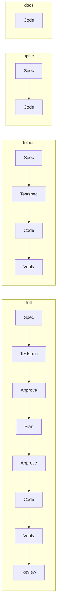

v2 treats these names as task profiles. A profile, risk assessment, and organizational policy are compiled into an execution graph.

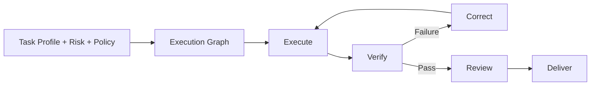

Internal nodes and roles do not become mandatory human-visible phases. Human
interaction is determined by evidence, uncertainty, and authority rather than by
the existence of a spec, plan, test, or review node.

## Top-Level Flow

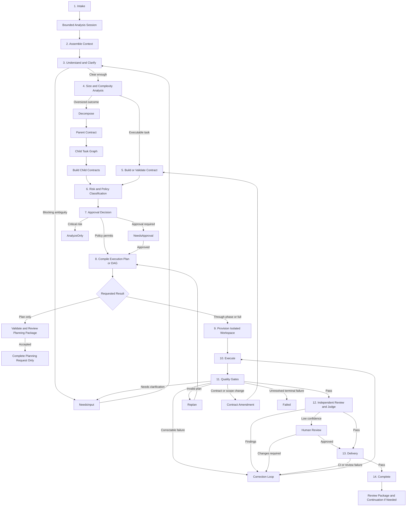

## Intake

An intake describes a desired outcome. It is not assumed to be an executable task.

Minimum intake fields:

- requested outcome;
- known context;
- constraints;
- external references;
- requested delivery boundary;
- explicit exclusions, when known.

The intake stage assigns a stable ID and records provenance for every external input.

## Understanding and Clarification

The requirement analyzer identifies:

- missing information;
- conflicting statements;
- ambiguous terminology;
- unverifiable outcomes;
- assumptions;
- external dependencies;
- security or operational constraints.

Blocking ambiguity moves the task to `NeedsInput`. Non-blocking assumptions may continue only when policy permits them and they are recorded in the contract.

Before creating a human question, the analyzer checks approved product context,
repository context, authoritative code and tests, and policy-permitted external
sources. Questions that remain material are consolidated with equivalent
questions from related tasks through the Decision Inbox. Waiting for one answer
does not stop unrelated ready tasks.

## Context Assembly

Every native v2 run pins a context snapshot containing the exact product,
repository, and task sources selected for the work. Selection records relevance,
version, content hash, provenance, trust, and staleness findings.

Context rules:

- approved context is reused instead of requested again from the human;
- stale or contradictory sources produce an explicit decision or governed update;
- task agents receive only context relevant to their assignment;
- agent output may propose knowledge updates but cannot silently change canonical
  product knowledge;
- an unresolved material context gap blocks only affected work.

## Size and Complexity Analysis

Before creating a full task contract, zForge determines whether the intake is small enough to execute as one task.

Signals that an intake is oversized include:

- multiple independently valuable outcomes;
- multiple services, repositories, or deployable components;
- unrelated risk domains in the same intake;
- database, API, UI, and local environment changes combined into one change set;
- expected scope above configured file, component, duration, or cost budgets;
- parts that can be implemented, verified, delivered, or rolled back independently;
- a plan that cannot be expressed as a bounded set of verifiable steps.

Example policy:

```yaml
task_limits:
  max_components: 2
  max_expected_files: 20
  max_plan_steps: 12
  max_duration_minutes: 120
  max_risk_domains: 2
```

Exceeding a threshold triggers decomposition analysis. Policy may require human approval before accepting the proposed decomposition.

## Oversized Intake Decomposition

An oversized intake becomes a parent task. The parent represents the complete outcome and does not directly modify production code.

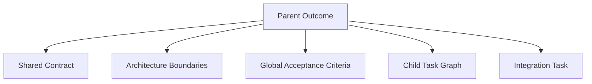

### Parent Contract

The parent contract owns:

- end-to-end outcome;
- global acceptance criteria;
- architecture and component boundaries;
- shared interfaces and schemas;
- cross-cutting constraints;
- dependency graph;
- integration and delivery strategy;
- overall risk and approval policy.

Example:

```yaml
id: SSO-100
type: epic
outcome: Organization SSO works end to end
acceptance_criteria:
  - id: AC-001
    outcome: An administrator can configure an identity provider
  - id: AC-002
    outcome: A user can authenticate through the configured provider
  - id: AC-003
    outcome: Authentication events are present in the audit log
shared_constraints:
  - Password login remains backward compatible
  - Identity-provider secrets never reach the frontend
children:
  - SSO-101
  - SSO-102
  - SSO-103
  - SSO-104
integration_task: SSO-199
```

### Child Task Requirements

Every child task must:

- produce one bounded outcome;
- have its own acceptance criteria;
- map to one or more parent acceptance criteria;
- have a limited component and file scope;
- be independently testable;
- be independently reviewable and revertible;
- declare dependencies and shared contracts;
- avoid circular dependencies;
- use the normal executable-task flow.

Prefer vertical slices that produce verifiable behavior. Avoid splitting only by technical layer unless an interface contract is established first.

Preferred:

- Configure and validate an identity provider.
- Implement the authorization and callback behavior.
- Expose SSO administration behavior.
- Add authentication audit and security controls.
- Verify the end-to-end SSO outcome.

Avoid when no shared contract exists:

- Build the database.
- Build the backend.
- Build the frontend.

### Child Dependency Graph

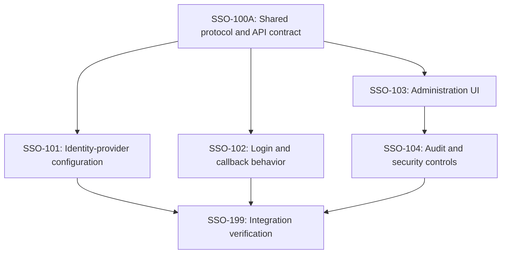

The scheduler may run independent children concurrently. A child cannot start until its required contracts and dependencies pass.

### Parent Completion

Completed child tasks do not automatically complete the parent. The parent passes only when:

- every parent acceptance criterion has evidence;
- required children are terminal and successful;
- cross-component integration gates pass;
- shared API and schema contracts are compatible;
- unexplained scope changes are absent;
- security, performance, delivery, and rollback requirements pass according to policy.

## Executable Task Contract

Whether created directly from intake or through decomposition, an executable task contract contains:

- requirements;
- measurable acceptance criteria;
- assumptions and exclusions;
- test or evidence strategy;
- expected component and file scope;
- dependencies;
- constraints;
- risk-relevant facts and constraints;
- delivery boundary.

Every contract element has a stable ID so zForge can trace:

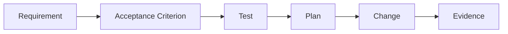

## Risk and Policy Classification

Risk determines the execution graph, required gates, reviewer independence, and human decisions.

Inputs include:

- authentication, authorization, cryptography, secrets, or personal data;
- public API or schema changes;
- database migration;
- local environment and integration impact;
- reversibility;
- affected component count;
- available test coverage;
- requirement confidence;
- operational blast radius.

Default supervision model:

| Risk | Supervision |
|---|---|
| Low | Continue through pull-request creation |
| Medium | Require plan or final-diff approval |
| High | Require contract, plan, and merge approval |
| Critical | Analyze only until explicit implementation authority is granted |

## Task Profiles

Profiles guide execution-graph compilation. They do not define immutable linear phase lists.

### Feature

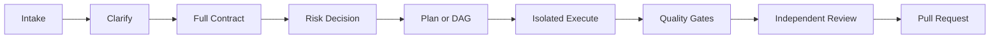

### Fixbug

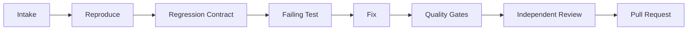

A fixbug task requires a reproducer, regression test, or explicitly approved alternative evidence.

### Docs

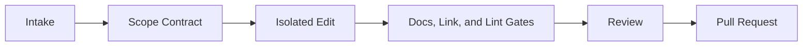

### Spike

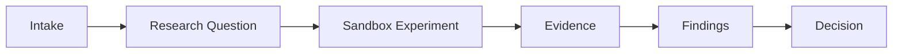

A spike cannot flow directly into production delivery. Implementation requires promotion into a new feature or fixbug contract.

## Execution Plan and DAG

The planner compiles the contract into nodes containing:

- dependencies;
- required resources;
- isolated workspace;
- assigned agent role;
- required model capabilities and permitted selection scope;
- expected file scope;
- quality gates;
- retry behavior;
- compensation or rollback behavior;
- approval conditions.

Independent nodes may run concurrently when evaluation and policy show the
execution is quality-neutral and resource-safe. Concurrency is optional.
Dependent nodes wait for their prerequisites and shared contracts.

Immediately before an agent-backed attempt, zForge compiles the node capability
profile and selects the concrete runtime-agent/model/reasoning combination. The
selection is deterministic from pinned catalog, evaluation, policy, task, and
attempt inputs. The spawned agent cannot replace that choice. Availability
fallback and inadequate-output quality escalation create new auditable routing
facts rather than silently using an ambient provider default.

## Isolated Execution

Every executable task or child task runs in its own worktree or equivalent sandbox.

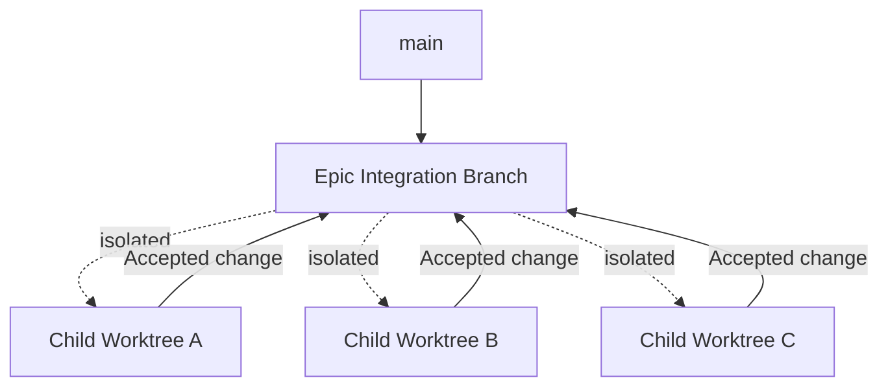

Agent processes may modify only policy-approved paths. Commits stage only files accepted by the task's change manifest.

## Quality Gates

Quality gates may include:

- formatting;
- linting;
- type checking;
- unit, integration, and end-to-end tests;
- coverage and mutation tests;
- static security analysis;
- dependency audit;
- API/schema compatibility;
- migration validation;
- performance regression;
- accessibility and visual regression.

Mandatory deterministic gate failures cannot be overridden by an LLM judge.

## Correction Routing

Failures return to the phase that owns their cause:

| Failure | Route |
|---|---|
| Test, lint, or implementation defect | Execute |
| Plan is incomplete or infeasible | Replan |
| Scope expansion is required | Contract Amendment |
| Requirement is ambiguous or conflicting | NeedsInput |
| Reviewer identifies a defect | Execute or Replan |
| CI failure | Execute |
| Development regression or user-supplied defect | Diagnose and create scoped fixbug intake |

Every correction loop has attempt, time, token, and cost budgets.

## Contract Amendment

A child cannot silently change a parent or shared contract.

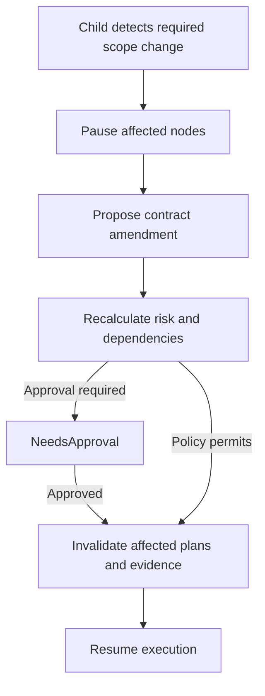

## Independent Review and Judge

The reviewer receives the original intake, structured contract, final diff, traceability graph, and deterministic evidence. High-risk tasks require a reviewer that is independent from the coding agent according to policy.

Possible decisions:

- pass;
- correct implementation;
- replan;
- quality fallback to a different agent;
- request human review;
- fail terminally.

Confidence and semantic judgment are routing signals, not proof. Review cannot
replace missing deterministic evidence. Multiple agents are selected only when
independence, specialization, or expected accepted quality justifies their cost
and context overhead.

## Delivery

Intake records `requested_result.mode`: `plan_only | through_phase |
full_implementation`. Implementation boundaries are `local_changes |
local_commits | pull_request`. Planning does not require a `TaskRun`;
analysis-session artifacts pass planning validation/review before acceptance.
Execution runs require an accepted executable plan.

Large requests have explicit phase outcomes, dependencies and acceptance
criteria. A through-phase request stops at its authorized target plus required
prerequisites. A full-implementation request cannot claim completion merely
because a plan or one phase is ready. Each partial handoff names remaining work
and prerequisite commits in a continuation manifest.

Every accepted result includes a concise `ReviewPackage`: behavior, rationale,
trade-offs, criteria-to-test cases/results, focused risk pointers, reproduction,
documentation changes and limitations. Reviewers may submit feedback on cases
without reading all implementation code; risk-selected code review still applies.
See [Development Handoff and Review](./delivery-and-review.md).

No application deployment, production connection or production debugging exists
in the v2 flow. Git/CI automation must not trigger deployment or production
effects. When that boundary cannot be verified, return local results.

## Work Batches and Fleet

A work batch selects multiple tasks under shared quality, attention, budget, and
delivery policy. It is not an alias for a sprint, schedule, or parallel job.

Before execution, batch preflight analyzes task readiness, context gaps,
dependencies, conflicts, risk, required authority, environment availability,
and integration order. Human questions are consolidated into a Decision Inbox.

The batch scheduler prioritizes dependency correctness, risk reduction,
knowledge-producing work, context readiness, expected accepted quality, and
integration safety before cost or elapsed time. It MAY serialize all tasks.

When one task blocks, zForge preserves it and continues unrelated ready tasks.
Each task retains independent state and evidence; aggregate fleet status never
hides a blocked, failed, deferred, or limited task. Detailed semantics are
defined in [Fleet and Human Attention](./fleet-and-human-attention.md).

## Task States

Task-level states describe orchestration status rather than completed document phases:

The diagram uses human-readable labels. Canonical machine values, complete
transition guards, task/run separation, and the event catalog are defined in
[State and Events](./state-and-events.md).

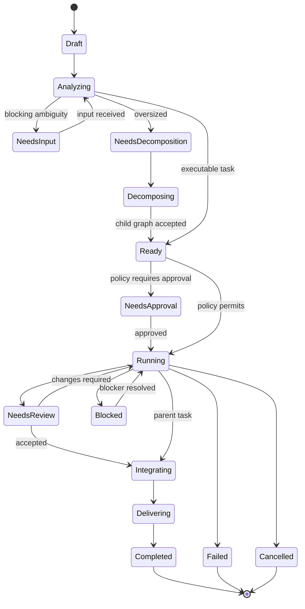

Execution-node states:

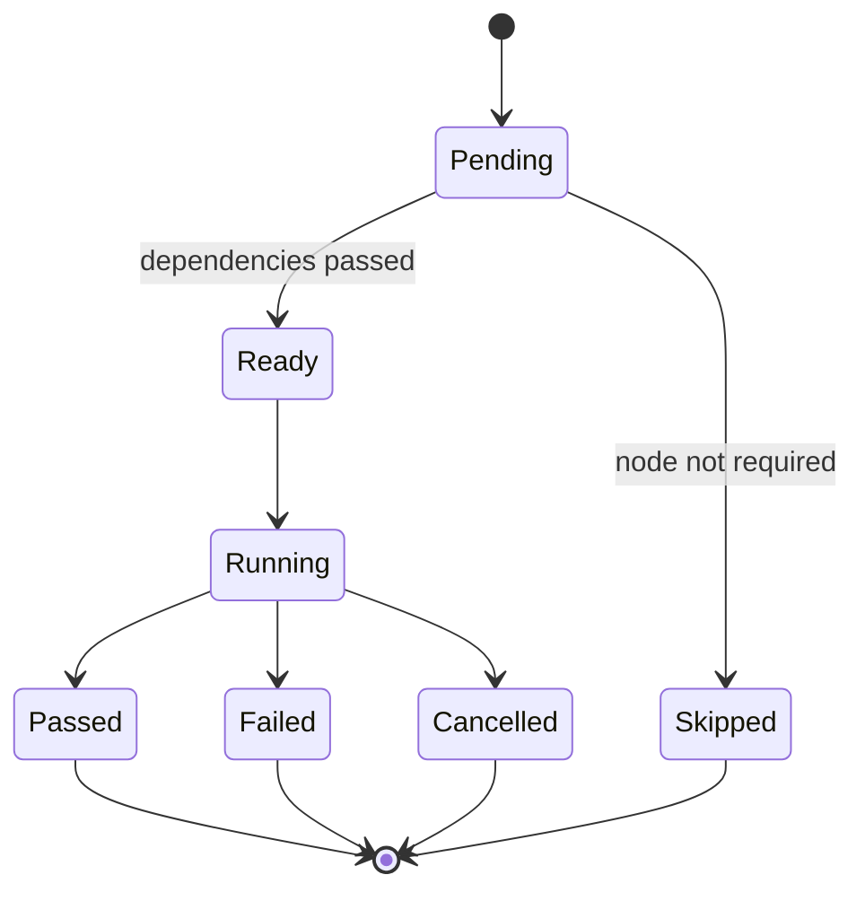

Parent task states may additionally expose `RunningChildren`, `Integrating`, and `Verifying` as user-facing detail.

## Invariants

- Correctness and safety outrank human attention, cost, elapsed time, and parallelism.
- Approved context is reused before requesting human input.
- Human questions are material, evidence-backed, and consolidated when equivalent.
- An intake is not assumed to be an executable task.
- Oversized outcomes are decomposed before implementation.
- Parent tasks own end-to-end outcomes; child tasks own bounded changes.
- Every child maps to parent acceptance criteria.
- Child tasks cannot silently amend shared contracts.
- Every executable task runs in an isolated workspace.
- Every committed file maps to an approved plan or scope amendment.
- Mandatory deterministic gates cannot be bypassed by agent confidence.
- Human approval is based on risk and uncertainty, not a fixed number of phases.
- Passing child tasks is insufficient without parent integration evidence.
- Spike output cannot be delivered as production implementation without promotion.
- Every retry, decision, artifact, and state transition is auditable and bounded.
- Fleet supports safe same-project task concurrency; individual batches may be serial and overnight is optional.
- A blocked task does not stop unrelated ready tasks.

## Initial v2 Delivery Milestone

The first implementation milestone stops at pull-request creation:

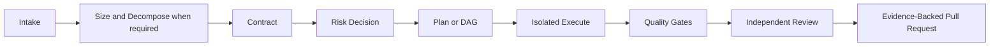

Subsequent milestones add same-project task concurrency, multi-project/role
coordination, optional richer local test adapters and governed knowledge proposals.
Application deployment and production access/debugging remain out of v2.

After the single-task milestone is proven, the next milestone adds a single-user,
single-repository work batch with read-only preflight, consolidated decisions,
task-level scheduling, continue-on-block, serial integration, and aggregate
quality and human-attention reporting.
