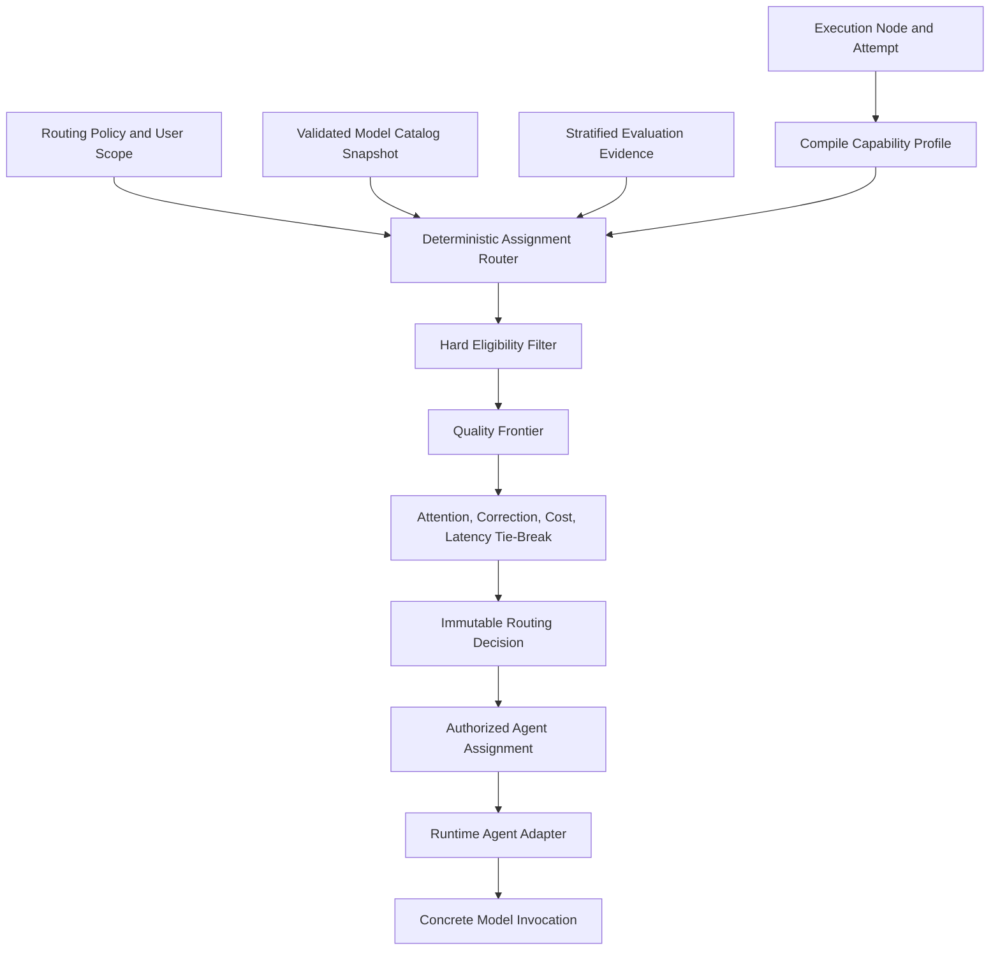

# zForge v2 Automatic Model Routing

## Status

This document defines the normative design target for capability-based runtime
agent and model selection in zForge v2. It is not a description of the current
v1 phase-to-model implementation.

Normative terms such as **MUST**, **MUST NOT**, **SHOULD**, and **MAY** describe
implementation requirements. The document remains a draft until explicitly
accepted.

Related documents:

- [Product Direction](./product-direction.md)
- [Agents and Subagents](./agents.md)
- [Configuration](./configuration.md)
- [Data Model](./data-model.md)
- [State and Events](./state-and-events.md)
- [Errors and Recovery](./errors-and-recovery.md)
- [Agent Token and Cost Accounting](./cost.md)
- [Policy and Risk](./policy-and-risk.md)
- [Security Threat Model](./security-threat-model.md)
- [Evaluation](./evaluation.md)
- [CLI and MCP](./cli-and-mcp.md)

## Objective

Automatically select the runtime agent, model, and supported reasoning profile
most likely to produce an accepted engineering outcome with the least human
intervention, subject to safety, independence, availability, and hard-budget
constraints.

The selection order is:

```text
eligibility, safety, and independence
    > expected accepted quality
    > probability of completion without human intervention
    > expected correction and fallback burden
    > monetary and quota cost
    > elapsed time
```

Automatic selection MUST NOT reduce a protected quality or safety floor merely
to use a cheaper or faster model.

## Core Boundary

The deterministic zForge assignment router selects the model before spawning a
runtime agent. A spawned agent cannot select or replace its own model because:

- the runtime process normally requires model selection at invocation time;
- the model determines budget, context, retention, and policy eligibility;
- self-selection would weaken auditability and reproducibility;
- repository or prompt injection must not influence assignment authority;
- an agent cannot authorize its own fallback or independence exception.

An agent MAY produce structured task-complexity or diagnostic evidence. That
evidence is an input to a later routing decision, never the decision itself.

## Non-Goals

The first implementation does not:

- train a learned router;
- assume one universal ranking of models across all task categories;
- discover undocumented model identifiers by trial and error;
- change an active invocation's model in place;
- treat provider marketing claims or model self-assessment as quality proof;
- explore unproven models on high-risk tasks;
- guarantee identical output across model or provider versions.

## Terminology

| Term | Meaning |
|---|---|
| Runtime agent | Executable adapter such as Codex, Claude Code, or OpenCode |
| Model candidate | One runtime-agent, provider, resolved-model, and reasoning-profile combination |
| Capability profile | Structured requirements for one execution node and attempt |
| Model catalog | Versioned facts and measured evidence about selectable candidates |
| Routing policy | Eligibility, quality, fallback, exploration, and tie-break rules |
| Routing decision | Immutable explanation of candidate filtering and final selection |
| Quality floor | Minimum measured outcome quality required for a task stratum |
| Quality-equivalent set | Candidates whose evidence satisfies the configured non-inferiority rule |
| Availability fallback | Replacement caused by runtime/provider unavailability |
| Quality escalation | New assignment caused by inadequate accepted-output evidence |

## Selection Modes

zForge supports three automatic scopes and one explicit mode:

| Agent request | Model request | Meaning |
|---|---|---|
| `codex` | `auto` | Select only among candidates invokable through the Codex adapter |
| `claude` | `auto` | Select only among candidates invokable through the Claude Code adapter |
| `auto` | `auto` | Select the eligible runtime-agent/model pair |
| explicit agent | explicit model | Pin the requested pair after validation |

`auto` is a selection request, not a resolved model identity. Every authorized
assignment MUST pin a concrete runtime agent, provider, model identifier,
reasoning profile when applicable, and catalog snapshot.

Explicit selection remains subject to policy, capability, availability,
independence, and budget validation. A user override cannot force an ineligible
model or weaken mandatory gates.

## Architecture



The router is a pure decision component over pinned inputs. Probing availability
and executing the chosen process are adapter responsibilities and produce
separate facts.

## Node Capability Profile

The flow compiler and deterministic analyzers create a capability profile for
each assignable node. A correction or material context change MAY create a new
profile revision.

```yaml
schema_version: 2
record_type: node_capability_profile
record_id: capability_profile_01J...
revision: 1
status: compiled
run_id: run_01J...
node_id: node_02J...
attempt_id: attempt_01J...
role: implementation
task_profile: feature
risk: high
languages:
  - rust
frameworks: []
complexity:
  class: high
  reasons:
    - cross_component_change
    - public_api_change
context:
  estimated_input_tokens: 82000
  requires_large_context: true
capabilities_required:
  - repository_read
  - repository_edit
  - structured_output
  - tool_use
capabilities_preferred:
  - long_horizon_reasoning
independence:
  different_from_assignment_refs:
    - assignment_00J...
  different_provider_required: false
quality_floor_ref: quality-floor:rust-feature-high@3
created_at: 2026-08-28T00:00:00Z
created_by:
  actor_type: system
  actor_id: capability-compiler
updated_at: 2026-08-28T00:00:00Z
content_hash: sha256:capability-profile...
provenance_refs:
  - plan_01J...
  - risk_01J...
```

Profile inputs MAY include:

- role and output contract;
- task type, language, framework, and repository capabilities;
- estimated relevant context, not total repository size;
- dependency depth, affected components, and interface surface;
- security, migration, compatibility, data, or local integration risk;
- tool and modality requirements;
- required model/provider independence;
- prior attempt errors and structured diagnostic evidence;
- approved task-specific model scope.

Free-form task text alone MUST NOT directly set risk, authority, or model
eligibility.

## Model Catalog

The catalog contains selectable candidates and evidence used to evaluate them.
Model identifiers and capabilities live in versioned catalog data, not in the
orchestrator's core routing code.

```yaml
schema_version: 2
record_type: model_catalog_snapshot
record_id: model_catalog_01J...
revision: 1
status: immutable
catalog_version: 2026-08-28.1
candidates:
  - candidate_id: candidate_codex_standard
    runtime_agent: codex
    adapter_version: 2.0.0
    provider: example-provider
    model_resolved: example-model-version
    model_family: example-model-family
    reasoning_profiles:
      - standard
      - deep
    capabilities:
      - repository_read
      - repository_edit
      - structured_output
      - tool_use
      - long_horizon_reasoning
    context_limit_tokens: 200000
    policy_labels:
      - local-cli
      - supported
    availability:
      state: available
      observed_at: 2026-08-28T00:00:00Z
      source: authenticated_probe
    evaluation_refs:
      - eval_run_01J...
source_refs:
  - model-registry:installation@4
  - model-registry:project@2
created_at: 2026-08-28T00:00:00Z
created_by:
  actor_type: system
  actor_id: model-catalog-resolver
updated_at: 2026-08-28T00:00:00Z
content_hash: sha256:model-catalog...
provenance_refs: []
```

Catalog facts have explicit sources:

| Fact | Acceptable source |
|---|---|
| Runtime command and argument support | Versioned adapter definition and contract test |
| Installed/authenticated availability | Adapter probe |
| Context or feature support | Trusted registry metadata verified where practical |
| Quality | zForge evaluation results for a defined task stratum |
| Cost and quota | Provider report, subscription policy, or versioned price plan |
| Project suitability | Project evaluation history with minimum sample policy |

Provider or model self-description MAY seed unverified metadata but cannot
satisfy a protected quality floor without evaluation evidence.

Catalog snapshots are immutable. A new availability probe, model version,
evaluation result, or policy change creates a new snapshot for future routing.
An active assignment continues using its pinned snapshot unless emergency
policy revokes the candidate.

## Runtime Agent Adapter Contract

Each adapter defines how zForge translates a selected candidate into a concrete
process invocation.

```rust
pub trait RuntimeAgentAdapter {
    fn probe(&self) -> Result<AdapterProbe>;
    fn validate_candidate(&self, candidate: &ModelCandidate) -> Result<()>;
    fn build_invocation(
        &self,
        assignment: &AgentAssignment,
        prompt_ref: &ArtifactRef,
    ) -> Result<ProcessSpec>;
    fn parse_outcome(&self, outcome: &ProcessOutcome) -> Result<InvocationOutcome>;
}
```

The adapter MUST:

- declare whether direct model selection, profiles, or another mechanism is used;
- validate the resolved model before a state-changing invocation;
- produce argument arrays without shell interpolation;
- report the requested and resolved model when observable;
- preserve usage and provider error evidence;
- fail explicitly when the requested selection cannot be represented.

If an adapter cannot enumerate supported models, it uses a trusted configured
candidate set. It MUST NOT probe unknown identifiers through billable or
state-changing invocations.

## Hard Eligibility

The router removes a candidate when any mandatory condition fails:

- runtime adapter is not installed, authenticated, or healthy enough for policy;
- candidate is outside the requested agent scope;
- required context, tool, modality, or structured-output capability is absent;
- data handling, network, retention, or provider policy is incompatible;
- risk class exceeds the candidate's permitted use;
- required reviewer/provider/model independence would be violated;
- resolved model or adapter version is unsupported or revoked;
- hard budget or quota reservation cannot be satisfied;
- required evaluation evidence is absent and cold-start policy does not allow it.

No score can compensate for failed eligibility.

## Quality-First Selection Algorithm

When qualified evidence exists, evaluation provides a task-stratified estimate of:

```text
P(accepted outcome without human correction)
P(accepted outcome after bounded autonomous correction)
expected correction attempts
expected human intervention
escaped-defect and critical-failure rate
cost and latency distributions
```

The evidence-backed router uses a deterministic lexicographic selection:

1. Reject candidates below mandatory correctness, safety, or independence floors.
2. Compare the conservative lower confidence bound for accepted quality in the
   closest valid task stratum.
3. Form a quality-equivalent set using the configured non-inferiority margin.
4. Within that set, minimize expected human intervention.
5. Then minimize expected correction and fallback burden.
6. Then minimize quota/monetary cost and elapsed time.
7. Apply a stable candidate-ID tie-break for reproducibility.

When evidence is insufficient, the router follows cold-start policy. The
quality-first default uses trusted configured priorities within eligible candidates,
recording `selection_basis: cold_start` and evidence gaps. Configured preference
is not measured model strength. Mandatory measured-quality/independence floors
still fail closed when evidence is missing; initial supported scope must say which
low-risk classes permit configured priors. No random exploration is implied.

Model strength is task-stratified. A model may be preferred for repository
implementation but not for architecture, review, UI inspection, or a different
language.

## Routing Policy

```yaml
schema_version: 2
policy_id: routing-quality-first
version: 1
selection:
  strategy: lexicographic_quality_first
  quality_metric: accepted_without_human_correction
  confidence_level: 0.95
  non_inferiority_margin: 0.01
  minimum_stratum_samples: 30
cold_start:
  strategy: configured_priority
  permitted_risk_levels: [low]
  priority_refs: ["candidate-priorities:repository-work@1"]
  missing_required_evidence: block
  allow_unvalidated_low_risk_exploration: false
fallback:
  availability:
    require_same_output_contract: true
    prefer_quality_equivalent: true
  quality:
    allow_same_candidate_retry_with_new_evidence: true
    require_non_decreasing_capability: true
    repeated_failure_route: diagnose
independence:
  high_risk_review:
    different_assignment_context: true
    different_model_or_agent: true
```

Policies MUST define missing-data behavior. Unknown quality, cost, or
availability is not silently converted to zero or best-in-class.

## Routing Decision

Every automatic or explicit selection creates an immutable decision record.

```yaml
schema_version: 2
record_type: model_routing_decision
record_id: routing_decision_01J...
revision: 1
status: selected
run_id: run_01J...
node_id: node_02J...
attempt_id: attempt_01J...
request:
  runtime_agent: codex
  model: auto
capability_profile_ref: capability_profile_01J...
catalog_snapshot_ref: model_catalog_01J...
routing_policy_ref: routing-quality-first@1
candidates:
  - candidate_id: candidate_codex_standard
    outcome: selected
    reason_codes:
      - highest_quality_lower_bound
      - satisfies_high_risk_policy
  - candidate_id: candidate_codex_fast
    outcome: rejected
    reason_codes:
      - below_quality_floor
selected:
  runtime_agent: codex
  adapter_version: 2.0.0
  provider: example-provider
  model_resolved: example-model-version
  model_family: example-model-family
  reasoning_profile_requested: deep
  reasoning_profile_resolved: provider-high
selection_basis: evaluated
created_at: 2026-08-28T00:00:00Z
created_by:
  actor_type: system
  actor_id: assignment-router
updated_at: 2026-08-28T00:00:00Z
content_hash: sha256:routing-decision...
provenance_refs:
  - eval_run_01J...
```

Decision status:

```text
selected | no_eligible_candidate | policy_blocked | budget_blocked
```

Candidate outcome:

```text
selected | eligible_not_selected | rejected
```

Selection basis:

```text
evaluated | cold_start | explicit | shadow
```

Candidate explanations expose stable reason codes and safe measured summaries.
They do not expose hidden evaluator data, private chain-of-thought, credentials,
or unrestricted provider payloads.

## Assignment and Invocation Semantics

An authorized assignment references exactly one routing decision and pins:

- runtime agent and adapter version;
- provider and resolved model;
- reasoning profile or equivalent supported setting;
- prompt, skills, context, tools, permissions, and output schema;
- budget reservation;
- capability profile, catalog snapshot, and routing policy.

A selected decision does not authorize execution by itself. Policy and budget
guards authorize the resulting assignment. A decision with
`selection_basis: shadow` cannot authorize an assignment even when it records a
would-select candidate. A model change creates a new routing decision and
assignment; it never mutates a running invocation.

## Reasoning Profiles

Reasoning depth is part of the candidate, not a hidden global toggle. Adapters
map a provider-neutral requested profile to an exact supported setting:

```text
minimal | standard | deep | maximum_validated
```

The adapter records the provider-specific resolved value. Unsupported mappings
fail validation rather than silently using an unknown default. Routing MAY
select a stronger reasoning profile without changing model when evaluation shows
that route is quality-equivalent to changing model.

## Analysis Before a Run Exists

Requirements, planning, decomposition, onboarding and preflight use bounded
`AnalysisSession` ownership from [Data Model](./data-model.md). Capability
profiles reference session/action/attempt; `run_id` and `node_id` are null.
The compiler uses pinned intake/context/configuration and a conservative risk
floor instead of requiring an already approved execution plan. Readiness checks
and finite budgets still precede assignment authorization.

## Fallback and Escalation

Every new spawn for retry, fallback or quality escalation creates a new attempt,
routing decision, assignment and invocation. The prior assignment remains pinned
to its concrete agent/model/reasoning tuple. Reconcile ambiguous process or
external effects before rescheduling; changing models does not resolve ambiguity.


### Availability Fallback

Availability fallback handles timeout, authentication, rate limit, quota,
transport, provider outage, or adapter incompatibility. It normally selects a
quality-equivalent eligible candidate under the same output contract.

### Quality Escalation

Quality escalation handles invalid output, failed evidence, unresolved review,
or repeated correction attributable to the selected candidate's output.

It MAY:

- retry the same candidate only with new structured correction evidence;
- increase a supported reasoning profile;
- select a better-evidenced model within the same runtime agent;
- select another runtime agent/model when request scope and policy permit;
- route through a diagnostic agent before another implementation attempt;
- revise role decomposition or the execution plan.

Quality escalation MUST NOT downgrade measured capability merely to reduce cost.
Repeated identical failure without new evidence routes to diagnosis or terminal
escalation, not an unbounded model carousel.

## Independence

Routing checks prior assignments named by the capability profile. Depending on
risk, independence MAY require:

- a different invocation context;
- a different resolved model;
- a different runtime agent;
- a different provider;
- a separately versioned evaluation judge.

String inequality alone is insufficient when two aliases resolve to the same
underlying model. Independence checks use resolved provider/model identities and
policy-defined model-family metadata. When required family/provider identity is
unknown, independence fails closed rather than assuming difference.

## Fleet Behavior

Fleet routing is task-local first. Each node receives its own decision; a batch
does not force one model across all tasks.

The batch preflight MAY:

- forecast candidate availability, quota, and model-specific bottlenecks;
- serialize tasks that compete for a scarce high-quality candidate;
- prioritize knowledge-producing tasks before routing dependent work;
- reserve capacity conservatively for high-risk review and correction;
- identify correlated risk when many tasks select the same model or provider.

Fleet scheduling MUST NOT downgrade a task solely to increase concurrency.

## Evaluation and Learning

Routing evidence is stratified by at least:

- role;
- task profile and risk;
- language/framework or repository class;
- context-size band;
- runtime agent, resolved model, and reasoning profile;
- fresh attempt, correction, availability fallback, or quality escalation.

Primary routing metrics are:

- accepted outcome without human correction;
- accepted outcome after bounded autonomous correction;
- human intervention reasons and rate;
- correction attempts to acceptance;
- reviewer and deterministic-gate rejection rate;
- escaped defects and critical failures;
- cost and latency conditional on accepted quality.

Project-specific evidence MAY override general routing evidence only after
minimum sample, recency, and regression requirements pass. Development feedback
creates versioned evaluation inputs; it does not directly rewrite routing policy.

Exploration of uncertain candidates is allowed only in explicitly eligible
low-risk strata with bounded exposure and independent gates. High-risk and
delivery-mutating tasks use validated candidates.

## Rollout

### Phase 1: Deterministic Rules

- Replace fixed phase mapping with `fixed | auto` selection requests.
- Add adapter validation, catalog snapshots, capability profiles, and explainable
  decisions.
- Use conservative configured candidate priorities and hard eligibility initially;
  label unevaluated selection `cold_start`, not `evaluated`.
- Use curated evaluation evidence when available. Do not invent quality scores or
  require project-specific statistical learning before fleet is usable.

Phase 1 may enable agent-scoped automatic selection under an explicit cold-start
policy; it is not restricted to fixed routing until later phases. Statistical
optimization remains optional until qualified evidence exists.

### Phase 2: Shadow Routing

- Compute and store an automatic decision while continuing to execute the
  configured fixed model.
- Compare predicted choice, actual outcome, human intervention, cost, and
  latency without changing task behavior.
- Shadow execution of model A cannot establish model B's actual quality. Qualify
  B through independent benchmark or bounded pilot runs before claiming measured improvement.

### Phase 3: Bounded Automatic Routing

- Enable automatic selection for evaluated low- and medium-risk strata.
- Retain explicit pinning and immediate rollback to fixed routing.
- Keep high-risk routing on the strongest validated policy path.

### Phase 4: Governed Adaptive Routing

- Incorporate qualified project-specific evidence.
- Enable bounded low-risk exploration.
- Promote policies only through offline, shadow, bounded pilot, and regression gates.

## Native-v2 Model Configuration

Per [ADR-005](./decisions/005-native-v2-no-migration.md), automatic and explicit fixed selection use native-v2
configuration only. No v1 `models.yaml` reader or phase-default migration is
required. The user recreates any desired explicit selection manually.

```yaml
agents:
  claude:
    model_selection:
      strategy: auto
      routing_policy_ref: routing-quality-first@1
```

Explicit fixed selection remains policy-validated and catalog-resolved; it is
not a compatibility mode. Core code supplies no hidden provider model names.
Unresolvable selections block with configuration diagnostics. Shadow routing
can evaluate choices before automatic execution is enabled.

## Failure Semantics

```text
ROUTING_PROFILE_INVALID | ROUTING_CATALOG_UNAVAILABLE |
ROUTING_CATALOG_STALE | ROUTING_NO_ELIGIBLE_CANDIDATE |
ROUTING_QUALITY_EVIDENCE_INSUFFICIENT | ROUTING_POLICY_BLOCKED |
ROUTING_INDEPENDENCE_UNSATISFIED | ROUTING_BUDGET_UNSATISFIED |
ROUTING_ADAPTER_MODEL_UNSUPPORTED | ROUTING_RESOLUTION_MISMATCH
```

No eligible candidate creates a typed blocker or escalation according to policy.
It never silently falls back to the runtime agent's ambient default model.

## Security and Privacy

- Repository content cannot add model candidates or change routing policy.
- Catalog and policy sources follow configuration trust and hash validation.
- Adapter probes are read-only, bounded, redacted, and never expose credentials.
- Routing explanations exclude sensitive prompts, proprietary benchmark cases,
  account details, and raw provider responses.
- Model/provider data-handling policy is evaluated before selection.
- Candidate revocation stops new assignments and triggers active-run
  reconciliation according to emergency policy.
- Attackers cannot improve a candidate's quality record by submitting
  self-scored outcomes; accepted evidence comes from trusted evaluators.

## CLI and MCP Surface

```text
zforge models list|show|probe
zforge routing explain <task-or-run> [--node <node-id>]
zforge routing shadow <task-or-run>
zforge run start <task> --agent codex --model auto
zforge run start <task> --agent auto --model auto
```

MCP exposes bounded model discovery and routing explanation queries. It does not
allow an agent caller to mutate trusted catalog facts, evaluation results, or
routing policy.

## Rust Modules

```text
src/model_routing/
├── model.rs
├── capability_profile.rs
├── catalog.rs
├── adapter.rs
├── probe.rs
├── eligibility.rs
├── quality.rs
├── select.rs
├── explain.rs
├── fallback.rs
└── configuration.rs
```

Provider-specific argument construction remains behind runtime-agent adapters,
not in the provider-neutral selection algorithm.

## Testing Strategy

Tests cover:

- fixed, agent-scoped auto, and fully automatic selection;
- adapter/model compatibility and resolved identity;
- every hard eligibility rule and rejection reason;
- deterministic selection for the same pinned inputs;
- quality floors, confidence bounds, non-inferiority, and stable tie-breaks;
- missing, stale, conflicting, and insufficient catalog evidence;
- cold-start and low-risk exploration restrictions;
- reviewer/model/provider independence including aliases;
- availability fallback versus quality escalation;
- no downgrade after quality failure;
- budget/quota constraints without quality-floor weakening;
- shadow decisions that cannot affect execution;
- catalog snapshot pinning and emergency revocation;
- unsupported legacy model configuration fails validation;
- malicious repository attempts to influence routing authority.

Contract tests run against fake adapters. Real Codex, Claude Code, and other
runtime-agent tests remain opt-in and verify invocation construction without
depending on undocumented ambient defaults.

## Acceptance Criteria

- [ ] `agent=<name>, model=auto` selects only compatible candidates for that runtime agent.
- [ ] `agent=auto, model=auto` may select a runtime-agent/model pair under policy.
- [ ] Explicit model selection remains supported and policy-validated.
- [ ] Core routing code contains no provider model-name defaults.
- [ ] Every automatic choice has a pinned capability profile, catalog snapshot, policy, and decision record.
- [ ] Hard eligibility is evaluated before quality or cost comparison.
- [ ] Automatic routing optimizes accepted quality before human attention, cost, or latency.
- [ ] Unknown evidence is represented as unknown and follows explicit cold-start policy.
- [ ] Quality fallback cannot silently downgrade capability or bypass failed evidence.
- [ ] Model/provider independence uses resolved identity rather than display names.
- [ ] Shadow routing can compare recommendations without affecting execution.
- [ ] Routing decisions and outcomes are measurable by task stratum.
- [ ] Native fixed and automatic configuration require no legacy reader or hidden defaults.
