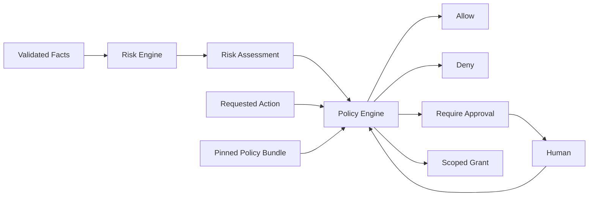
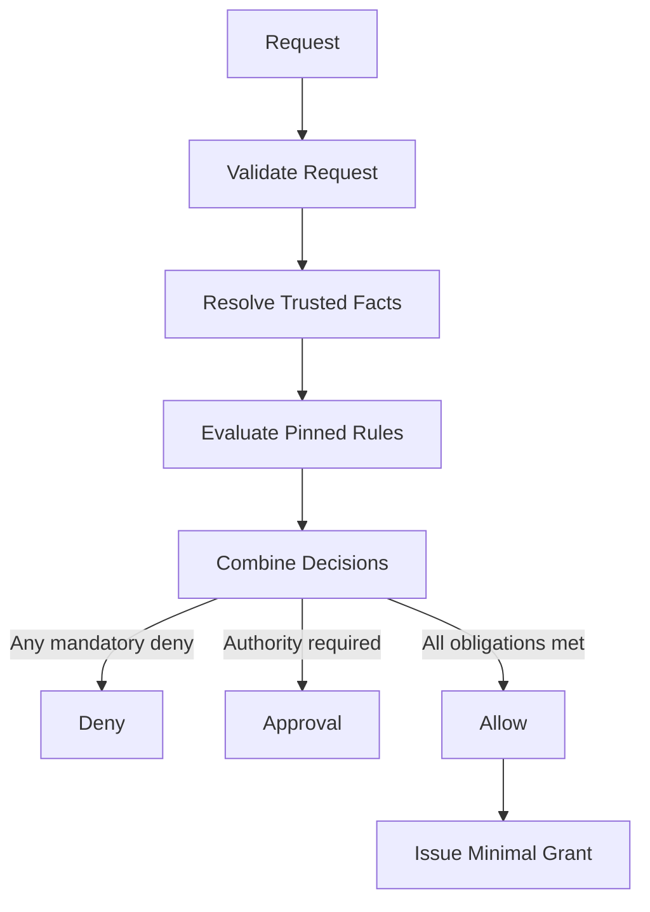

# zForge v2 Policy and Risk

## Status

Normative design draft for deterministic risk classification, policy evaluation,
permission grants, human supervision, exceptions, and authority boundaries.

Related documents:

- [Product Direction](./product-direction.md)
- [Fleet and Human Attention](./fleet-and-human-attention.md)
- [Data Model](./data-model.md)
- [State and Events](./state-and-events.md)
- [Execution DAG](./execution-dag.md)
- [Deterministic Runtime](./deterministic-runtime.md)
- [Automatic Model Routing](./model-routing.md)
- [Artifacts and Traceability](./artifacts-and-traceability.md)
- [Security Threat Model](./security-threat-model.md)
- [Configuration](./configuration.md)

## Objective

Convert explicit facts into reproducible decisions about required rigor and
allowed actions without allowing an agent to grant itself authority, reduce
mandatory risk, or bypass human decisions.

## Separation of Concerns



The risk engine classifies exposure and required rigor. The policy engine decides
whether a specific action is allowed. Human approval supplies authority but does
not itself prove technical correctness.

## Risk Inputs

Risk classification uses structured facts including:

- requirement ambiguity and confidence;
- number of components, repositories, and deployables;
- authentication, authorization, cryptography, secret, privacy, or compliance scope;
- public API, protocol, schema, and compatibility changes;
- database or irreversible migration;
- local infrastructure and integration blast radius;
- external side effects and third-party dependencies;
- availability of deterministic tests and rollback;
- generated-code and supply-chain changes;
- concurrency and shared-resource exposure;
- change size and novelty;
- historical escaped defects or unstable areas.

Agent analysis MAY propose additional risk factors. Deterministic rules establish
the minimum and agents cannot lower it.

## Risk Model

Risk levels:

```text
low | medium | high | critical
```

Each factor records domain, likelihood, impact, detectability, reversibility,
mandatory minimum, evidence, and reason codes.

```yaml
schema_version: 2
record_type: risk_assessment
record_id: risk_01J...
revision: 2
status: accepted
task_id: SSO-102
contract_ref: contract_01J...@3
factors:
  - factor_id: risk_factor_01J...
    domain: authentication
    likelihood: possible
    impact: high
    detectability: medium
    reversibility: reversible_with_downtime
    calculated_level: high
    mandatory_minimum: high
    reason_codes:
      - AUTH_CALLBACK_SECURITY_BOUNDARY
    evidence_refs:
      - provenance_01J...
overall_level: high
required_controls:
  - independent_security_review
  - integration_test
  - human_merge_approval
evaluated_by:
  actor_type: system
  actor_id: risk-engine
created_at: 2026-08-25T00:20:00Z
created_by:
  actor_type: system
  actor_id: risk-engine
updated_at: 2026-08-25T00:20:00Z
content_hash: sha256:risk...
provenance_refs: []
```

## Risk Calculation

The initial model uses configured lookup tables rather than an opaque model score.

```text
base_level = matrix(likelihood, impact)
adjusted_level = apply(detectability, reversibility, blast_radius, uncertainty)
factor_level = max(adjusted_level, mandatory_minimum)
overall_level = max(required factor levels, cross_factor_rules)
```

Numeric scores MAY support ordering but MUST NOT replace the explainable level,
factor list, or mandatory rules.

Unknown material facts increase uncertainty or require clarification. They are
never treated as zero risk.

## Mandatory Risk Rules

Examples of minimum rules:

| Signal | Minimum level or control |
|---|---|
| Authentication/authorization boundary | `high`, independent security review |
| Secret or cryptographic key handling | `high`, secret-safe tools and review |
| Irreversible data migration | `critical`, human approval and rollback rehearsal |
| Application deployment or production access/debugging | Denied throughout v2; no approval override |
| Public breaking API/schema | `high`, compatibility gate |
| No deterministic verification for critical behavior | Escalate or analyze-only |
| Documentation-only, no executable behavior | Normally `low` unless sensitive |

Organization policy may strengthen these rules. Project or task configuration
cannot weaken them.

## Policy Sources and Precedence

From strongest to most local:

```text
built_in_safety -> organization -> project -> profile -> task -> action request
```

Precedence is restrictive composition:

- higher layers define non-overridable minimums and denials;
- lower layers may narrow permissions or increase rigor;
- lower layers may override ordinary defaults only where the parent explicitly
  marks a setting overridable;
- no layer may turn a mandatory deny into allow;
- task input and agent output are never policy sources.

## Policy Bundle

```yaml
schema_version: 2
record_type: policy_bundle
record_id: policy_bundle_01J...
revision: 1
status: active
sources:
  - id: built-in-safety
    version: 2.0.0
    content_hash: sha256:builtin...
  - id: organization-policy
    version: 4
    content_hash: sha256:org...
  - id: project-policy
    version: 2
    content_hash: sha256:project...
compiled_rules_hash: sha256:compiled-policy...
language_version: 1
fact_registry_ref: policy-facts@1
compiler_version: 2.0.0
evaluator_version: 2.0.0
created_at: 2026-08-25T00:00:00Z
created_by:
  actor_type: system
  actor_id: policy-compiler
updated_at: 2026-08-25T00:00:00Z
content_hash: sha256:policy-bundle...
provenance_refs: []
```

Runs pin a policy bundle. Policy changes do not silently alter an active run;
emergency revocation appends a revocation decision and blocks new side effects.

## Action Taxonomy

Every protected operation has a typed action:

```text
read_repository | write_workspace | execute_command | access_network |
access_secret | invoke_agent | run_gate | expand_scope | increase_budget |
create_child_task | write_memory | commit | push | create_pull_request |
merge | recover_local_environment | export_artifact | delete_by_retention |
complete_node | complete_run | complete_task
```

Unknown actions default to deny.

## Policy Request

```yaml
action: write_workspace
subject:
  assignment_id: assignment_01J...
resource:
  workspace_lease_id: lease_02J...
requested_scope:
  path_patterns:
    - src/auth/**
  operations:
    - create
    - modify
context:
  task_id: SSO-102
  run_id: run_01J...
  node_id: node_02J...
  attempt_id: attempt_01J...
  risk_ref: risk_01J...@2
input_hash: sha256:policy-request...
```

Requests are exact and canonical. Changing subject, resource, scope, action,
duration, command, host, secret, or input hash requires a new decision.

## Policy Decisions

```text
allow | deny | require_approval
```

An allow decision produces a bounded grant containing only necessary authority:

- exact action and subject;
- resource identities and path/command/host constraints;
- validity window and maximum uses;
- run, node, attempt, assignment, and input hash;
- revocation identity;
- required audit and evidence obligations.

No implicit ambient grant exists. Absence of a decision means deny.

## Deterministic Rule Language

Policy rules use the closed YAML language accepted in
[ADR-004](./decisions/004-bounded-yaml-policy.md). Expressions are `all_of`,
`any_of`, `not` and typed comparisons using `equals | in | lt | lte | gt | gte`.
Action selectors, fact types, missing/null semantics and bounds follow that ADR.
No scripting or general-purpose expression engine is required.

```yaml
rules:
  - id: high-risk-review
    actions: [complete_run]
    when:
      all_of:
        - fact: risk.overall_level
          op: in
          value: [high, critical]
        - fact: action.type
          op: equals
          value: complete_run
    decision: require_approval
    obligations:
      - independent_review
      - evidence_coverage_100
    reason_code: HIGH_RISK_COMPLETION
```

Rules cannot execute shell, network requests, templates, or model calls. Unknown
facts, operators, or schema versions fail closed.

## Policy Evaluation



Combination rules:

- any matching deny dominates; rule ordering cannot weaken it;
- obligations from matched authorizing rules accumulate; unmet mandatory evidence/scope obligations deny admission and cannot be replaced by approval;
- unresolved require-approval dominates allow once deterministic obligations pass;
- valid scoped approvals satisfy matching conditional-authorization rules on re-evaluation rather than causing repeated prompts;
- deny/allow overlap is valid; malformed definitions are compile errors and impossible combined obligations deny admission with diagnostics;
- no authorizing match means deny, including safe reads unless an explicit scoped built-in allow rule applies;
- facts for all applicable action rules are validated before Boolean evaluation; negation or a true branch cannot mask missing/null/invalid facts.

## Human Supervision

Human attention is triggered by authority or uncertainty, not fixed phases.

Before requesting a human decision, the runtime MUST inspect eligible approved
context and authoritative evidence, then explain why the remaining uncertainty
is material. Policy MAY permit a recorded, reversible, low-impact assumption;
such an assumption is not human approval and cannot authorize protected actions.

Equivalent requests MAY be consolidated across tasks only when one answer or
grant has identical semantics and scope for every affected task. A batch does
not broaden approval authority.

Typical approval triggers:

- critical risk;
- material scope or contract amendment;
- budget increase beyond hard limit;
- restricted/secret access;
- irreversible or ambiguous external side effect;
- breaking compatibility;
- low-confidence semantic judgment;
- policy exception or residual critical finding.

Approval requests MUST include requested decision, exact scope, reason, evidence,
alternatives, cost/risk impact, expiry, and consequences of denial.
Non-urgent requests MAY be queued in the Decision Inbox while unrelated work
continues. Critical security, irreversible-effect, and expiring-authority policy
may require immediate interruption.

## Approval Semantics

- Only authenticated authorized humans or trusted external authority can approve.
- Agents cannot approve, impersonate, or synthesize approval.
- Approval is scoped to the exact request hash and expiry.
- Approval authorizes the policy engine to issue a grant; it does not directly
  mutate state or prove quality.
- Changed inputs, scope, risk, or action invalidate the approval.
- Denial and expiry are terminal for that request but a materially new request
  may be evaluated independently.

## Exceptions

Policy exceptions require:

- explicit exception type and violated rule;
- authorized human identity;
- narrow scope and expiry;
- rationale, alternatives, and residual risk;
- compensating controls;
- visible inclusion in review and delivery bundles.

Built-in non-overridable safety denials cannot receive exceptions.

## Risk-Based Workflow Requirements

| Level | Minimum normal behavior |
|---|---|
| `low` | Bounded implementation, deterministic gates, normal review policy |
| `medium` | Expanded gates, explicit evidence strategy, independent review as configured |
| `high` | Independent specialist review, strict isolation, human delivery/merge authority |
| `critical` | Analyze-only until approved; staged execution, rollback and observation required |

Task profile does not cap rigor. A documentation task touching secret operational
procedures may be high risk; a small code change may still require critical controls.

## Agent and Tool Policy

Policy resolves:

- allowed role, runtime agent, provider, and model class;
- tool and filesystem grants;
- network hosts and methods;
- secret references without exposing values;
- process, timeout, and resource limits;
- output schema and evidence obligations;
- reviewer independence;
- permitted fallback set.

Skills may request capabilities but cannot grant them.

Automatic model routing consumes policy; it does not create policy. Eligibility
uses resolved runtime-agent, provider, model, model-family, reasoning-profile,
data-handling, and catalog-trust facts. Display names and aliases cannot satisfy
independence or permitted-model rules by themselves. Repository and agent output
cannot add an eligible candidate, lower a quality floor, or authorize fallback.

## Revocation

Revocation prevents new uses of a grant. Active processes are cancelled or
reconciled according to action risk. Historical authorized actions remain factual.

Emergency policy changes MAY revoke grants across runs through a signed or
trusted administrative event. Runs then re-evaluate before resuming.

## Audit and Explainability

Every decision records:

- exact request and input hash;
- policy bundle and rule IDs;
- resolved trusted facts;
- matched rules and reason codes;
- decision, obligations, and grant;
- evaluator version and timestamp;
- approval or exception references;
- supersession or revocation.

Human summaries are generated from these records and do not replace them.

## Failure Semantics

Stable errors include:

```text
RISK_FACT_MISSING | RISK_RULE_CONFLICT | POLICY_SCHEMA_UNSUPPORTED |
POLICY_FACT_UNKNOWN | POLICY_DENIED | POLICY_APPROVAL_REQUIRED |
POLICY_FACT_INVALID | POLICY_OBLIGATION_UNSATISFIED | POLICY_LIMIT_EXCEEDED |
POLICY_GRANT_EXPIRED | POLICY_GRANT_SCOPE_MISMATCH |
POLICY_BUNDLE_CHANGED | APPROVAL_INVALID | EXCEPTION_NOT_PERMITTED
```

Missing or ambiguous authority fails closed. A policy engine failure never falls
back to agent judgment.

## Events

```text
risk_assessment_proposed | risk_assessment_accepted |
policy_bundle_compiled | policy_evaluated | policy_grant_revoked |
approval_requested | approval_resolved | exception_granted | exception_expired
```

## Configuration

```yaml
risk:
  default_unknown_level: high
  mandatory_rules_ref: risk-rules@4
policy:
  default_protected_action: deny
  require_request_hash: true
  approval_default_ttl_seconds: 86400
  non_overridable_rule_sets:
    - built-in-safety
```

## Rust Modules

```text
src/risk/
├── model.rs
├── facts.rs
├── matrix.rs
├── rules.rs
└── assess.rs

src/policy/
├── model.rs
├── bundle.rs
├── expression.rs
├── evaluate.rs
├── grant.rs
├── approval.rs
├── revoke.rs
└── explain.rs
```

## Testing Strategy

Tests cover every risk matrix cell, mandatory minimum, unknown fact, restrictive
precedence, deny dominance, approval flow, grant scoping, expiry, revocation,
exception limits, agent self-approval rejection, secret/network/path constraints,
review independence, deterministic replay, and concurrent policy bundle changes.

## Acceptance Criteria

- [ ] Risk is structured, explainable, and never silently defaults downward.
- [ ] Deterministic rules establish non-overridable minimum rigor.
- [ ] Every protected action requires an exact policy decision.
- [ ] Grants are minimal, scoped, expiring, auditable, and revocable.
- [ ] Agents and skills cannot grant permissions or approvals.
- [ ] Model selection and fallback cannot create eligibility or weaken independence policy.
- [ ] Restrictive precedence prevents local weakening of mandatory policy.
- [ ] Human approvals are input-hash bound and do not prove technical quality.
- [ ] Human requests show which approved context and evidence were already checked.
- [ ] Consolidation does not broaden one answer or approval beyond identical affected scope.
- [ ] Unknown actions and unsupported rules fail closed.
- [ ] Active runs do not silently adopt changed policy bundles.
- [ ] Review and delivery expose exceptions and residual risk.

## Non-Overridable Development-Only Boundary

Application deployment to any environment, production connections/credentials
and production debugging are denied throughout v2. The deny applies to reads as
well as writes, indirect tools and triggered Git/CI workflows. Ordinary approval,
task input or project configuration cannot enable these operations.

Disposable local test stacks, synthetic fixtures and explicitly allocated test
devices are permitted only under scoped grants. Platform adapters declare
`enforced | detect_after | unsupported` controls; mandatory prevention cannot
be replaced by post-execution detection. See
[Project Onboarding and Local Testing](./project-onboarding-and-local-testing.md).
