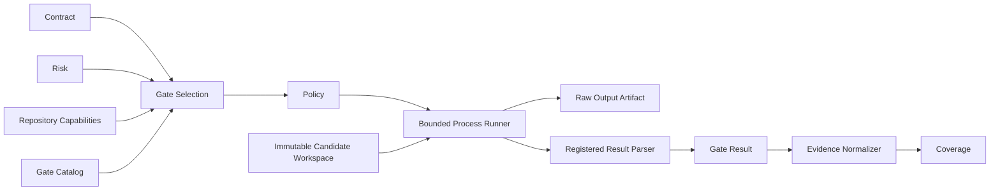
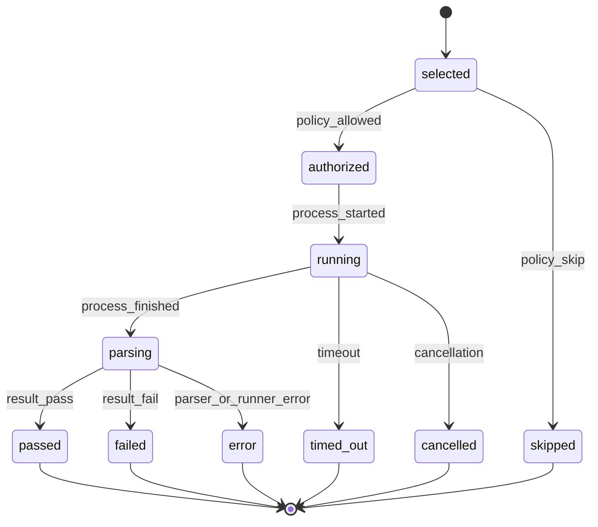
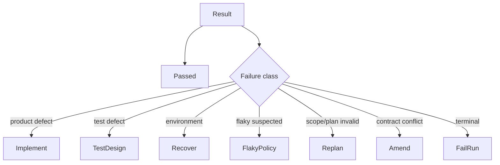

# zForge v2 Quality Gates

## Status

Normative design draft for deterministic quality-gate definitions, selection,
execution, parsing, evidence, reuse, baselines, flaky behavior, and aggregation.

Related documents:

- [Product Direction](./product-direction.md)
- [Fleet and Human Attention](./fleet-and-human-attention.md)
- [Artifacts and Traceability](./artifacts-and-traceability.md)
- [Execution DAG](./execution-dag.md)
- [Policy and Risk](./policy-and-risk.md)
- [Configuration](./configuration.md)
- [Workspace and Git](./workspace-and-git.md)
- [Errors and Recovery](./errors-and-recovery.md)

## Objective

Make verification reproducible and machine-enforceable so successful execution
means more than an agent claim or a single arbitrary command returning zero.

Gate rigor is selected to protect accepted outcome quality. It cannot be reduced
to save human attention, cost, or elapsed time. Fleet throughput does not alter a
task's mandatory gates, and integrated changes receive fresh integration evidence.

## Boundary



Agents may propose commands or interpret failures, but only registered,
policy-authorized gates produce authoritative deterministic gate results.

## Gate Definition

```yaml
schema_version: 2
record_type: gate_definition
record_id: gate_01J...
revision: 2
status: active
gate_id: unit-tests
category: unit_test
applies_when:
  language: rust
command:
  executable: cargo
  args:
    - test
  working_directory: .
environment:
  inherit: minimal
  allow_names:
    - RUST_BACKTRACE
timeout_seconds: 600
resources:
  network: false
  max_processes: 64
parser:
  id: cargo-test
  version: 2
success:
  exit_codes:
    - 0
input_dependencies:
  repository_tree: all_tracked
  configuration_refs:
    - Cargo.toml
    - Cargo.lock
artifacts:
  capture_stdout: true
  capture_stderr: true
  max_bytes: 10485760
created_at: 2026-08-25T00:00:00Z
created_by:
  actor_type: system
  actor_id: gate-registry
updated_at: 2026-08-25T00:00:00Z
content_hash: sha256:gate-definition...
provenance_refs: []
```

## Gate Categories

```text
format | lint | typecheck | build | unit_test | integration_test |
end_to_end | security | dependency | license | schema | compatibility |
migration | performance | accessibility | visual | local_environment_readiness |
custom_deterministic
```

Unknown categories cannot satisfy mandatory policy until registered.

## Command Safety

- Executable and arguments are separate arrays; shell interpretation is denied by default.
- Executable identity and allowed resolution path are policy-controlled.
- Working directory must resolve inside the leased workspace.
- Environment inheritance is minimal and allowlisted.
- Network, secret, filesystem, process, CPU, memory, and timeout grants are explicit.
- Gate commands cannot write outside permitted temporary/output paths.
- Git hooks, package scripts, or nested tools execute under the same grant boundary.
- Gate definitions are configuration, not trusted merely because they are in the repository.

## Gate Selection

Gate selection combines:

- task profile and contract evidence strategies;
- risk domains and required controls;
- changed paths, languages, frameworks, schemas, and deployables;
- repository capability declarations;
- parent/integration requirements;
- delivery target;
- policy-mandated gate groups.

Selection is deterministic and produces an explainable plan. Optional cost
optimization cannot remove mandatory gates.

## Gate Groups

```yaml
schema_version: 2
record_type: gate_group
record_id: gate_group_01J...
revision: 1
status: active
group_id: feature-default
members:
  - gate_ref: gate:format@2
    required: true
  - gate_ref: gate:lint@3
    required: true
  - gate_ref: gate:unit-tests@2
    required: true
aggregation: all_required_pass
execution:
  max_parallel: 2
  fail_fast: false
created_at: 2026-08-25T00:00:00Z
created_by:
  actor_type: system
  actor_id: gate-registry
updated_at: 2026-08-25T00:00:00Z
content_hash: sha256:gate-group...
provenance_refs: []
```

Fail-fast stops unnecessary commands but still records skipped gates with reason.
It never reports the group passed without all required results.

## Execution Lifecycle



Gate statuses align with result semantics:

```text
passed | failed | error | timed_out | cancelled | skipped
```

`error` means the gate could not produce a trustworthy result. It is never pass.

## Input Binding

Every gate result pins:

- repository base commit and candidate tree;
- relevant file subset when safely computable;
- gate definition and parser hashes;
- configuration snapshot;
- runtime/tool version and resolved executable identity;
- environment/platform facts affecting semantics;
- workspace lease and attempt;
- secret identities without values when needed.

Any material bound-input change invalidates the result.

## Result Parsing

Parsers are versioned deterministic components. They preserve raw stdout/stderr
artifacts and produce normalized counts, findings, locations, and reason codes.

Rules:

- Exit code interpretation is gate-definition-specific.
- Truncated output is explicit and may make parsing incomplete.
- Parser failure yields `error`, not an inferred result.
- Unknown output format fails closed for mandatory gates.
- Human-readable summaries cannot override normalized status.
- Findings have stable fingerprints where the tool permits.

## Gate Result

```yaml
schema_version: 2
record_type: gate_result
record_id: gate_result_01J...
revision: 1
status: passed
gate_result_id: gate_result_01J...
gate_definition_ref: gate:unit-tests@2
run_id: run_01J...
node_id: node_03J...
attempt_id: attempt_01J...
input_hashes:
  repository_tree: sha256:tree...
  gate_definition: sha256:gate...
  parser: sha256:parser...
  configuration: sha256:config...
runtime:
  executable: /verified/path/cargo
  tool_version: 1.92.0
  platform: aarch64-apple-darwin
exit_code: 0
started_at: 2026-08-25T01:11:00Z
ended_at: 2026-08-25T01:11:10Z
summary:
  total: 120
  passed: 120
  failed: 0
raw_output_artifact_refs:
  - artifact_01J...
finding_refs: []
evidence_refs:
  - evidence_01J...
created_at: 2026-08-25T01:11:10Z
created_by:
  actor_type: system
  actor_id: gate-runner
updated_at: 2026-08-25T01:11:10Z
content_hash: sha256:gate-result...
provenance_refs: []
```

## Evidence Production

A passing gate result becomes evidence only after:

- result schema and raw artifact hashes validate;
- exact evidence subject and strategy mapping exist;
- producer authority and input bindings validate;
- required environment and independence rules pass;
- contradiction and baseline rules are evaluated.

One gate may produce evidence for multiple criteria, but each claim is explicit.

## Baseline Comparison

Baseline-relative gates run comparable definitions on pinned base and candidate
trees. Findings are normalized into:

```text
pre_existing | fixed | introduced | changed | unknown
```

Comparability requires compatible tool, parser, configuration, environment, and
input scope. “No new failures” is not absolute pass unless the evidence strategy
allows baseline-relative proof.

## Flaky Gates

Flakiness is a recorded property supported by repeated observations, not a label
an agent can assign to dismiss failure.

Policy may allow bounded reruns with:

- same input hashes and environment;
- new gate result per execution;
- recorded seed/order/timing where available;
- configured pass rule such as all runs pass or statistical threshold;
- mandatory escalation for newly flaky critical tests.

Rerunning until one pass and hiding failures is prohibited.

## Quarantine

Quarantined checks remain visible. Quarantine records owner, reason, issue,
scope, created/expiry time, and compensating evidence. Expired quarantine blocks
completion. New failures cannot be auto-added to quarantine.

## Caching and Reuse

Gate reuse requires exact match of every declared input dependency, definition,
parser, tool/platform semantics, and validity period. Reuse records the original
result and a deterministic reuse decision.

Unknown dependency precision requires whole-tree binding. Cached absence or
cache lookup failure triggers execution, not pass.

## Network and External Gates

External CI, compatibility services, browsers, or local environment checks use adapters
with policy grants, idempotency, external identity, polling bounds, and snapshot
artifacts. Timeout may be `error` or external ambiguity, never assumed success.

## Performance Gates

Performance evidence declares hardware/environment, warmup, repetitions,
distribution, baseline, tolerance, and noise policy. A single timing without
environment identity is advisory only.

## Visual and Manual Gates

Visual, interaction, accessibility, or manual evidence uses approved capture and
observation schemas. Human observations require identity and exact scenario.
Agent visual judgment is semantic evidence and does not become deterministic
because it is formatted as a gate result.

## Correction Routing



Routing uses stable parser/error codes and policy, not free-form error text alone.

## Events

```text
gate_selected | gate_authorized | gate_started | gate_result_recorded |
gate_timed_out | gate_cancelled | gate_skipped | gate_result_reused |
gate_evidence_invalidated | flaky_gate_detected | quarantine_expired
```

## Failure Codes

```text
GATE_NOT_REGISTERED | GATE_NOT_APPLICABLE | GATE_POLICY_DENIED |
GATE_EXECUTABLE_MISSING | GATE_TIMEOUT | GATE_PROCESS_ERROR |
GATE_OUTPUT_TRUNCATED | GATE_PARSE_ERROR | GATE_RESULT_INCOMPLETE |
GATE_INPUT_STALE | GATE_BASELINE_INCOMPARABLE | GATE_FLAKY |
GATE_QUARANTINE_EXPIRED | GATE_EXTERNAL_AMBIGUOUS
```

## Rust Modules

```text
src/gate/
├── model.rs
├── registry.rs
├── select.rs
├── authorize.rs
├── runner.rs
├── parser.rs
├── normalize.rs
├── baseline.rs
├── flaky.rs
├── cache.rs
├── aggregate.rs
└── evidence.rs
```

## Testing Strategy

Tests cover command argument safety, environment allowlists, timeouts, process
groups, output limits, all statuses, parser failures, raw artifact preservation,
input hash invalidation, group aggregation, fail-fast, baseline comparison,
flaky rerun policy, quarantine expiry, cache reuse, external ambiguity,
performance environments, evidence mapping, and agent bypass attempts.

## Acceptance Criteria

- [ ] Mandatory gates are selected from contract, risk, policy, and repository facts.
- [ ] Gate commands execute under explicit bounded grants without shell injection.
- [ ] Every result pins exact inputs, tool, parser, and environment semantics.
- [ ] Parser or runner failure cannot become pass.
- [ ] Raw output is retained as hash-verified artifacts under retention policy.
- [ ] Baseline and candidate results are compared only when compatible.
- [ ] Flaky reruns preserve every result and cannot cherry-pick success.
- [ ] Cache reuse requires complete dependency-hash equivalence.
- [ ] Gate evidence maps explicitly to evidence strategies and criteria.
- [ ] Agents cannot override mandatory gate results.
- [ ] Batch and integration execution cannot weaken task-level mandatory gates.
- [ ] Integrated candidate trees receive the gates required by shared criteria and risk.

## Planning, Reviewer Cases and Local Test Evidence

Analysis-session gates may validate plan schemas, dependency acyclicity,
criterion coverage, scope, documentation impact and review evidence without a
run/node ID. They cannot count as implementation tests for unimplemented behavior.

For implementation, each readable case links a versioned `test_definition`
to criteria, actual test symbols and current `GateResult` evidence.
Observed case status is projected, never self-approved by an agent. Stale
evidence displays as not run with the invalidation reason. Missing required E2E
capability blocks acceptance; optional omitted cases remain visible limitations.

Environment-dependent gates pin the lease/profile, observed toolchain/image or
device/OS, fixture hashes and tested tree. Readiness/reset/teardown use registered
commands under explicit grants. No shared default database is acceptable for
concurrent tasks. Combined-tree integration and fresh reviewer replay receive
their own environment/evidence records.

Documentation impact is required for every contract. Where applicable, gates
check referenced documentation, links, examples and agreement with changed
interfaces/behavior. A justified not-applicable decision is permitted; boilerplate
documents per task are not required. See
[Development Handoff and Review](./delivery-and-review.md) and
[Project Onboarding and Local Testing](./project-onboarding-and-local-testing.md).
