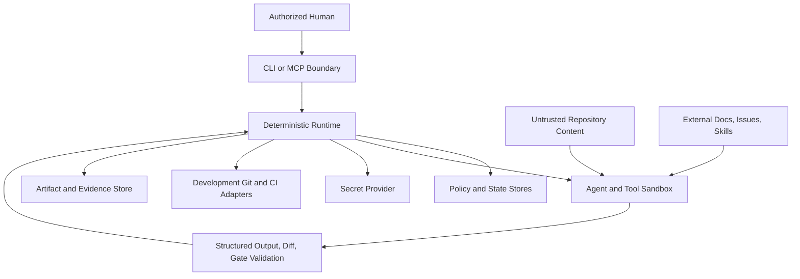
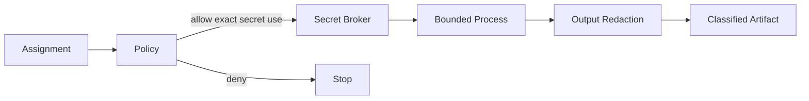
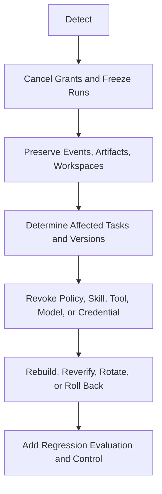

# zForge v2 Security Threat Model

## Status

Normative threat-model draft for zForge v2 autonomous engineering. It identifies
assets, actors, trust boundaries, abuse cases, controls, residual risk, security
verification, and incident response.

Related documents:

- [Product Direction](./product-direction.md)
- [Fleet and Human Attention](./fleet-and-human-attention.md)
- [Policy and Risk](./policy-and-risk.md)
- [Configuration](./configuration.md)
- [Automatic Model Routing](./model-routing.md)
- [Workspace and Git](./workspace-and-git.md)
- [Quality Gates](./quality-gates.md)
- [CLI and MCP](./cli-and-mcp.md)
- [Artifacts and Traceability](./artifacts-and-traceability.md)
- [Errors and Recovery](./errors-and-recovery.md)

## Security Objective

Allow bounded autonomous engineering while preserving code/repository integrity,
confidentiality, authority, evidence truth, availability, auditability, and safe
control of external side effects.

## Non-Goals

- Prove third-party models or tools are free of vulnerabilities.
- Make arbitrary untrusted code safe without OS/runtime isolation.
- Protect a host already fully controlled by an attacker.
- Treat sandboxing as the only control.
- Permit application deployment or production access/debugging, even with ordinary approval.

## Assets

| Asset | Security property |
|---|---|
| Source repositories and developer changes | Integrity, ownership, availability |
| Credentials, tokens, keys, and secret references | Confidentiality and scoped use |
| Contracts, policy, approvals, and configuration | Integrity, authenticity, provenance |
| Event streams and state | Integrity, order, non-repudiation |
| Artifacts, evidence, trace graph, bundles | Integrity, confidentiality, freshness |
| Workspaces, commits, branches, and delivery targets | Isolation and integrity |
| Agent/tool execution capability | Least privilege and containment |
| Budget and provider quotas | Availability and spend control |
| Human attention/approval channel | Authenticity and anti-confusion |
| Evaluation datasets/results | Integrity and contamination resistance |

## Actors

```text
authorized developer | organization administrator | policy administrator |
zForge deterministic runtime | agent/model provider | local tool/process |
external development Git/CI system | malicious repository contributor |
malicious dependency/skill/plugin | compromised external service |
unauthorized local or remote caller
```

Agents and model providers are never trusted authority, even when operated by an
authorized user.

## Trust Boundaries



Crossing a boundary requires validation, minimal authority, and audit.

## Primary Threat Assumptions

- Repository files, issues, docs, tests, build scripts, and generated output may
  contain malicious instructions or code.
- Agent output may be wrong, adversarially influenced, or intentionally deceptive.
- Skills, plugins, model providers, package registries, and external adapters may
  be compromised.
- Local processes may race or tamper with mutable workspaces.
- Network operations may time out after success.
- Human reviewers can be confused by misleading summaries.
- Logs and artifacts can accidentally contain secrets.

## Threat Categories

The model uses STRIDE-style categories plus model-specific threats:

```text
spoofing | tampering | repudiation | information_disclosure |
denial_of_service | elevation_of_privilege | prompt_injection |
evidence_forgery | supply_chain | unsafe_autonomy
```

## Threat Register

| ID | Threat | Main controls | Residual concern |
|---|---|---|---|
| T01 | Repository prompt injection directs agent to ignore policy | Treat content as untrusted data, bounded role prompts, deterministic policy | Model may still produce poor output; validation must catch effects |
| T02 | Agent requests or accesses excess files/network/secrets | Exact assignment grants, sandbox, path/host allowlists, audit | OS/tool isolation defects |
| T03 | Path traversal or symlink escapes workspace | Canonical path checks, no-follow defaults, isolated worktree | Platform-specific filesystem behavior |
| T04 | Agent edits developer/unrelated changes | Separate worktree, scoped diff reconciliation, explicit staging | Shared external generators/resources |
| T05 | Malicious build/test script executes code | Gate policy, process sandbox, network/secret denial, resource limits | Supported builds may require broad execution |
| T06 | Agent forges pass/evidence/review | Deterministic gates, immutable artifacts, typed trace, independent review | Semantic criteria may still need judgment |
| T07 | Agent self-approves or impersonates human | Trusted transport identity, actor restrictions, input-bound approvals | Compromised human session |
| T08 | Policy/config tampering weakens controls | Restrictive precedence, hashes, signatures/trust, pinned snapshots | Authorized admin error |
| T09 | Event/artifact history tampering | Hashes, sequence checks, protected store, append-only audit | Host administrator compromise |
| T10 | Secret leaks through prompts/logs/artifacts/errors | Secret references, redaction, context grants, protected artifacts | Model/provider retention and accidental transforms |
| T11 | Dependency/skill/plugin supply-chain compromise | Version/hash pinning, trust registry, review, isolation | Trusted upstream compromise |
| T12 | Unbounded retries exhaust budget/provider quota | Hard budgets, attempt/fingerprint limits, cancellation | Coordinated many-task exhaustion |
| T13 | External timeout causes duplicate PR/update/action | Idempotency, correlation IDs, authoritative reconciliation | Provider without idempotency/query support |
| T14 | Malicious MCP caller mutates state | Authentication, authorization, schemas, expected sequence | Compromised authenticated client |
| T15 | Misleading PR summary hides risk/findings | Generate from sealed bundle, show exceptions/findings | Human may not inspect referenced evidence |
| T16 | Parallel agents race shared files/contracts | Isolated worktrees, logical locks, integration node | Semantic conflicts undetected by path locks |
| T17 | Cached/stale gate evidence accepted | Exact input binding and invalidation | Incomplete dependency declaration |
| T18 | Cleanup deletes broad or wrong path | Exact lease identity, canonical root checks, safe retention workflow | Filesystem identity race |
| T19 | Evaluation gaming or dataset leakage | Hidden sets, dataset provenance, independent scoring | Model pretraining contamination |
| T20 | Autonomous delivery exceeds intended boundary | Typed action policy, human approval, exact commit bundle | Misconfigured authority policy |
| T21 | Poisoned or stale product context influences many tasks | Pinned context snapshots, trust, staleness/conflict checks, governed updates | Trusted source may still be wrong |
| T22 | Consolidated decision broadens one answer or approval across non-equivalent tasks | Semantic deduplication key, affected-contract hashes, per-task policy validation | Similar wording can hide different impact |
| T23 | Fleet concurrency amplifies one unsafe assumption or shared-resource defect | Task isolation, dependency analysis, conservative scheduling, batch cancellation | Correlated failures may remain |
| T24 | Poisoned catalog or evaluation telemetry promotes an unsafe/weak model | Trusted catalog sources, evaluator integrity, immutable snapshots, minimum samples, regression gates | Trusted measurements may still be biased |
| T25 | Task or repository text manipulates complexity/capability classification to influence routing | Deterministic compilation, trusted risk/policy inputs, bounded agent recommendations | Semantic task complexity remains imperfect |
| T26 | Model aliases bypass reviewer/provider independence | Resolve provider, model, and family identities before policy checks | Providers may not disclose shared lineage fully |

## Prompt Injection

Untrusted text is always labeled with source/provenance and placed in delimited
context. Runtime instructions, policy, tool grants, and output schemas remain
separate from repository/external content.

Controls:

- agents cannot alter system/role policy through output;
- tools enforce grants regardless of prompt text;
- retrieved content cannot introduce new tools or permissions;
- external instructions are treated as claims to analyze, not commands;
- output is schema-validated and actual effects independently reconciled;
- high-risk actions require deterministic/human authority outside the model.

Prompt injection remains possible at the model-behavior level; containment and
effect validation are mandatory even when prompting defenses improve.

## Tool and Process Execution

- No generic unrestricted shell tool for autonomous assignments.
- Registered commands use executable/argument arrays and verified working roots.
- Process groups, timeouts, environment allowlists, file/network/secret grants,
  output limits, and resource quotas are enforced outside the agent.
- Child processes inherit no broader authority than the parent assignment.
- Tool exit or output cannot directly advance state.
- OS sandboxing is defense in depth, not a replacement for policy and reconciliation.

## Filesystem and Git Integrity

The workspace-and-Git specification controls base identity, isolation, symlinks,
actual diff, manifests, explicit staging, commits, integration, delivery identity,
and cleanup. Destructive actions on broad/unresolved paths are prohibited.

## Secret Handling



- Secrets are resolved just in time through a broker/provider.
- Secret values do not enter config snapshots, prompts by default, state, events,
  command history, normal logs, or evidence bundles.
- Grants specify secret identity, consumer, purpose, duration, and operation.
- Redaction occurs before persistence, but output containing secrets is rejected or
  protected because redaction may be incomplete.
- Agent-visible secrets require exceptional explicit policy and isolation.

## Identity, Authentication, and Approval

Trusted identity originates from local OS/session or authenticated remote
transport and maps to configured principals. Payload actor fields cannot override it.

Approval is exact-action, input-hash, scope, and expiry bound. Confirmation prompts
do not replace authentication. Agents and agent invocations are ineligible human approvers.

## Policy and Configuration Integrity

- Built-in non-overridable rules are compiled with the runtime.
- Managed policies/configs use authenticated distribution when remote.
- Every run pins hashes and source trust.
- Unknown fields/versions fail closed.
- Local project content cannot redefine protected rule namespaces.
- Model catalogs, quality evidence, and routing policies have explicit trust,
  version, hash, and update authority.
- A catalog entry or adapter probe does not grant model eligibility without
  deterministic policy validation.
- Emergency revocation blocks new uses and triggers reconciliation.

## Artifact, Evidence, and Event Integrity

- Content/artifact/record hashes use canonical rules.
- Event streams enforce sequence, idempotency, and append-only semantics.
- Artifacts are read back after storage before publication.
- Evidence binds exact subjects and input hashes.
- Sealed bundles pin all record/artifact identities.
- Protected stores deny agent workspace write access.
- Integrity failure blocks state advancement and creates an incident record.

## Supply Chain

Applies to agents, models, skills, plugins, binaries, packages, gate tools,
containers, prompts, schemas, and adapters.

Controls include:

- stable identity, version, content hash, source, and trust classification;
- explicit install/update workflow;
- signature/attestation verification when available;
- dependency and vulnerability review;
- isolation for untrusted code;
- lockfiles and immutable resolution for runs;
- rollback and revocation of compromised versions;
- no automatic trust merely because content is local or popular.

## Network Security

Network is denied by default for agent and gate processes. Grants specify host,
port/protocol, method/action, data classification, and duration. DNS resolution,
redirects, proxies, private/link-local addresses, and TLS validation follow policy
to reduce SSRF and exfiltration paths.

Responses are size/time bounded and treated as untrusted artifacts.

## Denial of Service and Cost Abuse

Controls:

- project/run/node concurrency limits;
- process CPU/memory/time/output/file limits;
- token and hard monetary budgets;
- retry/fingerprint limits and persisted backoff;
- artifact quotas and retention;
- MCP rate limiting and pagination;
- circuit breakers for failing providers/adapters;
- cancellation that releases scarce resources.

Cleanup, accounting, and reconciliation remain permitted after hard budget exhaustion.

## External Side Effects

Push, PR, merge, local recovery, issue updates, and knowledge proposals are typed
protected actions. They require policy, exact target/request hash, idempotency,
verified result, and human authority where configured. Ambiguous outcomes stop
automatic repetition.

## Human-Factor Threats

Approval and review interfaces MUST resist confusion:

- show exact action, target, diff/commit, scope, risk, cost, evidence, and expiry;
- distinguish technical evidence from approval/attestation;
- display unresolved findings and exceptions prominently;
- avoid defaulting destructive/high-risk decisions to approve;
- prevent Unicode/control-character spoofing in identities and paths;
- keep denial and safe alternatives clear.

## Security Profiles

```text
local_trusted_repo | local_untrusted_repo | organization_managed |
high_risk_isolated | analyze_only
```

Profiles select minimum isolation and network/secret behavior. Repository risk can
raise the profile but cannot lower organization minimums.

## Security Events and Audit

Security-relevant events include denied grants, path escapes, secret detections,
policy/config integrity failures, artifact hash mismatch, approval misuse,
unexpected network/process behavior, evidence forgery, repeated budget abuse,
and unsafe external ambiguity.

Audit records are protected from agent writes, time/identity stamped, correlated
to task/run/assignment, and retained by security policy.

## Incident Response



Incident response must not destroy evidence during containment. Credential
rotation and external coordination require explicit authority.

## Residual Risk

Key residual risks:

- model behavior can remain deceptive or low quality;
- semantic correctness cannot always be deterministically proven;
- local OS/runtime isolation may have defects;
- trusted tools/dependencies/providers may be compromised;
- incomplete dependency declarations can allow stale evidence reuse;
- authorized humans/admins can make unsafe decisions;
- external systems may lack reliable idempotency or audit APIs.

Residual risk determines supported autonomy levels and human supervision.

## Security Verification

Required security tests include:

- repository/external prompt-injection suites;
- filesystem traversal, symlink, case, mount, and cleanup attacks;
- command/argument/environment injection;
- network SSRF, redirect, DNS, and exfiltration attempts;
- secret insertion into prompts, logs, artifacts, errors, and bundles;
- forged approval/identity/policy/config/event/evidence records;
- malicious skill/plugin/gate/parser packages;
- concurrent workspace and event-store races;
- stale evidence and bundle tampering;
- MCP authentication, rate-limit, cursor, and confused-deputy attacks;
- external side-effect timeout and duplicate prevention;
- cost/retry/resource exhaustion;
- context poisoning and stale canonical-knowledge propagation;
- Decision Inbox deduplication and cross-task approval widening;
- correlated batch failure and cancellation containment;
- incident containment and revocation.

## Threat Review Triggers

Threat model review is required when adding a new tool capability, secret use,
network destination, sandbox/runtime, remote MCP transport, delivery adapter,
artifact backend, policy language feature, plugin/skill source, local-environment action,
model-catalog source, automatic-routing policy, runtime-agent adapter, or trust
boundary.

## Acceptance Criteria

- [ ] All assets, actors, boundaries, and protected actions have explicit owners.
- [ ] Repository, external, agent, and plugin content is untrusted by default.
- [ ] Agents cannot grant authority or write authoritative state/evidence directly.
- [ ] Filesystem, process, network, secret, and Git effects are least-privileged.
- [ ] Approval identity and scope cannot be supplied by untrusted payloads.
- [ ] Integrity failures stop state advancement and preserve incident evidence.
- [ ] External ambiguity cannot cause blind duplicate actions.
- [ ] Resource and cost exhaustion are bounded.
- [ ] Context and consolidated decisions cannot silently broaden trust or authority across tasks.
- [ ] Repository content cannot grant model eligibility or alter routing policy.
- [ ] Resolved model-family identity is used for required reviewer independence.
- [ ] Security controls have adversarial regression tests.
- [ ] Residual risk is explicit and used to cap autonomy.

## Local-Test and Indirect-Release Boundary

Threat fixtures must attempt shared-database/port collisions, cross-task volume
cleanup, device misallocation, unsafe test-script execution and production access
through allowed-looking Git/CI operations. Deny application release and all
production access, not only direct deployment commands. Adapter enforcement
matrices must distinguish prevention, detection-after-execution and unsupported
controls. Unsupported mandatory prevention blocks eligibility.
