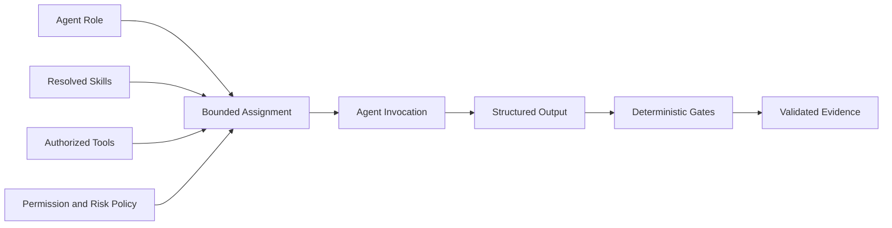
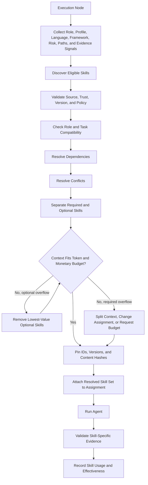
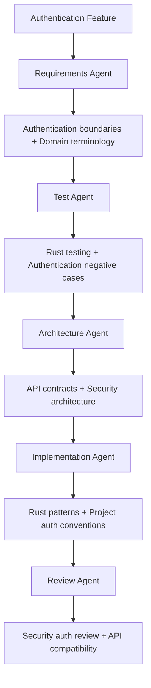
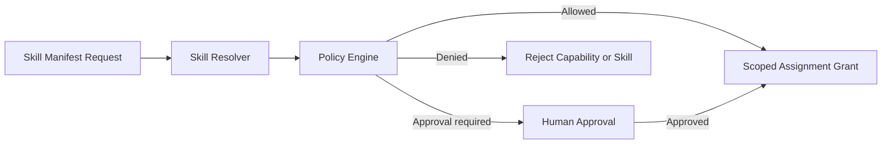
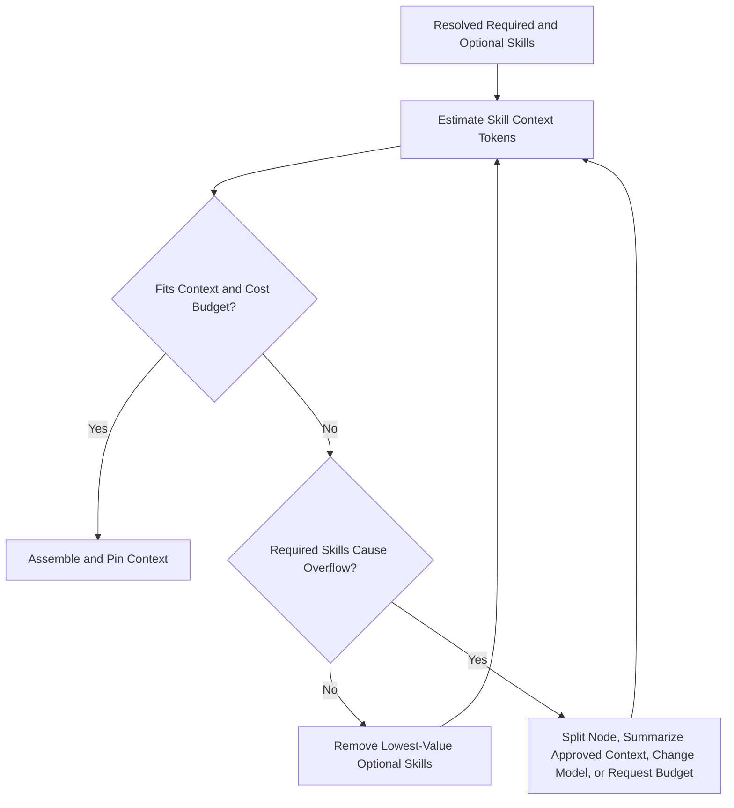
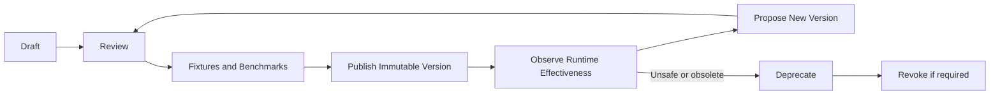

# zForge v2 Skills

## Status

This document defines the skill architecture for zForge v2.

Related documents:

- [Product Direction](./product-direction.md)
- [zForge v2 Autonomous Flow](./flow.md)
- [Agents and Subagents](./agents.md)
- [Deterministic Runtime](./deterministic-runtime.md)
- [Agent Token and Cost Accounting](./cost.md)
- [Data Model](./data-model.md)
- [State and Events](./state-and-events.md)
- [Artifacts and Traceability](./artifacts-and-traceability.md)
- [Policy and Risk](./policy-and-risk.md)
- [Configuration](./configuration.md)
- [Security Threat Model](./security-threat-model.md)
- [Evaluation](./evaluation.md)

## Objective

Provide versioned, composable, policy-controlled packages of engineering methodology and domain knowledge that can be attached to bounded agent assignments without granting permissions, controlling global state, or replacing deterministic quality gates.

Skills must:

- be selected from task, role, language, framework, risk, path, and evidence signals;
- declare compatibility, dependencies, conflicts, required inputs, and expected evidence;
- be pinned by version and content hash for every invocation;
- contribute only the context required by the assigned node;
- remain within token and monetary budgets;
- produce measurable value through evidence and evaluation;
- prefer expected accepted quality and reduced human intervention over minimal context cost;
- never authorize their own tools, permissions, budget, or delivery actions.

## Conceptual Boundary

| Concept | Responsibility |
|---|---|
| Agent role | Who owns the engineering responsibility |
| Skill | Which methodology or specialized knowledge the role applies |
| Tool | Which inspection or operation capability is available |
| Gate | Which deterministic result must pass |
| Policy | Which actions, permissions, and rigor are required or allowed |
| Memory | Which scoped project knowledge was learned from prior evidence |



A skill tells an agent how to approach a specialized responsibility. It does not decide whether the agent may perform an action or whether the result passes.

## Skill Taxonomy

## Language Skills

Language skills define idioms, error-handling conventions, testing patterns, ecosystem risks, and implementation constraints.

Examples:

- `rust-patterns`;
- `rust-testing`;
- `go-patterns`;
- `go-testing`;
- `typescript-patterns`;
- `typescript-testing`;
- `python-patterns`;
- `python-testing`;
- `ios-patterns`;
- `android-patterns`;
- `flutter-patterns`.

Activation signals:

- repository language;
- component language;
- affected file extensions;
- build and test profile;
- execution-node language override.

## Framework Skills

Framework skills provide conventions and failure patterns specific to a framework or platform.

Examples:

- `react-patterns`;
- `react-state-data`;
- `frontend-testing`;
- `android-compose-ui`;
- `android-instrumented-testing`;
- `ios-ui`;
- `ios-snapshot-accessibility`;
- `flutter-ui`;
- framework-specific routing, persistence, or background-work patterns.

Activation signals:

- dependency manifests;
- imported packages;
- affected paths;
- component metadata;
- execution-node framework tags.

## Domain Skills

Domain skills define terminology, invariants, compatibility rules, and common failure modes for an engineering domain.

Examples:

- `api-contracts`;
- `database-migrations`;
- `background-jobs`;
- `observability`;
- `authentication`;
- `authorization`;
- `cryptography`;
- `file-storage`;
- `payments`;
- `multi-tenancy`.

Domain skills may apply to requirements, architecture, tests, implementation, diagnosis, review, and integration roles with different role-specific instructions.

## Risk Review Skills

Risk review skills add specialized analysis and evidence requirements when task risk activates them.

Examples:

- `security-auth-review`;
- `security-input-review`;
- `api-compatibility-review`;
- `database-migration-review`;
- `privacy-review`;
- `performance-review`;
- `accessibility-review`;
- `local-environment-readiness-review`.

Risk review skills must define:

- risk triggers;
- trust or system boundaries to inspect;
- required negative cases;
- required deterministic gates;
- specialist finding schema additions;
- severity calibration;
- evidence needed for a clean result.

## Verification Skills

Verification skills guide how evidence should be designed, generated, and interpreted. The gate runner remains responsible for executing commands and deciding pass or fail.

Examples:

- `property-based-testing`;
- `fuzz-testing`;
- `mutation-testing`;
- `performance-benchmarking`;
- `visual-regression`;
- `accessibility-testing`;
- `migration-validation`;
- `contract-testing`;
- `flaky-test-analysis`.

## Research Skills

Research skills define repeatable methods for answering bounded technical questions.

Examples:

- `rfc-analysis`;
- `library-evaluation`;
- `architecture-comparison`;
- `benchmark-design`;
- `prototype-safety`;
- `interoperability-research`.

Research skills must require explicit sources, evidence, limitations, and decision criteria.

## Project Skills

Project skills capture reviewed repository-specific methodology and conventions.

Examples:

- architecture boundaries;
- service ownership;
- error-handling conventions;
- API and schema rules;
- test fixture conventions;
- local environment and recovery conventions;
- repository-specific security boundaries;
- approved implementation patterns;
- prohibited anti-patterns.

Project skills require explicit scope, provenance, owner, version, and review status.

## Skill Package

Each skill is a self-contained package.

```text
skills/v2/security-auth-review/
├── skill.yaml
├── SKILL.md
├── schemas/
│   └── findings.schema.json
├── references/
│   ├── threat-boundaries.md
│   └── negative-cases.md
├── examples/
│   ├── valid-output.yaml
│   └── invalid-output.yaml
└── tests/
    └── fixtures.yaml
```

Package responsibilities:

| Resource | Responsibility |
|---|---|
| `skill.yaml` | Machine-readable identity, triggers, compatibility, policy metadata, and evidence contract |
| `SKILL.md` | Agent-facing methodology and checklist |
| `schemas/` | Structured output extensions owned by the skill |
| `references/` | Focused supporting context selected through routing rules |
| `examples/` | Valid and invalid behavior examples |
| `tests/` | Resolver, schema, trigger, conflict, and benchmark fixtures |

Optional directories are included only when needed.

## Skill Manifest

Example:

```yaml
schema_version: 2
id: security-auth-review
version: 1.2.0
description: Review authentication, session, and credential changes

source:
  type: organization
  owner: security-team
  provenance: reviewed-security-standard

applies_to:
  roles:
    - architecture
    - test
    - review
  task_profiles:
    - feature
    - fixbug

triggers:
  risk_tags:
    - authentication
    - session
    - credentials
  path_patterns:
    - "**/auth/**"
    - "**/session/**"
  contract_terms:
    - login
    - token
    - identity-provider

requires:
  skills: []
  inputs:
    - contract
    - traceability
    - final_diff
    - gate_evidence

conflicts_with: []

outputs:
  schema_extension: security-findings-v2

required_evidence:
  - trust_boundaries
  - authentication_flows
  - negative_authorization_tests

recommended_tools:
  - codegraph.read

requested_permissions:
  filesystem: read_only
  network: denied
  secrets: denied

context:
  estimated_tokens: 1800
  cacheable: true
  references:
    - references/threat-boundaries.md
    - references/negative-cases.md
```

Manifest fields are validated before a skill becomes eligible for selection.

## Agent-Facing Instructions

`SKILL.md` contains methodology rather than runtime authority.

Recommended sections:

- purpose;
- applicability;
- required inputs;
- analysis method;
- checklist;
- evidence expectations;
- finding calibration;
- common failure patterns;
- prohibited reasoning shortcuts;
- structured-output guidance.

`SKILL.md` must not claim authority to:

- advance task or node state;
- approve artifacts;
- increase budget;
- reduce risk classification;
- grant filesystem, network, or secret access;
- expand write scope;
- stage, commit, push, merge, deploy, or rollback;
- override deterministic gate results.

## Skill Registry

The registry indexes available skill packages by:

- ID and version;
- source and owner;
- supported roles;
- task profiles;
- languages and frameworks;
- risk and domain tags;
- path and contract triggers;
- required inputs;
- evidence outputs;
- dependency and conflict metadata;
- estimated context cost;
- trust and review status.

Registry reads are immutable for a task run. Selected skills are pinned into the assignment.

## Skill Resolution Flow



The resolver is deterministic. An agent may request an additional skill, but the resolver and policy engine decide whether it is compatible, affordable, and allowed.

Required quality, risk, and evidence skills are resolved before optional cost or
latency optimization. A skill that measurably reduces correction or human
intervention MAY be retained even when a cheaper invocation would fit.

## Selection Signals

The resolver considers:

- assigned role;
- task profile;
- risk classification;
- repository and component language;
- framework metadata;
- affected paths;
- contract terminology;
- acceptance criteria;
- plan-node type;
- required quality gates;
- parent and shared contracts;
- project and organization policy;
- available context window;
- remaining token and monetary budget;
- previously failed skill evidence requirements.

Example resolution input:

```yaml
node:
  id: implement-auth-callback
  role: implementation
  task_profile: feature
  language: rust
  frameworks: []
  risk_tags:
    - authentication
  paths:
    - src/auth/callback.rs
  required_evidence:
    - callback-validation-tests
```

Example result:

```yaml
resolved_skills:
  - id: rust-patterns
    version: 2.0.0
    content_hash: sha256:aaa...
    source: built-in
    required: true
  - id: authentication
    version: 1.3.0
    content_hash: sha256:bbb...
    source: organization
    required: true
  - id: project-auth-conventions
    version: 4.1.0
    content_hash: sha256:ccc...
    source: project
    required: true
```

## Activation by Role

| Role | Typical skill categories |
|---|---|
| Requirements | Domain terminology, API semantics, privacy classification, interoperability |
| Decomposition | Architecture boundaries, monorepo structure, service ownership |
| Architecture | API contracts, migration, background jobs, observability, local environment readiness |
| Test | Language testing, property testing, contract testing, accessibility, migration validation |
| Implementation | Language, framework, domain, and project-convention skills |
| Diagnostic | Runtime, domain, observability, and root-cause methodologies |
| Review | Risk review, compatibility, security, performance, privacy, and accessibility |
| Integration | API/schema compatibility, migration, cross-service integration, local environment readiness |
| Research | RFC analysis, benchmarking, library evaluation, interoperability research |
| Semantic judge | Decision rubric only; implementation skills are normally excluded |

## Role-Specific Skill Views

One skill package may expose different instructions by role without duplicating the entire package.

Example:

```yaml
role_views:
  requirements:
    instructions: sections/requirements.md
  architecture:
    instructions: sections/architecture.md
  test:
    instructions: sections/testing.md
  review:
    instructions: sections/review.md
```

Only the assigned role view and its required references are included in context.

## Example: Authentication Feature in Rust



The role graph remains unchanged when optional skills differ. Skills specialize a role; they do not become additional autonomous agents.

## Permission Boundary

Skill manifests may declare recommended tools and requested permissions. The policy engine independently evaluates those requests.



Rules:

- A skill cannot grant permissions.
- A skill cannot broaden an existing role's maximum authority.
- A project skill cannot weaken mandatory organization policy.
- Tool recommendations do not make tools available automatically.
- Secret and network access remain default-deny.
- State, budget, Git, delivery, and deterministic-gate control are unavailable to skills.

## Skill and Tool Separation

Example security review assignment:

```text
Role
  review

Skill
  security-auth-review
  Defines what and how to inspect

Tool
  codegraph.read
  Locates implementations and call sites

Gate
  security-scan
  Produces a deterministic result

Policy
  read-only, no secrets, no network
  Defines allowed actions
```

A skill must not embed arbitrary shell execution as a substitute for a registered tool or gate. Executable behavior is routed through deterministic runtime policy.

## Skill and Memory Separation

Skills are reviewed methodology packages. Memory is scoped knowledge learned from task evidence.

| Skill | Memory |
|---|---|
| Stable method or domain procedure | Repository or component knowledge |
| Versioned and maintained | Provenance, confidence, scope, and expiry |
| Evaluated against benchmark fixtures | Validated against source task evidence |
| Selected by compatibility and triggers | Selected by applicability and freshness |
| Changes through reviewed releases | Changes through evidence-backed updates |

Memory does not automatically become a skill. Promotion requires:

- repeated supporting evidence;
- clear scope and applicability;
- owner and review;
- versioned package creation;
- fixtures or benchmarks;
- conflict analysis;
- explicit approval.

## Versioning

Skill versions use semantic versioning:

- major: incompatible methodology, schema, or trigger change;
- minor: backward-compatible capability or evidence extension;
- patch: clarification or correction without contract change.

Every assignment pins:

```yaml
skills:
  - id: security-auth-review
    version: 1.2.0
    content_hash: sha256:abc...
    source: organization
```

Updating the registry does not change a running or historical assignment.

## Source Precedence

Skill sources may include:

```text
Built-in
Organization
Project
Task-approved overlay
```

Precedence is not unrestricted replacement. A higher-priority local source may specialize or strengthen behavior but cannot weaken mandatory policy, remove required evidence, or impersonate a protected skill ID.

Resolution records:

- selected source;
- shadowed candidates;
- compatibility decision;
- policy constraints;
- final version and hash.

## Dependencies

Example:

```yaml
id: database-migration-review
requires:
  skills:
    - id: database-schema-analysis
      version: ">=2.0.0,<3.0.0"
```

Dependency rules:

- cycles are rejected;
- all required versions must be compatible;
- dependency context is deduplicated;
- transitive permissions are not inherited automatically;
- each dependency remains visible in assignment and telemetry;
- failure to resolve a required dependency blocks the assignment.

## Conflicts

Example:

```yaml
id: database-migration-review
conflicts_with:
  - id: no-database-access-assumption
    reason: Migration review requires database schema evidence
```

Conflict outcomes:

- choose the policy-required skill;
- replace an optional skill;
- split the assignment;
- request human resolution;
- block execution.

The agent does not resolve skill conflicts through prompt reasoning.

## Structured Evidence

A skill may extend a role's output schema.

Example:

```yaml
skill_evidence:
  security-auth-review:
    trust_boundaries:
      - browser_to_gateway
      - gateway_to_identity_provider
    negative_cases:
      - expired_state_rejected
      - callback_origin_validated
    findings: []
    confidence: 0.94
```

Skill completion requires schema-valid evidence. A statement such as `skill applied successfully` is insufficient.

Required evidence maps into the task traceability graph and remains available to independent review and audit.

## Context Assembly

The context builder includes only:

- the selected role view;
- required methodology sections;
- referenced material needed for the current node;
- structured project conventions applicable to affected paths;
- eligible product and repository knowledge from the pinned context snapshot;
- output schema extension;
- evidence checklist.

It excludes:

- role views for other agents;
- unrelated languages and frameworks;
- optional references outside the node scope;
- superseded skill versions;
- untrusted or unreviewed package content;
- implementation guidance from review-only skills when independence would be weakened.

## Token and Cost Accounting

Every invocation records skill context contribution:

```yaml
skill_usage:
  - id: rust-patterns
    version: 2.0.0
    content_hash: sha256:aaa...
    context_tokens: 900
    cache_status: read
  - id: security-auth-review
    version: 1.2.0
    content_hash: sha256:bbb...
    context_tokens: 1800
    cache_status: miss
```

Required cost behavior:

- skill context is included in invocation input-token accounting;
- stable content hashes support prompt-cache reuse;
- estimated context tokens participate in assignment forecasting;
- required skills reserve context and monetary budget before optional skills;
- optional skills may be removed only through resolver policy;
- mandatory security, privacy, compatibility, or migration skills cannot be dropped solely to reduce cost;
- reports expose cost by skill and role where provider data allows allocation.

## Context Budget Resolution



Summaries used to reduce context must reference the source skill version and preserve mandatory evidence requirements.

## Trust and Supply Chain

Skill packages are executable-context dependencies even when they contain no binary code. They require supply-chain controls.

Requirements:

- trusted source classification;
- owner and maintainer metadata;
- content hash;
- optional signature;
- immutable published versions;
- dependency lock;
- review status;
- vulnerability or malicious-instruction scanning;
- provenance for generated packages;
- explicit install and update policy;
- revocation and deprecation mechanism.

Untrusted external skill content cannot enter an autonomous assignment without policy approval and isolation.

## Governance Lifecycle



Lifecycle states:

- draft;
- reviewed;
- tested;
- published;
- deprecated;
- revoked.

Only published, policy-trusted versions are eligible for autonomous assignments.

## Skill Evaluation

Evaluation dimensions:

- trigger precision and recall;
- role compatibility accuracy;
- schema-valid output rate;
- required-evidence completion rate;
- finding precision and false-positive rate;
- defect detection and escape rate;
- retry reduction;
- accepted-outcome rate;
- token overhead;
- cost to accepted outcome;
- context-cache effectiveness;
- conflict and dependency failure rate;
- user override or disable rate.

Evaluation compares skill versions on fixed fixtures and representative task runs.

## Skill Telemetry

Each invocation records:

- resolved skill IDs, versions, sources, and hashes;
- trigger reasons;
- required or optional status;
- role view and references loaded;
- estimated and actual context tokens;
- cache status;
- evidence produced;
- findings accepted, rejected, or corrected;
- resolver conflicts and pruning decisions;
- skill-related validation failures;
- relevant benchmark and runtime outcome metrics.

Telemetry must not store secrets or unnecessary prompt content.

## Proposed Directory Layout

```text
templates/v2/skills/
├── language/
│   ├── rust-patterns/
│   ├── rust-testing/
│   ├── go-patterns/
│   └── typescript-testing/
├── framework/
│   ├── react-patterns/
│   └── android-compose-ui/
├── domain/
│   ├── api-contracts/
│   ├── database-migrations/
│   └── authentication/
├── risk/
│   ├── security-auth-review/
│   ├── privacy-review/
│   └── local-environment-readiness-review/
├── verification/
│   ├── property-based-testing/
│   ├── mutation-testing/
│   └── visual-regression/
├── research/
│   ├── rfc-analysis/
│   └── library-evaluation/
└── project/
    └── examples/
```

The physical layout may evolve, but every skill remains an independently versioned and validated package.

## Testing Strategy

Required tests:

- manifest parsing and schema validation;
- stable content hashing;
- role and task-profile compatibility;
- language, framework, risk, path, and contract triggers;
- dependency resolution and cycle detection;
- version-range compatibility;
- conflict resolution;
- required-versus-optional pruning;
- token and context-budget behavior;
- source precedence and protected-skill enforcement;
- permission non-escalation;
- output-schema extension validation;
- trust, signature, revocation, and deprecation behavior;
- context minimization;
- skill telemetry and cost attribution;
- benchmark fixtures for skill effectiveness;
- malicious or conflicting instruction handling.

## Acceptance Criteria

- [ ] Every skill is a versioned package with a valid manifest and agent-facing methodology.
- [ ] Skill, role, tool, gate, policy, and memory responsibilities remain separate.
- [ ] Skill resolution is deterministic and based on explicit task and node signals.
- [ ] Every selected skill is pinned by ID, version, source, and content hash.
- [ ] Required dependencies resolve without cycles before invocation.
- [ ] Conflicts are resolved by policy rather than agent reasoning.
- [ ] A skill cannot grant permissions, expand scope, increase budget, advance state, or perform delivery actions.
- [ ] Role-specific views minimize context without losing mandatory methodology.
- [ ] Skill-specific evidence is structured and validated.
- [ ] Required skills cannot be silently removed to reduce token cost.
- [ ] Skill optimization preserves protected quality and human-attention thresholds before cost.
- [ ] Skill context participates in forecasting, reservation, telemetry, and cost reporting.
- [ ] Only trusted published versions are eligible for autonomous assignments.
- [ ] Project skills cannot weaken protected organization requirements.
- [ ] Runtime telemetry can explain why each skill was selected and whether it improved the outcome.
- [ ] Skill versions are evaluated through fixtures, benchmarks, and observed task outcomes.
