# zForge v2 State and Events

## Status

This document is the normative design draft for zForge v2 lifecycle state,
domain events, transition guards, projections, concurrency, idempotency, and
recovery behavior.

Normative terms such as **MUST**, **MUST NOT**, **SHOULD**, and **MAY** describe
implementation requirements. The document remains a draft until explicitly
accepted.

Related documents:

- [Product Direction](./product-direction.md)
- [Fleet and Human Attention](./fleet-and-human-attention.md)
- [Data Model](./data-model.md)
- [Artifacts and Traceability](./artifacts-and-traceability.md)
- [Execution DAG](./execution-dag.md)
- [Policy and Risk](./policy-and-risk.md)
- [Errors and Recovery](./errors-and-recovery.md)
- [zForge v2 Autonomous Flow](./flow.md)
- [Deterministic Runtime](./deterministic-runtime.md)
- [Agents and Subagents](./agents.md)
- [Automatic Model Routing](./model-routing.md)
- [Agent Token and Cost Accounting](./cost.md)
- [Skills](./skills.md)

## Objective

Make every lifecycle change reproducible from immutable facts, prevent agents
or concurrent workers from advancing state without authority, and allow zForge
to recover deterministically after interruption or ambiguous external effects.

## Scope

This document defines:

- aggregate and event-stream boundaries;
- task, run, node, and attempt state machines;
- work-batch and batch-run coordination boundaries;
- event envelope and event catalog;
- model-routing decision facts required before assignment authorization;
- transition commands, guards, and required evidence;
- atomic append, idempotency, causation, and optimistic concurrency;
- projection and snapshot behavior;
- retry, correction, cancellation, invalidation, and resumption;
- parent and child task aggregation;
- external side-effect reconciliation;
- crash recovery, schema evolution, retention, and testing.

It does not define role prompts, skill contents, pricing formulas, or individual
record fields already specified by the data model.

## Core Principles

- Events record accepted facts, not requests or intentions that did not occur.
- Current state is derived by folding an ordered event stream.
- Commands request transitions; events confirm transitions.
- Only deterministic runtime components append authoritative events.
- Agent output is input to validation and policy, never an authoritative event.
- Every transition is guarded by expected state, authority, policy, and evidence.
- Append operations are atomic, idempotent, and concurrency-safe.
- Side effects are requested, executed, and reconciled as separate facts.
- Terminal history is immutable; corrections append compensating facts.
- Human-readable Markdown and UI labels are projections, not lifecycle truth.

## Terminology

| Term | Meaning |
|---|---|
| Aggregate | Consistency boundary whose state is derived from one event stream |
| Command | A request to evaluate and possibly perform a transition |
| Event | An immutable fact accepted by the deterministic state engine |
| Stream | Ordered events for one aggregate identity |
| Fold | Pure function that applies events to derive aggregate state |
| Guard | Deterministic precondition that must pass before an event is appended |
| Projection | Rebuildable read model derived from events and referenced records |
| Snapshot | Optional projection checkpoint at a known stream sequence |
| Causation | The prior event or command that directly caused an event |
| Correlation | Identity grouping events in one broader workflow |
| Compensation | New action that counteracts a prior fact without deleting history |

## State Ownership and Stream Boundaries

zForge uses separate aggregates because intake analysis may exist before an
execution plan or run exists.

| Stream type | Stream identity | Owns |
|---|---|---|
| `task` | task record ID | Intake, clarification, decomposition, contract readiness, aggregate completion |
| `run` | run ID | One pinned execution of an approved plan |
| `batch` | work-batch record ID | Batch revision, preflight, membership, decision summary, and aggregate outcome |
| `project` | project record ID | Project-wide configuration and administrative lifecycle events |

Execution node and attempt events live in the owning `run` stream. Before a
run exists, `AnalysisSession` and its attempt/gate/review/budget events live in
the owning project, task or batch stream with `analysis_session_ref` and no
`run_id`/`node_id`. They obey the same ordered append and authorization rules.
The ownership union is defined in [Data Model](./data-model.md).

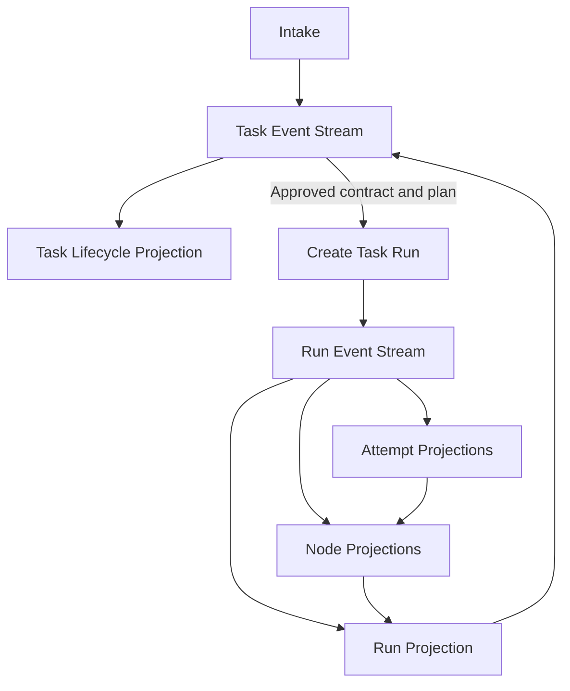

Rules:

- A task MAY exist without a run.
- Every run belongs to exactly one task and pins one plan revision.
- A task MAY have multiple historical runs but at most one delivery-mutating
  active run for the same target unless policy explicitly permits alternatives.
- Node and attempt identities are unique within their referenced plan and run.
- Cross-stream reactions append a new event to the target stream and retain the
  source event as causation; they do not mutate both streams implicitly.
- A batch references task and run summaries; it does not own or overwrite their
  lifecycle truth.
- A waiting batch item does not prevent unrelated ready items from progressing
  unless pinned batch policy requires an all-ready start.

## Serialized State Conventions

Machine values use lowercase `snake_case`. Documents and UI MAY render title
case labels such as `NeedsInput` for `needs_input`.

Unknown state values MUST fail closed. A reader that cannot interpret a state
or event schema version MUST stop state-changing work and report an upgrade
requirement.

Terminal states are:

- task: `completed`, `failed`, `cancelled`;
- run: `completed`, `failed`, `cancelled`;
- node: `passed`, `failed`, `skipped`, `cancelled`;
- attempt: `succeeded`, `failed`, `timed_out`, `cancelled`.

Terminal aggregates never transition back to an active state. A retry creates
a new attempt or run. Reopening a completed business outcome creates a new task
or an explicitly linked follow-up task.

State diagrams show the primary success, correction, wait, and terminal paths.
The transition guards and common terminal rules are authoritative for active
states not repeated as individual diagram arrows.

## Domain Event Envelope

Every event uses the envelope below. Payload schemas are selected by
`event_type` and `event_version`.

```yaml
schema_version: 2
record_type: domain_event
event_id: event_01J...
stream:
  type: run
  id: run_01J...
sequence: 42
aggregate_version: 42
project_id: project_01J...
task_id: SSO-102
run_id: run_01J...
node_id: node_02J...
attempt_id: attempt_01J...
event_type: node_passed
event_version: 1
occurred_at: 2026-08-25T01:11:10Z
recorded_at: 2026-08-25T01:11:10Z
actor:
  actor_type: system
  actor_id: state-engine
payload:
  from_state: running
  to_state: passed
  evidence_refs:
    - evidence_01J...
causation:
  event_id: event_00J...
  command_id: command_01J...
correlation_id: run_01J...
idempotency_key: run_01J:node_02J:attempt_01J:passed
policy_decision_refs:
  - policy_01J...
content_hash: sha256:event...
```

Envelope rules:

- `event_id` MUST be globally unique.
- `stream.type` and `stream.id` MUST select one existing aggregate.
- `sequence` MUST be contiguous and begin at `1` within a stream.
- `aggregate_version` MUST equal `sequence` in the initial implementation.
- `task_id` is required for task and run streams.
- `run_id` is required for run streams and prohibited for task events before a
  run exists.
- `node_id` and `attempt_id` are present only when the event concerns them.
- `event_version` versions the payload independently from the envelope schema.
- `occurred_at` is the domain time; `recorded_at` is durable append time.
- `recorded_at` MUST NOT precede `occurred_at` beyond configured clock-skew
  tolerance.
- `idempotency_key` MUST be unique within a stream.
- Reuse of an idempotency key with different canonical command input MUST fail.
- Causation chains MUST be acyclic.
- Event content is canonically hashed according to the data model.

## Command Envelope

Commands are durable only when required for a queue or inbox. They are not
facts and are not replayed as lifecycle history.

```yaml
schema_version: 2
record_type: state_command
command_id: command_01J...
command_type: pass_node
target_stream:
  type: run
  id: run_01J...
expected_sequence: 41
actor:
  actor_type: system
  actor_id: scheduler
requested_at: 2026-08-25T01:11:10Z
idempotency_key: run_01J:node_02J:attempt_01J:pass-command
input_hash: sha256:command-input...
payload:
  node_id: node_02J...
  attempt_id: attempt_01J...
  evidence_refs:
    - evidence_01J...
```

Command handling is conceptually:

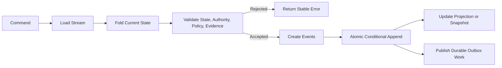

The decision function MUST be deterministic for the same current state,
command, pinned policy, and referenced record hashes.

## Task Lifecycle State Machine

Task lifecycle covers intake through final outcome, including work before an
execution run exists.

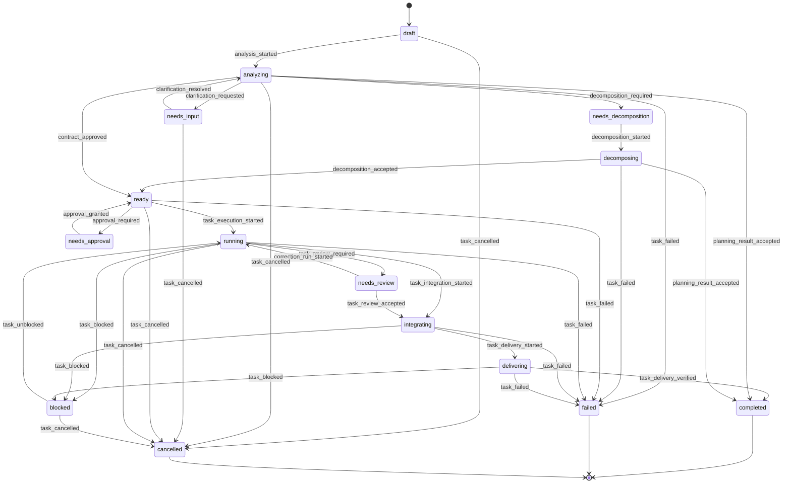

### Task State Semantics

| State | Meaning | Required condition to enter |
|---|---|---|
| `draft` | Intake exists but analysis has not started | Valid task and provenance records |
| `analyzing` | Requirements, size, or risk analysis is active | Analysis ownership acquired |
| `needs_input` | Blocking ambiguity requires external input | Open blocking question references |
| `needs_decomposition` | Outcome exceeds executable-task policy | Size decision and decomposition reason |
| `decomposing` | Parent and child graph are being prepared | Authorized decomposition assignment |
| `ready` | Approved contract, risk, and executable path exist | Pinned approved records and no blocker |
| `needs_approval` | Required authority is pending | Active approval request |
| `running` | One or more execution runs or child tasks are active | Valid run or child execution reference |
| `needs_review` | Deterministic evidence exists and review is required | Review requirement and evidence set |
| `integrating` | Child outputs or final change are being integrated | Integration plan and required child state |
| `delivering` | Authorized delivery operation is active | Accepted evidence bundle and delivery grant |
| `blocked` | Work cannot progress without an external condition | Stable blocker code and resumption condition |
| `completed` | Task outcome and configured delivery boundary are satisfied | Completion policy and required evidence pass |
| `failed` | Unrecoverable task outcome | Terminal error and failure decision |
| `cancelled` | Authorized cancellation completed | Cancellation cleanup and authority recorded |

`running_children` and `verifying` MAY be exposed as derived task substates.
They are not additional persisted primary states.

### Task Transition Guards

| Transition | Mandatory guards |
|---|---|
| `draft -> analyzing` | Intake provenance is present |
| `analyzing -> needs_input` | At least one unresolved blocking question exists |
| `needs_input -> analyzing` | Required answers are recorded or question is explicitly withdrawn |
| `analyzing -> needs_decomposition` | Deterministic size policy or approved recommendation requires decomposition |
| `decomposing -> ready` | Parent contract and acyclic child graph are approved |
| `analyzing -> ready` | Contract and risk revisions are accepted; no blocking ambiguity remains |
| `analyzing/decomposing -> completed` | Plan-only contract authorized; planning gates/review pass; review package and continuation are valid; no implementation completion claimed |
| `ready -> needs_approval` | Policy decision is `require_approval` |
| `needs_approval -> ready` | Approval is valid, scoped, unexpired, and converted to policy authority |
| `ready -> running` | Run pins exact approved inputs, budget, and execution plan |
| `running -> needs_review` | Required gates pass and review policy requires review |
| `needs_review -> integrating` | Review accepted and mandatory findings are resolved |
| `integrating -> delivering` | Parent criteria and integration evidence are complete |
| `delivering -> completed` | Configured local or external delivery boundary is verified |
| `* -> blocked` | Blocker is not representable as input, approval, retry, or terminal failure |
| `blocked -> running` | Exact recorded resumption condition is satisfied |
| `* -> failed` | Retry/correction policy exhausted or terminal decision exists |
| `* -> cancelled` | Authorized cancellation and required cleanup complete |

## Analysis Session Lifecycle

Session states are `created | running | waiting_input | waiting_approval |
blocked | completed | failed | cancelled`.

| Event | Transition | Required guard/payload |
|---|---|---|
| `analysis_session_created` | absent -> created | Owner, purpose, pinned context/config/policy, risk floor and finite budget |
| `analysis_session_started` | created -> running | Scoped grants and resource readiness |
| `analysis_session_waited` | running -> waiting_input/waiting_approval/blocked | Typed condition and affected work |
| `analysis_session_resumed` | waiting/blocked -> running | Condition satisfied and pinned inputs revalidated |
| `analysis_session_completed` | running -> completed | Required outputs, gates and review accepted; resources reconciled |
| `analysis_session_failed` | active -> failed | Terminal error and reconciled resources |
| `analysis_session_cancelled` | active -> cancelled | Authority, process termination, budget/resource reconciliation |
| `planning_result_accepted` | task analyzing/decomposing -> completed | Authorized plan-only scope, accepted planning package, evidence and continuation |

`analysis_session_created` precedes the first attempt. Task
`analysis_started` references the session, not a nonexistent analyzer assignment.
Individual actions use the attempt machine below; their ordinal is scoped to
session/action. An agent is routed before every spawn. Session events alone do
not advance task completion; `planning_result_accepted` is separately guarded.
Plan-only output with allowed open questions labels affected child tasks not ready.

For `through_phase`, existing execution completion transitions accept only the
target/prerequisite scope and attach a continuation manifest. Required later
phases in a full-implementation contract cannot be silently deferred. A terminal
phase-scoped task continues as a newly authorized linked task.

## Environment and Review Events

Environment events live in the owning run or analysis-owner stream. The minimum
catalog is `environment_requested`, `environment_provisioning_started`,
`environment_checking_started`, `environment_ready`,
`environment_use_started`, `environment_reset_started`,
`environment_retained`, `environment_release_started`,
`environment_released`, `environment_failed`. Each pins the lease/profile,
prior/next state, owner/fencing token, exact resources and observation refs.
Transitions follow [Local Testing](./project-onboarding-and-local-testing.md);
failed release remains failed/unavailable until a reconciled retry, never reusable
because a timer expired. Readiness-report acceptance lives in the project stream
and references the producing session/evidence.

`review_package_sealed` records the package revision and source hashes.
`test_case_feedback_recorded` records package revision, criterion/test IDs,
category, actor, feedback artifact and disposition request. Feedback is not a
test-result override or acceptance grant; controllers route correction or
amendment and invalidate affected evidence. `phase_accepted` records the
decomposition revision, phase key and integrated evidence; phase status remains
a projection over current child/integration truth.

## Run State Machine

A run begins only after an execution plan can be pinned. It does not represent
intake analysis.

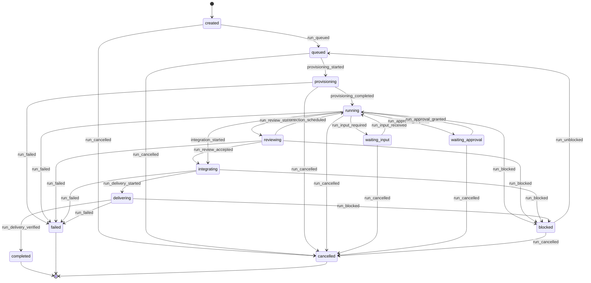

### Run State Semantics

| State | Meaning |
|---|---|
| `created` | Run and pinned input records are durable |
| `queued` | Eligible for worker acquisition |
| `provisioning` | Worker, budget, and isolated workspace are being acquired |
| `running` | Scheduler may execute ready nodes |
| `waiting_input` | A blocking clarification discovered during execution is pending |
| `waiting_approval` | A run-scoped authority request is pending |
| `reviewing` | Required independent or semantic review is active |
| `integrating` | Outputs and evidence are being combined |
| `delivering` | One or more external delivery operations are active |
| `blocked` | Environment or external dependency prevents progress |
| `completed` | Run completion policy passed and configured delivery boundary was verified |
| `failed` | Run cannot make permitted progress |
| `cancelled` | Cancellation and resource reconciliation completed |

### Run Transition Guards

- `created -> queued` requires valid pinned hashes and an accepted plan.
- `queued -> provisioning` requires an acquired worker lease.
- `provisioning -> running` requires an isolated workspace, budget account, and
  successful base-revision verification.
- Wait states require a typed pending question or approval reference.
- `running -> reviewing` requires all prerequisite nodes terminal and required
  deterministic gates valid for the current tree hash.
- `reviewing -> integrating` requires policy acceptance of review evidence.
- `integrating -> delivering` requires a complete traceability and evidence view.
- `delivering -> completed` requires the configured delivery artifact or every
  mandatory external operation to be verified or explicitly excluded by policy.
- `run_failed` requires a terminal error decision; process exit alone is not
  sufficient.
- `run_cancelled` is appended only after active processes, leases, reservations,
  and ambiguous side effects are reconciled.

## Execution Node State Machine

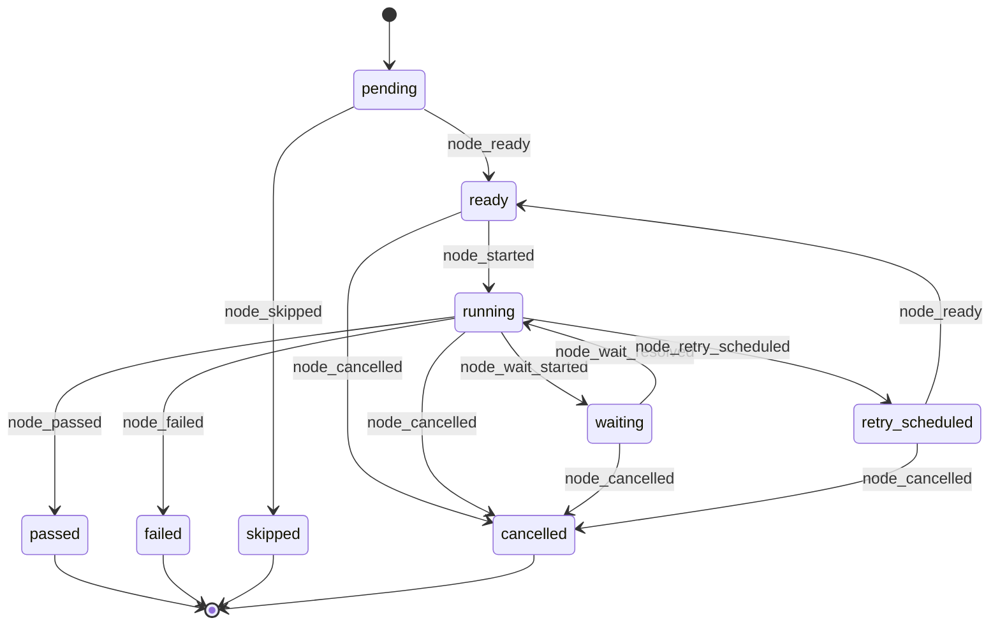

Node state semantics:

| State | Meaning |
|---|---|
| `pending` | Dependencies or activation conditions are unresolved |
| `ready` | All guards for starting a new attempt currently pass |
| `running` | Exactly one active attempt owns the node |
| `waiting` | Active attempt is waiting for a typed external condition |
| `retry_scheduled` | Prior attempt failed and retry policy authorized another attempt |
| `passed` | Output contract and required evidence are accepted |
| `failed` | Node exhausted permitted correction or reached terminal failure |
| `skipped` | Policy proved node unnecessary for this execution path |
| `cancelled` | Node was stopped by authorized cancellation |

Node guards:

- A node becomes `ready` only when every required incoming dependency condition
  is satisfied by current, non-invalidated evidence.
- Only one active attempt may own a node.
- `passed` requires an accepted output contract and the evidence required by
  node type; agent success or exit code zero is insufficient.
- `skipped` requires a policy decision and cannot remove evidence required by
  the contract.
- A terminal node cannot receive a new attempt. Re-execution after invalidation
  creates a replacement node in a revised plan or a new run.

## Attempt State Machine

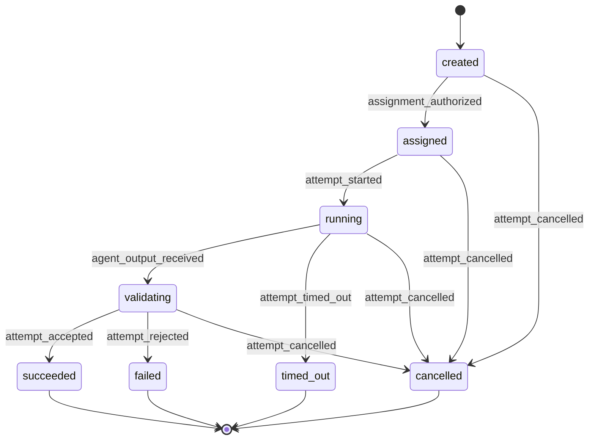

Attempt rules:

- Attempt ordinal is unique and monotonic per run/node or analysis session/action.
- Assignment, workspace, budget reservation, and input hashes are pinned before
  `attempt_started`.
- Capability compilation and model routing are recorded before
  `assignment_authorized`; a spawned invocation cannot change either decision.
- Every fallback or retry spawn creates a new attempt, routing decision,
  assignment and invocation, even when the output contract stays identical.
- Quality correction creates a new attempt because inputs or instructions change.
- A terminal attempt accepts no new invocations, manifests, gates, or evidence.
- Attempt failure does not automatically fail its node; error policy decides
  whether to schedule correction, fallback, replan, block, or fail.

## Event Catalog

Event names use past-tense facts. Every event has an explicit payload schema.
The tables below define the minimum catalog; implementations MAY add events
only through the extension and versioning rules in this document.

### Task Events

| Event type | Minimum payload | State effect |
|---|---|---|
| `task_created` | Task and provenance refs | none to `draft` |
| `analysis_started` | Analysis session ref | `draft -> analyzing` |
| `clarification_requested` | Blocking question refs | `analyzing -> needs_input` |
| `clarification_resolved` | Answer provenance refs | `needs_input -> analyzing` |
| `decomposition_required` | Size decision and reason codes | `analyzing -> needs_decomposition` |
| `decomposition_started` | Assignment ref | `needs_decomposition -> decomposing` |
| `decomposition_accepted` | Parent contract and child graph refs | `decomposing -> ready` |
| `contract_approved` | Contract, risk, and authority refs | `analyzing -> ready` |
| `approval_required` | Approval ref | `ready -> needs_approval` |
| `approval_granted` | Approval and resulting policy refs | `needs_approval -> ready` |
| `task_run_linked` | Run and pinned plan refs | no direct effect |
| `task_execution_started` | Run or active-child refs | `ready -> running` |
| `task_review_required` | Evidence and review requirement refs | `running -> needs_review` |
| `correction_run_started` | New run or correction ref | `needs_review -> running` |
| `task_review_accepted` | Review and policy refs | `needs_review -> integrating` |
| `task_integration_started` | Integration run or child refs | `running -> integrating` |
| `task_delivery_started` | Delivery operation refs | `integrating -> delivering` |
| `task_delivery_verified` | Verified delivery and evidence refs | `delivering -> completed` |
| `task_blocked` | Error ref and resumption condition | active state to `blocked` |
| `task_unblocked` | Satisfied condition and target state | `blocked -> recorded target` |
| `task_failed` | Terminal error and policy refs | active state to `failed` |
| `task_cancel_requested` | Authority and reason | no direct effect |
| `task_cancelled` | Cleanup evidence | active state to `cancelled` |
| `contract_revision_accepted` | Old/new contract and impact refs | invalidation/reprojection |
| `task_archived` | Retention decision | no lifecycle reactivation |

### Run Events

| Event type | Minimum payload | State effect |
|---|---|---|
| `run_created` | Pinned contract, risk, plan, context, config, base, budget refs | none to `created` |
| `run_queued` | Queue and priority | `created/blocked -> queued` |
| `worker_lease_acquired` | Lease ref | projection only |
| `provisioning_started` | Worker lease ref | `queued -> provisioning` |
| `workspace_lease_acquired` | Workspace lease and base hash | projection only |
| `budget_account_opened` | Budget account ref | projection only |
| `provisioning_completed` | Workspace, budget, and verification refs | `provisioning -> running` |
| `run_input_required` | Blocking question refs | `running -> waiting_input` |
| `run_input_received` | Answer provenance refs | `waiting_input -> running` |
| `run_approval_required` | Approval ref | `running -> waiting_approval` |
| `run_approval_granted` | Approval and policy refs | `waiting_approval -> running` |
| `run_review_started` | Review assignment and evidence refs | `running -> reviewing` |
| `correction_scheduled` | Finding, route, and new attempt refs | `reviewing -> running` |
| `run_review_accepted` | Review and policy refs | `reviewing -> integrating` |
| `integration_started` | Integration node and input refs | `running/reviewing -> integrating` |
| `run_delivery_started` | Delivery refs | `integrating -> delivering` |
| `run_delivery_verified` | Verified operation and evidence refs | `delivering -> completed` |
| `run_blocked` | Error and resumption condition | active state to `blocked` |
| `run_unblocked` | Satisfied condition | `blocked -> queued` |
| `run_failed` | Terminal error and decision refs | active state to `failed` |
| `run_cancel_requested` | Authority and reason | cancellation flag only |
| `run_cancelled` | Process, lease, budget, and side-effect reconciliation | active state to `cancelled` |

### Batch Events

Batch events live in the batch stream. Complete batch semantics are defined in
[Fleet and Human Attention](./fleet-and-human-attention.md).

| Event type | Minimum payload | State effect |
|---|---|---|
| `batch_created` | Work-batch revision and provenance refs | none to `queued` |
| `batch_preflight_started` | Pinned batch and context refs | `queued -> preflighting` |
| `batch_item_classified` | Task ref, readiness status, reason refs | projection only |
| `batch_decisions_required` | Decision projection refs and affected tasks | `preflighting -> waiting_decisions` when no runnable items exist |
| `batch_ready` | Ready item and policy refs | `preflighting/waiting_decisions -> ready` |
| `batch_started` | Batch-run, budget, and scheduler refs | `ready/waiting_decisions -> running` |
| `batch_item_run_linked` | Task-run and dependency refs | projection only |
| `batch_item_blocked` | Task, blocker, and downstream impact refs | projection only |
| `batch_item_completed` | Task outcome and evidence-bundle refs | projection only |
| `batch_integration_started` | Integration run and accepted task refs | `running -> integrating` |
| `batch_review_started` | Aggregate evidence and reviewer refs | `running/integrating -> reviewing` |
| `batch_completed` | All required task, integration, and evidence refs | active state to `completed` |
| `batch_partially_completed` | Accepted, blocked, failed, and deferred item refs | active state to `partially_completed` |
| `batch_blocked` | Batch-wide blocker and resumption condition | active state to `blocked` |
| `batch_cancel_requested` | Authority and scope | cancellation flag only |
| `batch_cancelled` | Child-run and resource reconciliation refs | active state to `cancelled` |

### Node and Attempt Events

| Event type | Minimum payload | State effect |
|---|---|---|
| `node_ready` | Satisfied dependency refs | `pending/retry_scheduled -> ready` |
| `node_skipped` | Policy decision and evidence-coverage explanation | `pending -> skipped` |
| `node_started` | Attempt ref | `ready -> running` |
| `node_wait_started` | Typed wait condition | `running -> waiting` |
| `node_wait_resolved` | Resolution ref | `waiting -> running` |
| `node_retry_scheduled` | Failed attempt, retry decision, backoff | `running -> retry_scheduled` |
| `node_passed` | Accepted attempt and evidence refs | `running -> passed` |
| `node_failed` | Terminal error and attempt refs | active state to `failed` |
| `node_cancelled` | Cancellation authority and cleanup refs | active state to `cancelled` |
| `attempt_created` | Ordinal, reason, input hashes | none to `created` |
| `node_capability_profile_compiled` | Capability profile and source refs | projection only |
| `model_routing_decided` | Routing decision, catalog snapshot, and policy refs | projection only |
| `assignment_authorized` | Assignment, grant, reservation refs | `created -> assigned` |
| `attempt_started` | Workspace and assignment refs | `assigned -> running` |
| `agent_invocation_started` | Invocation ref | projection only |
| `agent_invocation_finished` | Invocation, usage, output, error refs | projection only |
| `agent_output_received` | Output artifact and schema refs | `running -> validating` |
| `change_manifest_validated` | Manifest and actual diff refs | projection only |
| `gate_result_recorded` | Gate result and input hashes | projection only |
| `review_decision_recorded` | Review ref | projection only |
| `evidence_linked` | Evidence and trace refs | projection only |
| `attempt_accepted` | Accepted output/evidence refs | `validating -> succeeded` |
| `attempt_rejected` | Error and correction route | `validating -> failed` |
| `attempt_timed_out` | Invocation and error refs | `running -> timed_out` |
| `attempt_cancelled` | Cancellation and cleanup refs | active state to `cancelled` |

### Policy, Budget, Resource, and Delivery Events

These events normally live in the run stream and update projections without
implicitly advancing task, run, node, or attempt state.

Additional domain event catalogs are defined by the execution-DAG,
workspace-and-Git, quality-gates, artifacts-and-traceability, policy-and-risk,
errors-and-recovery, delivery, and evaluation specifications. They use this same
event envelope and cannot introduce state transitions outside this document.

| Event type | Minimum payload |
|---|---|
| `policy_evaluated` | Policy decision ref, request hash, outcome |
| `approval_requested` | Approval ref and expiry |
| `approval_resolved` | Approval ref, decision, authority |
| `budget_reserved` | Reservation ref and maximum amount |
| `budget_settled` | Reservation, invocation usage, ledger refs |
| `budget_released` | Reservation ref and unused amount |
| `budget_threshold_crossed` | Threshold, forecast, actual, policy action |
| `lease_renewed` | Lease ref and new expiry |
| `lease_released` | Lease ref and cleanup result |
| `lease_expired` | Lease ref and reconciliation action |
| `artifact_recorded` | Artifact ref, hash, classification |
| `trace_link_accepted` | Validated trace link ref and endpoint hashes |
| `coverage_evaluated` | Coverage report ref and contract/tree hashes |
| `evidence_bundle_sealed` | Bundle ref, purpose, and bundle hash |
| `evidence_invalidated` | Evidence ref, old input hash, cause ref |
| `plan_invalidated` | Plan ref and changed authoritative input |
| `delivery_authorized` | Operation, policy, and approval refs |
| `delivery_submitted` | Operation ref and external correlation identity |
| `delivery_reconciled` | Operation ref and verified external result |
| `delivery_ambiguous` | Operation ref, ambiguity code, safe next action |
| `delivery_cancelled` | Operation ref, authority, and cancellation reason |
| `external_event_observed` | Adapter, identity, payload artifact ref |

## Event Payload Rules

- Payloads MUST contain references and hashes, not duplicated mutable records.
- State-changing events MUST include `from_state` and `to_state` even when the
  values can be derived; the fold verifies them rather than trusts them.
- Evidence-gated transitions MUST list immutable evidence references.
- Policy-gated transitions MUST list exact policy decision references.
- Events caused by human input or approval MUST retain trusted actor provenance.
- Error-driven events MUST reference stable error records and reason codes.
- Optional human summaries cannot drive transitions.
- Secrets, raw credentials, and unrestricted prompt/output content are prohibited.

Example versioned payload:

```yaml
event_type: node_retry_scheduled
event_version: 1
payload:
  from_state: running
  to_state: retry_scheduled
  failed_attempt_ref: attempt_01J...
  error_ref: error_01J...
  retry_decision_ref: policy_06J...
  next_attempt_ordinal: 3
  not_before: 2026-08-25T01:15:00Z
```

## Transition Validation Order

The state engine validates a command in this order:

1. Envelope and payload schema.
2. Stream identity and expected sequence.
3. Idempotency-key lookup and input-hash equality.
4. Current aggregate and subentity state.
5. Actor authority and trusted identity.
6. Referenced record existence, type, revision, and content hash.
7. Policy decision scope and expiry.
8. Model-routing decision, candidate eligibility, and resolved adapter identity.
9. Budget, lease, concurrency, and cancellation constraints.
10. Evidence completeness and freshness.
11. Domain-specific transition guards.
12. Canonical event construction and atomic append.

The first rejection returns a stable error code. Rejection does not append a
state-changing event; audit policy MAY append a separate command-rejected audit
record outside the aggregate stream.

## Atomic Append and Optimistic Concurrency

Conceptual interface:

```rust
pub trait EventStore {
    fn load(&self, stream: &StreamId) -> Result<EventStream>;

    fn commit(&self, request: &FileCommitRequest) -> Result<AppendOutcome>;
}
```

`FileCommitRequest` holds expected sequences for one or more streams in the same
project, immutable record revisions, event batches, outbox intents and command
idempotency/result data. Single-stream append is a wrapper over this operation.
The file transaction boundary is defined in [ADR-002](./decisions/002-file-backed-persistence.md).

Required behavior:

- Append is compare-and-swap on `expected_sequence`.
- All events produced by one command are committed atomically and contiguously.
- Event rows and corresponding outbox messages share one transaction or
  recoverable write-ahead boundary.
- Sequence conflict returns `STATE_SEQUENCE_CONFLICT`; the caller reloads and
  re-evaluates rather than blindly retries the append.
- A matching idempotency key and matching input hash returns the original
  append outcome.
- A matching key with a different input hash returns
  `IDEMPOTENCY_KEY_REUSED_WITH_DIFFERENT_INPUT`.
- Partial event batches are never visible.

V2 commits immutable YAML record/event batches through one durable YAML commit
manifest under a short-lived project writer lock. The manifest admits related
record, event and outbox changes together; files without a committed manifest
are not accepted history. Views/indexes are rebuilt from committed manifests.
There is no database backend or authoritative append-in-place JSONL stream.
Required publish, flush, recovery and reader-cursor semantics follow
[ADR-002](./decisions/002-file-backed-persistence.md).

## Reducers and Projections

Reducers are pure functions:

```rust
fn apply_task_event(state: TaskState, event: &DomainEvent) -> Result<TaskState>;
fn apply_run_event(state: RunState, event: &DomainEvent) -> Result<RunState>;
```

Reducer rules:

- No network, clock, filesystem, model, or random access.
- Reject unexpected `from_state`, sequence, ownership, or payload version.
- Applying the same complete stream always produces the same state.
- Projection failure stops state-changing work for that stream.
- Read models MAY lag, but decisions MUST read a sequence-consistent aggregate.

Recommended projections:

- task lifecycle and active run summary;
- run, node, and attempt state;
- pending questions and approvals;
- active worker/workspace leases;
- budget reserved, settled, and remaining;
- current valid gates, reviews, and evidence;
- delivery operations and ambiguity status;
- parent/child progress and aggregate cost.

## Snapshots

Snapshots are optional performance caches.

```yaml
schema_version: 2
record_type: aggregate_snapshot
stream:
  type: run
  id: run_01J...
through_sequence: 42
state_hash: sha256:folded-state...
event_prefix_hash: sha256:events-through-42...
projector_version: 3
state:
  run_state: running
  node_states:
    node_01J...: passed
    node_02J...: running
created_at: 2026-08-25T01:11:10Z
```

Rules:

- Snapshot identity includes stream, sequence, event-prefix hash, and projector
  version.
- Snapshot writes are atomic.
- Readers verify the prefix hash before applying later events.
- Missing, corrupt, stale, or incompatible snapshots are discarded and rebuilt.
- Snapshot deletion never removes lifecycle truth.

## Scheduler Derivation

Ready-node selection is a projection plus a deterministic policy decision.

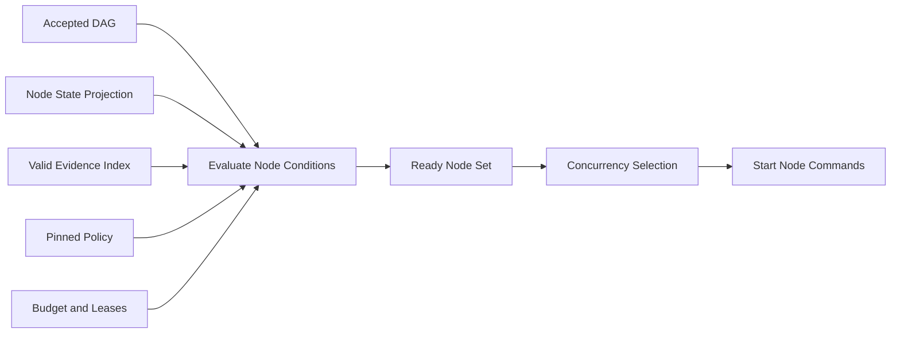

A node is ready only when:

- its state is `pending` or `retry_scheduled`;
- every required dependency condition is satisfied;
- activation conditions evaluate true;
- referenced evidence is current for its bound input hashes;
- retry `not_before` time has passed;
- run is active and not cancellation-requested;
- concurrency, workspace, and resource policy permit execution.

The scheduler MUST NOT persist `ready` based only on elapsed time without
rechecking current sequence and guards.

## Retry, Correction, Fallback, and Replan

These operations have distinct semantics:

| Operation | Creates | Appropriate when |
|---|---|---|
| Availability fallback | New attempt, routing decision, assignment and invocation | Provider/runtime unavailable |
| Retry | New attempt | Same node contract remains valid |
| Correction | New attempt with finding/error context | Output or quality gate is correctable |
| Replan | New plan revision and normally new run | Node graph or approach is invalid |
| Contract amendment | New contract/risk/plan revisions and new run | Requested outcome or scope changes |

Rules:

- Every retry consumes a new ordinal and budget decision.
- Backoff is stored as `not_before`; workers do not sleep while holding leases.
- Failure classification and retry limit are deterministic policy outputs.
- Agent recommendations may inform routing but cannot reset counters.
- Replan and amendment preserve old attempts and evidence as invalidated history.

## Cancellation

Cancellation is cooperative first and forceful after a bounded grace period.

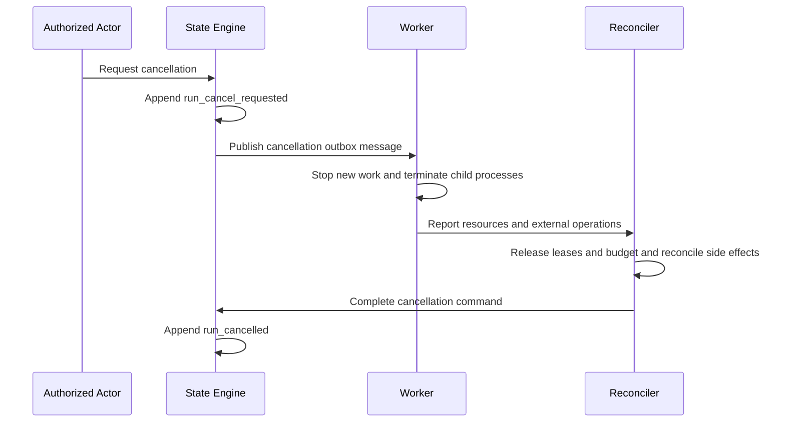

Cancellation rules:

- `cancel_requested` is a projection flag, not a terminal state.
- No new node or invocation starts after the flag is observed.
- Active invocations receive graceful termination then process-group kill.
- Usage, output, errors, and partial changes remain recorded.
- Ambiguous non-idempotent external effects block terminal cancellation until
  reconciliation or explicit authority accepts the ambiguity.
- Task cancellation follows only after active child runs and configured child
  cancellation policy are reconciled.

## Blocking, Waiting, and Human Interaction

Use typed wait states rather than a generic blocker when possible:

- missing requirement answer -> `waiting_input` or task `needs_input`;
- pending authority -> `waiting_approval` or task `needs_approval`;
- future retry time -> node `retry_scheduled`;
- active independent review -> run `reviewing`;
- unavailable environment with no safe immediate retry -> `blocked`.

A blocker payload MUST contain:

- stable blocker/error code;
- responsible external condition;
- exact resumption predicate;
- optional deadline and escalation rule;
- prior state to resume or recompute from;
- referenced evidence or external identity.

Unblocking always re-evaluates current contract, policy, budget, lease, evidence,
and cancellation state. It does not blindly restore the prior state.

Clarification questions, approvals, blockers, scope amendments, integration
conflicts, and human review requests are projected into the Decision Inbox. The
inbox is not an aggregate and cannot advance state directly.

Before requesting human input, the runtime records which eligible product,
repository, task, and external sources were inspected and why the missing
decision remains material. Equivalent requests MAY be consolidated when one
answer has identical semantics for all affected tasks. Answer events retain the
source question, authority, affected contracts, and provenance.

Human active-duration events are not required. A task waiting for input does
not block unrelated batch tasks. The batch scheduler re-evaluates
affected tasks after an answer rather than blindly resuming their prior state.

## Invalidation and Contract Amendment

Authoritative input changes are facts followed by explicit invalidation events.

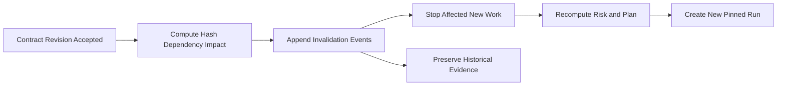

Rules:

- Contract amendments never mutate an active run's pinned inputs.
- Affected evidence remains historical but is excluded from current completion.
- Unaffected evidence MAY be reused only through a policy decision proving
  matching subject and input hashes.
- Changed plan semantics receive new node and edge IDs.
- An active run affected by amendment is cancelled, failed, or allowed to finish
  as obsolete according to policy; it is never silently upgraded.
- Parent-contract changes trigger impact analysis for every active child.

## Parent and Child Task Aggregation

Parent state is a projection over its task stream, child task summaries, and
integration evidence.

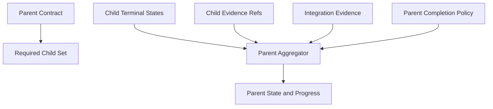

Aggregation rules:

- Parent `running` requires at least one active required child or integration run.
- Parent `integrating` requires the implementation children in the requested
  phase/full scope terminal-successful and that scope's integration task active.
- Implementation parent `completed` requires all children and criteria in the
  requested phase/full scope satisfied, mandatory findings resolved, and current
  integration/delivery evidence. Later phases remain visible in the continuation.
- Plan-only parent completion follows `planning_result_accepted`; no child
  implementation or execution-run success is implied.
- A failed required child does not automatically fail the parent when policy
  permits a replacement or correction child.
- A cancelled required child blocks completion unless the parent contract is
  amended or policy proves it optional.
- Child costs and invocations are referenced, not copied, preventing double count.
- Child state changes are consumed using source event ID and child stream
  sequence so repeated notifications are idempotent.

## External Side Effects and Outbox

Protected external effects use an outbox and reconciliation workflow.

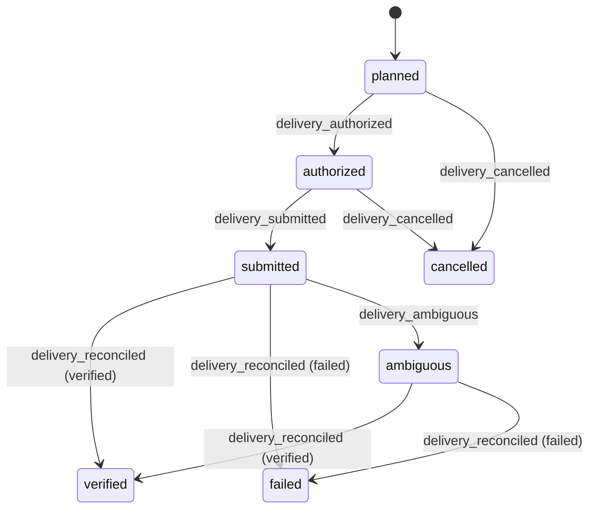

Rules:

- State-event append and outbox enqueue share one atomic boundary.
- Outbox delivery is at least once; adapters use stable idempotency keys.
- An adapter records the external correlation identity before considering an
  operation submitted whenever the provider supports it.
- Timeout after a request may produce `ambiguous`, never assumed failure.
- Ambiguous operations are reconciled by reading authoritative external state.
- Unsafe duplicate operations require human authority rather than blind retry.
- Inbox deduplication uses adapter, external event identity, and payload hash.

## Lease Expiry and Worker Recovery

Lease expiry indicates lost ownership, not automatic work failure.

Recovery sequence:

1. Acquire a new worker lease using compare-and-swap.
2. Load and validate the event stream.
3. Rebuild or verify projections and snapshots.
4. Inspect process, workspace, budget reservation, and delivery records.
5. Reconcile each incomplete action by stable identity.
6. Append missing observed facts or typed ambiguity events.
7. Resume only nodes whose current guards still pass.

The new worker MUST NOT assume an invocation failed merely because the prior
worker disappeared. It checks invocation process identity or provider result
when possible, and otherwise records ambiguity for policy routing.

## Crash Consistency

| Crash point | Recovery behavior |
|---|---|
| Before append | No fact exists; command may be retried with same key |
| During staging, before commit manifest | Ignore uncommitted files; retry or clean up only after checking references under the writer lock |
| After manifest publication, before acknowledgement | Validate manifest chain/payloads, establish durability and return the original result on idempotent retry |
| After append, before projection | Rebuild projection from new event |
| After event and outbox commit, before side effect | Dispatcher performs pending outbox work |
| During external request | Reconcile by idempotency key and external identity |
| After side effect, before result event | Reconcile external state, then append observed result |
| During snapshot write | Discard incomplete snapshot and replay |
| After process exit, before invocation event | Reconciler reads durable process/output record |

## Event Schema Evolution

- Envelope `schema_version` changes only for major model compatibility.
- Each event payload has an independent positive `event_version`.
- Existing event bytes are immutable and never rewritten during upgrade.
- Upcasters transform old payloads in memory into the current reducer input.
- Upcasters MUST be deterministic, pure, chained, and fixture-tested.
- A new optional field may retain an event version only when old and new readers
  preserve identical semantics.
- Renamed fields, changed units, changed enum meaning, or changed invariants
  require a new event version.
- Unknown event types or unsupported versions stop state-changing processing.
- Downcasters are not required; older binaries MUST refuse unsupported streams.

Example registry:

```text
schemas/v2/events/
├── envelope.schema.json
├── task-created.v1.schema.json
├── contract-approved.v1.schema.json
├── run-created.v1.schema.json
├── node-passed.v1.schema.json
├── attempt-rejected.v1.schema.json
├── delivery-ambiguous.v1.schema.json
└── snapshot.schema.json
```

## Event Store Layout

Accepted file-backed direction from [ADR-002](./decisions/002-file-backed-persistence.md):

```text
.zforge/
├── store/
│   ├── write.lock
│   ├── commits/              # immutable YAML commit manifests
│   ├── staging/
│   └── index.yaml           # derived only
├── batches/
│   └── batch_01J.../
│       ├── events/          # immutable YAML event batches
│       └── snapshot.yaml
├── tasks/
│   └── SSO-102/
│       ├── events/
│       ├── snapshot.yaml
│       └── runs/
│           └── run_01J.../
│               ├── events/
│               ├── snapshot.yaml
│               ├── outbox/
│               └── inbox/
└── projects/
    └── project_01J.../
        ├── events/
        └── snapshot.yaml
```

Paths are indexes, not identities. Each event repeats its stream identity and
sequence so moving or rebuilding indexes cannot change meaning.

The project manifest chain commits stream changes atomically; task-local event
directories remain human-inspectable YAML. File paths alone do not imply commit.
Database backends are not part of v2. JSON/YAML interchange validation still uses
the canonical JSON Schema contracts from ADR-001.

## Rust Module Boundaries

```text
src/state/
├── command.rs
├── event.rs
├── envelope.rs
├── store.rs
├── file_store.rs
├── outbox.rs
├── inbox.rs
├── task.rs
├── run.rs
├── node.rs
├── attempt.rs
├── reducer.rs
├── guards.rs
├── projection.rs
├── snapshot.rs
├── reconciliation.rs
├── upcast.rs
└── error.rs
```

Recommended type boundaries:

- newtypes for stream ID, sequence, event ID, command ID, and idempotency key;
- closed enums for states and core event types;
- typed payload enum after versioned deserialization;
- pure reducer and decision functions;
- store trait separated from the file-backed persistence adapter;
- explicit transition errors with stable machine codes;
- no public setters for aggregate state.

## Observability and Audit

Metrics and logs derive from accepted events but do not replace them.

Minimum telemetry:

- command accepted/rejected count by stable reason code;
- append conflict and idempotent replay count;
- event append and projection latency;
- stream length and snapshot rebuild count;
- time in task, run, and node states;
- retry, correction, replan, and amendment counts;
- cancellation and reconciliation duration;
- ambiguous external operation count and age;
- invalidation and stale-evidence count;
- event-schema/upcaster failures.

Logs MUST include event, stream, command, correlation, task, run, node, and
attempt identities when applicable. Logs MUST NOT include secrets or protected
artifact content.

## Security and Authority

- Agents cannot append events or choose `from_state`/`to_state`.
- Only registered deterministic components may submit authoritative commands.
- Human commands require authenticated identity and scoped authority.
- Policy and approval references are validated against exact command input hashes.
- Event files are integrity checked and SHOULD be protected from untrusted write
  access separately from agent workspaces.
- Imported events are untrusted until schema, hash, sequence, ownership, and
  signature policy pass.
- Clock time never grants authority by itself.
- Audit export preserves hashes and event order while applying field-level
  redaction policy.

## Native-v2 History Boundary

Per [ADR-005](./decisions/005-native-v2-no-migration.md), legacy `.state.yaml` and phase artifacts are not
converted into native events. No compatibility-event registry or resumed legacy
run is required. Unsupported legacy stores fail closed and remain unchanged.
Manually recreated tasks start with native contracts, policies and verification;
old completion labels do not grant authority or satisfy evidence requirements.

Event schema versions and upcasters elsewhere in this document describe evolution
of native-v2 events only. A payload filename ending in `.v1.schema.json` means
version 1 of that native event schema, not support for zForge product v1.

## Testing Strategy

Required unit and property tests:

- every allowed and forbidden transition;
- machine-value serialization and display labels;
- event-envelope and every payload schema fixture;
- sequence continuity and event hash validation;
- idempotent append with same key and same input;
- conflicting key with different input;
- optimistic concurrency conflict and reevaluation;
- atomic multi-event append and outbox write;
- reducer purity and deterministic replay;
- snapshot verification, corruption, and rebuild;
- unsupported event type/version fail-closed behavior;
- upcaster chains and historical fixtures;
- node dependency and retry readiness;
- terminal-state immutability;
- cancellation during each active state;
- crash at every consistency boundary;
- lease-expiry reconciliation;
- external-side-effect ambiguity and deduplication;
- evidence invalidation after contract, plan, or tree-hash change;
- parent/child completion and no cost double counting;
- malicious agent output cannot create authority or events;
- legacy stores cannot create native events or be changed by failed loading;

Model-based tests SHOULD generate command sequences and verify that no sequence
violates state, evidence, policy, budget, lease, or independence invariants.

## Acceptance Criteria

- [ ] Task analysis lifecycle and execution-run lifecycle use separate aggregates.
- [ ] Batch streams coordinate tasks without replacing task or run lifecycle truth.
- [ ] Every lifecycle state is derivable from an ordered immutable event stream.
- [ ] Task, run, node, and attempt transition tables are implemented as guarded
      deterministic decisions.
- [ ] Agent output cannot directly append events or advance state.
- [ ] State-changing events include exact authority, policy, and evidence refs.
- [ ] Atomic append enforces expected sequence and idempotency input hash.
- [ ] Event and outbox writes share an atomic or recoverable boundary.
- [ ] Snapshots can be deleted and rebuilt without loss of truth.
- [ ] Retry, correction, fallback, replan, and amendment have distinct semantics.
- [ ] Cancellation reconciles processes, leases, budgets, workspaces, and external
      side effects before becoming terminal.
- [ ] External ambiguity is represented explicitly and never coerced into success
      or failure.
- [ ] Invalidation preserves history while excluding stale evidence from current
      completion.
- [ ] Parent completion requires child outcomes plus integration evidence.
- [ ] Decision Inbox projections cannot directly mutate task, run, or policy state.
- [ ] Waiting on one batch item does not block unrelated ready items by default.
- [ ] Unsupported schemas and unknown states fail closed.
- [ ] Crash recovery is deterministic for every documented consistency boundary.
- [ ] Legacy history is neither implicitly converted nor accepted as native lifecycle authority.
