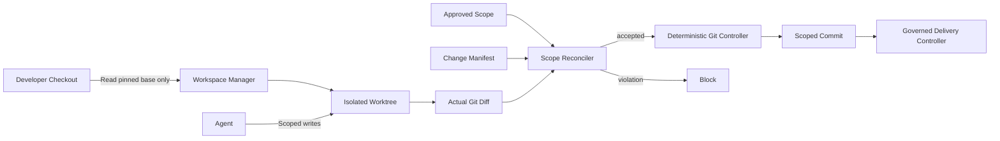
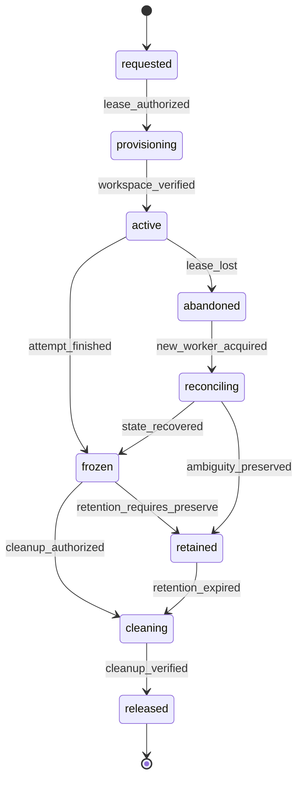
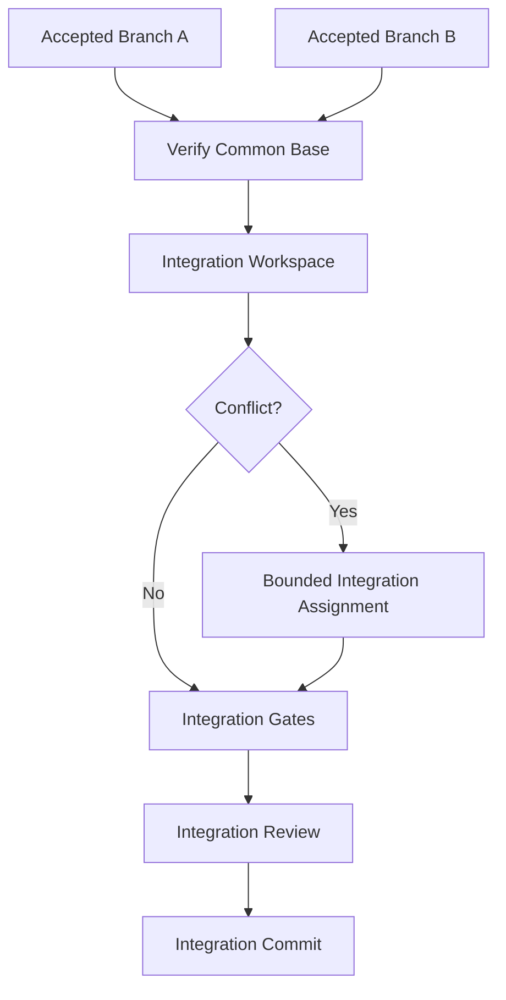

# zForge v2 Workspace and Git

## Status

Normative design draft for isolated workspaces, leases, scoped filesystem
mutation, Git reconciliation, commits, integration, cleanup, and recovery.

Related documents:

- [Product Direction](./product-direction.md)
- [Fleet and Human Attention](./fleet-and-human-attention.md)
- [Data Model](./data-model.md)
- [State and Events](./state-and-events.md)
- [Execution DAG](./execution-dag.md)
- [Policy and Risk](./policy-and-risk.md)
- [Configuration](./configuration.md)
- [Artifacts and Traceability](./artifacts-and-traceability.md)
- [Errors and Recovery](./errors-and-recovery.md)

## Objective

Ensure autonomous work cannot corrupt a developer's checkout, mix unrelated
changes, escape approved scope, or perform Git/delivery actions without exact
policy authority and reproducible evidence.

## Trust Boundary



Agents may edit an assigned isolated workspace. Only deterministic components
may create/delete worktrees, stage, commit, merge, rebase, push, or clean files.

## Workspace Modes

```text
read_only | exclusive_write | isolated_write | integration | gate_only
```

| Mode | Behavior |
|---|---|
| `read_only` | Repository content mounted or exposed without mutation |
| `exclusive_write` | One attempt owns a bounded mutable workspace |
| `isolated_write` | Parallel branch owns a separate worktree and branch |
| `integration` | Combines accepted child/node outputs under integration policy |
| `gate_only` | Immutable candidate tree verified without agent writes |

Production-code agent nodes never write directly to the developer checkout.

## Workspace Identity

```yaml
schema_version: 2
record_type: workspace_lease
record_id: lease_02J...
revision: 1
status: active
lease_id: lease_02J...
lease_kind: workspace
project_id: project_01J...
task_id: SSO-102
run_id: run_01J...
node_id: node_02J...
attempt_id: attempt_01J...
mode: exclusive_write
owner_worker_id: worker_12345
workspace_path: /project/.zforge/workspaces/run_01J/node_02J/attempt_01J
branch: zforge/SSO-102/run_01J/node_02J
base_commit: abcdef123456
base_tree_hash: sha256:base-tree...
allowed_path_patterns:
  - src/auth/**
  - tests/auth/**
acquired_at: 2026-08-25T01:00:00Z
heartbeat_at: 2026-08-25T01:10:00Z
expires_at: 2026-08-25T01:12:00Z
released_at: null
retention_policy: preserve_on_failure
created_at: 2026-08-25T01:00:00Z
created_by:
  actor_type: system
  actor_id: workspace-manager
updated_at: 2026-08-25T01:10:00Z
content_hash: sha256:lease...
provenance_refs: []
```

Workspace path is a locator. Lease ID, base commit, mode, and owner define authority.

## Workspace Lifecycle



`frozen` prohibits writes while diff, gates, evidence, review, commit, or cleanup
decisions occur.

This diagram describes the workspace resource projection. The owning lease keeps
the canonical lease statuses `pending`, `active`, `expired`, `released`, and
`orphaned` defined by the data model.

## Provisioning

Provisioning MUST:

1. Resolve canonical repository identity and root.
2. Verify the pinned base commit exists and matches the expected tree.
3. Verify workspace destination is under configured workspace root.
4. Acquire run, workspace, branch, and logical resource leases.
5. Create the worktree without reusing an unverified directory.
6. Configure only approved local Git settings.
7. Verify branch, HEAD, status, submodule policy, and filesystem boundaries.
8. Record a clean baseline manifest and hashes.
9. Append workspace acquisition events before agent execution.

Provisioning never cleans or resets the developer checkout.

## Existing Developer Changes

If the source checkout is dirty:

- zForge records the condition and affected paths;
- it does not stage, stash, reset, overwrite, or delete those changes;
- a Git worktree may still be created from a committed base when Git permits it;
- any dependency on uncommitted developer changes requires explicit intake and a
  protected snapshot/import workflow;
- imported changes become provenance-backed artifacts and are never assumed owned.

## Filesystem Boundary

Before each protected filesystem action, the runtime validates:

- canonical path is inside the leased workspace;
- no `..`, symlink, junction, mount, or case-normalization escape exists;
- operation and path match the policy grant;
- file type is permitted;
- generated/protected/secret paths satisfy additional policy;
- aggregate size, file count, and operation count remain within bounds.

Symlinks are treated as objects by default. Following a symlink for write requires
resolving its target and proving the target remains within the allowed root.

## Agent Write Scope

Agent runners receive the workspace and scoped grants. After invocation, actual
filesystem and Git state are authoritative over agent claims.

Writes outside scope, unexpected repositories, nested Git worktrees, hooks,
submodule mutation, or ignored secret files cause a scope violation and freeze
the workspace for investigation.

## Canonical Change Set

The Git controller builds a canonical change set from:

- base commit and candidate tree;
- staged and unstaged tracked changes;
- untracked files allowed by policy;
- file modes, symlinks, renames, copies, deletions, and submodule pointers;
- generated-file attribution;
- line and binary statistics.

Ignored files are excluded unless explicitly declared evidence artifacts. A
change hidden by ignore rules cannot enter a commit accidentally.

## Manifest Reconciliation

```yaml
base_commit: abcdef123456
candidate_tree_hash: sha256:candidate-tree...
operations:
  - operation_id: change_op_01J...
    operation: modify
    path: src/auth/callback.rs
    before_hash: sha256:before...
    after_hash: sha256:after...
    plan_node_ref: node_02J...
    criterion_refs:
      - ac_01J...
scope_result:
  status: accepted
  unexplained_paths: []
  policy_decision_ref: policy_01J...
```

Reconciliation checks every actual operation against plan, contract, path grant,
generated-file rules, and agent manifest. Unexplained operations block acceptance.

## Git Staging

- Staging uses explicit validated paths or a constructed index; never broad
  `git add .` in an uncontrolled workspace.
- The staged tree is read back and compared with the accepted change manifest.
- Files changed after gate execution invalidate bound evidence.
- Submodule and Gitlink changes require explicit policy and manifest operations.
- Git hooks are disabled or executed only as registered authorized gates.
- Global/system Git configuration is not trusted for protected behavior.

## Commit Creation

A commit requires:

- frozen workspace and active ownership lease;
- accepted change manifest matching actual and staged tree;
- current mandatory gate evidence;
- required review/approval policy satisfied;
- author/committer identity policy;
- deterministic or policy-defined commit message projection;
- parent commit matching the expected integration base.

The resulting commit ID and tree are verified and recorded as artifacts/evidence.

## Branch Naming

Branch names are sanitized from stable identities and policy templates. User text
cannot inject Git revision syntax, path separators beyond policy, shell content,
or ambiguous Unicode. Collision handling appends stable run identity.

## Integration



Integration never blindly merges agent branches. It verifies accepted commit
identities, dependency order, shared contracts, conflict resolution scope, and
end-to-end evidence.

The first fleet implementation integrates accepted task outputs serially in
dependency order and reruns required gates against the combined tree. Parallel
integration is not required. A semantic conflict affecting product behavior or a
shared contract creates a Decision Inbox item rather than an arbitrary merge.

## Rebase and Base Drift

Base drift is detected before integration and delivery. Policy selects:

- continue when target is unchanged;
- rebase in a new integration attempt and rerun affected gates;
- replan when interfaces changed;
- block for human authority when risk or conflict is material.

Rebase changes commit and often tree identity; evidence reuse requires exact
dependency analysis. Delivery never pushes a commit different from the sealed bundle.

## Delivery Boundary

Push, PR creation/update, and authorized development-only merge belong to the delivery
controller. Git controller supplies verified commits and refs but cannot infer
permission to publish them.

Force push, history rewrite, tag mutation, and deletion are denied by default and
require explicit action-specific policy where supported.

## Cleanup and Retention

Cleanup may remove only the exact verified workspace path associated with a
released lease. It validates path, repository identity, active processes, mounts,
nested worktrees, retained artifacts, and Git worktree registration first.

Failures normally preserve the workspace for configured time. Retention cleanup
records what was removed and preserves artifact/evidence records and tombstones.

## Recovery

After worker or process loss:

1. Acquire recovery authority and new lease.
2. Verify workspace path and repository identity.
3. Inspect HEAD, index, working tree, processes, and Git locks.
4. Compare with last durable manifest and events.
5. Record recovered changes as artifacts without accepting them.
6. Freeze and route ambiguity through recovery policy.
7. Resume only after ownership, scope, and input hashes revalidate.

Stale Git lock files are not deleted solely by age; process ownership and
repository state must be reconciled.

## Multi-Repository Work

Each repository has an independent lease, base, workspace, manifest, gates,
commit, and delivery decision. A coordination task references sealed per-repository
bundles and performs cross-repository compatibility verification. No distributed
atomic Git commit is claimed.

## Events

```text
workspace_requested | workspace_lease_acquired | workspace_verified |
workspace_frozen | workspace_abandoned | workspace_reconciled |
change_manifest_validated | scope_violation_detected |
git_index_prepared | commit_created | base_drift_detected |
workspace_cleanup_started | workspace_released
```

## Failure Codes

```text
WORKSPACE_PATH_ESCAPE | WORKSPACE_NOT_CLEAN | WORKSPACE_LEASE_CONFLICT |
WORKSPACE_IDENTITY_MISMATCH | BASE_COMMIT_MISSING | BASE_TREE_MISMATCH |
GIT_SCOPE_VIOLATION | GIT_UNEXPLAINED_CHANGE | GIT_INDEX_MISMATCH |
GIT_HOOK_NOT_ALLOWED | GIT_BASE_DRIFT | GIT_CONFLICT |
GIT_COMMIT_MISMATCH | WORKSPACE_CLEANUP_UNSAFE
```

## Rust Modules

```text
src/workspace/
├── model.rs
├── manager.rs
├── lease.rs
├── path.rs
├── provision.rs
├── freeze.rs
├── cleanup.rs
└── recover.rs

src/git/
├── repository.rs
├── diff.rs
├── manifest.rs
├── scope.rs
├── index.rs
├── commit.rs
├── integrate.rs
└── drift.rs
```

## Testing Strategy

Tests cover dirty developer checkout preservation, path traversal, symlink escape,
case sensitivity, worktree collision, lease loss, base mismatch, untracked and
ignored files, rename/delete/mode/submodule changes, explicit staging, post-gate
mutation, Git hooks, integration conflicts, base drift, crash recovery, safe
cleanup, and multi-repository partial failure.

## Acceptance Criteria

- [ ] Autonomous agents never mutate the developer checkout directly.
- [ ] Every mutable workspace has a valid scoped lease and pinned base.
- [ ] Filesystem paths cannot escape the workspace or policy scope.
- [ ] Actual diff is reconciled against manifest and approved intent.
- [ ] Only accepted explicit files enter the Git index and commit.
- [ ] Post-gate changes invalidate affected evidence.
- [ ] Integration uses accepted commits and reruns required evidence.
- [ ] Delivery publishes the exact sealed commit/tree.
- [ ] Cleanup never targets an unresolved or overly broad path.
- [ ] Recovery preserves ambiguous changes instead of silently accepting/deleting them.

## Workspace and Test-Resource Coordination

All task worktrees resolve to one shared project Markdown/YAML metadata store
under [ADR-002](./decisions/002-file-backed-persistence.md). Metadata commits use
a short-lived store lock; workspace/process leases cover execution separately.
Agents cannot edit commit manifests, writer locks or authoritative runtime state.
Git checkout/merge is not a state-store coordination mechanism, and copying a
worktree must not create a second owner for the same run or exclusive resource.

A workspace lease does not isolate ports, databases, containers or devices.
The scheduler also obtains an `EnvironmentLease` when required. No two tasks
share mutable test resources implicitly, even when their code paths are disjoint.
Device-exclusive tests may serialize while other ready tasks continue.

Provision, readiness, reset, retention, teardown and crash/fencing behavior follow
[Project Onboarding and Local Testing](./project-onboarding-and-local-testing.md).
Review replay uses a fresh workspace/environment and records new evidence
separately from the historical package. Integration verification runs on the
combined candidate tree with a clean fixture state.

Git publication/merge is development-only. Check hooks and triggered CI workflows
for application deployment or production access before external writes. If the
boundary cannot be established, preserve local changes and hand off with the
limitation; neither agent instructions nor an ordinary approval override it.
